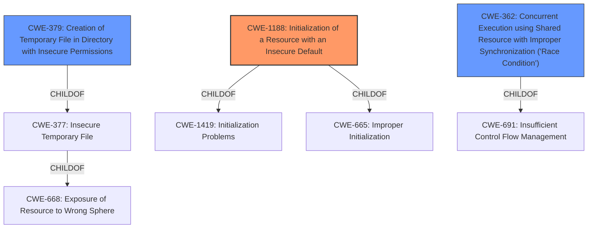

# Analysis Report for CVE-2020-10279

# Vulnerability Analysis Report: CVE-2020-10279

## Description


## Analysis (with Relationship Data)

# Summary
| CWE ID | CWE Name | Confidence | CWE Abstraction Level | CWE Vulnerability Mapping Label | CWE-Vulnerability Mapping Notes |
|---|---|---|---|---|---|
| **CWE-1188** | Initialization of a Resource with an Insecure Default | 0.9 | Base | Primary | Allowed |
| CWE-379 | Creation of Temporary File in Directory with Insecure Permissions | 0.6 | Base | Secondary | Allowed |
| CWE-362 | Concurrent Execution using Shared Resource with Improper Synchronization ('Race Condition') | 0.6 | Class | Secondary | Allowed-with-Review |

## Evidence and Confidence

*   **Confidence Score:** 0.8
*   **Evidence Strength:** HIGH

## Relationship Analysis
The primary CWE, CWE-1188, is a base-level CWE related to initializing resources with **insecure defaults**. This choice is supported by the vulnerability description and the "Root cause of vulnerability" section. The secondary CWEs considered, CWE-379 and CWE-362, represent specific consequences or types of **insecure defaults** related to temporary files and concurrency, respectively. The hierarchical relationships (ChildOf) suggest that the root cause is the **insecure default**, and the other CWEs represent potential exploitable conditions arising from those defaults.



## Vulnerability Chain
The vulnerability chain starts with **insecure defaults** (CWE-1188). These defaults can lead to various weaknesses, including **insecure temporary file creation** (CWE-379), **access race conditions** (CWE-362), and potentially others not fully described in this vulnerability report. These weaknesses can then be exploited to escalate access and facilitate Denial of Service (DoS) attacks.

## Summary of Analysis
The initial assessment focused on identifying the root cause. The description explicitly mentions "**insecure defaults**" in Ubuntu 16.04.2.

The CVE Reference Links Content Summary further supports this:

```
{
  "Root cause of vulnerability": "Insecure operating system defaults in Ubuntu 16.04.2, which is used in MiR robot controllers. This operating system, designed for desktop use, presents insecure defaults when used in robots.",
  "Weaknesses/vulnerabilities present": [
    "File creation vulnerabilities",
    "Access race conditions",
    "Insecure home directory configurations",
    "Defaults that facilitate Denial of Service (DoS) attacks"
  ],
  "Impact of exploitation": "Users can escalate their access beyond what they were granted. Denial of Service (DoS) attacks can be facilitated.",
  "Attack vectors": "Not disclosed.",
  "Required attacker capabilities/position": "Not disclosed."
}
```

Therefore, CWE-1188: Initialization of a Resource with an Insecure Default is the most appropriate primary CWE. The retriever results also support this, with CWE-1188 being the top result.

CWE-379 (Creation of Temporary File in Directory with Insecure Permissions) and CWE-362 (Concurrent Execution using Shared Resource with Improper Synchronization ('Race Condition')) are included as secondary CWEs because they are explicitly mentioned as vulnerabilities arising from the **insecure defaults**.

CWE-732 (Incorrect Permission Assignment for Critical Resource) was considered but not selected as the primary because, while related to permissions, the root cause is the **insecure default** setting of those permissions. It is also a Class level CWE.

CWE-250 (Execution with Unnecessary Privileges) was considered because **insecure defaults** might lead to unnecessary privileges being granted. However, the description doesn't explicitly state this, making it less directly relevant than the selected CWEs.

CWE-427 (Uncontrolled Search Path Element) was considered since the description mentions file creation and potential privilege escalation. However, the provided information doesn't directly mention issues related to the search path itself, making CWE-427 less applicable.

The selected CWEs are at the optimal level of specificity because CWE-1188 captures the root cause, while CWE-379 and CWE-362 represent the immediate consequences. The chain accurately reflects the progression from **insecure defaults** to exploitable vulnerabilities.

Relevant CWE Information:

# Enhanced Context (25 CWEs)

## CWE-1188: Initialization of a Resource with an Insecure Default
**Abstraction Level**: Base
**Similarity Score**: 0.584 (sparse)
**Source**: sparse

**Description**:
The product initializes or sets a resource with a default that is intended to be changed by the administrator, but the default is not secure.

**Mapping Guidance**:
- Usage: Allowed
- Rationale: This CWE entry is at the Base level of abstraction, which is a preferred level of abstraction for mapping to the root causes of vulnerabilities.
**Justification**: The description explicitly states "**insecure defaults**", and the retriever results confirm CWE-1188 as a top match. This CWE captures the root cause of the vulnerabilities described.

## CWE-379: Creation of Temporary File in Directory with Insecure Permissions
**Abstraction Level**: Base
**Similarity Score**: 0.279 (sparse)
**Source**: sparse

**Description**:
The product creates a temporary file in a directory whose permissions allow unintended actors to determine the file's existence or otherwise access that file.

**Mapping Guidance**:
- Usage: Allowed
- Rationale: This CWE entry is at the Base level of abstraction, which is a preferred level of abstraction for mapping to the root causes of vulnerabilities.
**Justification**: The description mentions "file creation vulnerabilities" and the "Root cause of vulnerability" section mentions "Insecure operating system defaults". CWE-379 describes a specific type of file creation vulnerability related to **insecure permissions**.

## CWE-362: Concurrent Execution using Shared Resource with Improper Synchronization ('Race Condition')
**Abstraction Level**: Class
**Similarity Score**: 0.270 (sparse)
**Source**: sparse

**Description**:
The product contains a concurrent code sequence that requires temporary, exclusive access to a shared resource, but a timing window exists in which the shared resource can be modified by another code sequence operating concurrently.

**Mapping Guidance**:
- Usage: Allowed-with-Review
- Rationale: This CWE entry is a Class and might have Base-level children that would be more appropriate
**Justification**: The description explicitly mentions "access race conditions."

## CWE-732: Incorrect Permission Assignment for Critical Resource
**Abstraction Level**: Class
**Similarity Score**: N/A
**Source**: N/A

**Description**:
The product specifies permissions for a security-critical resource in a way that allows that resource to be read or modified by unintended actors.

**Mapping Guidance**:
- Usage: Allowed-with-Review
- Rationale: While the name itself indicates an assignment of permissions for resources, this is often misused for vulnerabilities in which "permissions" are not checked, which is an "authorization" weakness (CWE-285 or descendants) within CWE's model [REF-1287].
**Justification**: This was considered, but the root cause is the **insecure defaults**, not necessarily an incorrect assignment in the first place.

## CWE-250: Execution with Unnecessary Privileges
**Abstraction Level**: Base
**Similarity Score**: N/A
**Source**: dense

**Description**:
The product performs an operation at a privilege level that is higher than the minimum level required, which creates new weaknesses or amplifies the consequences of other weaknesses.

**Mapping Guidance**:
- Usage: Allowed
- Rationale: This CWE entry is at the Base level of abstraction, which is a preferred level of abstraction for mapping to the root causes of vulnerabilities.
**Justification**: Although the impact is "escalate access", the root cause is more directly related to **insecure defaults** than to the execution of unnecessary privileges.

## CWE-427: Uncontrolled Search Path Element
**Abstraction Level**: Base
**Similarity Score


## CWE Relationship Analysis

Current CWEs represent these abstraction levels: .


### Vulnerability Chain Analysis

**Chain starting from CWE-691:**
- 691 (Insufficient Control Flow Management) - ROOT


**Chain starting from CWE-732:**
- 732 (Incorrect Permission Assignment for Critical Resource) - ROOT


### CWE Relationship Diagram

```mermaid
graph TD
    classDef primary fill:#f96,stroke:#333,stroke-width:2px
    classDef secondary fill:#69f,stroke:#333
    classDef tertiary fill:#9e9,stroke:#333
```


*Report generated on 2025-04-02 15:07:37*
