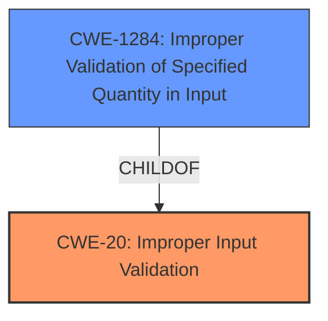

# Analysis for CVE-2020-1040

# Summary
| CWE ID | CWE Name | Confidence | CWE Abstraction Level | CWE Vulnerability Mapping Label | CWE-Vulnerability Mapping Notes |
|---|---|---|---|---|---|
| CWE-20 | Improper Input Validation | 0.8 | Class | Primary | Discouraged |
| CWE-1284 | Improper Validation of Specified Quantity in Input | 0.6 | Base | Secondary Candidate | Allowed |

## Evidence and Confidence

*   **Confidence Score:** 0.7
*   **Evidence Strength:** MEDIUM

## Relationship Analysis
The primary relationship to consider is that CWE-1284 is a child of CWE-20. While CWE-20 is a general class, CWE-1284 is a more specific base. The evidence suggests the vulnerability stems from **improper input validation**. The description of CWE-1284 mentions quantity, and while not explicitly stated in the provided description, the underlying vulnerability of the Hyper-V RemoteFX vGPU likely involves validating quantities related to the input.

## Vulnerability Chain
The chain of events is as follows:

1.  **Root Cause:** **Improper Input Validation** (CWE-20) or more specifically **Improper Validation of Specified Quantity in Input** (CWE-1284) in Hyper-V RemoteFX vGPU.
2.  **Impact:** Remote Code Execution.

The description focuses on the initial **improper input validation**, leading to remote code execution.

## Summary of Analysis
The initial assessment identified **improper input validation** as the root cause, which aligns with CWE-20. However, further analysis, especially the Retriever Results, suggests CWE-1284, **Improper Validation of Specified Quantity in Input**, as a more specific candidate.

The vulnerability description states "**rootcause:** **improper input validation**" which directly supports the selection of CWE-20.

The Retriever Results show that CWE-20 is a top match, but it is a Class-level CWE and the mapping guidance discourages its use when more specific CWEs are available. The retriever also suggests CWE-1284, which is a Base-level CWE and a child of CWE-20.

The graph relationships show the direct parent-child relationship between CWE-20 and CWE-1284.

Given that the vulnerability involves the validation of input from an authenticated user, it is plausible that the input involves a quantity that is not properly validated. The nature of vGPU operations suggests that memory allocation or processing size might be involved, making CWE-1284 a relevant consideration.

CWE-20 is the primary weakness due to the explicit statement in the description, however, CWE-1284 is a strong secondary candidate because it is more specific. I am choosing CWE-20 as the primary due to the vulnerability description, and CWE-1284 as a secondary candidate.

Relevant CWE Information:

# Enhanced Context (25 CWEs)

## CWE-23: Relative Path Traversal
**Abstraction Level**: Base
**Similarity Score**: 0.80
**Source**: dense

**Description**:
The product uses external input to construct a pathname that should be within a restricted directory, but it does not properly neutralize sequences such as ".." that can resolve to a location that is outside of that directory.

**Mapping Guidance**:
- Usage: Allowed
- Rationale: This CWE entry is at the Base level of abstraction, which is a preferred level of abstraction for mapping to the root causes of vulnerabilities.

## CWE-41: Improper Resolution of Path Equivalence
**Abstraction Level**: Base
**Similarity Score**: 0.79
**Source**: dense

**Description**:
The product is vulnerable to file system contents disclosure through path equivalence. Path equivalence involves the use of special characters in file and directory names. The associated manipulations are intended to generate multiple names for the same object.

**Mapping Guidance**:
- Usage: Allowed
- Rationale: This CWE entry is at the Base level of abstraction, which is a preferred level of abstraction for mapping to the root causes of vulnerabilities.

## CWE-59: Improper Link Resolution Before File Access ('Link Following')
**Abstraction Level**: Base
**Similarity Score**: 0.79
**Source**: dense

**Description**:
The product attempts to access a file based on the filename, but it does not properly prevent that filename from identifying a link or shortcut that resolves to an unintended resource.

**Mapping Guidance**:
- Usage: Allowed
- Rationale: This CWE entry is at the Base level of abstraction, which is a preferred level of abstraction for mapping to the root causes of vulnerabilities.

## CWE-1289: Improper Validation of Unsafe Equivalence in Input
**Abstraction Level**: Base
**Similarity Score**: 0.79
**Source**: dense

**Description**:
The product receives an input value that is used as a resource identifier or other type of reference, but it does not validate or incorrectly validates that the input is equivalent to a potentially-unsafe value.

**Mapping Guidance**:
- Usage: Allowed
- Rationale: This CWE entry is at the Base level of abstraction, which is a preferred level of abstraction for mapping to the root causes of vulnerabilities.

## CWE-73: External Control of File Name or Path
**Abstraction Level**: Base
**Similarity Score**: 0.79
**Source**: dense

**Description**:
The product allows user input to control or influence paths or file names that are used in filesystem operations.

**Mapping Guidance**:
- Usage: Allowed
- Rationale: This CWE entry is at the Base level of abstraction, which is a preferred level of abstraction for mapping to the root causes of vulnerabilities.

## CWE-184: Incomplete List of Disallowed Inputs
**Abstraction Level**: Base
**Similarity Score**: 0.78
**Source**: dense

**Description**:
The product implements a protection mechanism that relies on a list of inputs (or properties of inputs) that are not allowed by policy or otherwise require other action to neutralize before additional processing takes place, but the list is incomplete.

**Mapping Guidance**:
- Usage: Allowed
- Rationale: This CWE entry is at the Base level of abstraction, which is a preferred level of abstraction for mapping to the root causes of vulnerabilities.

## CWE-36: Absolute Path Traversal
**Abstraction Level**: Base
**Similarity Score**: 0.78
**Source**: dense

**Description**:
The product uses external input to construct a pathname that should be within a restricted directory, but it does not properly neutralize absolute path sequences such as "/abs/path" that can resolve to a location that is outside of that directory.

**Mapping Guidance**:
- Usage: Allowed
- Rationale: This CWE entry is at the Base level of abstraction, which is a preferred level of abstraction for mapping to the root causes of vulnerabilities.

## CWE-427: Uncontrolled Search Path Element
**Abstraction Level**: Base
**Similarity Score**: 0.77
**Source**: dense

**Description**:
The product uses a fixed or controlled search path to find resources, but one or more locations in that path can be under the control of unintended actors.

**Mapping Guidance**:
- Usage: Allowed
- Rationale: This CWE entry is at the Base level of abstraction, which is a preferred level of abstraction for mapping to the root causes of vulnerabilities.

## CWE-668: Exposure of Resource to Wrong Sphere
**Abstraction Level**: Class
**Similarity Score**: 0.77
**Source**: dense

**Description**:
The product exposes a resource to the wrong control sphere, providing unintended actors with inappropriate access to the resource.

**Mapping Guidance**:
- Usage: Discouraged
- Rationale: CWE-668 is high-level and is often misused as a catch-all when lower-level CWE IDs might be applicable. It is sometimes used for low-information vulnerability reports [REF-1287]. It is a level-1 Class (i.e., a child of a Pillar). It is not useful for trend analysis.

## CWE-125: Out-of-bounds Read
**Abstraction Level**: Base
**Similarity Score**: 0.77
**Source**: dense

**Description**:
The product reads data past the end, or before the beginning, of the intended buffer.

**Mapping Guidance**:
- Usage: Allowed
- Rationale: This CWE entry is at the Base level of abstraction, which is a preferred level of abstraction for mapping to the root causes of vulnerabilities.

## CWE-1284: Improper Validation of Specified Quantity in Input
**Abstraction Level**: Base
**Similarity Score**: 6958.29
**Source**: sparse

**Description**:
The product receives input that is expected to specify a quantity (such as size or length), but it does not validate

# Enhanced Query for CVE-2020-1040

## Vulnerability Description
A remote code execution vulnerability exists when Hyper-V RemoteFX vGPU on a host server fails to properly validate input from an authenticated user on a guest operating system, aka 'Hyper-V RemoteFX vGPU Remote Code Execution Vulnerability'. This CVE ID is unique from CVE-2020-1032, CVE-2020-1036, CVE-2020-1041, CVE-2020-1042, CVE-2020-1043.

### Vulnerability Description Key Phrases
- **rootcause:** **improper input validation**
- **impact:** remote code execution
- **attacker:** authenticated user on a guest operating system
- **product:** Hyper-V RemoteFX vGPU

### CWE for similar CVE Descriptions
### Primary CWE Match
CWE-20

#### Top CWEs
- CWE-20 (Count: 73)
- CWE-787 (Count: 3)
- CWE-119 (Count: 1)

## CVE Reference Links Content Summary
The provided content indicates that NVIDIA products are not affected by CVE-2020-1040. There is no vulnerability information in the provided text.

NOINFO

## Retriever Results

### Top Combined Results

| Rank | CWE ID | Name | Abstraction | Usage  | Retrievers | Individual Scores |
|------|--------|------|-------------|-------|------------|-------------------|
| 1 | 1284 | Improper Validation of Specified Quantity in Input | Base | Allowed | sparse | 0.358 |
| 2 | 20 | Improper Input Validation | Class | Discouraged | sparse | 0.317 |
| 3 | 1285 | Improper Validation of Specified Index, Position, or Offset in Input | Base | Allowed | sparse | 0.303 |
| 4 | 755 | Improper Handling of Exceptional Conditions | Class | Discouraged | sparse | 0.293 |
| 5 | 121 | Stack-based Buffer Overflow | Variant | Allowed | sparse | 0.291 |
| 6 | 250 | Execution with Unnecessary Privileges | Base | Allowed | dense | 0.542 |
| 7 | 770 | Allocation of Resources Without Limits or Throttling | Base | Allowed | graph | 0.002 |
| 8 | 345 | Insufficient Verification of Data Authenticity | Class | Discouraged | sparse | 0.285 |
| 9 | 787 | Out-of-bounds Write | Base | Allowed | sparse | 0.284 |
| 10 | 22 | Improper Limitation of a Pathname to a Restricted Directory ('Path Traversal') | Base | Allowed | sparse | 0.284 |

# Complete CWE Specifications

## CWE-1284: Improper Validation of Specified Quantity in Input
**Abstraction:** Base
**Status:** Incomplete

### Description
The product receives input that is expected to specify a quantity (such as size or length), but it does not validate or incorrectly validates that the quantity has the required properties.

### Extended Description

Specified quantities include size, length, frequency, price, rate, number of operations, time, and others. Code may rely on specified quantities to allocate resources, perform calculations, control iteration, etc. When the quantity is not properly validated, then attackers can specify malicious quantities to cause excessive resource allocation, trigger unexpected failures, enable buffer overflows, etc.

### Alternative Terms
None

### Relationships
ChildOf -> CWE-20
ChildOf -> CWE-20
CanPrecede -> CWE-789

### Mapping Guidance
**Usage:** Allowed
**Rationale:** This CWE entry is at the Base level of abstraction, which is a preferred level of abstraction for mapping to the root causes of vulnerabilities.
**Comments:** Carefully read both the name and description to ensure that this mapping is an appropriate fit. Do not try to 'force' a mapping to a lower-level Base/Variant simply to comply with this preferred level of abstraction.
**Reasons:**
- Acceptable-Use

### Additional Notes
**[Maintenance]** This entry is still under development and will continue to see updates and content improvements.

### Observed Examples
- **CVE-2022-21668:** Chain: Python library does not limit the resources used to process images that specify a very large number of bands (CWE-1284), leading to excessive memory consumption (CWE-789) or an integer overflow (CWE-190).
- **CVE-2008-1440:** lack of validation of length field leads to infinite loop
- **CVE-2008-2374:** lack of validation of string length fields allows memory consumption or buffer over-read

## CWE-20: Improper Input Validation
**Abstraction:** Class
**Status:** Stable

### Description
The product receives input or data, but it does
        not validate or incorrectly validates that the input has the
        properties that are required to process the data safely and
        correctly.

### Extended Description

Input validation is a frequently-used technique for checking potentially dangerous inputs in order to ensure that the inputs are safe for processing within the code, or when communicating with other components. When software does not validate input properly, an attacker is able to craft the input in a form that is not expected by the rest of the application. This will lead to parts of the system receiving unintended input, which may result in altered control flow, arbitrary control of a resource, or arbitrary code execution.

Input validation is not the only technique for processing input, however. Other techniques attempt to transform potentially-dangerous input into something safe, such as filtering (CWE-790) - which attempts to remove dangerous inputs - or encoding/escaping (CWE-116), which attempts to ensure that the input is not misinterpreted when it is included in output to another component. Other techniques exist as well (see CWE-138 for more examples.)

Input validation can be applied to:

  - raw data - strings, numbers, parameters, file contents, etc.

  - metadata - information about the raw data, such as headers or size

Data can be simple or structured. Structured data can be composed of many nested layers, composed of combinations of metadata and raw data, with other simple or structured data.

Many properties of raw data or metadata may need to be validated upon entry into the code, such as:

  - specified quantities such as size, length, frequency, price, rate, number of operations, time, etc.

  - implied or derived quantities, such as the actual size of a file instead of a specified size

  - indexes, offsets, or positions into more complex data structures

  - symbolic keys or other elements into hash tables, associative arrays, etc.

  - well-formedness, i.e. syntactic correctness - compliance with expected syntax 

  - lexical token correctness - compliance with rules for what is treated as a token

  - specified or derived type - the actual type of the input (or what the input appears to be)

  - consistency - between individual data elements, between raw data and metadata, between references, etc.

  - conformance to domain-specific rules, e.g. business logic 

  - equivalence - ensuring that equivalent inputs are treated the same

  - authenticity, ownership, or other attestations about the input, e.g. a cryptographic signature to prove the source of the data

Implied or derived properties of data must often be calculated or inferred by the code itself. Errors in deriving properties may be considered a contributing factor to improper input validation. 

Note that "input validation" has very different meanings to different people, or within different classification schemes. Caution must be used when referencing this CWE entry or mapping to it. For example, some weaknesses might involve inadvertently giving control to an attacker over an input when they should not be able to provide an input at all, but sometimes this is referred to as input validation.

Finally, it is important to emphasize that the distinctions between input validation and output escaping are often blurred, and developers must be careful to understand the difference, including how input validation is not always sufficient to prevent vulnerabilities, especially when less stringent data types must be supported, such as free-form text. Consider a SQL injection scenario in which a person's last name is inserted into a query. The name "O'Reilly" would likely pass the validation step since it is a common last name in the English language. However, this valid name cannot be directly inserted into the database because it contains the "'" apostrophe character, which would need to be escaped or otherwise transformed. In this case, removing the apostrophe might reduce the risk of SQL injection, but it would produce incorrect behavior because the wrong name would be recorded.

### Alternative Terms
None

### Relationships
ChildOf -> CWE-707
PeerOf -> CWE-345
CanPrecede -> CWE-22
CanPrecede -> CWE-41
CanPrecede -> CWE-74
CanPrecede -> CWE-119
CanPrecede -> CWE-770

### Mapping Guidance
**Usage:** Discouraged
**Rationale:** CWE-20 is commonly misused in low-information vulnerability reports when lower-level CWEs could be used instead, or when more details about the vulnerability are available [REF-1287]. It is not useful for trend analysis. It is also a level-1 Class (i.e., a child of a Pillar).
**Comments:** Consider lower-level children such as Improper Use of Validation Framework (CWE-1173) or improper validation involving specific types or properties of input such as Specified Quantity (CWE-1284); Specified Index, Position, or Offset (CWE-1285); Syntactic Correctness (CWE-1286); Specified Type (CWE-1287); Consistency within Input (CWE-1288); or Unsafe Equivalence (CWE-1289).
**Reasons:**
- Frequent Misuse
**Suggested Alternatives:**
- CWE-1284: Specified Quantity
- CWE-1285: Specified Index, Position, or Offset
- CWE-1286: Syntactic Correctness
- CWE-1287: Specified Type
- CWE-1288: Consistency within Input
- CWE-1289: Unsafe Equivalence
- CWE-116: Improper Encoding or Escaping of Output

### Additional Notes
**[Relationship]** 

CWE-116 and CWE-20 have a close association because, depending on the nature of the structured message, proper input validation can indirectly prevent special characters from changing the meaning of a structured message. For example, by validating that a numeric ID field should only contain the 0-9 characters, the programmer effectively prevents injection attacks.

**[Maintenance]** As of 2020, this entry is used more often than preferred, and it is a source of frequent confusion. It is being actively modified for CWE 4.1 and subsequent versions.

**[Maintenance]** Concepts such as validation, data transformation, and neutralization are being refined, so relationships between CWE-20 and other entries such as CWE-707 may change in future versions, along with an update to the Vulnerability Theory document.

**[Maintenance]** Input validation - whether missing or incorrect - is such an essential and widespread part of secure development that it is implicit in many different weaknesses. Traditionally, problems such as buffer overflows and XSS have been classified as input validation problems by many security professionals. However, input validation is not necessarily the only protection mechanism available for avoiding such problems, and in some cases it is not even sufficient. The CWE team has begun capturing these subtleties in chains within the Research Concepts view (CWE-1000), but more work is needed.

**[Terminology]** 

The "input validation" term is extremely common, but it is used in many different ways. In some cases its usage can obscure the real underlying weakness or otherwise hide chaining and composite relationships.

Some people use "input validation" as a general term that covers many different neutralization techniques for ensuring that input is appropriate, such as filtering, canonicalization, and escaping. Others use the term in a more narrow context to simply mean "checking if an input conforms to expectations without changing it." CWE uses this more narrow interpretation.

### Observed Examples
- **CVE-2024-37032:** Large language model (LLM) management tool does not validate the format of a digest value (CWE-1287) from a private, untrusted model registry, enabling relative path traversal (CWE-23), a.k.a. Probllama
- **CVE-2022-45918:** Chain: a learning management tool debugger uses external input to locate previous session logs (CWE-73) and does not properly validate the given path (CWE-20), allowing for filesystem path traversal using "../" sequences (CWE-24)
- **CVE-2021-30860:** Chain: improper input validation (CWE-20) leads to integer overflow (CWE-190) in mobile OS, as exploited in the wild per CISA KEV.

## CWE-1285: Improper Validation of Specified Index, Position, or Offset in Input
**Abstraction:** Base
**Status:** Incomplete

### Description
The product receives input that is expected to specify an index, position, or offset into an indexable resource such as a buffer or file, but it does not validate or incorrectly validates that the specified index/position/offset has the required properties.

### Extended Description

Often, indexable resources such as memory buffers or files can be accessed using a specific position, index, or offset, such as an index for an array or a position for a file. When untrusted input is not properly validated before it is used as an index, attackers could access (or attempt to access) unauthorized portions of these resources. This could be used to cause buffer overflows, excessive resource allocation, or trigger unexpected failures. 

### Alternative Terms
None

### Relationships
ChildOf -> CWE-20

### Mapping Guidance
**Usage:** Allowed
**Rationale:** This CWE entry is at the Base level of abstraction, which is a preferred level of abstraction for mapping to the root causes of vulnerabilities.
**Comments:** Carefully read both the name and description to ensure that this mapping is an appropriate fit. Do not try to 'force' a mapping to a lower-level Base/Variant simply to comply with this preferred level of abstraction.
**Reasons:**
- Acceptable-Use

### Additional Notes
**[Maintenance]** This entry is still under development and will continue to see updates and content improvements.

### Observed Examples
- **CVE-2005-0369:** large ID in packet used as array index
- **CVE-2001-1009:** negative array index as argument to POP LIST command

## CWE-755: Improper Handling of Exceptional Conditions
**Abstraction:** Class
**Status:** Incomplete

### Description
The product does not handle or incorrectly handles an exceptional condition.

### Extended Description
Not provided

### Alternative Terms
None

### Relationships
ChildOf -> CWE-703

### Mapping Guidance
**Usage:** Discouraged
**Rationale:** This CWE entry is a level-1 Class (i.e., a child of a Pillar). It might have lower-level children that would be more appropriate
**Comments:** Examine children of this entry to see if there is a better fit
**Reasons:**
- Abstraction

### Observed Examples
- **CVE-2023-41151:** SDK for OPC Unified Architecture (OPC UA) server has uncaught exception when a socket is blocked for writing but the server tries to send an error
- **[REF-1374]:** Chain: JavaScript-based cryptocurrency library can fall back to the insecure Math.random() function instead of reporting a failure (CWE-392), thus reducing the entropy (CWE-332) and leading to generation of non-unique cryptographic keys for Bitcoin wallets (CWE-1391)
- **CVE-2021-3011:** virtual interrupt controller in a virtualization product allows crash of host by writing a certain invalid value to a register, which triggers a fatal error instead of returning an error code

## CWE-121: Stack-based Buffer Overflow
**Abstraction:** Variant
**Status:** Draft

### Description
A stack-based buffer overflow condition is a condition where the buffer being overwritten is allocated on the stack (i.e., is a local variable or, rarely, a parameter to a function).

### Extended Description
Not provided

### Alternative Terms
Stack Overflow: "Stack Overflow" is often used to mean the same thing as stack-based buffer overflow, however it is also used on occasion to mean stack exhaustion, usually a result from an excessively recursive function call. Due to the ambiguity of the term, use of stack overflow to describe either circumstance is discouraged.

### Relationships
ChildOf -> CWE-788
ChildOf -> CWE-787

### Mapping Guidance
**Usage:** Allowed
**Rationale:** This CWE entry is at the Variant level of abstraction, which is a preferred level of abstraction for mapping to the root causes of vulnerabilities.
**Comments:** Carefully read both the name and description to ensure that this mapping is an appropriate fit. Do not try to 'force' a mapping to a lower-level Base/Variant simply to comply with this preferred level of abstraction.
**Reasons:**
- Acceptable-Use

### Additional Notes
**[Other]** Stack-based buffer overflows can instantiate in return address overwrites, stack pointer overwrites or frame pointer overwrites. They can also be considered function pointer overwrites, array indexer overwrites or write-what-where condition, etc.

### Observed Examples
- **CVE-2021-35395:** Stack-based buffer overflows in SFK for wifi chipset used for IoT/embedded devices, as exploited in the wild per CISA KEV.

## CWE-250: Execution with Unnecessary Privileges
**Abstraction:** Base
**Status:** Draft

### Description
The product performs an operation at a privilege level that is higher than the minimum level required, which creates new weaknesses or amplifies the consequences of other weaknesses.

### Extended Description

New weaknesses can be exposed because running with extra privileges, such as root or Administrator, can disable the normal security checks being performed by the operating system or surrounding environment. Other pre-existing weaknesses can turn into security vulnerabilities if they occur while operating at raised privileges.

Privilege management functions can behave in some less-than-obvious ways, and they have different quirks on different platforms. These inconsistencies are particularly pronounced if you are transitioning from one non-root user to another. Signal handlers and spawned processes run at the privilege of the owning process, so if a process is running as root when a signal fires or a sub-process is executed, the signal handler or sub-process will operate with root privileges.

### Alternative Terms
None

### Relationships
ChildOf -> CWE-269
ChildOf -> CWE-657

### Mapping Guidance
**Usage:** Allowed
**Rationale:** This CWE entry is at the Base level of abstraction, which is a preferred level of abstraction for mapping to the root causes of vulnerabilities.
**Comments:** Carefully read both the name and description to ensure that this mapping is an appropriate fit. Do not try to 'force' a mapping to a lower-level Base/Variant simply to comply with this preferred level of abstraction.
**Reasons:**
- Acceptable-Use

### Additional Notes
**[Relationship]** There is a close association with CWE-653 (Insufficient Separation of Privileges). CWE-653 is about providing separate components for each privilege; CWE-250 is about ensuring that each component has the least amount of privileges possible.

**[Maintenance]** CWE-271, CWE-272, and CWE-250 are all closely related and possibly overlapping. CWE-271 is probably better suited as a category. Both CWE-272 and CWE-250 are in active use by the community. The "least privilege" phrase has multiple interpretations.

**[Maintenance]** The Taxonomy_Mappings to ISA/IEC 62443 were added in CWE 4.10, but they are still under review and might change in future CWE versions. These draft mappings were performed by members of the "Mapping CWE to 62443" subgroup of the CWE-CAPEC ICS/OT Special Interest Group (SIG), and their work is incomplete as of CWE 4.10. The mappings are included to facilitate discussion and review by the broader ICS/OT community, and they are likely to change in future CWE versions.

### Observed Examples
- **CVE-2007-4217:** FTP client program on a certain OS runs with setuid privileges and has a buffer overflow. Most clients do not need extra privileges, so an overflow is not a vulnerability for those clients.
- **CVE-2008-1877:** Program runs with privileges and calls another program with the same privileges, which allows read of arbitrary files.
- **CVE-2007-5159:** OS incorrectly installs a program with setuid privileges, allowing users to gain privileges.

## CWE-770: Allocation of Resources Without Limits or Throttling
**Abstraction:** Base
**Status:** Incomplete

### Description
The product allocates a reusable resource or group of resources on behalf of an actor without imposing any restrictions on the size or number of resources that can be allocated, in violation of the intended security policy for that actor.

### Extended Description

Code frequently has to work with limited resources, so programmers must be careful to ensure that resources are not consumed too quickly, or too easily. Without use of quotas, resource limits, or other protection mechanisms, it can be easy for an attacker to consume many resources by rapidly making many requests, or causing larger resources to be used than is needed. When too many resources are allocated, or if a single resource is too large, then it can prevent the code from working correctly, possibly leading to a denial of service.

### Alternative Terms
None

### Relationships
ChildOf -> CWE-400
ChildOf -> CWE-665
ChildOf -> CWE-400

### Mapping Guidance
**Usage:** Allowed
**Rationale:** This CWE entry is at the Base level of abstraction, which is a preferred level of abstraction for mapping to the root causes of vulnerabilities.
**Comments:** Carefully read both the name and description to ensure that this mapping is an appropriate fit. Do not try to 'force' a mapping to a lower-level Base/Variant simply to comply with this preferred level of abstraction.
**Reasons:**
- Acceptable-Use

### Additional Notes
**[Relationship]** This entry is different from uncontrolled resource consumption (CWE-400) in that there are other weaknesses that are related to inability to control resource consumption, such as holding on to a resource too long after use, or not correctly keeping track of active resources so that they can be managed and released when they are finished (CWE-771).

**[Theoretical]** Vulnerability theory is largely about how behaviors and resources interact. "Resource exhaustion" can be regarded as either a consequence or an attack, depending on the perspective. This entry is an attempt to reflect one of the underlying weaknesses that enable these attacks (or consequences) to take place.

### Observed Examples
- **CVE-2022-21668:** Chain: Python library does not limit the resources used to process images that specify a very large number of bands (CWE-1284), leading to excessive memory consumption (CWE-789) or an integer overflow (CWE-190).
- **CVE-2009-4017:** Language interpreter does not restrict the number of temporary files being created when handling a MIME request with a large number of parts..
- **CVE-2009-2726:** Driver does not use a maximum width when invoking sscanf style functions, causing stack consumption.

## CWE-345: Insufficient Verification of Data Authenticity
**Abstraction:** Class
**Status:** Draft

### Description
The product does not sufficiently verify the origin or authenticity of data, in a way that causes it to accept invalid data.

### Extended Description
Not provided

### Alternative Terms
None

### Relationships
ChildOf -> CWE-693

### Mapping Guidance
**Usage:** Discouraged
**Rationale:** This CWE entry is a level-1 Class (i.e., a child of a Pillar). It might have lower-level children that would be more appropriate
**Comments:** Examine children of this entry to see if there is a better fit
**Reasons:**
- Abstraction

### Additional Notes
**[Relationship]** "origin validation" could fall under this.

**[Maintenance]** The specific ways in which the origin is not properly identified should be laid out as separate weaknesses. In some sense, this is more like a category.

### Observed Examples
- **CVE-2022-30260:** Distributed Control System (DCS) does not sign firmware images and only relies on insecure checksums for integrity checks
- **CVE-2022-30267:** Distributed Control System (DCS) does not sign firmware images and only relies on insecure checksums for integrity checks
- **CVE-2022-30272:** Remote Terminal Unit (RTU) does not use signatures for firmware images and relies on insecure checksums

## CWE-787: Out-of-bounds Write
**Abstraction:** Base
**Status:** Draft

### Description
The product writes data past the end, or before the beginning, of the intended buffer.

### Extended Description
Not provided

### Alternative Terms
Memory Corruption: Often used to describe the consequences of writing to memory outside the bounds of a buffer, or to memory that is otherwise invalid.

### Relationships
ChildOf -> CWE-119
ChildOf -> CWE-119
ChildOf -> CWE-119
ChildOf -> CWE-119

### Mapping Guidance
**Usage:** Allowed
**Rationale:** This CWE entry is at the Base level of abstraction, which is a preferred level of abstraction for mapping to the root causes of vulnerabilities.
**Comments:** Carefully read both the name and description to ensure that this mapping is an appropriate fit. Do not try to 'force' a mapping to a lower-level Base/Variant simply to comply with this preferred level of abstraction.
**Reasons:**
- Acceptable-Use

### Observed Examples
- **CVE-2023-1017:** The reference implementation code for a Trusted Platform Module does not implement length checks on data, allowing for an attacker to write 2 bytes past the end of a buffer.
- **CVE-2021-21220:** Chain: insufficient input validation (CWE-20) in browser allows heap corruption (CWE-787), as exploited in the wild per CISA KEV.
- **CVE-2021-28664:** GPU kernel driver allows memory corruption because a user can obtain read/write access to read-only pages, as exploited in the wild per CISA KEV.

## CWE-22: Improper Limitation of a Pathname to a Restricted Directory ('Path Traversal')
**Abstraction:** Base
**Status:** Stable

### Description
The product uses external input to construct a pathname that is intended to identify a file or directory that is located underneath a restricted parent directory, but the product does not properly neutralize special elements within the pathname that can cause the pathname to resolve to a location that is outside of the restricted directory.

### Extended Description

Many file operations are intended to take place within a restricted directory. By using special elements such as ".." and "/" separators, attackers can escape outside of the restricted location to access files or directories that are elsewhere on the system. One of the most common special elements is the "../" sequence, which in most modern operating systems is interpreted as the parent directory of the current location. This is referred to as relative path traversal. Path traversal also covers the use of absolute pathnames such as "/usr/local/bin" to access unexpected files. This is referred to as absolute path traversal.

### Alternative Terms
Directory traversal
Path traversal: "Path traversal" is preferred over "directory traversal," but both terms are attack-focused.

### Relationships
ChildOf -> CWE-706
ChildOf -> CWE-706
ChildOf -> CWE-668

### Mapping Guidance
**Usage:** Allowed
**Rationale:** This CWE entry is at the Base level of abstraction, which is a preferred level of abstraction for mapping to the root causes of vulnerabilities.
**Comments:** Carefully read both the name and description to ensure that this mapping is an appropriate fit. Do not try to 'force' a mapping to a lower-level Base/Variant simply to comply with this preferred level of abstraction.
**Reasons:**
- Acceptable-Use

### Additional Notes
**[Other]** In many programming languages, the injection of a null byte (the 0 or NUL) may allow an attacker to truncate a generated filename to apply to a wider range of files. For example, the product may add ".txt" to any pathname, thus limiting the attacker to text files, but a null injection may effectively remove this restriction.

**[Relationship]** Pathname equivalence can be regarded as a type of canonicalization error.

**[Relationship]** Some pathname equivalence issues are not directly related to directory traversal, rather are used to bypass security-relevant checks for whether a file/directory can be accessed by the attacker (e.g. a trailing "/" on a filename could bypass access rules that don't expect a trailing /, causing a server to provide the file when it normally would not).

**[Terminology]** 

Like other weaknesses, terminology is often based on the types of manipulations used, instead of the underlying weaknesses. Some people use "directory traversal" only to refer to the injection of ".." and equivalent sequences whose specific meaning is to traverse directories.

Other variants like "absolute pathname" and "drive letter" have the *effect* of directory traversal, but some people may not call it such, since it doesn't involve ".." or equivalent.

**[Research Gap]** Many variants of path traversal attacks are probably under-studied with respect to root cause. CWE-790 and CWE-182 begin to cover part of this gap.

**[Research Gap]** 

Incomplete diagnosis or reporting of vulnerabilities can make it difficult to know which variant is affected. For example, a researcher might say that "..\" is vulnerable, but not test "../" which may also be vulnerable.

Any combination of directory separators ("/", "\", etc.) and numbers of "." (e.g. "....") can produce unique variants; for example, the "//../" variant is not listed (CVE-2004-0325). See this entry's children and lower-level descendants.

### Observed Examples
- **CVE-2024-37032:** Large language model (LLM) management tool does not validate the format of a digest value (CWE-1287) from a private, untrusted model registry, enabling relative path traversal (CWE-23), a.k.a. Probllama
- **CVE-2024-4315:** Chain: API for text generation using Large Language Models (LLMs) does not include the "\" Windows folder separator in its denylist (CWE-184) when attempting to prevent Local File Inclusion via path traversal (CWE-22), allowing deletion of arbitrary files on Windows systems.
- **CVE-2022-45918:** Chain: a learning management tool debugger uses external input to locate previous session logs (CWE-73) and does not properly validate the given path (CWE-20), allowing for filesystem path traversal using "../" sequences (CWE-24)

