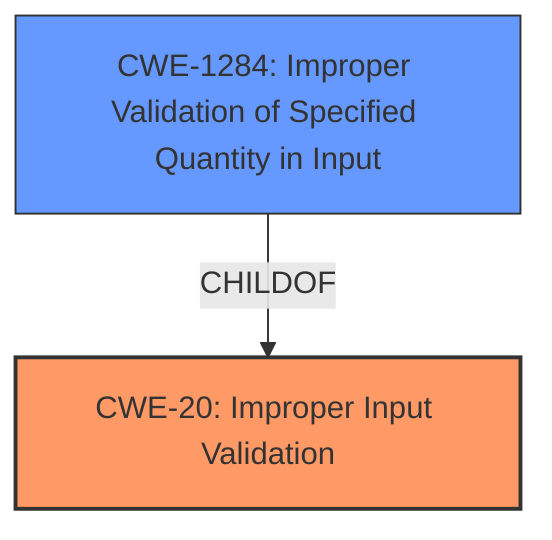

# Analysis Report for CVE-2020-1040

# Vulnerability Analysis Report: CVE-2020-1040

## Description


## Analysis (with Relationship Data)

# Summary
| CWE ID | CWE Name | Confidence | CWE Abstraction Level | CWE Vulnerability Mapping Label | CWE-Vulnerability Mapping Notes |
|---|---|---|---|---|---|
| CWE-20 | Improper Input Validation | 0.8 | Class | Primary | Discouraged |
| CWE-1284 | Improper Validation of Specified Quantity in Input | 0.6 | Base | Secondary Candidate | Allowed |

## Evidence and Confidence

*   **Confidence Score:** 0.7
*   **Evidence Strength:** MEDIUM

## Relationship Analysis
The primary relationship to consider is that CWE-1284 is a child of CWE-20. While CWE-20 is a general class, CWE-1284 is a more specific base. The evidence suggests the vulnerability stems from **improper input validation**. The description of CWE-1284 mentions quantity, and while not explicitly stated in the provided description, the underlying vulnerability of the Hyper-V RemoteFX vGPU likely involves validating quantities related to the input.



## Vulnerability Chain
The chain of events is as follows:

1.  **Root Cause:** **Improper Input Validation** (CWE-20) or more specifically **Improper Validation of Specified Quantity in Input** (CWE-1284) in Hyper-V RemoteFX vGPU.
2.  **Impact:** Remote Code Execution.

The description focuses on the initial **improper input validation**, leading to remote code execution.

## Summary of Analysis
The initial assessment identified **improper input validation** as the root cause, which aligns with CWE-20. However, further analysis, especially the Retriever Results, suggests CWE-1284, **Improper Validation of Specified Quantity in Input**, as a more specific candidate.

The vulnerability description states "**rootcause:** **improper input validation**" which directly supports the selection of CWE-20.

The Retriever Results show that CWE-20 is a top match, but it is a Class-level CWE and the mapping guidance discourages its use when more specific CWEs are available. The retriever also suggests CWE-1284, which is a Base-level CWE and a child of CWE-20.

The graph relationships show the direct parent-child relationship between CWE-20 and CWE-1284.

Given that the vulnerability involves the validation of input from an authenticated user, it is plausible that the input involves a quantity that is not properly validated. The nature of vGPU operations suggests that memory allocation or processing size might be involved, making CWE-1284 a relevant consideration.

CWE-20 is the primary weakness due to the explicit statement in the description, however, CWE-1284 is a strong secondary candidate because it is more specific. I am choosing CWE-20 as the primary due to the vulnerability description, and CWE-1284 as a secondary candidate.

Relevant CWE Information:

# Enhanced Context (25 CWEs)

## CWE-23: Relative Path Traversal
**Abstraction Level**: Base
**Similarity Score**: 0.80
**Source**: dense

**Description**:
The product uses external input to construct a pathname that should be within a restricted directory, but it does not properly neutralize sequences such as ".." that can resolve to a location that is outside of that directory.

**Mapping Guidance**:
- Usage: Allowed
- Rationale: This CWE entry is at the Base level of abstraction, which is a preferred level of abstraction for mapping to the root causes of vulnerabilities.

## CWE-41: Improper Resolution of Path Equivalence
**Abstraction Level**: Base
**Similarity Score**: 0.79
**Source**: dense

**Description**:
The product is vulnerable to file system contents disclosure through path equivalence. Path equivalence involves the use of special characters in file and directory names. The associated manipulations are intended to generate multiple names for the same object.

**Mapping Guidance**:
- Usage: Allowed
- Rationale: This CWE entry is at the Base level of abstraction, which is a preferred level of abstraction for mapping to the root causes of vulnerabilities.

## CWE-59: Improper Link Resolution Before File Access ('Link Following')
**Abstraction Level**: Base
**Similarity Score**: 0.79
**Source**: dense

**Description**:
The product attempts to access a file based on the filename, but it does not properly prevent that filename from identifying a link or shortcut that resolves to an unintended resource.

**Mapping Guidance**:
- Usage: Allowed
- Rationale: This CWE entry is at the Base level of abstraction, which is a preferred level of abstraction for mapping to the root causes of vulnerabilities.

## CWE-1289: Improper Validation of Unsafe Equivalence in Input
**Abstraction Level**: Base
**Similarity Score**: 0.79
**Source**: dense

**Description**:
The product receives an input value that is used as a resource identifier or other type of reference, but it does not validate or incorrectly validates that the input is equivalent to a potentially-unsafe value.

**Mapping Guidance**:
- Usage: Allowed
- Rationale: This CWE entry is at the Base level of abstraction, which is a preferred level of abstraction for mapping to the root causes of vulnerabilities.

## CWE-73: External Control of File Name or Path
**Abstraction Level**: Base
**Similarity Score**: 0.79
**Source**: dense

**Description**:
The product allows user input to control or influence paths or file names that are used in filesystem operations.

**Mapping Guidance**:
- Usage: Allowed
- Rationale: This CWE entry is at the Base level of abstraction, which is a preferred level of abstraction for mapping to the root causes of vulnerabilities.

## CWE-184: Incomplete List of Disallowed Inputs
**Abstraction Level**: Base
**Similarity Score**: 0.78
**Source**: dense

**Description**:
The product implements a protection mechanism that relies on a list of inputs (or properties of inputs) that are not allowed by policy or otherwise require other action to neutralize before additional processing takes place, but the list is incomplete.

**Mapping Guidance**:
- Usage: Allowed
- Rationale: This CWE entry is at the Base level of abstraction, which is a preferred level of abstraction for mapping to the root causes of vulnerabilities.

## CWE-36: Absolute Path Traversal
**Abstraction Level**: Base
**Similarity Score**: 0.78
**Source**: dense

**Description**:
The product uses external input to construct a pathname that should be within a restricted directory, but it does not properly neutralize absolute path sequences such as "/abs/path" that can resolve to a location that is outside of that directory.

**Mapping Guidance**:
- Usage: Allowed
- Rationale: This CWE entry is at the Base level of abstraction, which is a preferred level of abstraction for mapping to the root causes of vulnerabilities.

## CWE-427: Uncontrolled Search Path Element
**Abstraction Level**: Base
**Similarity Score**: 0.77
**Source**: dense

**Description**:
The product uses a fixed or controlled search path to find resources, but one or more locations in that path can be under the control of unintended actors.

**Mapping Guidance**:
- Usage: Allowed
- Rationale: This CWE entry is at the Base level of abstraction, which is a preferred level of abstraction for mapping to the root causes of vulnerabilities.

## CWE-668: Exposure of Resource to Wrong Sphere
**Abstraction Level**: Class
**Similarity Score**: 0.77
**Source**: dense

**Description**:
The product exposes a resource to the wrong control sphere, providing unintended actors with inappropriate access to the resource.

**Mapping Guidance**:
- Usage: Discouraged
- Rationale: CWE-668 is high-level and is often misused as a catch-all when lower-level CWE IDs might be applicable. It is sometimes used for low-information vulnerability reports [REF-1287]. It is a level-1 Class (i.e., a child of a Pillar). It is not useful for trend analysis.

## CWE-125: Out-of-bounds Read
**Abstraction Level**: Base
**Similarity Score**: 0.77
**Source**: dense

**Description**:
The product reads data past the end, or before the beginning, of the intended buffer.

**Mapping Guidance**:
- Usage: Allowed
- Rationale: This CWE entry is at the Base level of abstraction, which is a preferred level of abstraction for mapping to the root causes of vulnerabilities.

## CWE-1284: Improper Validation of Specified Quantity in Input
**Abstraction Level**: Base
**Similarity Score**: 6958.29
**Source**: sparse

**Description**:
The product receives input that is expected to specify a quantity (such as size or length), but it does not validate


## CWE Relationship Analysis

Current CWEs represent these abstraction levels: .


### Vulnerability Chain Analysis

**Chain starting from CWE-36:**
- 36 (Absolute Path Traversal) - ROOT


**Chain starting from CWE-41:**
- 41 (Improper Resolution of Path Equivalence) - ROOT


### CWE Relationship Diagram

```mermaid
graph TD
    classDef primary fill:#f96,stroke:#333,stroke-width:2px
    classDef secondary fill:#69f,stroke:#333
    classDef tertiary fill:#9e9,stroke:#333
```


*Report generated on 2025-04-02 03:32:54*
