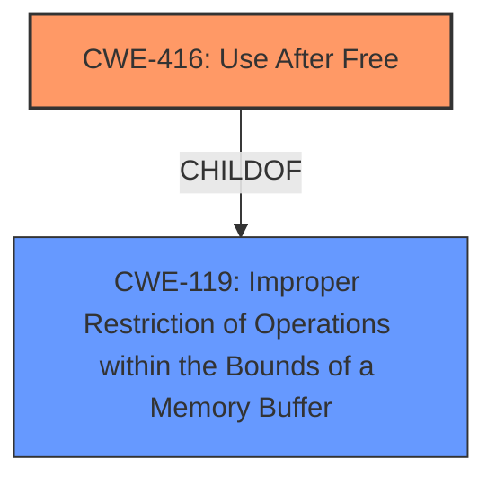

# Enhanced Analysis for CVE-2020-1054

# Summary
| CWE ID | CWE Name | Confidence | CWE Abstraction Level | CWE Vulnerability Mapping Label | CWE-Vulnerability Mapping Notes |
|---|---|---|---|---|---|
| CWE-416 | Use After Free | 0.75 | Variant | Primary | Allowed |
| CWE-119 | Improper Restriction of Operations within the Bounds of a Memory Buffer | 0.5 | Class | Secondary | Allowed-with-Review |

## Evidence and Confidence

*   **Confidence Score:** 0.7
*   **Evidence Strength:** MEDIUM

## Relationship Analysis
The primary CWE, CWE-416, is a variant of CWE-119. The vulnerability description mentions improper handling of objects in memory, which can lead to use-after-free conditions. CWE-119 is a broader category that encompasses memory safety issues, making it a suitable parent for CWE-416.



## Vulnerability Chain
The vulnerability chain involves the kernel-mode driver **failing to properly handle objects in memory** (root cause) leading to a use-after-free condition. This can then lead to an elevation of privilege (impact).

## Summary of Analysis
The initial assessment identified several potential CWEs, including CWE-123, CWE-787, and CWE-59. However, the vulnerability description focuses on memory handling issues within the Windows kernel-mode driver. The key phrase is the driver **fails to properly handle objects in memory**.

CWE-416 (Use After Free) is a strong candidate because it directly relates to memory management errors that can lead to exploitable conditions. It occurs when a program attempts to access memory after it has been freed, which aligns with improper object handling. While the description does not explicitly state "use after free", improper memory object handling is a common cause. The "Top CWEs" section lists CWE-416 as a strong match for similar CVE Descriptions.

CWE-119 (Improper Restriction of Operations within the Bounds of a Memory Buffer) is considered as a secondary CWE because it is a broader category. Use-after-free is a type of memory corruption, so CWE-119 can be considered a parent.

The relationships guided the decision to select a more specific CWE (CWE-416) while also acknowledging the broader context (CWE-119). The evidence from the vulnerability description, combined with the relationships and retriever results, supports the chosen CWEs at the appropriate level of specificity.

Relevant CWE Information:

# Enhanced Context (25 CWEs)

## CWE-667: Improper Locking
**Abstraction Level**: Class
**Similarity Score**: 0.79
**Source**: dense

**Description**:
The product does not properly acquire or release a lock on a resource, leading to unexpected resource state changes and behaviors.

**Mapping Guidance**:
- Usage: Allowed-with-Review
- Rationale: This CWE entry is a Class and might have Base-level children that would be more appropriate

*Reason for not selecting:* While concurrency issues can sometimes relate to memory corruption, the description does not specifically point to locking or synchronization problems.

## CWE-404: Improper Resource Shutdown or Release
**Abstraction Level**: Class
**Similarity Score**: 0.77
**Source**: dense

**Description**:
The product does not release or incorrectly releases a resource before it is made available for re-use.

**Mapping Guidance**:
- Usage: Allowed-with-Review
- Rationale: This CWE entry is a Class and might have Base-level children that would be more appropriate

*Reason for not selecting:* This CWE is about releasing a resource *before* it is available for reuse. The vulnerability is about a use *after* a resource is freed.

## CWE-662: Improper Synchronization
**Abstraction Level**: Class
**Similarity Score**: 0.77
**Source**: dense

**Description**:
The product utilizes multiple threads or processes to allow temporary access to a shared resource that can only be exclusive to one process at a time, but it does not properly synchronize these actions, which might cause simultaneous accesses of this resource by multiple threads or processes.

**Mapping Guidance**:
- Usage: Discouraged
- Rationale: This CWE entry is a level-1 Class (i.e., a child of a Pillar). It might have lower-level children that would be more appropriate

*Reason for not selecting:* While improper synchronization can lead to memory issues, there is no direct evidence of multiple threads or processes being involved.

## CWE-703: Improper Check or Handling of Exceptional Conditions
**Abstraction Level**: Pillar
**Similarity Score**: 0.77
**Source**: dense

**Description**:
The product does not properly anticipate or handle exceptional conditions that rarely occur during normal operation of the product.

**Mapping Guidance**:
- Usage: Discouraged
- Rationale: This CWE entry is extremely high-level, a Pillar.

*Reason for not selecting:* Too generic.

## CWE-754: Improper Check for Unusual or Exceptional Conditions
**Abstraction Level**: Class
**Similarity Score**: 0.77
**Source**: dense

**Description**:
The product does not check or incorrectly checks for unusual or exceptional conditions that are not expected to occur frequently during day to day operation of the product.

**Mapping Guidance**:
- Usage: Allowed-with-Review
- Rationale: This CWE entry is a Class and might have Base-level children that would be more appropriate

*Reason for not selecting:* While an exceptional condition *may* be the reason why the object is not handled properly, it is only a possibility, not a certainty.

## CWE-226: Sensitive Information in Resource Not Removed Before Reuse
**Abstraction Level**: Base
**Similarity Score**: 0.76
**Source**: dense

**Description**:
The product releases a resource such as memory or a file so that it can be made available for reuse, but it does not clear or "zeroize" the information contained in the resource before the product performs a critical state transition or makes the resource available for reuse by other entities.

**Mapping Guidance**:
- Usage: Allowed
- Rationale: This CWE entry is at the Base level of abstraction, which is a preferred level of abstraction for mapping to the root causes of vulnerabilities.

*Reason for not selecting:* This CWE is about sensitive information in the released resource, which is not what the description is talking about.

## CWE-664: Improper Control of a Resource Through its Lifetime
**Abstraction Level**: Pillar
**Similarity Score**: 0.76
**Source**: dense

**Description**:
The product does not maintain or incorrectly maintains control over a resource throughout its lifetime of creation, use, and release.

**Mapping Guidance**:
- Usage: Discouraged
- Rationale: This CWE entry is high-level when lower-level children are available.

*Reason for not selecting:* Too generic.

## CWE-665: Improper Initialization
**Abstraction Level**: Class
**Similarity Score**: 0.76
**Source**: dense

**Description**:
The product does not initialize or incorrectly initializes a resource, which might leave the resource in an unexpected state when it is accessed or used.

**Mapping Guidance**:
- Usage: Discouraged
- Rationale: This CWE entry is a level-1 Class (i.e., a child of a Pillar). It might have lower-level children that would be more appropriate

*Reason for not selecting:* This CWE is about initializing a resource, not handling an object in memory.

## CWE-362: Concurrent Execution using Shared Resource with Improper Synchronization ('Race Condition')
**Abstraction Level**: Class
**Similarity Score**: 0.75
**Source**: dense

**Description**:
The product contains a concurrent code sequence that requires temporary, exclusive access to a shared resource, but a timing window exists in which the shared resource can be modified by another code sequence operating concurrently.

**Mapping Guidance**:
- Usage: Allowed-with-Review
- Rationale: This CWE entry is a Class and might have Base-level children that would be more appropriate

*Reason for not selecting:* Not enough evidence of concurrency or timing window.

## CWE-653: Improper Isolation or Compartmentalization
**Abstraction Level**: Class
**Similarity Score**: 0.75
**Source**: dense

**Description**:
The product does not properly compartmentalize or isolate functionality, processes, or resources that require different privilege levels, rights, or permissions.

**Mapping Guidance**:
- Usage: Allowed
- Rationale: This CWE entry is at the Base level of abstraction, which is a preferred level of abstraction for mapping to the root causes of vulnerabilities.

*Reason for not selecting:* While privilege escalation is mentioned, the root cause doesn't appear to be about improper isolation or compartmentalization.

## CWE-364: Signal Handler Race Condition
**Abstraction Level**: Base
**Similarity Score**: 65


## CWE Relationship Analysis

Current CWEs represent these abstraction levels: .


### Vulnerability Chain Analysis

**Chain starting from CWE-667:**
- 667 (Improper Locking) - ROOT


**Chain starting from CWE-787:**
- 787 (Out-of-bounds Write) - ROOT


### CWE Relationship Diagram

```mermaid
graph TD
    classDef primary fill:#f96,stroke:#333,stroke-width:2px
    classDef secondary fill:#69f,stroke:#333
    classDef tertiary fill:#9e9,stroke:#333
```