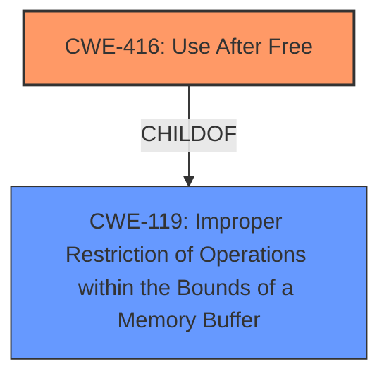

# Analysis for CVE-2020-1054

# Summary
| CWE ID | CWE Name | Confidence | CWE Abstraction Level | CWE Vulnerability Mapping Label | CWE-Vulnerability Mapping Notes |
|---|---|---|---|---|---|
| CWE-416 | Use After Free | 0.75 | Variant | Primary | Allowed |
| CWE-119 | Improper Restriction of Operations within the Bounds of a Memory Buffer | 0.5 | Class | Secondary | Allowed-with-Review |

## Evidence and Confidence

*   **Confidence Score:** 0.7
*   **Evidence Strength:** MEDIUM

## Relationship Analysis
The primary CWE, CWE-416, is a variant of CWE-119. The vulnerability description mentions improper handling of objects in memory, which can lead to use-after-free conditions. CWE-119 is a broader category that encompasses memory safety issues, making it a suitable parent for CWE-416.

## Vulnerability Chain
The vulnerability chain involves the kernel-mode driver **failing to properly handle objects in memory** (root cause) leading to a use-after-free condition. This can then lead to an elevation of privilege (impact).

## Summary of Analysis
The initial assessment identified several potential CWEs, including CWE-123, CWE-787, and CWE-59. However, the vulnerability description focuses on memory handling issues within the Windows kernel-mode driver. The key phrase is the driver **fails to properly handle objects in memory**.

CWE-416 (Use After Free) is a strong candidate because it directly relates to memory management errors that can lead to exploitable conditions. It occurs when a program attempts to access memory after it has been freed, which aligns with improper object handling. While the description does not explicitly state "use after free", improper memory object handling is a common cause. The "Top CWEs" section lists CWE-416 as a strong match for similar CVE Descriptions.

CWE-119 (Improper Restriction of Operations within the Bounds of a Memory Buffer) is considered as a secondary CWE because it is a broader category. Use-after-free is a type of memory corruption, so CWE-119 can be considered a parent.

The relationships guided the decision to select a more specific CWE (CWE-416) while also acknowledging the broader context (CWE-119). The evidence from the vulnerability description, combined with the relationships and retriever results, supports the chosen CWEs at the appropriate level of specificity.

Relevant CWE Information:

# Enhanced Context (25 CWEs)

## CWE-667: Improper Locking
**Abstraction Level**: Class
**Similarity Score**: 0.79
**Source**: dense

**Description**:
The product does not properly acquire or release a lock on a resource, leading to unexpected resource state changes and behaviors.

**Mapping Guidance**:
- Usage: Allowed-with-Review
- Rationale: This CWE entry is a Class and might have Base-level children that would be more appropriate

*Reason for not selecting:* While concurrency issues can sometimes relate to memory corruption, the description does not specifically point to locking or synchronization problems.

## CWE-404: Improper Resource Shutdown or Release
**Abstraction Level**: Class
**Similarity Score**: 0.77
**Source**: dense

**Description**:
The product does not release or incorrectly releases a resource before it is made available for re-use.

**Mapping Guidance**:
- Usage: Allowed-with-Review
- Rationale: This CWE entry is a Class and might have Base-level children that would be more appropriate

*Reason for not selecting:* This CWE is about releasing a resource *before* it is available for reuse. The vulnerability is about a use *after* a resource is freed.

## CWE-662: Improper Synchronization
**Abstraction Level**: Class
**Similarity Score**: 0.77
**Source**: dense

**Description**:
The product utilizes multiple threads or processes to allow temporary access to a shared resource that can only be exclusive to one process at a time, but it does not properly synchronize these actions, which might cause simultaneous accesses of this resource by multiple threads or processes.

**Mapping Guidance**:
- Usage: Discouraged
- Rationale: This CWE entry is a level-1 Class (i.e., a child of a Pillar). It might have lower-level children that would be more appropriate

*Reason for not selecting:* While improper synchronization can lead to memory issues, there is no direct evidence of multiple threads or processes being involved.

## CWE-703: Improper Check or Handling of Exceptional Conditions
**Abstraction Level**: Pillar
**Similarity Score**: 0.77
**Source**: dense

**Description**:
The product does not properly anticipate or handle exceptional conditions that rarely occur during normal operation of the product.

**Mapping Guidance**:
- Usage: Discouraged
- Rationale: This CWE entry is extremely high-level, a Pillar.

*Reason for not selecting:* Too generic.

## CWE-754: Improper Check for Unusual or Exceptional Conditions
**Abstraction Level**: Class
**Similarity Score**: 0.77
**Source**: dense

**Description**:
The product does not check or incorrectly checks for unusual or exceptional conditions that are not expected to occur frequently during day to day operation of the product.

**Mapping Guidance**:
- Usage: Allowed-with-Review
- Rationale: This CWE entry is a Class and might have Base-level children that would be more appropriate

*Reason for not selecting:* While an exceptional condition *may* be the reason why the object is not handled properly, it is only a possibility, not a certainty.

## CWE-226: Sensitive Information in Resource Not Removed Before Reuse
**Abstraction Level**: Base
**Similarity Score**: 0.76
**Source**: dense

**Description**:
The product releases a resource such as memory or a file so that it can be made available for reuse, but it does not clear or "zeroize" the information contained in the resource before the product performs a critical state transition or makes the resource available for reuse by other entities.

**Mapping Guidance**:
- Usage: Allowed
- Rationale: This CWE entry is at the Base level of abstraction, which is a preferred level of abstraction for mapping to the root causes of vulnerabilities.

*Reason for not selecting:* This CWE is about sensitive information in the released resource, which is not what the description is talking about.

## CWE-664: Improper Control of a Resource Through its Lifetime
**Abstraction Level**: Pillar
**Similarity Score**: 0.76
**Source**: dense

**Description**:
The product does not maintain or incorrectly maintains control over a resource throughout its lifetime of creation, use, and release.

**Mapping Guidance**:
- Usage: Discouraged
- Rationale: This CWE entry is high-level when lower-level children are available.

*Reason for not selecting:* Too generic.

## CWE-665: Improper Initialization
**Abstraction Level**: Class
**Similarity Score**: 0.76
**Source**: dense

**Description**:
The product does not initialize or incorrectly initializes a resource, which might leave the resource in an unexpected state when it is accessed or used.

**Mapping Guidance**:
- Usage: Discouraged
- Rationale: This CWE entry is a level-1 Class (i.e., a child of a Pillar). It might have lower-level children that would be more appropriate

*Reason for not selecting:* This CWE is about initializing a resource, not handling an object in memory.

## CWE-362: Concurrent Execution using Shared Resource with Improper Synchronization ('Race Condition')
**Abstraction Level**: Class
**Similarity Score**: 0.75
**Source**: dense

**Description**:
The product contains a concurrent code sequence that requires temporary, exclusive access to a shared resource, but a timing window exists in which the shared resource can be modified by another code sequence operating concurrently.

**Mapping Guidance**:
- Usage: Allowed-with-Review
- Rationale: This CWE entry is a Class and might have Base-level children that would be more appropriate

*Reason for not selecting:* Not enough evidence of concurrency or timing window.

## CWE-653: Improper Isolation or Compartmentalization
**Abstraction Level**: Class
**Similarity Score**: 0.75
**Source**: dense

**Description**:
The product does not properly compartmentalize or isolate functionality, processes, or resources that require different privilege levels, rights, or permissions.

**Mapping Guidance**:
- Usage: Allowed
- Rationale: This CWE entry is at the Base level of abstraction, which is a preferred level of abstraction for mapping to the root causes of vulnerabilities.

*Reason for not selecting:* While privilege escalation is mentioned, the root cause doesn't appear to be about improper isolation or compartmentalization.

## CWE-364: Signal Handler Race Condition
**Abstraction Level**: Base
**Similarity Score**: 65

# Enhanced Query for CVE-2020-1054

## Vulnerability Description
An elevation of privilege vulnerability exists in Windows when the Windows kernel-mode driver **fails to properly handle objects in memory**, aka 'Win32k Elevation of Privilege Vulnerability'. This CVE ID is unique from CVE-2020-1143.

### Vulnerability Description Key Phrases
- **rootcause:** **fails to properly handle objects in memory**
- **impact:** elevation of privilege
- **product:** Windows
- **component:** kernel-mode driver

### CWE for similar CVE Descriptions
### Primary CWE Match
CWE-NVD-noinfo

#### Top CWEs
- CWE-NVD-noinfo (Count: 138)
- CWE-416 (Count: 8)
- CWE-59 (Count: 8)

## Retriever Results

### Top Combined Results

| Rank | CWE ID | Name | Abstraction | Usage  | Retrievers | Individual Scores |
|------|--------|------|-------------|-------|------------|-------------------|
| 1 | 123 | Write-what-where Condition | Base | Allowed | sparse | 0.353 |
| 2 | 787 | Out-of-bounds Write | Base | Allowed | sparse | 0.297 |
| 3 | 59 | Improper Link Resolution Before File Access ('Link Following') | Base | Allowed | sparse | 0.280 |
| 4 | 362 | Concurrent Execution using Shared Resource with Improper Synchronization ('Race Condition') | Class | Allowed-with-Review | sparse | 0.278 |
| 5 | 1285 | Improper Validation of Specified Index, Position, or Offset in Input | Base | Allowed | sparse | 0.270 |
| 6 | 1386 | Insecure Operation on Windows Junction / Mount Point | Base | Allowed | dense | 0.584 |
| 7 | 364 | Signal Handler Race Condition | Base | Allowed | graph | 0.003 |
| 8 | 667 | Improper Locking | Class | Allowed-with-Review | sparse | 0.270 |
| 9 | 755 | Improper Handling of Exceptional Conditions | Class | Discouraged | sparse | 0.265 |
| 10 | 909 | Missing Initialization of Resource | Class | Allowed-with-Review | sparse | 0.264 |

# Complete CWE Specifications

## CWE-123: Write-what-where Condition
**Abstraction:** Base
**Status:** Draft

### Description
Any condition where the attacker has the ability to write an arbitrary value to an arbitrary location, often as the result of a buffer overflow.

### Extended Description
Not provided

### Alternative Terms
None

### Relationships
ChildOf -> CWE-787
ChildOf -> CWE-119
ChildOf -> CWE-119

### Mapping Guidance
**Usage:** Allowed
**Rationale:** This CWE entry is at the Base level of abstraction, which is a preferred level of abstraction for mapping to the root causes of vulnerabilities.
**Comments:** Carefully read both the name and description to ensure that this mapping is an appropriate fit. Do not try to 'force' a mapping to a lower-level Base/Variant simply to comply with this preferred level of abstraction.
**Reasons:**
- Acceptable-Use

### Observed Examples
- **CVE-2022-21668:** Chain: Python library does not limit the resources used to process images that specify a very large number of bands (CWE-1284), leading to excessive memory consumption (CWE-789) or an integer overflow (CWE-190).
- **CVE-2022-0545:** Chain: 3D renderer has an integer overflow (CWE-190) leading to write-what-where condition (CWE-123) using a crafted image.

## CWE-787: Out-of-bounds Write
**Abstraction:** Base
**Status:** Draft

### Description
The product writes data past the end, or before the beginning, of the intended buffer.

### Extended Description
Not provided

### Alternative Terms
Memory Corruption: Often used to describe the consequences of writing to memory outside the bounds of a buffer, or to memory that is otherwise invalid.

### Relationships
ChildOf -> CWE-119
ChildOf -> CWE-119
ChildOf -> CWE-119
ChildOf -> CWE-119

### Mapping Guidance
**Usage:** Allowed
**Rationale:** This CWE entry is at the Base level of abstraction, which is a preferred level of abstraction for mapping to the root causes of vulnerabilities.
**Comments:** Carefully read both the name and description to ensure that this mapping is an appropriate fit. Do not try to 'force' a mapping to a lower-level Base/Variant simply to comply with this preferred level of abstraction.
**Reasons:**
- Acceptable-Use

### Observed Examples
- **CVE-2023-1017:** The reference implementation code for a Trusted Platform Module does not implement length checks on data, allowing for an attacker to write 2 bytes past the end of a buffer.
- **CVE-2021-21220:** Chain: insufficient input validation (CWE-20) in browser allows heap corruption (CWE-787), as exploited in the wild per CISA KEV.
- **CVE-2021-28664:** GPU kernel driver allows memory corruption because a user can obtain read/write access to read-only pages, as exploited in the wild per CISA KEV.

## CWE-59: Improper Link Resolution Before File Access ('Link Following')
**Abstraction:** Base
**Status:** Draft

### Description
The product attempts to access a file based on the filename, but it does not properly prevent that filename from identifying a link or shortcut that resolves to an unintended resource.

### Extended Description
Not provided

### Alternative Terms
insecure temporary file: Some people use the phrase "insecure temporary file" when referring to a link following weakness, but other weaknesses can produce insecure temporary files without any symlink involvement at all.
Zip Slip: "Zip slip" is an attack that uses file archives (e.g., ZIP, tar, rar, etc.) that contain filenames with path traversal sequences that cause the files to be written outside of the directory under which the archive is expected to be extracted [REF-1282]. It is most commonly used for relative path traversal (CWE-23) and link following (CWE-59).

### Relationships
ChildOf -> CWE-706
ChildOf -> CWE-706

### Mapping Guidance
**Usage:** Allowed
**Rationale:** This CWE entry is at the Base level of abstraction, which is a preferred level of abstraction for mapping to the root causes of vulnerabilities.
**Comments:** Carefully read both the name and description to ensure that this mapping is an appropriate fit. Do not try to 'force' a mapping to a lower-level Base/Variant simply to comply with this preferred level of abstraction.
**Reasons:**
- Acceptable-Use

### Additional Notes
**[Theoretical]** 

Link following vulnerabilities are Multi-factor Vulnerabilities (MFV). They are the combination of multiple elements: file or directory permissions, filename predictability, race conditions, and in some cases, a design limitation in which there is no mechanism for performing atomic file creation operations.

Some potential factors are race conditions, permissions, and predictability.

### Observed Examples
- **CVE-1999-1386:** Some versions of Perl follow symbolic links when running with the -e option, which allows local users to overwrite arbitrary files via a symlink attack.
- **CVE-2000-1178:** Text editor follows symbolic links when creating a rescue copy during an abnormal exit, which allows local users to overwrite the files of other users.
- **CVE-2004-0217:** Antivirus update allows local users to create or append to arbitrary files via a symlink attack on a logfile.

## CWE-362: Concurrent Execution using Shared Resource with Improper Synchronization ('Race Condition')
**Abstraction:** Class
**Status:** Draft

### Description
The product contains a concurrent code sequence that requires temporary, exclusive access to a shared resource, but a timing window exists in which the shared resource can be modified by another code sequence operating concurrently.

### Extended Description

A race condition occurs within concurrent environments, and it is effectively a property of a code sequence. Depending on the context, a code sequence may be in the form of a function call, a small number of instructions, a series of program invocations, etc.

A race condition violates these properties, which are closely related:

  - Exclusivity - the code sequence is given exclusive access to the shared resource, i.e., no other code sequence can modify properties of the shared resource before the original sequence has completed execution.

  - Atomicity - the code sequence is behaviorally atomic, i.e., no other thread or process can concurrently execute the same sequence of instructions (or a subset) against the same resource.

A race condition exists when an "interfering code sequence" can still access the shared resource, violating exclusivity.

The interfering code sequence could be "trusted" or "untrusted." A trusted interfering code sequence occurs within the product; it cannot be modified by the attacker, and it can only be invoked indirectly. An untrusted interfering code sequence can be authored directly by the attacker, and typically it is external to the vulnerable product.

### Alternative Terms
Race Condition

### Relationships
ChildOf -> CWE-691
CanPrecede -> CWE-416
CanPrecede -> CWE-476

### Mapping Guidance
**Usage:** Allowed-with-Review
**Rationale:** This CWE entry is a Class and might have Base-level children that would be more appropriate
**Comments:** Examine children of this entry to see if there is a better fit
**Reasons:**
- Abstraction

### Additional Notes
**[Maintenance]** The relationship between race conditions and synchronization problems (CWE-662) needs to be further developed. They are not necessarily two perspectives of the same core concept, since synchronization is only one technique for avoiding race conditions, and synchronization can be used for other purposes besides race condition prevention.

**[Research Gap]** Race conditions in web applications are under-studied and probably under-reported. However, in 2008 there has been growing interest in this area.

**[Research Gap]** Much of the focus of race condition research has been in Time-of-check Time-of-use (TOCTOU) variants (CWE-367), but many race conditions are related to synchronization problems that do not necessarily require a time-of-check.

**[Research Gap]** From a classification/taxonomy perspective, the relationships between concurrency and program state need closer investigation and may be useful in organizing related issues.

### Observed Examples
- **CVE-2022-29527:** Go application for cloud management creates a world-writable sudoers file that allows local attackers to inject sudo rules and escalate privileges to root by winning a race condition.
- **CVE-2021-1782:** Chain: improper locking (CWE-667) leads to race condition (CWE-362), as exploited in the wild per CISA KEV.
- **CVE-2021-0920:** Chain: mobile platform race condition (CWE-362) leading to use-after-free (CWE-416), as exploited in the wild per CISA KEV.

## CWE-1285: Improper Validation of Specified Index, Position, or Offset in Input
**Abstraction:** Base
**Status:** Incomplete

### Description
The product receives input that is expected to specify an index, position, or offset into an indexable resource such as a buffer or file, but it does not validate or incorrectly validates that the specified index/position/offset has the required properties.

### Extended Description

Often, indexable resources such as memory buffers or files can be accessed using a specific position, index, or offset, such as an index for an array or a position for a file. When untrusted input is not properly validated before it is used as an index, attackers could access (or attempt to access) unauthorized portions of these resources. This could be used to cause buffer overflows, excessive resource allocation, or trigger unexpected failures. 

### Alternative Terms
None

### Relationships
ChildOf -> CWE-20

### Mapping Guidance
**Usage:** Allowed
**Rationale:** This CWE entry is at the Base level of abstraction, which is a preferred level of abstraction for mapping to the root causes of vulnerabilities.
**Comments:** Carefully read both the name and description to ensure that this mapping is an appropriate fit. Do not try to 'force' a mapping to a lower-level Base/Variant simply to comply with this preferred level of abstraction.
**Reasons:**
- Acceptable-Use

### Additional Notes
**[Maintenance]** This entry is still under development and will continue to see updates and content improvements.

### Observed Examples
- **CVE-2005-0369:** large ID in packet used as array index
- **CVE-2001-1009:** negative array index as argument to POP LIST command

## CWE-1386: Insecure Operation on Windows Junction / Mount Point
**Abstraction:** Base
**Status:** Incomplete

### Description
The product opens a file or directory, but it does not properly prevent the name from being associated with a junction or mount point to a destination that is outside of the intended control sphere.

### Extended Description

Depending on the intended action being performed, this could allow an attacker to cause the product to read, write, delete, or otherwise operate on unauthorized files.

In Windows, NTFS5 allows for file system objects called reparse points. Applications can create a hard link from one directory to another directory, called a junction point. They can also create a mapping from a directory to a drive letter, called a mount point. If a file is used by a privileged program, but it can be replaced with a hard link to a sensitive file (e.g., AUTOEXEC.BAT), an attacker could excalate privileges. When the process opens the file, the attacker can assume the privileges of that process, tricking the privileged process to read, modify, or delete the sensitive file, preventing the program from accurately processing data. Note that one can also point to registries and semaphores.

### Alternative Terms
None

### Relationships
ChildOf -> CWE-59

### Mapping Guidance
**Usage:** Allowed
**Rationale:** This CWE entry is at the Base level of abstraction, which is a preferred level of abstraction for mapping to the root causes of vulnerabilities.
**Comments:** Carefully read both the name and description to ensure that this mapping is an appropriate fit. Do not try to 'force' a mapping to a lower-level Base/Variant simply to comply with this preferred level of abstraction.
**Reasons:**
- Acceptable-Use

### Additional Notes
**[Terminology]** Symbolic links, hard links, junctions, and mount points can be confusing terminology, as there are differences in how they operate between UNIX-based systems and Windows, and there are interactions between them.

**[Maintenance]** This entry is still under development and will continue to see updates and content improvements.

### Observed Examples
- **CVE-2021-26426:** Privileged service allows attackers to delete unauthorized files using a directory junction, leading to arbitrary code execution as SYSTEM.
- **CVE-2020-0863:** By creating a mount point and hard links, an attacker can abuse a service to allow users arbitrary file read permissions.
- **CVE-2019-1161:** Chain: race condition (CWE-362) in anti-malware product allows deletion of files by creating a junction (CWE-1386) and using hard links during the time window in which a temporary file is created and deleted.

## CWE-364: Signal Handler Race Condition
**Abstraction:** Base
**Status:** Incomplete

### Description
The product uses a signal handler that introduces a race condition.

### Extended Description

Race conditions frequently occur in signal handlers, since signal handlers support asynchronous actions. These race conditions have a variety of root causes and symptoms. Attackers may be able to exploit a signal handler race condition to cause the product state to be corrupted, possibly leading to a denial of service or even code execution.

These issues occur when non-reentrant functions, or state-sensitive actions occur in the signal handler, where they may be called at any time. These behaviors can violate assumptions being made by the "regular" code that is interrupted, or by other signal handlers that may also be invoked. If these functions are called at an inopportune moment - such as while a non-reentrant function is already running - memory corruption could occur that may be exploitable for code execution. Another signal race condition commonly found occurs when free is called within a signal handler, resulting in a double free and therefore a write-what-where condition. Even if a given pointer is set to NULL after it has been freed, a race condition still exists between the time the memory was freed and the pointer was set to NULL. This is especially problematic if the same signal handler has been set for more than one signal -- since it means that the signal handler itself may be reentered.

There are several known behaviors related to signal handlers that have received the label of "signal handler race condition":

  - Shared state (e.g. global data or static variables) that are accessible to both a signal handler and "regular" code

  - Shared state between a signal handler and other signal handlers

  - Use of non-reentrant functionality within a signal handler - which generally implies that shared state is being used. For example, malloc() and free() are non-reentrant because they may use global or static data structures for managing memory, and they are indirectly used by innocent-seeming functions such as syslog(); these functions could be exploited for memory corruption and, possibly, code execution.

  - Association of the same signal handler function with multiple signals - which might imply shared state, since the same code and resources are accessed. For example, this can be a source of double-free and use-after-free weaknesses.

  - Use of setjmp and longjmp, or other mechanisms that prevent a signal handler from returning control back to the original functionality

  - While not technically a race condition, some signal handlers are designed to be called at most once, and being called more than once can introduce security problems, even when there are not any concurrent calls to the signal handler. This can be a source of double-free and use-after-free weaknesses.

Signal handler vulnerabilities are often classified based on the absence of a specific protection mechanism, although this style of classification is discouraged in CWE because programmers often have a choice of several different mechanisms for addressing the weakness. Such protection mechanisms may preserve exclusivity of access to the shared resource, and behavioral atomicity for the relevant code:

  - Avoiding shared state

  - Using synchronization in the signal handler

  - Using synchronization in the regular code

  - Disabling or masking other signals, which provides atomicity (which effectively ensures exclusivity)

### Alternative Terms
None

### Relationships
ChildOf -> CWE-362
CanPrecede -> CWE-415
CanPrecede -> CWE-416
CanPrecede -> CWE-123

### Mapping Guidance
**Usage:** Allowed
**Rationale:** This CWE entry is at the Base level of abstraction, which is a preferred level of abstraction for mapping to the root causes of vulnerabilities.
**Comments:** Carefully read both the name and description to ensure that this mapping is an appropriate fit. Do not try to 'force' a mapping to a lower-level Base/Variant simply to comply with this preferred level of abstraction.
**Reasons:**
- Acceptable-Use

### Observed Examples
- **CVE-1999-0035:** Signal handler does not disable other signal handlers, allowing it to be interrupted, causing other functionality to access files/etc. with raised privileges
- **CVE-2001-0905:** Attacker can send a signal while another signal handler is already running, leading to crash or execution with root privileges
- **CVE-2001-1349:** unsafe calls to library functions from signal handler

## CWE-667: Improper Locking
**Abstraction:** Class
**Status:** Draft

### Description
The product does not properly acquire or release a lock on a resource, leading to unexpected resource state changes and behaviors.

### Extended Description

Locking is a type of synchronization behavior that ensures that multiple independently-operating processes or threads do not interfere with each other when accessing the same resource. All processes/threads are expected to follow the same steps for locking. If these steps are not followed precisely - or if no locking is done at all - then another process/thread could modify the shared resource in a way that is not visible or predictable to the original process. This can lead to data or memory corruption, denial of service, etc.

### Alternative Terms
None

### Relationships
ChildOf -> CWE-662
ChildOf -> CWE-662
ChildOf -> CWE-662
ChildOf -> CWE-662

### Mapping Guidance
**Usage:** Allowed-with-Review
**Rationale:** This CWE entry is a Class and might have Base-level children that would be more appropriate
**Comments:** Examine children of this entry to see if there is a better fit
**Reasons:**
- Abstraction

### Additional Notes
**[Maintenance]** Deeper research is necessary for synchronization and related mechanisms, including locks, mutexes, semaphores, and other mechanisms. Multiple entries are dependent on this research, which includes relationships to concurrency, race conditions, reentrant functions, etc. CWE-662 and its children - including CWE-667, CWE-820, CWE-821, and others - may need to be modified significantly, along with their relationships.

### Observed Examples
- **CVE-2021-1782:** Chain: improper locking (CWE-667) leads to race condition (CWE-362), as exploited in the wild per CISA KEV.
- **CVE-2009-0935:** Attacker provides invalid address to a memory-reading function, causing a mutex to be unlocked twice
- **CVE-2010-4210:** function in OS kernel unlocks a mutex that was not previously locked, causing a panic or overwrite of arbitrary memory.

## CWE-755: Improper Handling of Exceptional Conditions
**Abstraction:** Class
**Status:** Incomplete

### Description
The product does not handle or incorrectly handles an exceptional condition.

### Extended Description
Not provided

### Alternative Terms
None

### Relationships
ChildOf -> CWE-703

### Mapping Guidance
**Usage:** Discouraged
**Rationale:** This CWE entry is a level-1 Class (i.e., a child of a Pillar). It might have lower-level children that would be more appropriate
**Comments:** Examine children of this entry to see if there is a better fit
**Reasons:**
- Abstraction

### Observed Examples
- **CVE-2023-41151:** SDK for OPC Unified Architecture (OPC UA) server has uncaught exception when a socket is blocked for writing but the server tries to send an error
- **[REF-1374]:** Chain: JavaScript-based cryptocurrency library can fall back to the insecure Math.random() function instead of reporting a failure (CWE-392), thus reducing the entropy (CWE-332) and leading to generation of non-unique cryptographic keys for Bitcoin wallets (CWE-1391)
- **CVE-2021-3011:** virtual interrupt controller in a virtualization product allows crash of host by writing a certain invalid value to a register, which triggers a fatal error instead of returning an error code

## CWE-909: Missing Initialization of Resource
**Abstraction:** Class
**Status:** Incomplete

### Description
The product does not initialize a critical resource.

### Extended Description
Many resources require initialization before they can be properly used. If a resource is not initialized, it could contain unpredictable or expired data, or it could be initialized to defaults that are invalid. This can have security implications when the resource is expected to have certain properties or values.

### Alternative Terms
None

### Relationships
ChildOf -> CWE-665
ChildOf -> CWE-665
CanPrecede -> CWE-908

### Mapping Guidance
**Usage:** Allowed-with-Review
**Rationale:** This CWE entry is a Class and might have Base-level children that would be more appropriate
**Comments:** Examine children of this entry to see if there is a better fit
**Reasons:**
- Abstraction

### Observed Examples
- **CVE-2020-20739:** A variable that has its value set in a conditional statement is sometimes used when the conditional fails, sometimes causing data leakage
- **CVE-2005-1036:** Chain: Bypass of access restrictions due to improper authorization (CWE-862) of a user results from an improperly initialized (CWE-909) I/O permission bitmap

