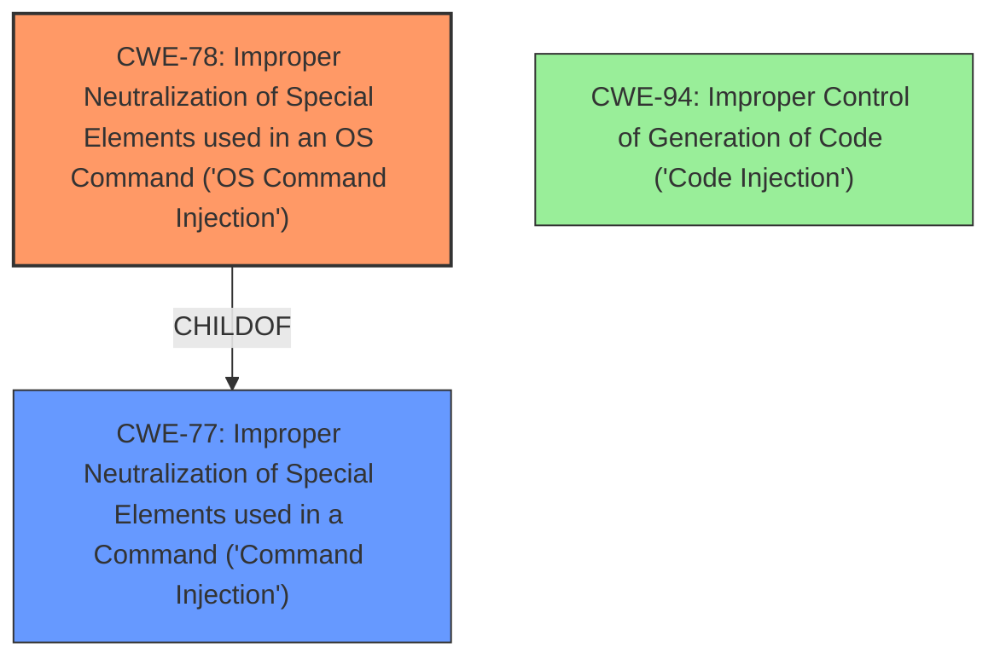

# Analysis Report for CVE-2020-10580

# Vulnerability Analysis Report: CVE-2020-10580

## Description


## Analysis (with Relationship Data)

# Summary
| CWE ID | CWE Name | Confidence | CWE Abstraction Level | CWE Vulnerability Mapping Label | CWE-Vulnerability Mapping Notes |
|---|---|---|---|---|---|
| CWE-78 | Improper Neutralization of Special Elements used in an OS Command ('Command Injection') | 1.0 | Base | Allowed | Primary CWE |
| CWE-94 | Improper Control of Generation of Code ('Code Injection') | 0.6 | Base | Allowed-with-Review | Secondary Candidate |

## Evidence and Confidence

*   **Confidence Score:** 0.9
*   **Evidence Strength:** HIGH

## Relationship Analysis
The primary relationship is that CWE-78 [Improper Neutralization of Special Elements used in an OS Command ('OS Command Injection')] is a base CWE that is child of CWE-77 [Improper Neutralization of Special Elements used in a Command ('Command Injection')]. CWE-94 [Improper Control of Generation of Code ('Code Injection')] is a peer. The vulnerability involves **command injection** leading to arbitrary PHP code execution, which aligns well with CWE-78. The relationships suggest that CWE-78 is a more specific and appropriate choice than its parent CWE-77. CWE-94 is related as code execution is the impact of the **command injection**



## Vulnerability Chain
The vulnerability chain starts with the **command injection** vulnerability due to **improper neutralization** of special elements, leading to the execution of arbitrary PHP code on the server.

## Summary of Analysis
The initial assessment identified the **command injection** vulnerability in the /admin/broadcast.php script of Invigo Automatic Device Management (ADM) through 5.0. The final conclusion, based on the evidence and relationship analysis, is that CWE-78 [Improper Neutralization of Special Elements used in an OS Command ('OS Command Injection')] is the most appropriate CWE to classify this vulnerability, with CWE-94 [Improper Control of Generation of Code ('Code Injection')] as a possible secondary candidate due to the nature of PHP's ability to execute code.

The evidence supporting this decision comes directly from the vulnerability description, which states "**command injection** on the /admin/broadcast.php script...allows remote authenticated attackers to execute arbitrary PHP code on the server." This statement clearly indicates a **command injection** issue, aligning perfectly with CWE-78's description.

The choice of CWE-78 is at the optimal level of specificity because it directly addresses the root cause of the vulnerability which is **improper neutralization** of special elements in an OS command, rather than a more general class of **injection** vulnerabilities.

Relevant CWE Information:

# Enhanced Context (25 CWEs)
The following CWEs were identified as potentially relevant to this vulnerability:

## CWE-184: Incomplete List of Disallowed Inputs
**Abstraction Level**: Base
**Similarity Score**: 0.78
**Source**: dense

**Description**:
The product implements a protection mechanism that relies on a list of inputs (or properties of inputs) that are not allowed by policy or otherwise require other action to neutralize before additional processing takes place, but the list is incomplete.

**Mapping Guidance**:
- Usage: Allowed
- Rationale: This CWE entry is at the Base level of abstraction, which is a preferred level of abstraction for mapping to the root causes of vulnerabilities.

## CWE-434: Unrestricted Upload of File with Dangerous Type
**Abstraction Level**: Base
**Similarity Score**: 0.76
**Source**: dense

**Description**:
The product allows the upload or transfer of dangerous file types that are automatically processed within its environment.

**Mapping Guidance**:
- Usage: Allowed
- Rationale: This CWE entry is at the Base level of abstraction, which is a preferred level of abstraction for mapping to the root causes of vulnerabilities.

## CWE-74: Improper Neutralization of Special Elements in Output Used by a Downstream Component ('Injection')
**Abstraction Level**: Class
**Similarity Score**: 0.76
**Source**: dense

**Description**:
The product constructs all or part of a command, data structure, or record using externally-influenced input from an upstream component, but it does not neutralize or incorrectly neutralizes special elements that could modify how it is parsed or interpreted when it is sent to a downstream component.

**Mapping Guidance**:
- Usage: Discouraged
- Rationale: CWE-74 is high-level and often misused when lower-level weaknesses are more appropriate.

## CWE-183: Permissive List of Allowed Inputs
**Abstraction Level**: Base
**Similarity Score**: 0.75
**Source**: dense

**Description**:
The product implements a protection mechanism that relies on a list of inputs (or properties of inputs) that are explicitly allowed by policy because the inputs are assumed to be safe, but the list is too permissive - that is, it allows an input that is unsafe, leading to resultant weaknesses.

**Mapping Guidance**:
- Usage: Allowed
- Rationale: This CWE entry is at the Base level of abstraction, which is a preferred level of abstraction for mapping to the root causes of vulnerabilities.

## CWE-80: Improper Neutralization of Script-Related HTML Tags in a Web Page (Basic XSS)
**Abstraction Level**: Variant
**Similarity Score**: 0.75
**Source**: dense

**Description**:
The product receives input from an upstream component, but it does not neutralize or incorrectly neutralizes special characters such as "<", ">", and "&" that could be interpreted as web-scripting elements when they are sent to a downstream component that processes web pages.

**Mapping Guidance**:
- Usage: Allowed
- Rationale: This CWE entry is at the Variant level of abstraction, which is a preferred level of abstraction for mapping to the root causes of vulnerabilities.

## CWE-73: External Control of File Name or Path
**Abstraction Level**: Base
**Similarity Score**: 0.75
**Source**: dense

**Description**:
The product allows user input to control or influence paths or file names that are used in filesystem operations.

**Mapping Guidance**:
- Usage: Allowed
- Rationale: This CWE entry is at the Base level of abstraction, which is a preferred level of abstraction for mapping to the root causes of vulnerabilities.

## CWE-1289: Improper Validation of Unsafe Equivalence in Input
**Abstraction Level**: Base
**Similarity Score**: 0.75
**Source**: dense

**Description**:
The product receives an input value that is used as a resource identifier or other type of reference, but it does not validate or incorrectly validates that the input is equivalent to a potentially-unsafe value.

**Mapping Guidance**:
- Usage: Allowed
- Rationale: This CWE entry is at the Base level of abstraction, which is a preferred level of abstraction for mapping to the root causes of vulnerabilities.

## CWE-138: Improper Neutralization of Special Elements
**Abstraction Level**: Class
**Similarity Score**: 0.74
**Source**: dense

**Description**:
The product receives input from an upstream component, but it does not neutralize or incorrectly neutralizes special elements that could be interpreted as control elements or syntactic markers when they are sent to a downstream component.

**Mapping Guidance**:
- Usage: Discouraged
- Rationale: This CWE entry is a level-1 Class (i.e., a child of a Pillar). It might have lower-level children that would be more appropriate

## CWE-41: Improper Resolution of Path Equivalence
**Abstraction Level**: Base
**Similarity Score**: 0.74
**Source**: dense

**Description**:
The product is vulnerable to file system contents disclosure through path equivalence. Path equivalence involves the use of special characters in file and directory names. The associated manipulations are intended to generate multiple names for the same object.

**Mapping Guidance**:
- Usage: Allowed
- Rationale: This CWE entry is at the Base level of abstraction, which is a preferred level of abstraction for mapping to the root causes of vulnerabilities.

## CWE-23: Relative Path Traversal
**Abstraction Level**: Base
**Similarity Score**: 0.74
**Source**: dense

**Description**:
The product uses external input to construct a pathname that should be within a restricted directory, but it does not properly neutralize sequences such as ".." that can resolve to a location that is outside of that directory.

**Mapping Guidance**:
- Usage: Allowed
- Rationale: This CWE entry is at the Base level of abstraction, which is a preferred level of abstraction for mapping to the root causes of vulnerabilities.

## CWE-1336: Improper Neutralization of Special Elements Used in a Template Engine
**Abstraction Level**:


## CWE Relationship Analysis

Current CWEs represent these abstraction levels: .


### Vulnerability Chain Analysis

**Chain starting from CWE-1336:**
- 1336 (Improper Neutralization of Special Elements Used in a Template Engine) - ROOT


**Chain starting from CWE-80:**
- 80 (Improper Neutralization of Script-Related HTML Tags in a Web Page (Basic XSS)) - ROOT


### CWE Relationship Diagram

```mermaid
graph TD
    classDef primary fill:#f96,stroke:#333,stroke-width:2px
    classDef secondary fill:#69f,stroke:#333
    classDef tertiary fill:#9e9,stroke:#333
```


*Report generated on 2025-04-02 02:12:13*
