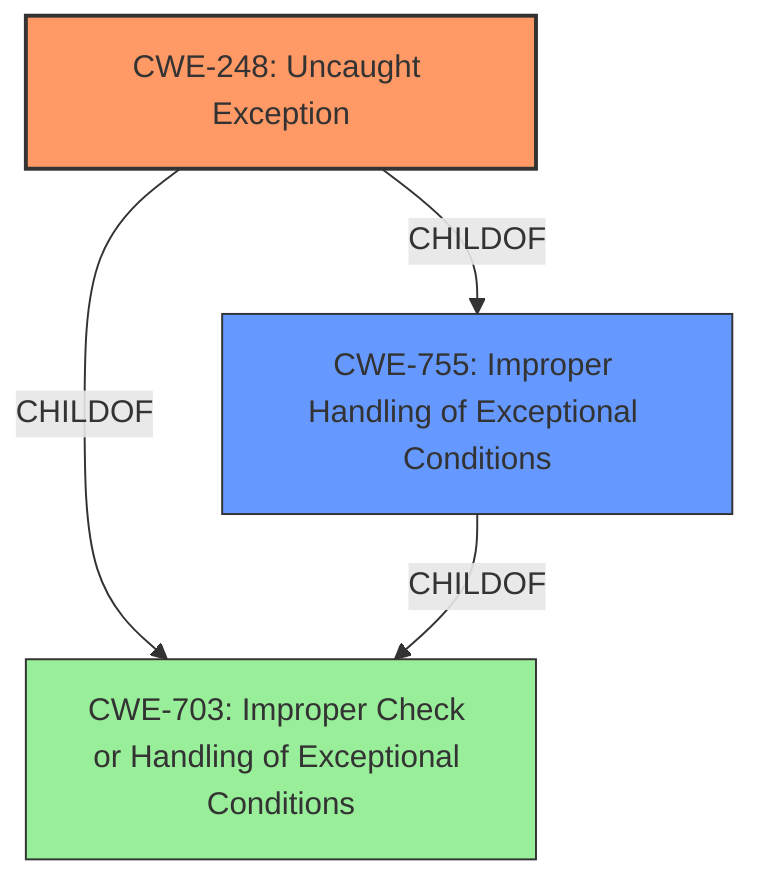

# Enhanced Analysis for CVE-2020-10604

# Summary
| CWE ID | CWE Name | Confidence | CWE Abstraction Level | CWE Vulnerability Mapping Label | CWE-Vulnerability Mapping Notes |
|---|---|---|---|---|---|
| CWE-248 | Uncaught Exception | 0.9 | Base | Primary | Allowed |
| CWE-755 | Improper Handling of Exceptional Conditions | 0.5 | Class | Secondary | Discouraged |

## Evidence and Confidence

*   **Confidence Score:** 0.9
*   **Evidence Strength:** HIGH

## Relationship Analysis
The primary CWE selected is CWE-248 **(Uncaught Exception)**, which is a Base level CWE. This CWE is a child of CWE-755 **(Improper Handling of Exceptional Conditions)**, and CWE-703 **(Improper Check or Handling of Exceptional Conditions)**. Although CWE-755 was in the Retriever results, it is a Class level of abstraction and per mapping guidance, it is Discouraged. Therefore, the final conclusion is to use the Base level CWE-248 as the primary CWE.



## Vulnerability Chain
The vulnerability chain consists of a specially crafted request leading to an uncaught exception.

1.  The **ROOT CAUSE** is the specially crafted request.
2.  The **WEAKNESS** is the uncaught exception, which is CWE-248 **(Uncaught Exception)**.
3.  The **IMPACT** is the crashing of the PI Network Manager service, blocking connections and queries to PI Data Archive.

## Summary of Analysis
The initial analysis identified CWE-248 **(Uncaught Exception)** as a strong candidate based on the vulnerability description and the "CVE Reference Links Content Summary" section, which states, "**Root Cause:** Uncaught Exception" and "The PI Network Manager service can crash due to a specially crafted request, leading to an **uncaught exception**." This statement is the primary evidence for the selection of CWE-248.

The Retriever Results listed CWE-248 as the top result. The Complete CWE Specifications for CWE-248 state that it is a Base level of abstraction and that the Usage is Allowed. The relationship analysis shows that CWE-248 is a child of CWE-705, CWE-755, and CWE-703. CWE-755 **(Improper Handling of Exceptional Conditions)**, which is a Class level of abstraction, was considered but not used as the primary CWE because it is discouraged per mapping guidance and a more specific Base level CWE was present.

Therefore, the final conclusion is to use CWE-248 **(Uncaught Exception)** as the primary CWE because it is the most specific Base level CWE that accurately represents the **WEAKNESS**.


## CWE Relationship Analysis

Current CWEs represent these abstraction levels: .


### Vulnerability Chain Analysis

**Chain starting from CWE-248:**
- 248 (Uncaught Exception) - ROOT


**Chain starting from CWE-755:**
- 755 (Improper Handling of Exceptional Conditions) - ROOT


### CWE Relationship Diagram

```mermaid
graph TD
    classDef primary fill:#f96,stroke:#333,stroke-width:2px
    classDef secondary fill:#69f,stroke:#333
    classDef tertiary fill:#9e9,stroke:#333
```