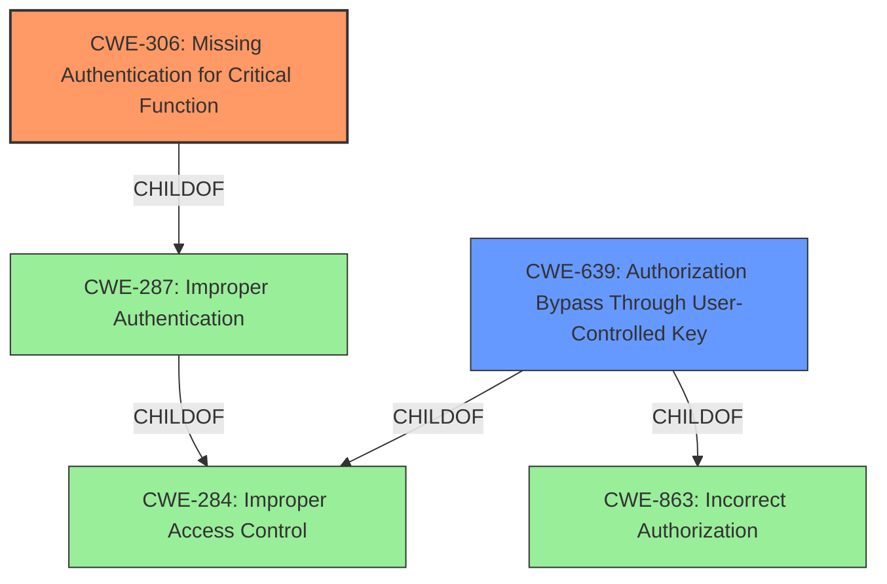

# Analysis for CVE-2020-10627

# Summary
| CWE ID | CWE Name | Confidence | CWE Abstraction Level | CWE Vulnerability Mapping Label | CWE-Vulnerability Mapping Notes |
|---|---|---|---|---|---|
| CWE-306 | Missing Authentication for Critical Function | 0.9 | Base | Allowed | Primary CWE |
| CWE-639 | Authorization Bypass Through User-Controlled Key | 0.6 | Base | Allowed | Secondary Candidate |

## Evidence and Confidence

*   **Confidence Score:** 0.75
*   **Evidence Strength:** MEDIUM

## Relationship Analysis
The primary relationship influencing the decision is the ChildOf relationship where CWE-306 and CWE-639 are children of broader classes like CWE-287 (Improper Authentication) and CWE-863 (Incorrect Authorization), respectively. The selection of CWE-306 as primary and CWE-639 as a secondary candidate reflects a focus on the **missing authentication** aspect first, with a possible bypass through key manipulation as a secondary concern. The base abstraction level of both CWEs is preferred for root cause analysis.

## Vulnerability Chain
The vulnerability chain starts with the **lack of proper authentication and authorization** in the wireless communication protocol. This leads to the ability for an attacker to modify and/or intercept data, change pump settings, and control insulin delivery. The root cause is the **missing authentication**, followed by the potential for authorization bypass.

## Summary of Analysis
Initially, the analysis focused on the description stating the product "**does not properly implement authentication or authorization**". The Retriever Results pointed to CWE-284 (Improper Access Control), CWE-639 (Authorization Bypass Through User-Controlled Key), CWE-306 (Missing Authentication for Critical Function), and CWE-285 (Improper Authorization).

The decision to prioritize CWE-306 (Missing Authentication for Critical Function) as the primary CWE is based on the explicit mention of "**does not properly implement authentication**" in the vulnerability description. This directly aligns with the definition of CWE-306, which focuses on the absence of authentication for critical functions. The impact described (changing pump settings and controlling insulin delivery) underscores the criticality of the affected functionality.

CWE-639 (Authorization Bypass Through User-Controlled Key) is considered a secondary candidate because the description also mentions "**does not properly implement ... authorization**," suggesting that even if some form of authorization exists, it can be bypassed, potentially through manipulation of keys or identifiers. However, the primary issue appears to be the absence of authentication, making CWE-306 more directly relevant.

CWE-284 (Improper Access Control) and CWE-285 (Improper Authorization) are too high-level and generic. While technically applicable, they do not capture the specific nature of the **missing authentication** as accurately as CWE-306.

The chosen CWEs are at the optimal level of specificity (Base level) as they directly address the root cause of the vulnerability.

Relevant CWE Information:

## CWE-306: Missing Authentication for Critical Function
The product **does not perform any authentication** for functionality that requires a provable user identity or consumes a significant amount of resources. In this case, the insulin pump **does not perform authentication** over its wireless communication, allowing unauthorized modification of settings and insulin delivery. The security implication is direct control over a critical medical device, leading to potential health consequences for the user.

## CWE-639: Authorization Bypass Through User-Controlled Key
The system's authorization functionality **does not prevent one user from gaining access to another user's data** or record by modifying the key value identifying the data. In this case, an attacker might be able to modify pump settings by manipulating identifiers or keys used in the wireless communication protocol, bypassing any existing authorization checks. The security implication is unauthorized modification of the insulin pump's configuration, leading to potential health consequences for the user.