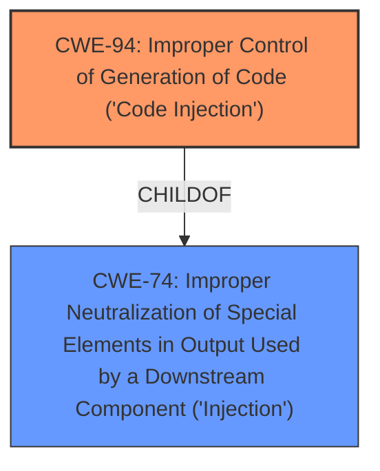

# Enhanced Analysis for CVE-2020-10666

# Summary
| CWE ID | CWE Name | Confidence | CWE Abstraction Level | CWE Vulnerability Mapping Label | CWE-Vulnerability Mapping Notes |
|---|---|---|---|---|---|
| CWE-94 | Improper Control of Generation of Code ('Code Injection') | 0.9 | Base | Allowed-with-Review | Primary CWE |

## Evidence and Confidence

*   **Confidence Score:** 0.9
*   **Evidence Strength:** MEDIUM

## Relationship Analysis
The primary CWE, CWE-94, is a base-level weakness that is a child of the class-level CWE-74 (Improper Neutralization of Special Elements in Output Used by a Downstream Component ('Injection')). Given the nature of the vulnerability, where code is being generated based on external input, selecting CWE-94 provides a more specific and accurate representation of the weakness compared to its parent class.



## Vulnerability Chain
The vulnerability chain starts with external input (URL variable) being used to construct code, without proper neutralization, leading to remote code execution.

## Summary of Analysis
The initial analysis identified several potential CWEs. The most relevant is CWE-94 (Improper Control of Generation of Code ('Code Injection')). The vulnerability description explicitly states that the "restapps module for Sangoma FreePBX and PBXact 13, 14, and 15 through 15.0.19.2 allows remote code execution via a URL variable to an AMI command." This aligns directly with the description of CWE-94, where code is constructed using externally-influenced input without proper neutralization, leading to the ability to modify the intended control flow and achieve arbitrary code execution.

The evidence supporting this decision comes directly from the vulnerability description key phrases, which highlight the "impact" as "remote code execution" and the "vector" as a "URL variable."

CWE-77 (Improper Neutralization of Special Elements used in a Command ('Command Injection')) was considered, but the description emphasizes the generation of code rather than just the improper neutralization of command elements. The description of CWE-77 states that "the product constructs all or part of a command using externally-influenced input...". However, the root cause here is the construction of a code segment.

CWE-94 is at the optimal level of specificity. While it's a child of CWE-74, CWE-94 provides a more precise description of the vulnerability, focusing on the improper control of code generation rather than just a general lack of neutralization.

Relevant CWE Information:

# Enhanced Context (25 CWEs)
The following CWEs were identified as potentially relevant to this vulnerability:

## CWE-74: Improper Neutralization of Special Elements in Output Used by a Downstream Component ('Injection')
**Abstraction Level**: Class
**Similarity Score**: 0.78
**Source**: dense

**Description**:
The product constructs all or part of a command, data structure, or record using externally-influenced input from an upstream component, but it does not neutralize or incorrectly neutralizes special elements that could modify how it is parsed or interpreted when it is sent to a downstream component.

**Mapping Guidance**:
- Usage: Discouraged
- Rationale: CWE-74 is high-level and often misused when lower-level weaknesses are more appropriate.

## CWE-94: Improper Control of Generation of Code ('Code Injection')
**Abstraction Level**: Base
**Similarity Score**: 3.89
**Source**: graph

**Description**:
The product constructs all or part of a code segment using externally-influenced input from an upstream component, but it does not neutralize or incorrectly neutralizes special elements that could modify the syntax or behavior of the intended code segment.

**Mapping Guidance**:
- Usage: Allowed-with-Review
- Rationale: This entry is frequently misused for vulnerabilities with a technical impact of "code execution," which does not by itself indicate a root cause weakness, since dozens of weaknesses can enable code execution.

## CWE-77: Improper Neutralization of Special Elements used in a Command ('Command Injection')
**Abstraction Level**: Class
**Similarity Score**: 6902.47
**Source**: sparse

**Description**:
The product constructs all or part of a command using externally-influenced input from an upstream component, but it does not neutralize or incorrectly neutralizes special elements that could modify the intended command when it is sent to a downstream component.

**Mapping Guidance**:
- Usage: Allowed-with-Review
- Rationale: CWE-77 is often misused when OS command injection (CWE-78) was intended instead [REF-1287].
**Comments:** Ensure that the analysis focuses on the root-cause error that allows the execution of commands, as there are many weaknesses that can lead to this consequence. See Terminology Notes. If the weakness involves a command language besides OS shell invocation, then CWE-77 could be used.


## CWE Relationship Analysis

Current CWEs represent these abstraction levels: .


### Vulnerability Chain Analysis

**Chain starting from CWE-78:**
- 78 (Improper Neutralization of Special Elements used in an OS Command ('OS Command Injection')) - ROOT


**Chain starting from CWE-77:**
- 77 (Improper Neutralization of Special Elements used in a Command ('Command Injection')) - ROOT


### CWE Relationship Diagram

```mermaid
graph TD
    classDef primary fill:#f96,stroke:#333,stroke-width:2px
    classDef secondary fill:#69f,stroke:#333
    classDef tertiary fill:#9e9,stroke:#333
```