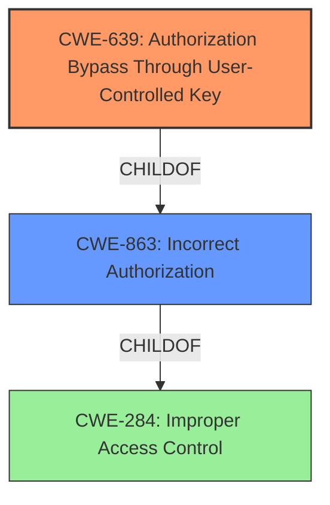

# Enhanced Analysis for CVE-2020-10686

# Summary
| CWE ID  | CWE Name                                      | Confidence | CWE Abstraction Level | CWE Vulnerability Mapping Label | CWE-Vulnerability Mapping Notes |
| ------- | --------------------------------------------- | ---------- | ----------------------- | ------------------------------- | ----------------------------- |
| CWE-639 | Authorization Bypass Through User-Controlled Key | 0.85       | Base                    | Allowed                         | Primary CWE                   |
| CWE-863 | Incorrect Authorization                         | 0.75       | Class                   | Allowed-with-Review           | Secondary Candidate             |

## Evidence and Confidence

*   **Confidence Score:** 0.80
*   **Evidence Strength:** HIGH

## Relationship Analysis
The primary CWE selected is CWE-639, which is a Base level CWE and a child of CWE-863. CWE-863 is a Class level CWE. The child relationship helps to refine the classification, making it more specific. There aren't any relevant chain relationships in this case. The abstraction levels influenced the decision by favoring the more specific Base level CWE over the Class level.



## Vulnerability Chain
The vulnerability chain starts with the **lack of authorization checks** on the "remove devices" form. This allows a malicious user, who has registered as themselves, to **post different credential IDs** and **remove MFA devices for other users**. The root cause is the **improper input validation** of credential IDs.

## Summary of Analysis
The initial assessment identified several potential CWEs, including CWE-285, CWE-863, and CWE-1390. However, after a thorough review of the vulnerability description and the provided CWE specifications, CWE-639 was selected as the primary CWE.

The selection of CWE-639 is strongly supported by the following evidence from the CVE Reference Links Content Summary:

*   "The system does not properly validate the credential IDs being submitted through the 'remove devices' form."
*   "The system does not verify if the user attempting to remove a device is the actual owner of that device."
*   "The attacker could then use the remove devices form to post different credential IDs and possibly remove MFA devices for other users."

These statements align closely with the description of CWE-639: "The system's authorization functionality does not prevent one user from gaining access to another user's data or record by modifying the key value identifying the data."

CWE-863 was considered as a secondary CWE because it represents a more general case of incorrect authorization. However, CWE-639 is more specific because it highlights the user-controlled key aspect of the authorization bypass.

The selected CWEs are at the optimal level of specificity because they accurately represent the weakness and its root cause. CWE-639 is a Base level CWE, which is preferred for mapping to the root causes of vulnerabilities. The relationships between the CWEs, particularly the child-parent relationship between CWE-639 and CWE-863, support the decision to choose the more specific CWE.

Relevant CWE Information:

# Enhanced Context (25 CWEs)
The following CWEs were identified as potentially relevant to this vulnerability:

## CWE-1390: Weak Authentication
**Abstraction Level**: Class
**Similarity Score**: 0.77
**Source**: dense

**Description**:
The product uses an authentication mechanism to restrict access to specific users or identities, but the mechanism does not sufficiently prove that the claimed identity is correct.

**Mapping Guidance**:
- Usage: Allowed-with-Review
- Rationale: This CWE entry is a Class and might have Base-level children that would be more appropriate

## CWE-807: Reliance on Untrusted Inputs in a Security Decision
**Abstraction Level**: Base
**Similarity Score**: 0.77
**Source**: dense

**Description**:
The product uses a protection mechanism that relies on the existence or values of an input, but the input can be modified by an untrusted actor in a way that bypasses the protection mechanism.

**Mapping Guidance**:
- Usage: Allowed
- Rationale: This CWE entry is at the Base level of abstraction, which is a preferred level of abstraction for mapping to the root causes of vulnerabilities.

## CWE-303: Incorrect Implementation of Authentication Algorithm
**Abstraction Level**: Base
**Similarity Score**: 0.77
**Source**: dense

**Description**:
The requirements for the product dictate the use of an established authentication algorithm, but the implementation of the algorithm is incorrect.

**Mapping Guidance**:
- Usage: Allowed
- Rationale: This CWE entry is at the Base level of abstraction, which is a preferred level of abstraction for mapping to the root causes of vulnerabilities.

## CWE-639: Authorization Bypass Through User-Controlled Key
**Abstraction Level**: Base
**Similarity Score**: 0.77
**Source**: dense

**Description**:
The system's authorization functionality does not prevent one user from gaining access to another user's data or record by modifying the key value identifying the data.

**Mapping Guidance**:
- Usage: Allowed
- Rationale: This CWE entry is at the Base level of abstraction, which is a preferred level of abstraction for mapping to the root causes of vulnerabilities.

## CWE-1391: Use of Weak Credentials
**Abstraction Level**: Class
**Similarity Score**: 0.77
**Source**: dense

**Description**:
The product uses weak credentials (such as a default key or hard-coded password) that can be calculated, derived, reused, or guessed by an attacker.

**Mapping Guidance**:
- Usage: Allowed-with-Review
- Rationale: This CWE entry is a Class and might have Base-level children that would be more appropriate

## CWE-288: Authentication Bypass Using an Alternate Path or Channel
**Abstraction Level**: Base
**Similarity Score**: 0.76
**Source**: dense

**Description**:
The product requires authentication, but the product has an alternate path or channel that does not require authentication.

**Mapping Guidance**:
- Usage: Allowed
- Rationale: This CWE entry is at the Base level of abstraction, which is a preferred level of abstraction for mapping to the root causes of vulnerabilities.

## CWE-472: External Control of Assumed-Immutable Web Parameter
**Abstraction Level**: Base
**Similarity Score**: 0.76
**Source**: dense

**Description**:
The web application does not sufficiently verify inputs that are assumed to be immutable but are actually externally controllable, such as hidden form fields.

**Mapping Guidance**:
- Usage: Allowed
- Rationale: This CWE entry is at the Base level of abstraction, which is a preferred level of abstraction for mapping to the root causes of vulnerabilities.

## CWE-302: Authentication Bypass by Assumed-Immutable Data
**Abstraction Level**: Base
**Similarity Score**: 0.76
**Source**: dense

**Description**:
The authentication scheme or implementation uses key data elements that are assumed to be immutable, but can be controlled or modified by the attacker.

**Mapping Guidance**:
- Usage: Allowed
- Rationale: This CWE entry is at the Base level of abstraction, which is a preferred level of abstraction for mapping to the root causes of vulnerabilities.

## CWE-274: Improper Handling of Insufficient Privileges
**Abstraction Level**: Base
**Similarity Score**: 0.75
**Source**: dense

**Description**:
The product does not handle or incorrectly handles when it has insufficient privileges to perform an operation, leading to resultant weaknesses.

**Mapping Guidance**:
- Usage: Discouraged
- Rationale: This CWE entry could be deprecated in a future version of CWE.

## CWE-345: Insufficient Verification of Data Authenticity
**Abstraction Level**: Class
**Similarity Score**: 0.75
**Source**: dense

**Description**:
The product does not sufficiently verify the origin or authenticity of data, in a way that causes it to accept invalid data.

**Mapping Guidance**:
- Usage: Discouraged
- Rationale: This CWE entry is a level-1 Class (i.e., a child of a Pillar). It might have lower-level children that would be more appropriate

## CWE-639: Authorization Bypass Through User-Controlled Key
**Abstraction Level**: Base
**Similarity Score**: 5181.49
**Source**: sparse

**Description**:
The system's authorization functionality does not prevent one user from gaining access to another user's data or record by modifying the key value identifying the data.

**Mapping Guidance**:
- Usage: Allowed
- Rationale: This CWE entry is at the Base level of abstraction, which


## CWE Relationship Analysis

Current CWEs represent these abstraction levels: .


### Vulnerability Chain Analysis

**Chain starting from CWE-288:**
- 288 (Authentication Bypass Using an Alternate Path or Channel) - ROOT


**Chain starting from CWE-303:**
- 303 (Incorrect Implementation of Authentication Algorithm) - ROOT


### CWE Relationship Diagram

```mermaid
graph TD
    classDef primary fill:#f96,stroke:#333,stroke-width:2px
    classDef secondary fill:#69f,stroke:#333
    classDef tertiary fill:#9e9,stroke:#333
```