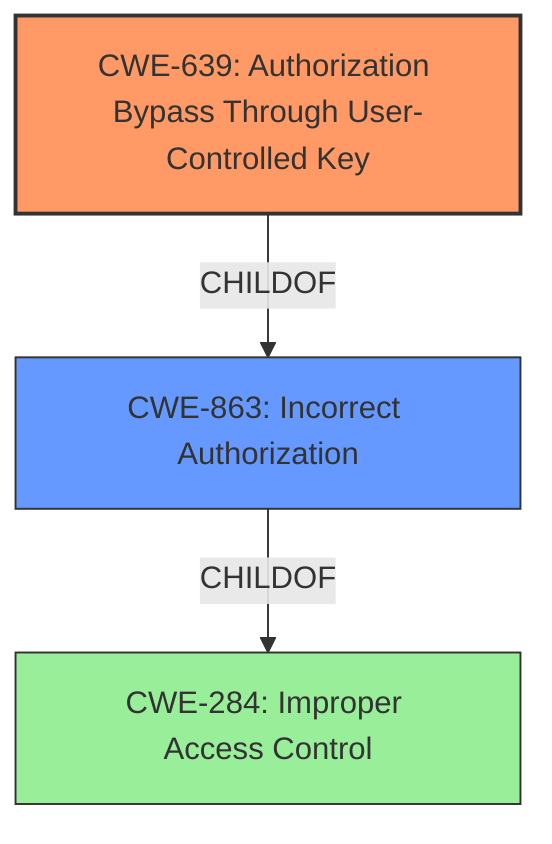

# Analysis for CVE-2020-10686

# Summary
| CWE ID  | CWE Name                                      | Confidence | CWE Abstraction Level | CWE Vulnerability Mapping Label | CWE-Vulnerability Mapping Notes |
| ------- | --------------------------------------------- | ---------- | ----------------------- | ------------------------------- | ----------------------------- |
| CWE-639 | Authorization Bypass Through User-Controlled Key | 0.85       | Base                    | Allowed                         | Primary CWE                   |
| CWE-863 | Incorrect Authorization                         | 0.75       | Class                   | Allowed-with-Review           | Secondary Candidate             |

## Evidence and Confidence

*   **Confidence Score:** 0.80
*   **Evidence Strength:** HIGH

## Relationship Analysis
The primary CWE selected is CWE-639, which is a Base level CWE and a child of CWE-863. CWE-863 is a Class level CWE. The child relationship helps to refine the classification, making it more specific. There aren't any relevant chain relationships in this case. The abstraction levels influenced the decision by favoring the more specific Base level CWE over the Class level.

## Vulnerability Chain
The vulnerability chain starts with the **lack of authorization checks** on the "remove devices" form. This allows a malicious user, who has registered as themselves, to **post different credential IDs** and **remove MFA devices for other users**. The root cause is the **improper input validation** of credential IDs.

## Summary of Analysis
The initial assessment identified several potential CWEs, including CWE-285, CWE-863, and CWE-1390. However, after a thorough review of the vulnerability description and the provided CWE specifications, CWE-639 was selected as the primary CWE.

The selection of CWE-639 is strongly supported by the following evidence from the CVE Reference Links Content Summary:

*   "The system does not properly validate the credential IDs being submitted through the 'remove devices' form."
*   "The system does not verify if the user attempting to remove a device is the actual owner of that device."
*   "The attacker could then use the remove devices form to post different credential IDs and possibly remove MFA devices for other users."

These statements align closely with the description of CWE-639: "The system's authorization functionality does not prevent one user from gaining access to another user's data or record by modifying the key value identifying the data."

CWE-863 was considered as a secondary CWE because it represents a more general case of incorrect authorization. However, CWE-639 is more specific because it highlights the user-controlled key aspect of the authorization bypass.

The selected CWEs are at the optimal level of specificity because they accurately represent the weakness and its root cause. CWE-639 is a Base level CWE, which is preferred for mapping to the root causes of vulnerabilities. The relationships between the CWEs, particularly the child-parent relationship between CWE-639 and CWE-863, support the decision to choose the more specific CWE.

Relevant CWE Information:

# Enhanced Context (25 CWEs)
The following CWEs were identified as potentially relevant to this vulnerability:

## CWE-1390: Weak Authentication
**Abstraction Level**: Class
**Similarity Score**: 0.77
**Source**: dense

**Description**:
The product uses an authentication mechanism to restrict access to specific users or identities, but the mechanism does not sufficiently prove that the claimed identity is correct.

**Mapping Guidance**:
- Usage: Allowed-with-Review
- Rationale: This CWE entry is a Class and might have Base-level children that would be more appropriate

## CWE-807: Reliance on Untrusted Inputs in a Security Decision
**Abstraction Level**: Base
**Similarity Score**: 0.77
**Source**: dense

**Description**:
The product uses a protection mechanism that relies on the existence or values of an input, but the input can be modified by an untrusted actor in a way that bypasses the protection mechanism.

**Mapping Guidance**:
- Usage: Allowed
- Rationale: This CWE entry is at the Base level of abstraction, which is a preferred level of abstraction for mapping to the root causes of vulnerabilities.

## CWE-303: Incorrect Implementation of Authentication Algorithm
**Abstraction Level**: Base
**Similarity Score**: 0.77
**Source**: dense

**Description**:
The requirements for the product dictate the use of an established authentication algorithm, but the implementation of the algorithm is incorrect.

**Mapping Guidance**:
- Usage: Allowed
- Rationale: This CWE entry is at the Base level of abstraction, which is a preferred level of abstraction for mapping to the root causes of vulnerabilities.

## CWE-639: Authorization Bypass Through User-Controlled Key
**Abstraction Level**: Base
**Similarity Score**: 0.77
**Source**: dense

**Description**:
The system's authorization functionality does not prevent one user from gaining access to another user's data or record by modifying the key value identifying the data.

**Mapping Guidance**:
- Usage: Allowed
- Rationale: This CWE entry is at the Base level of abstraction, which is a preferred level of abstraction for mapping to the root causes of vulnerabilities.

## CWE-1391: Use of Weak Credentials
**Abstraction Level**: Class
**Similarity Score**: 0.77
**Source**: dense

**Description**:
The product uses weak credentials (such as a default key or hard-coded password) that can be calculated, derived, reused, or guessed by an attacker.

**Mapping Guidance**:
- Usage: Allowed-with-Review
- Rationale: This CWE entry is a Class and might have Base-level children that would be more appropriate

## CWE-288: Authentication Bypass Using an Alternate Path or Channel
**Abstraction Level**: Base
**Similarity Score**: 0.76
**Source**: dense

**Description**:
The product requires authentication, but the product has an alternate path or channel that does not require authentication.

**Mapping Guidance**:
- Usage: Allowed
- Rationale: This CWE entry is at the Base level of abstraction, which is a preferred level of abstraction for mapping to the root causes of vulnerabilities.

## CWE-472: External Control of Assumed-Immutable Web Parameter
**Abstraction Level**: Base
**Similarity Score**: 0.76
**Source**: dense

**Description**:
The web application does not sufficiently verify inputs that are assumed to be immutable but are actually externally controllable, such as hidden form fields.

**Mapping Guidance**:
- Usage: Allowed
- Rationale: This CWE entry is at the Base level of abstraction, which is a preferred level of abstraction for mapping to the root causes of vulnerabilities.

## CWE-302: Authentication Bypass by Assumed-Immutable Data
**Abstraction Level**: Base
**Similarity Score**: 0.76
**Source**: dense

**Description**:
The authentication scheme or implementation uses key data elements that are assumed to be immutable, but can be controlled or modified by the attacker.

**Mapping Guidance**:
- Usage: Allowed
- Rationale: This CWE entry is at the Base level of abstraction, which is a preferred level of abstraction for mapping to the root causes of vulnerabilities.

## CWE-274: Improper Handling of Insufficient Privileges
**Abstraction Level**: Base
**Similarity Score**: 0.75
**Source**: dense

**Description**:
The product does not handle or incorrectly handles when it has insufficient privileges to perform an operation, leading to resultant weaknesses.

**Mapping Guidance**:
- Usage: Discouraged
- Rationale: This CWE entry could be deprecated in a future version of CWE.

## CWE-345: Insufficient Verification of Data Authenticity
**Abstraction Level**: Class
**Similarity Score**: 0.75
**Source**: dense

**Description**:
The product does not sufficiently verify the origin or authenticity of data, in a way that causes it to accept invalid data.

**Mapping Guidance**:
- Usage: Discouraged
- Rationale: This CWE entry is a level-1 Class (i.e., a child of a Pillar). It might have lower-level children that would be more appropriate

## CWE-639: Authorization Bypass Through User-Controlled Key
**Abstraction Level**: Base
**Similarity Score**: 5181.49
**Source**: sparse

**Description**:
The system's authorization functionality does not prevent one user from gaining access to another user's data or record by modifying the key value identifying the data.

**Mapping Guidance**:
- Usage: Allowed
- Rationale: This CWE entry is at the Base level of abstraction, which

# Enhanced Query for CVE-2020-10686

## Vulnerability Description
A flaw was found in Keycloak version 8.0.2 and 9.0.0, and was fixed in Keycloak version 9.0.1, where a malicious user registers as oneself. The attacker could then use the remove devices form to post different credential IDs and possibly remove MFA devices for other users.

### Vulnerability Description Key Phrases
- **impact:** remove MFA devices for other users
- **vector:** post different credential IDs
- **attacker:** malicious user
- **product:** Keycloak
- **version:** 8.0.2 and 9.0.0
- **component:** remove devices form

## CVE Reference Links Content Summary
Based on the provided information, here's an analysis of CVE-2020-10686:

**Root Cause of Vulnerability:**
- The vulnerability stems from a flaw in Keycloak versions 8.0.2 and 9.0.0, where a user could register as themselves and then use the "remove devices" form to submit different credential IDs, potentially removing MFA devices of other users.

**Weaknesses/Vulnerabilities Present:**
- **Improper Input Validation:** The system does not properly validate the credential IDs being submitted through the "remove devices" form.
- **Lack of Authorization Checks:** The system does not verify if the user attempting to remove a device is the actual owner of that device.

**Impact of Exploitation:**
- **Denial of Service (DoS):** An attacker can potentially remove MFA devices for other users, preventing them from logging into their accounts. This disrupts services by locking legitimate users out.

**Attack Vectors:**
- **Web Interface:** The attack is carried out through the "remove devices" form in Keycloak's web interface.
- **Malicious User:**  A malicious user first registers with the system, and then exploits the vulnerability via the web interface.

**Required Attacker Capabilities/Position:**
- **Registered User:** The attacker must be a registered user in the Keycloak system.
- **Access to the "Remove Devices" Form:**  The attacker needs access to the Keycloak web interface and the "remove devices" functionality.
- **Knowledge of the API:** The attacker needs to be able to manipulate the device credential IDs being sent to the server through the remove device function.

## Retriever Results

### Top Combined Results

| Rank | CWE ID | Name | Abstraction | Usage  | Retrievers | Individual Scores |
|------|--------|------|-------------|-------|------------|-------------------|
| 1 | 285 | Improper Authorization | Class | Discouraged | sparse | 0.090 |
| 2 | 863 | Incorrect Authorization | Class | Allowed-with-Review | sparse | 0.089 |
| 3 | 1390 | Weak Authentication | Class | Allowed-with-Review | sparse | 0.085 |
| 4 | 522 | Insufficiently Protected Credentials | Class | Allowed-with-Review | sparse | 0.085 |
| 5 | 201 | Insertion of Sensitive Information Into Sent Data | Base | Allowed | sparse | 0.085 |
| 6 | 287 | Improper Authentication | Class | Discouraged | dense | 0.488 |
| 7 | 613 | Insufficient Session Expiration | Base | Allowed | graph | 0.002 |
| 8 | 257 | Storing Passwords in a Recoverable Format | Base | Allowed | sparse | 0.084 |
| 9 | 639 | Authorization Bypass Through User-Controlled Key | Base | Allowed | sparse | 0.084 |
| 10 | 306 | Missing Authentication for Critical Function | Base | Allowed | sparse | 0.083 |

# Complete CWE Specifications

## CWE-285: Improper Authorization
**Abstraction:** Class
**Status:** Draft

### Description
The product does not perform or incorrectly performs an authorization check when an actor attempts to access a resource or perform an action.

### Extended Description

Assuming a user with a given identity, authorization is the process of determining whether that user can access a given resource, based on the user's privileges and any permissions or other access-control specifications that apply to the resource.

When access control checks are not applied consistently - or not at all - users are able to access data or perform actions that they should not be allowed to perform. This can lead to a wide range of problems, including information exposures, denial of service, and arbitrary code execution.

### Alternative Terms
AuthZ: "AuthZ" is typically used as an abbreviation of "authorization" within the web application security community. It is distinct from "AuthN" (or, sometimes, "AuthC") which is an abbreviation of "authentication." The use of "Auth" as an abbreviation is discouraged, since it could be used for either authentication or authorization.

### Relationships
ChildOf -> CWE-284
ChildOf -> CWE-284

### Mapping Guidance
**Usage:** Discouraged
**Rationale:** CWE-285 is high-level and lower-level CWEs can frequently be used instead. It is a level-1 Class (i.e., a child of a Pillar).
**Comments:** Look at CWE-285's children and consider mapping to CWEs such as CWE-862: Missing Authorization, CWE-863: Incorrect Authorization, CWE-732: Incorrect Permission Assignment for Critical Resource, or others.
**Reasons:**
- Abstraction
**Suggested Alternatives:**
- CWE-862: Missing Authorization
- CWE-863: Incorrect Authorization
- CWE-732: Incorrect Permission Assignment for Critical Resource

### Observed Examples
- **CVE-2022-24730:** Go-based continuous deployment product does not check that a user has certain privileges to update or create an app, allowing adversaries to read sensitive repository information
- **CVE-2009-3168:** Web application does not restrict access to admin scripts, allowing authenticated users to reset administrative passwords.
- **CVE-2009-2960:** Web application does not restrict access to admin scripts, allowing authenticated users to modify passwords of other users.

## CWE-863: Incorrect Authorization
**Abstraction:** Class
**Status:** Incomplete

### Description
The product performs an authorization check when an actor attempts to access a resource or perform an action, but it does not correctly perform the check.

### Extended Description
Not provided

### Alternative Terms
AuthZ: "AuthZ" is typically used as an abbreviation of "authorization" within the web application security community. It is distinct from "AuthN" (or, sometimes, "AuthC") which is an abbreviation of "authentication." The use of "Auth" as an abbreviation is discouraged, since it could be used for either authentication or authorization.

### Relationships
ChildOf -> CWE-285
ChildOf -> CWE-284

### Mapping Guidance
**Usage:** Allowed-with-Review
**Rationale:** This CWE entry is a Class and might have Base-level children that would be more appropriate
**Comments:** Examine children of this entry to see if there is a better fit
**Reasons:**
- Abstraction

### Additional Notes
**[Terminology]** 

Assuming a user with a given identity, authorization is the process of determining whether that user can access a given resource, based on the user's privileges and any permissions or other access-control specifications that apply to the resource.

### Observed Examples
- **CVE-2021-39155:** Chain: A microservice integration and management platform compares the hostname in the HTTP Host header in a case-sensitive way (CWE-178, CWE-1289), allowing bypass of the authorization policy (CWE-863) using a hostname with mixed case or other variations.
- **CVE-2019-15900:** Chain: sscanf() call is used to check if a username and group exists, but the return value of sscanf() call is not checked (CWE-252), causing an uninitialized variable to be checked (CWE-457), returning success to allow authorization bypass for executing a privileged (CWE-863).
- **CVE-2009-2213:** Gateway uses default "Allow" configuration for its authorization settings.

## CWE-1390: Weak Authentication
**Abstraction:** Class
**Status:** Incomplete

### Description
The product uses an authentication mechanism to restrict access to specific users or identities, but the mechanism does not sufficiently prove that the claimed identity is correct.

### Extended Description

Attackers may be able to bypass weak authentication faster and/or with less effort than expected.

### Alternative Terms
None

### Relationships
ChildOf -> CWE-287

### Mapping Guidance
**Usage:** Allowed-with-Review
**Rationale:** This CWE entry is a Class and might have Base-level children that would be more appropriate
**Comments:** Examine children of this entry to see if there is a better fit
**Reasons:**
- Abstraction

### Observed Examples
- **CVE-2022-30034:** Chain: Web UI for a Python RPC framework does not use regex anchors to validate user login emails (CWE-777), potentially allowing bypass of OAuth (CWE-1390).
- **CVE-2022-35248:** Chat application skips validation when Central Authentication Service (CAS) is enabled, effectively removing the second factor from two-factor authentication
- **CVE-2021-3116:** Chain: Python-based HTTP Proxy server uses the wrong boolean operators (CWE-480) causing an incorrect comparison (CWE-697) that identifies an authN failure if all three conditions are met instead of only one, allowing bypass of the proxy authentication (CWE-1390)

## CWE-522: Insufficiently Protected Credentials
**Abstraction:** Class
**Status:** Incomplete

### Description
The product transmits or stores authentication credentials, but it uses an insecure method that is susceptible to unauthorized interception and/or retrieval.

### Extended Description
Not provided

### Alternative Terms
None

### Relationships
ChildOf -> CWE-1390
ChildOf -> CWE-287
ChildOf -> CWE-668

### Mapping Guidance
**Usage:** Allowed-with-Review
**Rationale:** This CWE entry is a Class and might have Base-level children that would be more appropriate
**Comments:** Examine children of this entry to see if there is a better fit
**Reasons:**
- Abstraction

### Observed Examples
- **CVE-2022-30018:** A messaging platform serializes all elements of User/Group objects, making private information available to adversaries
- **CVE-2022-29959:** Initialization file contains credentials that can be decoded using a "simple string transformation"
- **CVE-2022-35411:** Python-based RPC framework enables pickle functionality by default, allowing clients to unpickle untrusted data.

## CWE-201: Insertion of Sensitive Information Into Sent Data
**Abstraction:** Base
**Status:** Draft

### Description
The code transmits data to another actor, but a portion of the data includes sensitive information that should not be accessible to that actor.

### Extended Description
Not provided

### Alternative Terms
None

### Relationships
ChildOf -> CWE-200
CanAlsoBe -> CWE-209
CanAlsoBe -> CWE-202

### Mapping Guidance
**Usage:** Allowed
**Rationale:** This CWE entry is at the Base level of abstraction, which is a preferred level of abstraction for mapping to the root causes of vulnerabilities.
**Comments:** Carefully read both the name and description to ensure that this mapping is an appropriate fit. Do not try to 'force' a mapping to a lower-level Base/Variant simply to comply with this preferred level of abstraction.
**Reasons:**
- Acceptable-Use

### Additional Notes
**[Other]** Sensitive information could include data that is sensitive in and of itself (such as credentials or private messages), or otherwise useful in the further exploitation of the system (such as internal file system structure).

### Observed Examples
- **CVE-2022-0708:** Collaboration platform does not clear team emails in a response, allowing leak of email addresses

## CWE-287: Improper Authentication
**Abstraction:** Class
**Status:** Draft

### Description
When an actor claims to have a given identity, the product does not prove or insufficiently proves that the claim is correct.

### Extended Description
Not provided

### Alternative Terms
authentification: An alternate term is "authentification", which appears to be most commonly used by people from non-English-speaking countries.
AuthN: "AuthN" is typically used as an abbreviation of "authentication" within the web application security community. It is also distinct from "AuthZ," which is an abbreviation of "authorization." The use of "Auth" as an abbreviation is discouraged, since it could be used for either authentication or authorization.
AuthC: "AuthC" is used as an abbreviation of "authentication," but it appears to used less frequently than "AuthN."

### Relationships
ChildOf -> CWE-284
ChildOf -> CWE-284

### Mapping Guidance
**Usage:** Discouraged
**Rationale:** This CWE entry might be misused when lower-level CWE entries are likely to be applicable. It is a level-1 Class (i.e., a child of a Pillar).
**Comments:** Consider children or descendants, beginning with CWE-1390: Weak Authentication or CWE-306: Missing Authentication for Critical Function.
**Reasons:**
- Frequent Misuse
**Suggested Alternatives:**
- CWE-1390: Weak Authentication
- CWE-306: Missing Authentication for Critical Function

### Additional Notes
**[Relationship]** This can be resultant from SQL injection vulnerabilities and other issues.

**[Maintenance]** The Taxonomy_Mappings to ISA/IEC 62443 were added in CWE 4.10, but they are still under review and might change in future CWE versions. These draft mappings were performed by members of the "Mapping CWE to 62443" subgroup of the CWE-CAPEC ICS/OT Special Interest Group (SIG), and their work is incomplete as of CWE 4.10. The mappings are included to facilitate discussion and review by the broader ICS/OT community, and they are likely to change in future CWE versions.

### Observed Examples
- **CVE-2022-35248:** Chat application skips validation when Central Authentication Service (CAS) is enabled, effectively removing the second factor from two-factor authentication
- **CVE-2022-36436:** Python-based authentication proxy does not enforce password authentication during the initial handshake, allowing the client to bypass authentication by specifying a 'None' authentication type.
- **CVE-2022-30034:** Chain: Web UI for a Python RPC framework does not use regex anchors to validate user login emails (CWE-777), potentially allowing bypass of OAuth (CWE-1390).

## CWE-613: Insufficient Session Expiration
**Abstraction:** Base
**Status:** Incomplete

### Description
According to WASC, "Insufficient Session Expiration is when a web site permits an attacker to reuse old session credentials or session IDs for authorization."

### Extended Description
Not provided

### Alternative Terms
None

### Relationships
ChildOf -> CWE-672
ChildOf -> CWE-672
CanPrecede -> CWE-287

### Mapping Guidance
**Usage:** Allowed
**Rationale:** This CWE entry is at the Base level of abstraction, which is a preferred level of abstraction for mapping to the root causes of vulnerabilities.
**Comments:** Carefully read both the name and description to ensure that this mapping is an appropriate fit. Do not try to 'force' a mapping to a lower-level Base/Variant simply to comply with this preferred level of abstraction.
**Reasons:**
- Acceptable-Use

### Additional Notes
**[Other]** The lack of proper session expiration may improve the likely success of certain attacks. For example, an attacker may intercept a session ID, possibly via a network sniffer or Cross-site Scripting attack. Although short session expiration times do not help if a stolen token is immediately used, they will protect against ongoing replaying of the session ID. In another scenario, a user might access a web site from a shared computer (such as at a library, Internet cafe, or open work environment). Insufficient Session Expiration could allow an attacker to use the browser's back button to access web pages previously accessed by the victim.

## CWE-257: Storing Passwords in a Recoverable Format
**Abstraction:** Base
**Status:** Incomplete

### Description
The storage of passwords in a recoverable format makes them subject to password reuse attacks by malicious users. In fact, it should be noted that recoverable encrypted passwords provide no significant benefit over plaintext passwords since they are subject not only to reuse by malicious attackers but also by malicious insiders. If a system administrator can recover a password directly, or use a brute force search on the available information, the administrator can use the password on other accounts.

### Extended Description
Not provided

### Alternative Terms
None

### Relationships
ChildOf -> CWE-522
PeerOf -> CWE-259

### Mapping Guidance
**Usage:** Allowed
**Rationale:** This CWE entry is at the Base level of abstraction, which is a preferred level of abstraction for mapping to the root causes of vulnerabilities.
**Comments:** Carefully read both the name and description to ensure that this mapping is an appropriate fit. Do not try to 'force' a mapping to a lower-level Base/Variant simply to comply with this preferred level of abstraction.
**Reasons:**
- Acceptable-Use

### Additional Notes
**[Maintenance]** The meaning of this entry needs to be investigated more closely, especially with respect to what is meant by "recoverable."

### Observed Examples
- **CVE-2022-30018:** A messaging platform serializes all elements of User/Group objects, making private information available to adversaries

## CWE-639: Authorization Bypass Through User-Controlled Key
**Abstraction:** Base
**Status:** Incomplete

### Description
The system's authorization functionality does not prevent one user from gaining access to another user's data or record by modifying the key value identifying the data.

### Extended Description

Retrieval of a user record occurs in the system based on some key value that is under user control. The key would typically identify a user-related record stored in the system and would be used to lookup that record for presentation to the user. It is likely that an attacker would have to be an authenticated user in the system. However, the authorization process would not properly check the data access operation to ensure that the authenticated user performing the operation has sufficient entitlements to perform the requested data access, hence bypassing any other authorization checks present in the system.

For example, attackers can look at places where user specific data is retrieved (e.g. search screens) and determine whether the key for the item being looked up is controllable externally. The key may be a hidden field in the HTML form field, might be passed as a URL parameter or as an unencrypted cookie variable, then in each of these cases it will be possible to tamper with the key value.

One manifestation of this weakness is when a system uses sequential or otherwise easily-guessable session IDs that would allow one user to easily switch to another user's session and read/modify their data.

### Alternative Terms
Insecure Direct Object Reference / IDOR: The "Insecure Direct Object Reference" term, as described in the OWASP Top Ten, is broader than this CWE because it also covers path traversal (CWE-22). Within the context of vulnerability theory, there is a similarity between the OWASP concept and CWE-706: Use of Incorrectly-Resolved Name or Reference.
Broken Object Level Authorization / BOLA: BOLA is used in the 2019 OWASP API Security Top 10 and is said to be the same as IDOR.
Horizontal Authorization: "Horizontal Authorization" is used to describe situations in which two users have the same privilege level, but must be prevented from accessing each other's resources. This is fairly common when using key-based access to resources in a multi-user context.

### Relationships
ChildOf -> CWE-863
ChildOf -> CWE-863
ChildOf -> CWE-284

### Mapping Guidance
**Usage:** Allowed
**Rationale:** This CWE entry is at the Base level of abstraction, which is a preferred level of abstraction for mapping to the root causes of vulnerabilities.
**Comments:** Carefully read both the name and description to ensure that this mapping is an appropriate fit. Do not try to 'force' a mapping to a lower-level Base/Variant simply to comply with this preferred level of abstraction.
**Reasons:**
- Acceptable-Use

### Observed Examples
- **CVE-2021-36539:** An educational application does not appropriately restrict file IDs to a particular user. The attacker can brute-force guess IDs, indicating IDOR.

## CWE-306: Missing Authentication for Critical Function
**Abstraction:** Base
**Status:** Draft

### Description
The product does not perform any authentication for functionality that requires a provable user identity or consumes a significant amount of resources.

### Extended Description
Not provided

### Alternative Terms
None

### Relationships
ChildOf -> CWE-287
ChildOf -> CWE-287

### Mapping Guidance
**Usage:** Allowed
**Rationale:** This CWE entry is at the Base level of abstraction, which is a preferred level of abstraction for mapping to the root causes of vulnerabilities.
**Comments:** Carefully read both the name and description to ensure that this mapping is an appropriate fit. Do not try to 'force' a mapping to a lower-level Base/Variant simply to comply with this preferred level of abstraction.
**Reasons:**
- Acceptable-Use

### Observed Examples
- **CVE-2022-31260:** Chain: a digital asset management program has an undisclosed backdoor in the legacy version of a PHP script (CWE-912) that could allow an unauthenticated user to export metadata (CWE-306)
- **CVE-2022-29951:** TCP-based protocol in Programmable Logic Controller (PLC) has no authentication.
- **CVE-2022-29952:** Condition Monitor firmware uses a protocol that does not require authentication.

