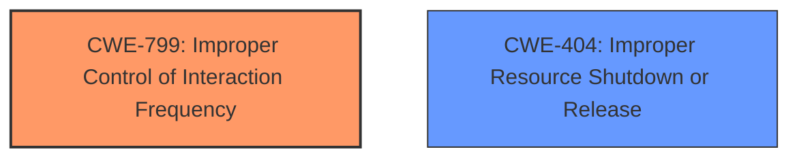

# Analysis for CVE-2020-10697

# Summary
| CWE ID | CWE Name | Confidence | CWE Abstraction Level | CWE Vulnerability Mapping Label | CWE-Vulnerability Mapping Notes |
|---|---|---|---|---|---|
| CWE-799 | Improper Control of Interaction Frequency | 0.7 | Class | Primary | Allowed-with-Review |
| CWE-404 | Improper Resource Shutdown or Release | 0.6 | Class | Secondary | Allowed-with-Review |

## Evidence and Confidence

*   **Confidence Score:** 0.7
*   **Evidence Strength:** MEDIUM

## Relationship Analysis
The primary relationship that influenced the CWE selection was the hierarchical relationship. CWE-799 is a Class-level CWE, and its children might offer more specific mappings. However, given the information provided, CWE-799 adequately captures the essence of the vulnerability without requiring a deeper dive into its more specific variants. Similarly, CWE-404, although less directly related, was considered due to its implication in resource management. The analysis focused on aligning the identified weakness with the most relevant and descriptive CWE at an appropriate level of abstraction.

## Vulnerability Chain
The chain of events for this vulnerability is as follows:
1.  **Insecure Memcached Deployment:** Memcached exposed via TCP without proper access control.
2.  **Attacker Action:** Attacker pollutes the cache by writing a playbook.
3.  **Impact:** Denial of Service due to reduced Tower performance.

## Summary of Analysis
Initially, the analysis focused on identifying the root cause of the vulnerability: the **insecure deployment** of memcached. The **Vulnerability Description Key Phrases** highlights the impact as a "denial of service attack," which guides the search for relevant CWEs.

The **CVE Reference Links Content Summary** details the **lack of access control** as a key weakness, aligning with the potential for unauthorized interaction with the memcached service.

The **Retriever Results** list several candidate CWEs, including CWE-285 (Improper Authorization), CWE-287 (Improper Authentication), and CWE-362 (Concurrent Execution using Shared Resource with Improper Synchronization ('Race Condition')). However, these were deemed less relevant because the core issue is not about lacking authorization or authentication mechanisms, nor is it a race condition. Instead, the vulnerability stems from the ability of an attacker to flood the memcached instance with requests, leading to performance degradation.

CWE-799 (Improper Control of Interaction Frequency) was selected as the primary CWE because it directly addresses the weakness where the product (**Ansible Tower**) does not properly limit the number or frequency of interactions (**writing a playbook polluting this cache**) with an actor (**attacker**), leading to a denial-of-service condition.

CWE-404 (Improper Resource Shutdown or Release) was considered as a secondary CWE because flooding memcached could potentially lead to resource exhaustion, but it is not the primary mechanism of the attack.

The final decision is based on the evidence provided, focusing on the root cause and the immediate impact of the vulnerability. CWE-799 accurately represents the vulnerability's characteristics and aligns with the available information, reflecting the optimal level of specificity.

Relevant CWE Information:

# Enhanced Context (25 CWEs)

## CWE-653: Improper Isolation or Compartmentalization
**Abstraction Level**: Class
**Similarity Score**: 0.77
**Source**: dense

**Description**:
The product does not properly compartmentalize or isolate functionality, processes, or resources that require different privilege levels, rights, or permissions.

**Mapping Guidance**:
- Usage: Allowed
- Rationale: This CWE entry is at the Base level of abstraction, which is a preferred level of abstraction for mapping to the root causes of vulnerabilities.

*This CWE was not selected because although the lack of isolation of memcached contributes to the vulnerability, it is not the direct cause of the denial of service.*

## CWE-941: Incorrectly Specified Destination in a Communication Channel
**Abstraction Level**: Base
**Similarity Score**: 0.77
**Source**: dense

**Description**:
The product creates a communication channel to initiate an outgoing request to an actor, but it does not correctly specify the intended destination for that actor.

**Mapping Guidance**:
- Usage: Allowed
- Rationale: This CWE entry is at the Base level of abstraction, which is a preferred level of abstraction for mapping to the root causes of vulnerabilities.

*This CWE was not selected because it does not closely align with the vulnerability's root cause, which is the lack of rate limiting rather than an incorrect communication channel specification.*

## CWE-668: Exposure of Resource to Wrong Sphere
**Abstraction Level**: Class
**Similarity Score**: 0.76
**Source**: dense

**Description**:
The product exposes a resource to the wrong control sphere, providing unintended actors with inappropriate access to the resource.

**Mapping Guidance**:
- Usage: Discouraged
- Rationale: CWE-668 is high-level and is often misused as a catch-all when lower-level CWE IDs might be applicable. It is sometimes used for low-information vulnerability reports [REF-1287]. It is a level-1 Class (i.e., a child of a Pillar). It is not useful for trend analysis.

*This CWE was not selected because it is too high-level and does not precisely describe the specific issue of uncontrolled interaction frequency.*

## CWE-799: Improper Control of Interaction Frequency
**Abstraction Level**: Class
**Similarity Score**: 0.76
**Source**: dense

**Description**:
The product does not properly limit the number or frequency of interactions that it has with an actor, such as the number of incoming requests.

**Mapping Guidance**:
- Usage: Allowed-with-Review
- Rationale: This CWE entry is a Class and might have Base-level children that would be more appropriate

*This CWE was selected as the primary CWE because it closely matches the vulnerability where the attacker can flood the memcached instance, leading to a denial of service.*

## CWE-807: Reliance on Untrusted Inputs in a Security Decision
**Abstraction Level**: Base
**Similarity Score**: 0.76
**Source**: dense

**Description**:
The product uses a protection mechanism that relies on the existence or values of an input, but the input can be modified by an untrusted actor in a way that bypasses the protection mechanism.

**Mapping Guidance**:
- Usage: Allowed
- Rationale: This CWE entry is at the Base level of abstraction, which is a preferred level of abstraction for mapping to the root causes of vulnerabilities.

*This CWE was not selected because the vulnerability does not involve a protection mechanism being bypassed due to untrusted inputs.*

## CWE-274: Improper Handling of Insufficient Privileges
**Abstraction Level**: Base
**Similarity Score**: 0.76
**Source**: dense

**Description**:
The product does not handle or incorrectly handles when it has insufficient privileges to perform an operation, leading to resultant weaknesses.

**Mapping Guidance**:
- Usage: Discouraged
- Rationale: This CWE entry could be deprecated in a future version of CWE.

*This CWE was not selected because the vulnerability does not involve privilege handling.*

## CWE-280: Improper Handling of Insufficient Permissions or Privileges
**Abstraction Level**: Base
**Similarity Score**: 0.76
**Source**: dense

**Description**:
The product does not handle or incorrectly handles when it has insufficient privileges to access resources or functionality as specified by their permissions. This may cause it to follow unexpected code paths that may leave the product in an invalid state.

**Mapping Guidance**:
- Usage: Allowed
- Rationale: This CWE entry is at the Base level of abstraction, which is a preferred level of abstraction for mapping to the root causes of vulnerabilities.

*This CWE was not selected because the vulnerability is not related to insufficient permissions or privileges.*

## CWE-404: Improper Resource Shutdown or Release
**Abstraction Level**: Class
**Similarity Score**: 0.76
**Source**: dense

**Description**:
The product does not release or incorrectly releases a resource before it is made available for re-use.

**Mapping Guidance**:
- Usage: Allowed-with-Review
- Rationale: This CWE entry is a Class and might have Base-level children that would be more appropriate

*This CWE was selected as a secondary CWE because the flood of requests could potentially lead to resource exhaustion.*

## CWE-226: Sensitive Information in Resource Not Removed Before Reuse
**Abstraction Level**: Base
**Similarity Score**: 0.76
**Source**: dense

**Description**:
The product releases a resource such as memory or a file so that it can be made available for reuse, but it does not clear or "zeroize" the information contained in the resource before the product performs a critical state transition or makes the resource available for reuse by other entities.

**Mapping Guidance**:
- Usage: Allowed
- Rationale: This CWE entry is at the Base level of abstraction, which is a preferred level of