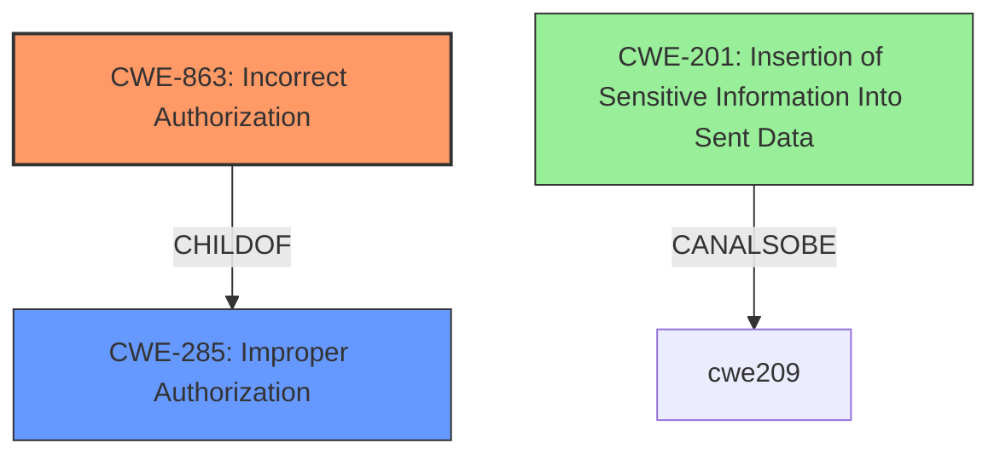

# Enhanced Analysis for CVE-2020-10698

# Summary
| CWE ID    | CWE Name                                                                            | Confidence | CWE Abstraction Level | CWE Vulnerability Mapping Label | CWE-Vulnerability Mapping Notes |
| :-------- | :---------------------------------------------------------------------------------- | :--------- | :---------------------- | :------------------------------ | :------------------------------ |
| CWE-863   | Incorrect Authorization                                                             | 0.9        | Class                   | Primary CWE                    | Allowed-with-Review             |
| CWE-201   | Insertion of Sensitive Information Into Sent Data                                   | 0.7        | Base                    | Secondary Candidate             | Allowed                         |

## Evidence and Confidence

*   **Confidence Score:** 0.8
*   **Evidence Strength:** HIGH

## Relationship Analysis

The primary relationship that influenced the decision was the parent-child relationship between CWE-285 (Improper Authorization) and CWE-863 (Incorrect Authorization). CWE-863 is a more specific type of improper authorization, where the authorization check is performed but is done incorrectly. The vulnerability description indicates that the access control is not properly restricting WebSocket group subscriptions, leading to unauthorized users accessing job outputs. This suggests that an authorization check is likely in place but is flawed, making CWE-863 a better fit than its parent, CWE-285.



## Vulnerability Chain

The vulnerability chain starts with the **inadequate access control (authorization)**, leading to the exposure of sensitive job output to unauthorized users.

1.  **Root Cause:** **Incorrect Authorization** (CWE-863) - The system fails to properly validate or authorize users subscribing to WebSocket groups.
2.  **Impact:** **Insertion of Sensitive Information Into Sent Data** (CWE-201) - Sensitive job output is sent to unauthorized users due to the authorization bypass.

## Summary of Analysis

The initial analysis focused on identifying the root cause of the vulnerability. The key phrase "insufficient access control" from the "CVE Reference Links Content Summary" pointed towards an authorization issue.

The Retriever Results listed several potential CWEs, including:

*   CWE-842: Placement of User into Incorrect Group
*   CWE-285: Improper Authorization
*   CWE-306: Missing Authentication for Critical Function

However, based on the detailed analysis of the vulnerability description and the CVE reference, it was determined that the vulnerability was not about placing a user in the wrong group, nor was it a case of missing authentication entirely. Instead, the vulnerability lies in the **incorrect authorization** mechanism that fails to properly restrict access to job outputs via WebSocket subscriptions. This is explicitly called out in the "CVE Reference Links Content Summary": "**Inadequate Access Control:** The primary weakness is the **lack of proper validation or authorization** when users subscribe to WebSocket groups related to job execution."

CWE-863 (Incorrect Authorization) was chosen as the primary CWE because it directly addresses the scenario where an authorization check is performed but is done incorrectly, allowing unauthorized access. While CWE-285 (Improper Authorization) could also be considered, it's a more general case that includes both missing and incorrect authorization. Given the evidence, CWE-863 provides a more precise mapping.

CWE-201 (Insertion of Sensitive Information Into Sent Data) was considered as a secondary CWE because the **impact** of the authorization bypass is the disclosure of sensitive information via job stdout streams to unauthorized users. This CWE addresses the scenario where sensitive data is included in the data sent to another actor.

The final decision to map to CWE-863 was based on the evidence from the CVE summary, the hierarchical relationship between CWE-285 and CWE-863, and the desire to provide the most specific and accurate classification of the vulnerability.

Relevant CWE Information:

# Enhanced Context (25 CWEs)

## CWE-362: Concurrent Execution using Shared Resource with Improper Synchronization ('Race Condition')
**Abstraction Level**: Class
**Similarity Score**: 0.78
**Source**: dense

**Description**:
The product contains a concurrent code sequence that requires temporary, exclusive access to a shared resource, but a timing window exists in which the shared resource can be modified by another code sequence operating concurrently.

**Mapping Guidance**:
- Usage: Allowed-with-Review
- Rationale: This CWE entry is a Class and might have Base-level children that would be more appropriate

## CWE-662: Improper Synchronization
**Abstraction Level**: Class
**Similarity Score**: 0.77
**Source**: dense

**Description**:
The product utilizes multiple threads or processes to allow temporary access to a shared resource that can only be exclusive to one process at a time, but it does not properly synchronize these actions, which might cause simultaneous accesses of this resource by multiple threads or processes.

**Mapping Guidance**:
- Usage: Discouraged
- Rationale: This CWE entry is a level-1 Class (i.e., a child of a Pillar). It might have lower-level children that would be more appropriate

## CWE-667: Improper Locking
**Abstraction Level**: Class
**Similarity Score**: 0.77
**Source**: dense

**Description**:
The product does not properly acquire or release a lock on a resource, leading to unexpected resource state changes and behaviors.

**Mapping Guidance**:
- Usage: Allowed-with-Review
- Rationale: This CWE entry is a Class and might have Base-level children that would be more appropriate

## CWE-366: Race Condition within a Thread
**Abstraction Level**: Base
**Similarity Score**: 0.77
**Source**: dense

**Description**:
If two threads of execution use a resource simultaneously, there exists the possibility that resources may be used while invalid, in turn making the state of execution undefined.

**Mapping Guidance**:
- Usage: Allowed
- Rationale: This CWE entry is at the Base level of abstraction, which is a preferred level of abstraction for mapping to the root causes of vulnerabilities.

## CWE-367: Time-of-check Time-of-use (TOCTOU) Race Condition
**Abstraction Level**: Base
**Similarity Score**: 0.77
**Source**: dense

**Description**:
The product checks the state of a resource before using that resource, but the resource's state can change between the check and the use in a way that invalidates the results of the check. This can cause the product to perform invalid actions when the resource is in an unexpected state.

**Mapping Guidance**:
- Usage: Allowed
- Rationale: This CWE entry is at the Base level of abstraction, which is a preferred level of abstraction for mapping to the root causes of vulnerabilities.

## CWE-404: Improper Resource Shutdown or Release
**Abstraction Level**: Class
**Similarity Score**: 0.75
**Source**: dense

**Description**:
The product does not release or incorrectly releases a resource before it is made available for re-use.

**Mapping Guidance**:
- Usage: Allowed-with-Review
- Rationale: This CWE entry is a Class and might have Base-level children that would be more appropriate

## CWE-226: Sensitive Information in Resource Not Removed Before Reuse
**Abstraction Level**: Base
**Similarity Score**: 0.75
**Source**: dense

**Description**:
The product releases a resource such as memory or a file so that it can be made available for reuse, but it does not clear or "zeroize" the information contained in the resource before the product performs a critical state transition or makes the resource available for reuse by other entities.

**Mapping Guidance**:
- Usage: Allowed
- Rationale: This CWE entry is at the Base level of abstraction, which is a preferred level of abstraction for mapping to the root causes of vulnerabilities.

## CWE-754: Improper Check for Unusual or Exceptional Conditions
**Abstraction Level**: Class
**Similarity Score**: 0.74
**Source**: dense

**Description**:
The product does not check or incorrectly checks for unusual or exceptional conditions that are not expected to occur frequently during day to day operation of the product.

**Mapping Guidance**:
- Usage: Allowed-with-Review
- Rationale: This CWE entry is a Class and might have Base-level children that would be more appropriate

## CWE-668: Exposure of Resource to Wrong Sphere
**Abstraction Level**: Class
**Similarity Score**: 0.74
**Source**: dense

**Description**:
The product exposes a resource to the wrong control sphere, providing unintended actors with inappropriate access to the resource.

**Mapping Guidance**:
- Usage: Discouraged
- Rationale: CWE-668 is high-level and is often misused as a catch-all when


## CWE Relationship Analysis

Current CWEs represent these abstraction levels: .


### Vulnerability Chain Analysis

**Chain starting from CWE-842:**
- 842 (Placement of User into Incorrect Group) - ROOT


**Chain starting from CWE-662:**
- 662 (Improper Synchronization) - ROOT


### CWE Relationship Diagram

```mermaid
graph TD
    classDef primary fill:#f96,stroke:#333,stroke-width:2px
    classDef secondary fill:#69f,stroke:#333
    classDef tertiary fill:#9e9,stroke:#333
```