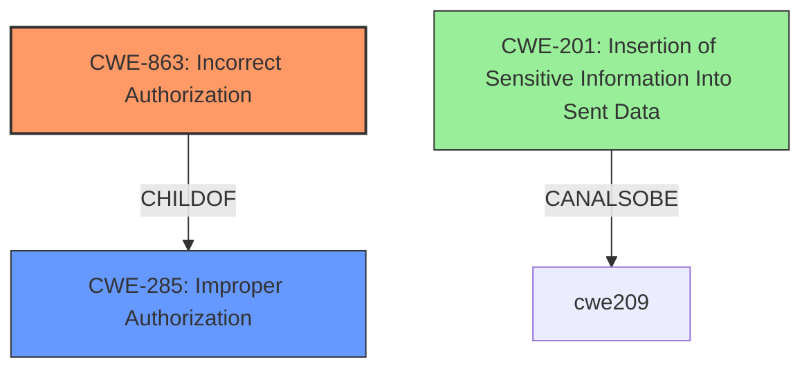

# Analysis for CVE-2020-10698

# Summary
| CWE ID    | CWE Name                                                                            | Confidence | CWE Abstraction Level | CWE Vulnerability Mapping Label | CWE-Vulnerability Mapping Notes |
| :-------- | :---------------------------------------------------------------------------------- | :--------- | :---------------------- | :------------------------------ | :------------------------------ |
| CWE-863   | Incorrect Authorization                                                             | 0.9        | Class                   | Primary CWE                    | Allowed-with-Review             |
| CWE-201   | Insertion of Sensitive Information Into Sent Data                                   | 0.7        | Base                    | Secondary Candidate             | Allowed                         |

## Evidence and Confidence

*   **Confidence Score:** 0.8
*   **Evidence Strength:** HIGH

## Relationship Analysis

The primary relationship that influenced the decision was the parent-child relationship between CWE-285 (Improper Authorization) and CWE-863 (Incorrect Authorization). CWE-863 is a more specific type of improper authorization, where the authorization check is performed but is done incorrectly. The vulnerability description indicates that the access control is not properly restricting WebSocket group subscriptions, leading to unauthorized users accessing job outputs. This suggests that an authorization check is likely in place but is flawed, making CWE-863 a better fit than its parent, CWE-285.

## Vulnerability Chain

The vulnerability chain starts with the **inadequate access control (authorization)**, leading to the exposure of sensitive job output to unauthorized users.

1.  **Root Cause:** **Incorrect Authorization** (CWE-863) - The system fails to properly validate or authorize users subscribing to WebSocket groups.
2.  **Impact:** **Insertion of Sensitive Information Into Sent Data** (CWE-201) - Sensitive job output is sent to unauthorized users due to the authorization bypass.

## Summary of Analysis

The initial analysis focused on identifying the root cause of the vulnerability. The key phrase "insufficient access control" from the "CVE Reference Links Content Summary" pointed towards an authorization issue.

The Retriever Results listed several potential CWEs, including:

*   CWE-842: Placement of User into Incorrect Group
*   CWE-285: Improper Authorization
*   CWE-306: Missing Authentication for Critical Function

However, based on the detailed analysis of the vulnerability description and the CVE reference, it was determined that the vulnerability was not about placing a user in the wrong group, nor was it a case of missing authentication entirely. Instead, the vulnerability lies in the **incorrect authorization** mechanism that fails to properly restrict access to job outputs via WebSocket subscriptions. This is explicitly called out in the "CVE Reference Links Content Summary": "**Inadequate Access Control:** The primary weakness is the **lack of proper validation or authorization** when users subscribe to WebSocket groups related to job execution."

CWE-863 (Incorrect Authorization) was chosen as the primary CWE because it directly addresses the scenario where an authorization check is performed but is done incorrectly, allowing unauthorized access. While CWE-285 (Improper Authorization) could also be considered, it's a more general case that includes both missing and incorrect authorization. Given the evidence, CWE-863 provides a more precise mapping.

CWE-201 (Insertion of Sensitive Information Into Sent Data) was considered as a secondary CWE because the **impact** of the authorization bypass is the disclosure of sensitive information via job stdout streams to unauthorized users. This CWE addresses the scenario where sensitive data is included in the data sent to another actor.

The final decision to map to CWE-863 was based on the evidence from the CVE summary, the hierarchical relationship between CWE-285 and CWE-863, and the desire to provide the most specific and accurate classification of the vulnerability.

Relevant CWE Information:

# Enhanced Context (25 CWEs)

## CWE-362: Concurrent Execution using Shared Resource with Improper Synchronization ('Race Condition')
**Abstraction Level**: Class
**Similarity Score**: 0.78
**Source**: dense

**Description**:
The product contains a concurrent code sequence that requires temporary, exclusive access to a shared resource, but a timing window exists in which the shared resource can be modified by another code sequence operating concurrently.

**Mapping Guidance**:
- Usage: Allowed-with-Review
- Rationale: This CWE entry is a Class and might have Base-level children that would be more appropriate

## CWE-662: Improper Synchronization
**Abstraction Level**: Class
**Similarity Score**: 0.77
**Source**: dense

**Description**:
The product utilizes multiple threads or processes to allow temporary access to a shared resource that can only be exclusive to one process at a time, but it does not properly synchronize these actions, which might cause simultaneous accesses of this resource by multiple threads or processes.

**Mapping Guidance**:
- Usage: Discouraged
- Rationale: This CWE entry is a level-1 Class (i.e., a child of a Pillar). It might have lower-level children that would be more appropriate

## CWE-667: Improper Locking
**Abstraction Level**: Class
**Similarity Score**: 0.77
**Source**: dense

**Description**:
The product does not properly acquire or release a lock on a resource, leading to unexpected resource state changes and behaviors.

**Mapping Guidance**:
- Usage: Allowed-with-Review
- Rationale: This CWE entry is a Class and might have Base-level children that would be more appropriate

## CWE-366: Race Condition within a Thread
**Abstraction Level**: Base
**Similarity Score**: 0.77
**Source**: dense

**Description**:
If two threads of execution use a resource simultaneously, there exists the possibility that resources may be used while invalid, in turn making the state of execution undefined.

**Mapping Guidance**:
- Usage: Allowed
- Rationale: This CWE entry is at the Base level of abstraction, which is a preferred level of abstraction for mapping to the root causes of vulnerabilities.

## CWE-367: Time-of-check Time-of-use (TOCTOU) Race Condition
**Abstraction Level**: Base
**Similarity Score**: 0.77
**Source**: dense

**Description**:
The product checks the state of a resource before using that resource, but the resource's state can change between the check and the use in a way that invalidates the results of the check. This can cause the product to perform invalid actions when the resource is in an unexpected state.

**Mapping Guidance**:
- Usage: Allowed
- Rationale: This CWE entry is at the Base level of abstraction, which is a preferred level of abstraction for mapping to the root causes of vulnerabilities.

## CWE-404: Improper Resource Shutdown or Release
**Abstraction Level**: Class
**Similarity Score**: 0.75
**Source**: dense

**Description**:
The product does not release or incorrectly releases a resource before it is made available for re-use.

**Mapping Guidance**:
- Usage: Allowed-with-Review
- Rationale: This CWE entry is a Class and might have Base-level children that would be more appropriate

## CWE-226: Sensitive Information in Resource Not Removed Before Reuse
**Abstraction Level**: Base
**Similarity Score**: 0.75
**Source**: dense

**Description**:
The product releases a resource such as memory or a file so that it can be made available for reuse, but it does not clear or "zeroize" the information contained in the resource before the product performs a critical state transition or makes the resource available for reuse by other entities.

**Mapping Guidance**:
- Usage: Allowed
- Rationale: This CWE entry is at the Base level of abstraction, which is a preferred level of abstraction for mapping to the root causes of vulnerabilities.

## CWE-754: Improper Check for Unusual or Exceptional Conditions
**Abstraction Level**: Class
**Similarity Score**: 0.74
**Source**: dense

**Description**:
The product does not check or incorrectly checks for unusual or exceptional conditions that are not expected to occur frequently during day to day operation of the product.

**Mapping Guidance**:
- Usage: Allowed-with-Review
- Rationale: This CWE entry is a Class and might have Base-level children that would be more appropriate

## CWE-668: Exposure of Resource to Wrong Sphere
**Abstraction Level**: Class
**Similarity Score**: 0.74
**Source**: dense

**Description**:
The product exposes a resource to the wrong control sphere, providing unintended actors with inappropriate access to the resource.

**Mapping Guidance**:
- Usage: Discouraged
- Rationale: CWE-668 is high-level and is often misused as a catch-all when

# Enhanced Query for CVE-2020-10698

## Vulnerability Description
A flaw was found in Ansible Tower when running jobs. This flaw allows an attacker to access the stdout of the executed jobs which are run from other organizations. Some sensible data can be disclosed. However, critical data should not be disclosed, as it should be protected by the no_log flag when debugging is enabled. This flaw affects Ansible Tower versions before 3.6.4, Ansible Tower versions before 3.5.6 and Ansible Tower versions before 3.4.6.

### Vulnerability Description Key Phrases
- **impact:** access stdout of executed jobs from other organizations
- **attacker:** attacker
- **product:** Ansible Tower
- **version:** versions before 3.6.4, 3.5.6, and 3.4.6

## CVE Reference Links Content Summary
Based on the provided content, here's the breakdown of CVE-2020-10698:

**Root Cause:**

The vulnerability stems from insufficient access control in Ansible Tower. It does not properly restrict WebSocket group subscriptions, allowing unauthorized users to intercept job output.

**Weaknesses/Vulnerabilities:**

*   **Inadequate Access Control:** The primary weakness is the lack of proper validation or authorization when users subscribe to WebSocket groups related to job execution.
*   **Information Disclosure:** The vulnerability leads to the disclosure of sensitive information via job stdout streams.

**Impact of Exploitation:**

*   **Information Disclosure:** Normal users can potentially access the standard output (stdout) of jobs that are running in different organizations. This could leak sensitive data, though the document notes that critical data should be protected by the `no_log` flag when debugging is enabled.

**Attack Vectors:**

*   **WebSocket Subscription:** The attack vector involves a normal user improperly subscribing to WebSocket groups associated with jobs running in other organizations.

**Required Attacker Capabilities/Position:**

*   **Normal User Access:** The attacker needs to have valid user credentials within the Ansible Tower system.
*   **Network Access:** The attacker needs to be able to connect to the Ansible Tower system, presumably over a network.

**Additional Details:**

*   **Affected Versions:** Ansible Tower versions 3.4.5, 3.5.5, 3.6.3 and prior versions are affected.
*   **Mitigation:**  Disabling the `/websocket` location in Nginx can mitigate the issue but also disables job output functionality for all users.
*   **Fix:** The vulnerability is fixed in Ansible Tower versions 3.6.4, 3.5.6, and 3.4.6
*  **AWX:** The related fix in AWX can be found at <https://github.com/ansible/awx/pull/6465>

## Retriever Results

### Top Combined Results

| Rank | CWE ID | Name | Abstraction | Usage  | Retrievers | Individual Scores |
|------|--------|------|-------------|-------|------------|-------------------|
| 1 | 842 | Placement of User into Incorrect Group | Base | Allowed | sparse | 0.284 |
| 2 | 214 | Invocation of Process Using Visible Sensitive Information | Base | Allowed | sparse | 0.168 |
| 3 | 285 | Improper Authorization | Class | Discouraged | sparse | 0.160 |
| 4 | 212 | Improper Removal of Sensitive Information Before Storage or Transfer | Base | Allowed | sparse | 0.155 |
| 5 | 287 | Improper Authentication | Class | Discouraged | sparse | 0.152 |
| 6 | 532 | Insertion of Sensitive Information into Log File | Base | Allowed | dense | 0.550 |
| 7 | 1272 | Sensitive Information Uncleared Before Debug/Power State Transition | Base | Allowed | graph | 0.003 |
| 8 | 306 | Missing Authentication for Critical Function | Base | Allowed | sparse | 0.141 |
| 9 | 201 | Insertion of Sensitive Information Into Sent Data | Base | Allowed | sparse | 0.141 |
| 10 | 362 | Concurrent Execution using Shared Resource with Improper Synchronization ('Race Condition') | Class | Allowed-with-Review | sparse | 0.140 |

# Complete CWE Specifications

## CWE-842: Placement of User into Incorrect Group
**Abstraction:** Base
**Status:** Incomplete

### Description
The product or the administrator places a user into an incorrect group.

### Extended Description
If the incorrect group has more access or privileges than the intended group, the user might be able to bypass intended security policy to access unexpected resources or perform unexpected actions. The access-control system might not be able to detect malicious usage of this group membership.

### Alternative Terms
None

### Relationships
ChildOf -> CWE-286

### Mapping Guidance
**Usage:** Allowed
**Rationale:** This CWE entry is at the Base level of abstraction, which is a preferred level of abstraction for mapping to the root causes of vulnerabilities.
**Comments:** Carefully read both the name and description to ensure that this mapping is an appropriate fit. Do not try to 'force' a mapping to a lower-level Base/Variant simply to comply with this preferred level of abstraction.
**Reasons:**
- Acceptable-Use

### Observed Examples
- **CVE-1999-1193:** Operating system assigns user to privileged wheel group, allowing the user to gain root privileges.
- **CVE-2010-3716:** Chain: drafted web request allows the creation of users with arbitrary group membership.
- **CVE-2008-5397:** Chain: improper processing of configuration options causes users to contain unintended group memberships.

## CWE-214: Invocation of Process Using Visible Sensitive Information
**Abstraction:** Base
**Status:** Incomplete

### Description
A process is invoked with sensitive command-line arguments, environment variables, or other elements that can be seen by other processes on the operating system.

### Extended Description
Many operating systems allow a user to list information about processes that are owned by other users. Other users could see information such as command line arguments or environment variable settings. When this data contains sensitive information such as credentials, it might allow other users to launch an attack against the product or related resources.

### Alternative Terms
None

### Relationships
ChildOf -> CWE-497

### Mapping Guidance
**Usage:** Allowed
**Rationale:** This CWE entry is at the Base level of abstraction, which is a preferred level of abstraction for mapping to the root causes of vulnerabilities.
**Comments:** Carefully read both the name and description to ensure that this mapping is an appropriate fit. Do not try to 'force' a mapping to a lower-level Base/Variant simply to comply with this preferred level of abstraction.
**Reasons:**
- Acceptable-Use

### Additional Notes
**[Research Gap]** Under-studied, especially environment variables.

### Observed Examples
- **CVE-2005-1387:** password passed on command line
- **CVE-2005-2291:** password passed on command line
- **CVE-2001-1565:** username/password on command line allows local users to view via "ps" or other process listing programs

## CWE-285: Improper Authorization
**Abstraction:** Class
**Status:** Draft

### Description
The product does not perform or incorrectly performs an authorization check when an actor attempts to access a resource or perform an action.

### Extended Description

Assuming a user with a given identity, authorization is the process of determining whether that user can access a given resource, based on the user's privileges and any permissions or other access-control specifications that apply to the resource.

When access control checks are not applied consistently - or not at all - users are able to access data or perform actions that they should not be allowed to perform. This can lead to a wide range of problems, including information exposures, denial of service, and arbitrary code execution.

### Alternative Terms
AuthZ: "AuthZ" is typically used as an abbreviation of "authorization" within the web application security community. It is distinct from "AuthN" (or, sometimes, "AuthC") which is an abbreviation of "authentication." The use of "Auth" as an abbreviation is discouraged, since it could be used for either authentication or authorization.

### Relationships
ChildOf -> CWE-284
ChildOf -> CWE-284

### Mapping Guidance
**Usage:** Discouraged
**Rationale:** CWE-285 is high-level and lower-level CWEs can frequently be used instead. It is a level-1 Class (i.e., a child of a Pillar).
**Comments:** Look at CWE-285's children and consider mapping to CWEs such as CWE-862: Missing Authorization, CWE-863: Incorrect Authorization, CWE-732: Incorrect Permission Assignment for Critical Resource, or others.
**Reasons:**
- Abstraction
**Suggested Alternatives:**
- CWE-862: Missing Authorization
- CWE-863: Incorrect Authorization
- CWE-732: Incorrect Permission Assignment for Critical Resource

### Observed Examples
- **CVE-2022-24730:** Go-based continuous deployment product does not check that a user has certain privileges to update or create an app, allowing adversaries to read sensitive repository information
- **CVE-2009-3168:** Web application does not restrict access to admin scripts, allowing authenticated users to reset administrative passwords.
- **CVE-2009-2960:** Web application does not restrict access to admin scripts, allowing authenticated users to modify passwords of other users.

## CWE-212: Improper Removal of Sensitive Information Before Storage or Transfer
**Abstraction:** Base
**Status:** Incomplete

### Description
The product stores, transfers, or shares a resource that contains sensitive information, but it does not properly remove that information before the product makes the resource available to unauthorized actors.

### Extended Description

Resources that may contain sensitive data include documents, packets, messages, databases, etc. While this data may be useful to an individual user or small set of users who share the resource, it may need to be removed before the resource can be shared outside of the trusted group. The process of removal is sometimes called cleansing or scrubbing.

For example, a product for editing documents might not remove sensitive data such as reviewer comments or the local pathname where the document is stored. Or, a proxy might not remove an internal IP address from headers before making an outgoing request to an Internet site.

### Alternative Terms
None

### Relationships
ChildOf -> CWE-669
ChildOf -> CWE-669
CanPrecede -> CWE-201

### Mapping Guidance
**Usage:** Allowed
**Rationale:** This CWE entry is at the Base level of abstraction, which is a preferred level of abstraction for mapping to the root causes of vulnerabilities.
**Comments:** Carefully read both the name and description to ensure that this mapping is an appropriate fit. Do not try to 'force' a mapping to a lower-level Base/Variant simply to comply with this preferred level of abstraction.
**Reasons:**
- Acceptable-Use

### Additional Notes
**[Relationship]** This entry is intended to be different from resultant information leaks, including those that occur from improper buffer initialization and reuse, improper encryption, interaction errors, and multiple interpretation errors. This entry could be regarded as a privacy leak, depending on the type of information that is leaked.

**[Relationship]** There is a close association between CWE-226 and CWE-212. The difference is partially that of perspective. CWE-226 is geared towards the final stage of the resource lifecycle, in which the resource is deleted, eliminated, expired, or otherwise released for reuse. Technically, this involves a transfer to a different control sphere, in which the original contents of the resource are no longer relevant. CWE-212, however, is intended for sensitive data in resources that are intentionally shared with others, so they are still active. This distinction is useful from the perspective of the CWE research view (CWE-1000).

**[Terminology]** The terms "cleansing" and "scrubbing" have multiple uses within computing. In information security, these are used for the removal of sensitive data, but they are also used for the modification of incoming/outgoing data so that it conforms to specifications.

### Observed Examples
- **CVE-2019-3733:** Cryptography library does not clear heap memory before release
- **CVE-2005-0406:** Some image editors modify a JPEG image, but the original EXIF thumbnail image is left intact within the JPEG. (Also an interaction error).
- **CVE-2002-0704:** NAT feature in firewall leaks internal IP addresses in ICMP error messages.

## CWE-287: Improper Authentication
**Abstraction:** Class
**Status:** Draft

### Description
When an actor claims to have a given identity, the product does not prove or insufficiently proves that the claim is correct.

### Extended Description
Not provided

### Alternative Terms
authentification: An alternate term is "authentification", which appears to be most commonly used by people from non-English-speaking countries.
AuthN: "AuthN" is typically used as an abbreviation of "authentication" within the web application security community. It is also distinct from "AuthZ," which is an abbreviation of "authorization." The use of "Auth" as an abbreviation is discouraged, since it could be used for either authentication or authorization.
AuthC: "AuthC" is used as an abbreviation of "authentication," but it appears to used less frequently than "AuthN."

### Relationships
ChildOf -> CWE-284
ChildOf -> CWE-284

### Mapping Guidance
**Usage:** Discouraged
**Rationale:** This CWE entry might be misused when lower-level CWE entries are likely to be applicable. It is a level-1 Class (i.e., a child of a Pillar).
**Comments:** Consider children or descendants, beginning with CWE-1390: Weak Authentication or CWE-306: Missing Authentication for Critical Function.
**Reasons:**
- Frequent Misuse
**Suggested Alternatives:**
- CWE-1390: Weak Authentication
- CWE-306: Missing Authentication for Critical Function

### Additional Notes
**[Relationship]** This can be resultant from SQL injection vulnerabilities and other issues.

**[Maintenance]** The Taxonomy_Mappings to ISA/IEC 62443 were added in CWE 4.10, but they are still under review and might change in future CWE versions. These draft mappings were performed by members of the "Mapping CWE to 62443" subgroup of the CWE-CAPEC ICS/OT Special Interest Group (SIG), and their work is incomplete as of CWE 4.10. The mappings are included to facilitate discussion and review by the broader ICS/OT community, and they are likely to change in future CWE versions.

### Observed Examples
- **CVE-2022-35248:** Chat application skips validation when Central Authentication Service (CAS) is enabled, effectively removing the second factor from two-factor authentication
- **CVE-2022-36436:** Python-based authentication proxy does not enforce password authentication during the initial handshake, allowing the client to bypass authentication by specifying a 'None' authentication type.
- **CVE-2022-30034:** Chain: Web UI for a Python RPC framework does not use regex anchors to validate user login emails (CWE-777), potentially allowing bypass of OAuth (CWE-1390).

## CWE-532: Insertion of Sensitive Information into Log File
**Abstraction:** Base
**Status:** Incomplete

### Description
The product writes sensitive information to a log file.

### Extended Description
Not provided

### Alternative Terms
None

### Relationships
ChildOf -> CWE-538
ChildOf -> CWE-200

### Mapping Guidance
**Usage:** Allowed
**Rationale:** This CWE entry is at the Base level of abstraction, which is a preferred level of abstraction for mapping to the root causes of vulnerabilities.
**Comments:** Carefully read both the name and description to ensure that this mapping is an appropriate fit. Do not try to 'force' a mapping to a lower-level Base/Variant simply to comply with this preferred level of abstraction.
**Reasons:**
- Acceptable-Use

### Observed Examples
- **CVE-2017-9615:** verbose logging stores admin credentials in a world-readable log file
- **CVE-2018-1999036:** SSH password for private key stored in build log

## CWE-1272: Sensitive Information Uncleared Before Debug/Power State Transition
**Abstraction:** Base
**Status:** Stable

### Description
The product performs a power or debug state transition, but it does not clear sensitive information that should no longer be accessible due to changes to information access restrictions.

### Extended Description

A device or system frequently employs many power and sleep states during its normal operation (e.g., normal power, additional power, low power, hibernate, deep sleep, etc.). A device also may be operating within a debug condition. State transitions can happen from one power or debug state to another. If there is information available in the previous state which should not be available in the next state and is not properly removed before the transition into the next state, sensitive information may leak from the system.

### Alternative Terms
None

### Relationships
ChildOf -> CWE-226
CanPrecede -> CWE-200

### Mapping Guidance
**Usage:** Allowed
**Rationale:** This CWE entry is at the Base level of abstraction, which is a preferred level of abstraction for mapping to the root causes of vulnerabilities.
**Comments:** Carefully read both the name and description to ensure that this mapping is an appropriate fit. Do not try to 'force' a mapping to a lower-level Base/Variant simply to comply with this preferred level of abstraction.
**Reasons:**
- Acceptable-Use

### Observed Examples
- **CVE-2020-12926:** Product software does not set a flag as per TPM specifications, thereby preventing a failed authorization attempt from being recorded after a loss of power.

## CWE-306: Missing Authentication for Critical Function
**Abstraction:** Base
**Status:** Draft

### Description
The product does not perform any authentication for functionality that requires a provable user identity or consumes a significant amount of resources.

### Extended Description
Not provided

### Alternative Terms
None

### Relationships
ChildOf -> CWE-287
ChildOf -> CWE-287

### Mapping Guidance
**Usage:** Allowed
**Rationale:** This CWE entry is at the Base level of abstraction, which is a preferred level of abstraction for mapping to the root causes of vulnerabilities.
**Comments:** Carefully read both the name and description to ensure that this mapping is an appropriate fit. Do not try to 'force' a mapping to a lower-level Base/Variant simply to comply with this preferred level of abstraction.
**Reasons:**
- Acceptable-Use

### Observed Examples
- **CVE-2022-31260:** Chain: a digital asset management program has an undisclosed backdoor in the legacy version of a PHP script (CWE-912) that could allow an unauthenticated user to export metadata (CWE-306)
- **CVE-2022-29951:** TCP-based protocol in Programmable Logic Controller (PLC) has no authentication.
- **CVE-2022-29952:** Condition Monitor firmware uses a protocol that does not require authentication.

## CWE-201: Insertion of Sensitive Information Into Sent Data
**Abstraction:** Base
**Status:** Draft

### Description
The code transmits data to another actor, but a portion of the data includes sensitive information that should not be accessible to that actor.

### Extended Description
Not provided

### Alternative Terms
None

### Relationships
ChildOf -> CWE-200
CanAlsoBe -> CWE-209
CanAlsoBe -> CWE-202

### Mapping Guidance
**Usage:** Allowed
**Rationale:** This CWE entry is at the Base level of abstraction, which is a preferred level of abstraction for mapping to the root causes of vulnerabilities.
**Comments:** Carefully read both the name and description to ensure that this mapping is an appropriate fit. Do not try to 'force' a mapping to a lower-level Base/Variant simply to comply with this preferred level of abstraction.
**Reasons:**
- Acceptable-Use

### Additional Notes
**[Other]** Sensitive information could include data that is sensitive in and of itself (such as credentials or private messages), or otherwise useful in the further exploitation of the system (such as internal file system structure).

### Observed Examples
- **CVE-2022-0708:** Collaboration platform does not clear team emails in a response, allowing leak of email addresses

## CWE-362: Concurrent Execution using Shared Resource with Improper Synchronization ('Race Condition')
**Abstraction:** Class
**Status:** Draft

### Description
The product contains a concurrent code sequence that requires temporary, exclusive access to a shared resource, but a timing window exists in which the shared resource can be modified by another code sequence operating concurrently.

### Extended Description

A race condition occurs within concurrent environments, and it is effectively a property of a code sequence. Depending on the context, a code sequence may be in the form of a function call, a small number of instructions, a series of program invocations, etc.

A race condition violates these properties, which are closely related:

  - Exclusivity - the code sequence is given exclusive access to the shared resource, i.e., no other code sequence can modify properties of the shared resource before the original sequence has completed execution.

  - Atomicity - the code sequence is behaviorally atomic, i.e., no other thread or process can concurrently execute the same sequence of instructions (or a subset) against the same resource.

A race condition exists when an "interfering code sequence" can still access the shared resource, violating exclusivity.

The interfering code sequence could be "trusted" or "untrusted." A trusted interfering code sequence occurs within the product; it cannot be modified by the attacker, and it can only be invoked indirectly. An untrusted interfering code sequence can be authored directly by the attacker, and typically it is external to the vulnerable product.

### Alternative Terms
Race Condition

### Relationships
ChildOf -> CWE-691
CanPrecede -> CWE-416
CanPrecede -> CWE-476

### Mapping Guidance
**Usage:** Allowed-with-Review
**Rationale:** This CWE entry is a Class and might have Base-level children that would be more appropriate
**Comments:** Examine children of this entry to see if there is a better fit
**Reasons:**
- Abstraction

### Additional Notes
**[Maintenance]** The relationship between race conditions and synchronization problems (CWE-662) needs to be further developed. They are not necessarily two perspectives of the same core concept, since synchronization is only one technique for avoiding race conditions, and synchronization can be used for other purposes besides race condition prevention.

**[Research Gap]** Race conditions in web applications are under-studied and probably under-reported. However, in 2008 there has been growing interest in this area.

**[Research Gap]** Much of the focus of race condition research has been in Time-of-check Time-of-use (TOCTOU) variants (CWE-367), but many race conditions are related to synchronization problems that do not necessarily require a time-of-check.

**[Research Gap]** From a classification/taxonomy perspective, the relationships between concurrency and program state need closer investigation and may be useful in organizing related issues.

### Observed Examples
- **CVE-2022-29527:** Go application for cloud management creates a world-writable sudoers file that allows local attackers to inject sudo rules and escalate privileges to root by winning a race condition.
- **CVE-2021-1782:** Chain: improper locking (CWE-667) leads to race condition (CWE-362), as exploited in the wild per CISA KEV.
- **CVE-2021-0920:** Chain: mobile platform race condition (CWE-362) leading to use-after-free (CWE-416), as exploited in the wild per CISA KEV.

