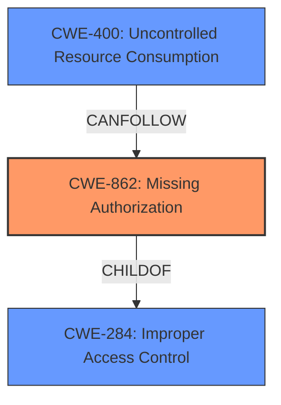

# Analysis for CVE-2020-10701

# Summary
| CWE ID | CWE Name | Confidence | CWE Abstraction Level | CWE Vulnerability Mapping Label | CWE-Vulnerability Mapping Notes |
|---|---|---|---|---|---|
| CWE-862 | Missing Authorization | 1.0 | Class | Primary | Allowed-with-Review |
| CWE-400 | Uncontrolled Resource Consumption | 0.6 | Class | Secondary | Discouraged |

## Evidence and Confidence

*   **Confidence Score:** 0.8
*   **Evidence Strength:** HIGH

## Relationship Analysis
The primary CWE selected is CWE-862, which is a child of CWE-284 (Improper Access Control). While CWE-284 is a more general category, CWE-862 specifically addresses the **missing authorization** aspect described in the vulnerability. CWE-400 can be viewed as a potential consequence of CWE-862 in this particular scenario. The unprivileged user can exhaust resources by repeatedly making the QEMU agent unresponsive by setting a zero timeout.



## Vulnerability Chain
The chain of events is as follows:
1.  **Root Cause:** **Missing authorization** (CWE-862) in the libvirt API.
2.  An unprivileged user exploits this **missing authorization** to adjust the QEMU agent response timeout.
3.  By setting the timeout to zero, the attacker can cause guest agent commands to fail, leading to a denial of service.
4.  **Impact:** Potential denial of service (CWE-400 due to resource exhaustion by unresponding QEMU agent).

## Summary of Analysis
The primary weakness is the **missing authorization** check, allowing unauthorized users to modify the timeout. The vulnerability description explicitly states that a **missing authorization** flaw was found. The **CVE Reference Links Content Summary** also supports this, stating "A missing authorization flaw was found in the libvirt API responsible for changing the QEMU agent response timeout." This leads to CWE-862 being selected as the primary CWE.

The potential denial of service condition can be seen as uncontrolled resource consumption. Therefore, CWE-400 is included as a secondary weakness.

The analysis is primarily based on the provided evidence, which strongly points to a **missing authorization** issue. The graph relationships help illustrate the connection between the **missing authorization** and the potential denial of service impact. CWE-862 is at the Class level, which is appropriate given the information available.

Relevant CWE Information:

# Enhanced Context (25 CWEs)
The following CWEs were identified as potentially relevant to this vulnerability:

## CWE-404: Improper Resource Shutdown or Release
**Abstraction Level**: Class
**Similarity Score**: 0.76
**Source**: dense

**Description**:
The product does not release or incorrectly releases a resource before it is made available for re-use.

**Mapping Guidance**:
- Usage: Allowed-with-Review
- Rationale: This CWE entry is a Class and might have Base-level children that would be more appropriate

## CWE-274: Improper Handling of Insufficient Privileges
**Abstraction Level**: Base
**Similarity Score**: 0.75
**Source**: dense

**Description**:
The product does not handle or incorrectly handles when it has insufficient privileges to perform an operation, leading to resultant weaknesses.

**Mapping Guidance**:
- Usage: Discouraged
- Rationale: This CWE entry could be deprecated in a future version of CWE.

## CWE-667: Improper Locking
**Abstraction Level**: Class
**Similarity Score**: 0.74
**Source**: dense

**Description**:
The product does not properly acquire or release a lock on a resource, leading to unexpected resource state changes and behaviors.

**Mapping Guidance**:
- Usage: Allowed-with-Review
- Rationale: This CWE entry is a Class and might have Base-level children that would be more appropriate

## CWE-131: Incorrect Calculation of Buffer Size
**Abstraction Level**: Base
**Similarity Score**: 0.74
**Source**: dense

**Description**:
The product does not correctly calculate the size to be used when allocating a buffer, which could lead to a buffer overflow.

**Mapping Guidance**:
- Usage: Allowed
- Rationale: This CWE entry is at the Base level of abstraction, which is a preferred level of abstraction for mapping to the root causes of vulnerabilities.

## CWE-226: Sensitive Information in Resource Not Removed Before Reuse
**Abstraction Level**: Base
**Similarity Score**: 0.74
**Source**: dense

**Description**:
The product releases a resource such as memory or a file so that it can be made available for reuse, but it does not clear or "zeroize" the information contained in the resource before the product performs a critical state transition or makes the resource available for reuse by other entities.

**Mapping Guidance**:
- Usage: Allowed
- Rationale: This CWE entry is at the Base level of abstraction, which is a preferred level of abstraction for mapping to the root causes of vulnerabilities.

## CWE-1220: Insufficient Granularity of Access Control
**Abstraction Level**: Base
**Similarity Score**: 0.74
**Source**: dense

**Description**:
The product implements access controls via a policy or other feature with the intention to disable or restrict accesses (reads and/or writes) to assets in a system from untrusted agents. However, implemented access controls lack required granularity, which renders the control policy too broad because it allows accesses from unauthorized agents to the security-sensitive assets.

**Mapping Guidance**:
- Usage: Allowed
- Rationale: This CWE entry is at the Base level of abstraction, which is a preferred level of abstraction for mapping to the root causes of vulnerabilities.

## CWE-653: Improper Isolation or Compartmentalization
**Abstraction Level**: Class
**Similarity Score**: 0.74
**Source**: dense

**Description**:
The product does not properly compartmentalize or isolate functionality, processes, or resources that require different privilege levels, rights, or permissions.

**Mapping Guidance**:
- Usage: Allowed
- Rationale: This CWE entry is at the Base level of abstraction, which is a preferred level of abstraction for mapping to the root causes of vulnerabilities.

## CWE-280: Improper Handling of Insufficient Permissions or Privileges
**Abstraction Level**: Base
**Similarity Score**: 0.74
**Source**: dense

**Description**:
The product does not handle or incorrectly handles when it has insufficient privileges to access resources or functionality as specified by their permissions. This may cause it to follow unexpected code paths that may leave the product in an invalid state.

**Mapping Guidance**:
- Usage: Allowed
- Rationale: This CWE entry is at the Base level of abstraction, which is a preferred level of abstraction for mapping to the root causes of vulnerabilities.

## CWE-125: Out-of-bounds Read
**Abstraction Level**: Base
**Similarity Score**: 0.74
**Source**: dense

**Description**:
The product reads data past the end, or before the beginning, of the intended buffer.

**Mapping Guidance**:
- Usage: Allowed
- Rationale: This CWE entry is at the Base level of abstraction, which is a preferred level of abstraction for mapping to the root causes of vulnerabilities.

## CWE-130: Improper Handling of Length Parameter Inconsistency
**Abstraction Level**: Base
**Similarity Score**: 0.74
**Source**: dense

**Description**:
The product parses a formatted message or structure, but it does not handle or incorrectly handles a length field that is inconsistent with the actual length of the associated data.

**Mapping Guidance**:
- Usage: Allowed
- Rationale: This CWE entry is at the Base level of abstraction, which is a preferred level of abstraction for mapping to the root causes of vulnerabilities.

## CWE-789: Memory Allocation with Excessive Size Value
**Abstraction Level**: Variant
**Similarity Score**: 5890.61
**Source**: sparse

**Description**:
The product allocates memory based on an untrusted, large size value, but it does not ensure that the size is within expected limits, allowing arbitrary amounts of memory to be allocated.

**Mapping Guidance**:
- Usage: Allowed
- Rationale: This CWE entry is at the Variant level of abstraction, which is a preferred level of abstraction for mapping to the root causes of vulnerabilities.

## CWE-295: Improper Certificate Validation
**Abstraction Level**: Base
**Similarity Score**: 5788.62
**Source**: sparse

**Description**:
The product does not validate, or incorrectly validates, a certificate.

**Mapping Guidance**:
- Usage: Allowed
- Rationale: This CWE entry is at the Base level

# Enhanced Query for CVE-2020-10701

## Vulnerability Description
A **missing authorization** flaw was found in the libvirt API responsible for changing the QEMU agent response timeout. This flaw allows read-only connections to adjust the time that libvirt waits for the QEMU guest agent to respond to agent commands. Depending on the timeout value that is set, this flaw can make guest agent commands fail because the agent cannot respond in time. Unprivileged users with a read-only connection could abuse this flaw to set the response timeout for all guest agent messages to zero, potentially leading to a denial of service. This flaw affects libvirt versions before 6.2.0.

### Vulnerability Description Key Phrases
- **rootcause:** **missing authorization**
- **impact:** make guest agent commands fail
- **attacker:** unprivileged users with a read-only connection
- **product:** libvirt
- **version:** before 6.2.0
- **component:** API responsible for changing the QEMU agent response timeout

## CVE Reference Links Content Summary
```
{
  "guidelines": "1. First verify if the content relates to the CVE specified based on the official description\n2. If the content does not relate to this CVE, respond with \"UNRELATED\"\n3. If no useful vulnerability information is found, respond with \"NOINFO\" \n4. For relevant content, extract:\n   - Root cause of vulnerability\n   - Weaknesses/vulnerabilities present\n   - Impact of exploitation\n   - Attack vectors\n   - Required attacker capabilities/position\n\nAdditional instructions:\n- Preserve original technical details and descriptions\n- Remove unrelated content\n- Translate non-English content to English\n- Note if the content provides more detail than the official CVE description",
  "response": {
    "related": true,
    "details": [
      {
        "source": "bugzilla.redhat.com_143c7b60_20250119_111152.html",
        "root_cause": "A missing authorization flaw was found in the libvirt API responsible for changing the QEMU agent response timeout.",
        "weaknesses": [
          "Authorization flaw in the libvirt API.",
          "Read-only connections were allowed to adjust the QEMU guest agent timeout."
        ],
        "impact": "Unprivileged users with a read-only connection could abuse this flaw to set the response timeout for all guest agent messages to zero, potentially leading to a denial of service. Depending on the timeout value that is set, this flaw can make guest agent commands fail because the agent cannot respond in time.",
        "attack_vectors": [
          "Abuse of read-only connections to adjust the guest agent timeout.",
          "Setting the timeout to zero to cause a denial of service."
        ],
        "required_capabilities": "An unprivileged user with a read-only connection to libvirt."
      },
      {
        "source": "security.netapp.com_6de0c0ff_20250119_111152.html",
        "root_cause": "Libvirt versions prior to 6.2.0 are susceptible to a vulnerability.",
        "weaknesses": [
          "Vulnerability present in libvirt versions prior to 6.2.0."
        ],
        "impact": "Successful exploitation of this vulnerability could lead to Denial of Service (DoS).",
        "attack_vectors": [
          "Unspecified - stated that public discussion of the vulnerability exists."
        ],
       "required_capabilities": "A user capable of exploiting a libvirt vulnerability"
      },
      {
          "source": "security.netapp.com_925b5f0c_20250119_130811.html",
        "root_cause": "Libvirt versions prior to 6.2.0 are susceptible to a vulnerability.",
          "weaknesses": [
              "Vulnerability present in libvirt versions prior to 6.2.0."
            ],
          "impact": "Successful exploitation of this vulnerability could lead to Denial of Service (DoS).",
        "attack_vectors": [
              "Unspecified - stated that public discussion of the vulnerability exists."
            ],
        "required_capabilities": "A user capable of exploiting a libvirt vulnerability"
        }
    ]
  }
}
```

## Retriever Results

### Top Combined Results

| Rank | CWE ID | Name | Abstraction | Usage  | Retrievers | Individual Scores |
|------|--------|------|-------------|-------|------------|-------------------|
| 1 | 284 | Improper Access Control | Pillar | Discouraged | alternate_terms | 0.800 |
| 2 | 789 | Memory Allocation with Excessive Size Value | Variant | Allowed | sparse | 0.625 |
| 3 | 909 | Missing Initialization of Resource | Class | Allowed-with-Review | sparse | 0.602 |
| 4 | 755 | Improper Handling of Exceptional Conditions | Class | Discouraged | sparse | 0.589 |
| 5 | 295 | Improper Certificate Validation | Base | Allowed | sparse | 0.586 |
| 6 | 250 | Execution with Unnecessary Privileges | Base | Allowed | dense | 0.499 |
| 7 | 1325 | Improperly Controlled Sequential Memory Allocation | Base | Allowed | graph | 0.002 |
| 8 | 862 | Missing Authorization | Class | Allowed-with-Review | sparse | 0.586 |
| 9 | 732 | Incorrect Permission Assignment for Critical Resource | Class | Allowed-with-Review | sparse | 0.559 |
| 10 | 125 | Out-of-bounds Read | Base | Allowed | sparse | 0.554 |


# Complete CWE Specifications


## CWE-284: Improper Access Control
**Abstraction:** Pillar
**Status:** Incomplete

### Description
The product does not restrict or incorrectly restricts access to a resource from an unauthorized actor.

### Extended Description


Access control involves the use of several protection mechanisms such as:


  - Authentication (proving the identity of an actor)

  - Authorization (ensuring that a given actor can access a resource), and

  - Accountability (tracking of activities that were performed)

When any mechanism is not applied or otherwise fails, attackers can compromise the security of the product by gaining privileges, reading sensitive information, executing commands, evading detection, etc.

There are two distinct behaviors that can introduce access control weaknesses:


  - Specification: incorrect privileges, permissions, ownership, etc. are explicitly specified for either the user or the resource (for example, setting a password file to be world-writable, or giving administrator capabilities to a guest user). This action could be performed by the program or the administrator.

  - Enforcement: the mechanism contains errors that prevent it from properly enforcing the specified access control requirements (e.g., allowing the user to specify their own privileges, or allowing a syntactically-incorrect ACL to produce insecure settings). This problem occurs within the program itself, in that it does not actually enforce the intended security policy that the administrator specifies.


### Alternative Terms
Authorization: The terms "access control" and "authorization" are often used interchangeably, although many people have distinct definitions. The CWE usage of "access control" is intended as a general term for the various mechanisms that restrict which users can access which resources, and "authorization" is more narrowly defined. It is unlikely that there will be community consensus on the use of these terms.

### Relationships
None

### Mapping Guidance
**Usage:** Discouraged
**Rationale:** CWE-284 is extremely high-level, a Pillar. Its name, "Improper Access Control," is often misused in low-information vulnerability reports [REF-1287] or by active use of the OWASP Top Ten, such as "A01:2021-Broken Access Control". It is not useful for trend analysis.
**Comments:** Consider using descendants of CWE-284 that are more specific to the kind of access control involved, such as those involving authorization (Missing Authorization (CWE-862), Incorrect Authorization (CWE-863), Incorrect Permission Assignment for Critical Resource (CWE-732), etc.); authentication (Missing Authentication (CWE-306) or Weak Authentication (CWE-1390)); Incorrect User Management (CWE-286); Improper Restriction of Communication Channel to Intended Endpoints (CWE-923); etc.
**Reasons:**
- Frequent Misuse
- Abstraction
**Suggested Alternatives:**
- CWE-862: Missing Authorization
- CWE-863: Incorrect Authorization
- CWE-732: Incorrect Permission Assignment for Critical Resource
- CWE-306: Missing Authentication
- CWE-1390: Weak Authentication
- CWE-923: Improper Restriction of Communication Channel to Intended Endpoints


### Additional Notes
**[Maintenance]** 

This entry needs more work. Possible sub-categories include:


  - Trusted group includes undesired entities (partially covered by CWE-286)

  - Group can perform undesired actions

  - ACL parse error does not fail closed


### Observed Examples
- **CVE-2022-24985:** A form hosting website only checks the session authentication status for a single form, making it possible to bypass authentication when there are multiple forms
- **CVE-2022-29238:** Access-control setting in web-based document collaboration tool is not properly implemented by the code, which prevents listing hidden directories but does not prevent direct requests to files in those directories.
- **CVE-2022-23607:** Python-based HTTP library did not scope cookies to a particular domain such that "supercookies" could be sent to any domain on redirect


## CWE-789: Memory Allocation with Excessive Size Value
**Abstraction:** Variant
**Status:** Draft

### Description
The product allocates memory based on an untrusted, large size value, but it does not ensure that the size is within expected limits, allowing arbitrary amounts of memory to be allocated.

### Extended Description
Not provided

### Alternative Terms
Stack Exhaustion: When a weakness allocates excessive memory on the stack, it is often described as "stack exhaustion," which is a technical impact of the weakness. This technical impact is often encountered as a consequence of CWE-789 and/or CWE-1325.

### Relationships
ChildOf -> CWE-770
CanPrecede -> CWE-476

### Mapping Guidance
**Usage:** Allowed
**Rationale:** This CWE entry is at the Variant level of abstraction, which is a preferred level of abstraction for mapping to the root causes of vulnerabilities.
**Comments:** Carefully read both the name and description to ensure that this mapping is an appropriate fit. Do not try to 'force' a mapping to a lower-level Base/Variant simply to comply with this preferred level of abstraction.
**Reasons:**
- Acceptable-Use


### Additional Notes
**[Relationship]** This weakness can be closely associated with integer overflows (CWE-190). Integer overflow attacks would concentrate on providing an extremely large number that triggers an overflow that causes less memory to be allocated than expected. By providing a large value that does not trigger an integer overflow, the attacker could still cause excessive amounts of memory to be allocated.

**[Applicable Platform]** 

Uncontrolled memory allocation is possible in many languages, such as dynamic array allocation in perl or initial size parameters in Collections in Java. However, languages like C and C++ where programmers have the power to more directly control memory management will be more susceptible.


### Observed Examples
- **CVE-2022-21668:** Chain: Python library does not limit the resources used to process images that specify a very large number of bands (CWE-1284), leading to excessive memory consumption (CWE-789) or an integer overflow (CWE-190).
- **CVE-2010-3701:** program uses ::alloca() for encoding messages, but large messages trigger segfault
- **CVE-2008-1708:** memory consumption and daemon exit by specifying a large value in a length field


## CWE-909: Missing Initialization of Resource
**Abstraction:** Class
**Status:** Incomplete

### Description
The product does not initialize a critical resource.

### Extended Description
Many resources require initialization before they can be properly used. If a resource is not initialized, it could contain unpredictable or expired data, or it could be initialized to defaults that are invalid. This can have security implications when the resource is expected to have certain properties or values.

### Alternative Terms
None

### Relationships
ChildOf -> CWE-665
ChildOf -> CWE-665
CanPrecede -> CWE-908

### Mapping Guidance
**Usage:** Allowed-with-Review
**Rationale:** This CWE entry is a Class and might have Base-level children that would be more appropriate
**Comments:** Examine children of this entry to see if there is a better fit
**Reasons:**
- Abstraction


### Observed Examples
- **CVE-2020-20739:** A variable that has its value set in a conditional statement is sometimes used when the conditional fails, sometimes causing data leakage
- **CVE-2005-1036:** Chain: Bypass of access restrictions due to improper authorization (CWE-862) of a user results from an improperly initialized (CWE-909) I/O permission bitmap


## CWE-755: Improper Handling of Exceptional Conditions
**Abstraction:** Class
**Status:** Incomplete

### Description
The product does not handle or incorrectly handles an exceptional condition.

### Extended Description
Not provided

### Alternative Terms
None

### Relationships
ChildOf -> CWE-703

### Mapping Guidance
**Usage:** Discouraged
**Rationale:** This CWE entry is a level-1 Class (i.e., a child of a Pillar). It might have lower-level children that would be more appropriate
**Comments:** Examine children of this entry to see if there is a better fit
**Reasons:**
- Abstraction


### Observed Examples
- **CVE-2023-41151:** SDK for OPC Unified Architecture (OPC UA) server has uncaught exception when a socket is blocked for writing but the server tries to send an error
- **[REF-1374]:** Chain: JavaScript-based cryptocurrency library can fall back to the insecure Math.random() function instead of reporting a failure (CWE-392), thus reducing the entropy (CWE-332) and leading to generation of non-unique cryptographic keys for Bitcoin wallets (CWE-1391)
- **CVE-2021-3011:** virtual interrupt controller in a virtualization product allows crash of host by writing a certain invalid value to a register, which triggers a fatal error instead of returning an error code


## CWE-295: Improper Certificate Validation
**Abstraction:** Base
**Status:** Draft

### Description
The product does not validate, or incorrectly validates, a certificate.

### Extended Description
When a certificate is invalid or malicious, it might allow an attacker to spoof a trusted entity by interfering in the communication path between the host and client. The product might connect to a malicious host while believing it is a trusted host, or the product might be deceived into accepting spoofed data that appears to originate from a trusted host.

### Alternative Terms
None

### Relationships
ChildOf -> CWE-287
ChildOf -> CWE-287
PeerOf -> CWE-322

### Mapping Guidance
**Usage:** Allowed
**Rationale:** This CWE entry is at the Base level of abstraction, which is a preferred level of abstraction for mapping to the root causes of vulnerabilities.
**Comments:** Carefully read both the name and description to ensure that this mapping is an appropriate fit. Do not try to 'force' a mapping to a lower-level Base/Variant simply to comply with this preferred level of abstraction.
**Reasons:**
- Acceptable-Use


### Observed Examples
- **CVE-2019-12496:** A Go framework for robotics, drones, and IoT devices skips verification of root CA certificates by default.
- **CVE-2014-1266:** chain: incorrect "goto" in Apple SSL product bypasses certificate validation, allowing Adversary-in-the-Middle (AITM) attack (Apple "goto fail" bug). CWE-705 (Incorrect Control Flow Scoping) -> CWE-561 (Dead Code) -> CWE-295 (Improper Certificate Validation) -> CWE-393 (Return of Wrong Status Code) -> CWE-300 (Channel Accessible by Non-Endpoint).
- **CVE-2021-22909:** Chain: router's firmware update procedure uses curl with "-k" (insecure) option that disables certificate validation (CWE-295), allowing adversary-in-the-middle (AITM) compromise with a malicious firmware image (CWE-494).


## CWE-250: Execution with Unnecessary Privileges
**Abstraction:** Base
**Status:** Draft

### Description
The product performs an operation at a privilege level that is higher than the minimum level required, which creates new weaknesses or amplifies the consequences of other weaknesses.

### Extended Description


New weaknesses can be exposed because running with extra privileges, such as root or Administrator, can disable the normal security checks being performed by the operating system or surrounding environment. Other pre-existing weaknesses can turn into security vulnerabilities if they occur while operating at raised privileges.


Privilege management functions can behave in some less-than-obvious ways, and they have different quirks on different platforms. These inconsistencies are particularly pronounced if you are transitioning from one non-root user to another. Signal handlers and spawned processes run at the privilege of the owning process, so if a process is running as root when a signal fires or a sub-process is executed, the signal handler or sub-process will operate with root privileges.


### Alternative Terms
None

### Relationships
ChildOf -> CWE-269
ChildOf -> CWE-657

### Mapping Guidance
**Usage:** Allowed
**Rationale:** This CWE entry is at the Base level of abstraction, which is a preferred level of abstraction for mapping to the root causes of vulnerabilities.
**Comments:** Carefully read both the name and description to ensure that this mapping is an appropriate fit. Do not try to 'force' a mapping to a lower-level Base/Variant simply to comply with this preferred level of abstraction.
**Reasons:**
- Acceptable-Use


### Additional Notes
**[Relationship]** There is a close association with CWE-653 (Insufficient Separation of Privileges). CWE-653 is about providing separate components for each privilege; CWE-250 is about ensuring that each component has the least amount of privileges possible.

**[Maintenance]** CWE-271, CWE-272, and CWE-250 are all closely related and possibly overlapping. CWE-271 is probably better suited as a category. Both CWE-272 and CWE-250 are in active use by the community. The "least privilege" phrase has multiple interpretations.

**[Maintenance]** The Taxonomy_Mappings to ISA/IEC 62443 were added in CWE 4.10, but they are still under review and might change in future CWE versions. These draft mappings were performed by members of the "Mapping CWE to 62443" subgroup of the CWE-CAPEC ICS/OT Special Interest Group (SIG), and their work is incomplete as of CWE 4.10. The mappings are included to facilitate discussion and review by the broader ICS/OT community, and they are likely to change in future CWE versions.


### Observed Examples
- **CVE-2007-4217:** FTP client program on a certain OS runs with setuid privileges and has a buffer overflow. Most clients do not need extra privileges, so an overflow is not a vulnerability for those clients.
- **CVE-2008-1877:** Program runs with privileges and calls another program with the same privileges, which allows read of arbitrary files.
- **CVE-2007-5159:** OS incorrectly installs a program with setuid privileges, allowing users to gain privileges.


## CWE-1325: Improperly Controlled Sequential Memory Allocation
**Abstraction:** Base
**Status:** Incomplete

### Description
The product manages a group of objects or resources and performs a separate memory allocation for each object, but it does not properly limit the total amount of memory that is consumed by all of the combined objects.

### Extended Description


While the product might limit the amount of memory that is allocated in a single operation for a single object (such as a malloc of an array), if an attacker can cause multiple objects to be allocated in separate operations, then this might cause higher total memory consumption than the developer intended, leading to a denial of service.


### Alternative Terms
Stack Exhaustion: When a weakness allocates excessive memory on the stack, it is often described as "stack exhaustion," which is a technical impact of the weakness. This technical impact is often encountered as a consequence of CWE-789 and/or CWE-1325.

### Relationships
ChildOf -> CWE-770
PeerOf -> CWE-789
CanPrecede -> CWE-476

### Mapping Guidance
**Usage:** Allowed
**Rationale:** This CWE entry is at the Base level of abstraction, which is a preferred level of abstraction for mapping to the root causes of vulnerabilities.
**Comments:** Carefully read both the name and description to ensure that this mapping is an appropriate fit. Do not try to 'force' a mapping to a lower-level Base/Variant simply to comply with this preferred level of abstraction.
**Reasons:**
- Acceptable-Use


### Observed Examples
- **CVE-2020-36049:** JavaScript-based packet decoder uses concatenation of many small strings, causing out-of-memory (OOM) condition
- **CVE-2019-20176:** Product allocates a new buffer on the stack for each file in a directory, allowing stack exhaustion
- **CVE-2013-1591:** Chain: an integer overflow (CWE-190) in the image size calculation causes an infinite loop (CWE-835) which sequentially allocates buffers without limits (CWE-1325) until the stack is full.


## CWE-862: Missing Authorization
**Abstraction:** Class
**Status:** Incomplete

### Description
The product does not perform an authorization check when an actor attempts to access a resource or perform an action.

### Extended Description
Not provided

### Alternative Terms
AuthZ: "AuthZ" is typically used as an abbreviation of "authorization" within the web application security community. It is distinct from "AuthN" (or, sometimes, "AuthC") which is an abbreviation of "authentication." The use of "Auth" as an abbreviation is discouraged, since it could be used for either authentication or authorization.

### Relationships
ChildOf -> CWE-285
ChildOf -> CWE-284

### Mapping Guidance
**Usage:** Allowed-with-Review
**Rationale:** This CWE entry is a Class and might have Base-level children that would be more appropriate
**Comments:** Examine children of this entry to see if there is a better fit
**Reasons:**
- Abstraction


### Additional Notes
**[Terminology]** Assuming a user with a given identity, authorization is the process of determining whether that user can access a given resource, based on the user's privileges and any permissions or other access-control specifications that apply to the resource.


### Observed Examples
- **CVE-2022-24730:** Go-based continuous deployment product does not check that a user has certain privileges to update or create an app, allowing adversaries to read sensitive repository information
- **CVE-2009-3168:** Web application does not restrict access to admin scripts, allowing authenticated users to reset administrative passwords.
- **CVE-2009-3597:** Web application stores database file under the web root with insufficient access control (CWE-219), allowing direct request.


## CWE-732: Incorrect Permission Assignment for Critical Resource
**Abstraction:** Class
**Status:** Draft

### Description
The product specifies permissions for a security-critical resource in a way that allows that resource to be read or modified by unintended actors.

### Extended Description
When a resource is given a permission setting that provides access to a wider range of actors than required, it could lead to the exposure of sensitive information, or the modification of that resource by unintended parties. This is especially dangerous when the resource is related to program configuration, execution, or sensitive user data. For example, consider a misconfigured storage account for the cloud that can be read or written by a public or anonymous user.

### Alternative Terms
None

### Relationships
ChildOf -> CWE-285
ChildOf -> CWE-668

### Mapping Guidance
**Usage:** Allowed-with-Review
**Rationale:** While the name itself indicates an assignment of permissions for resources, this is often misused for vulnerabilities in which "permissions" are not checked, which is an "authorization" weakness (CWE-285 or descendants) within CWE's model [REF-1287].
**Comments:** Closely analyze the specific mistake that is allowing the resource to be exposed, and perform a CWE mapping for that mistake.
**Reasons:**
- Frequent Misuse


### Additional Notes
**[Maintenance]** The relationships between privileges, permissions, and actors (e.g. users and groups) need further refinement within the Research view. One complication is that these concepts apply to two different pillars, related to control of resources (CWE-664) and protection mechanism failures (CWE-693).


### Observed Examples
- **CVE-2022-29527:** Go application for cloud management creates a world-writable sudoers file that allows local attackers to inject sudo rules and escalate privileges to root by winning a race condition.
- **CVE-2009-3482:** Anti-virus product sets insecure "Everyone: Full Control" permissions for files under the "Program Files" folder, allowing attackers to replace executables with Trojan horses.
- **CVE-2009-3897:** Product creates directories with 0777 permissions at installation, allowing users to gain privileges and access a socket used for authentication.


## CWE-125: Out-of-bounds Read
**Abstraction:** Base
**Status:** Draft

### Description
The product reads data past the end, or before the beginning, of the intended buffer.

### Extended Description
Not provided

### Alternative Terms
OOB read: Shorthand for "Out of bounds" read

### Relationships
ChildOf -> CWE-119
ChildOf -> CWE-119
ChildOf -> CWE-119
ChildOf -> CWE-119

### Mapping Guidance
**Usage:** Allowed
**Rationale:** This CWE entry is at the Base level of abstraction, which is a preferred level of abstraction for mapping to the root causes of vulnerabilities.
**Comments:** Carefully read both the name and description to ensure that this mapping is an appropriate fit. Do not try to 'force' a mapping to a lower-level Base/Variant simply to comply with this preferred level of abstraction.
**Reasons:**
- Acceptable-Use


### Observed Examples
- **CVE-2023-1018:** The reference implementation code for a Trusted Platform Module does not implement length checks on data, allowing for an attacker to read 2 bytes past the end of a buffer.
- **CVE-2020-11899:** Out-of-bounds read in IP stack used in embedded systems, as exploited in the wild per CISA KEV.
- **CVE-2014-0160:** Chain: "Heartbleed" bug receives an inconsistent length parameter (CWE-130) enabling an out-of-bounds read (CWE-126), returning memory that could include private cryptographic keys and other sensitive data.

