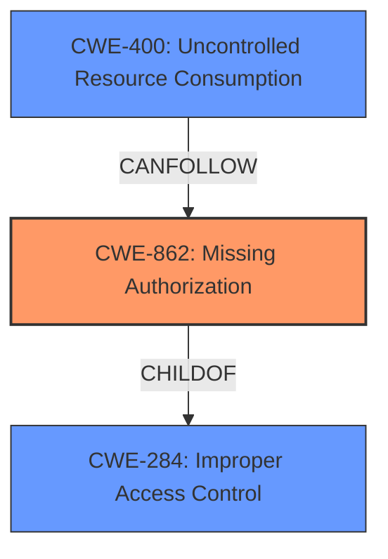

# Analysis Report for CVE-2020-10701

# Vulnerability Analysis Report: CVE-2020-10701

## Description


## Analysis (with Relationship Data)

# Summary
| CWE ID | CWE Name | Confidence | CWE Abstraction Level | CWE Vulnerability Mapping Label | CWE-Vulnerability Mapping Notes |
|---|---|---|---|---|---|
| CWE-862 | Missing Authorization | 1.0 | Class | Primary | Allowed-with-Review |
| CWE-400 | Uncontrolled Resource Consumption | 0.6 | Class | Secondary | Discouraged |

## Evidence and Confidence

*   **Confidence Score:** 0.8
*   **Evidence Strength:** HIGH

## Relationship Analysis
The primary CWE selected is CWE-862, which is a child of CWE-284 (Improper Access Control). While CWE-284 is a more general category, CWE-862 specifically addresses the **missing authorization** aspect described in the vulnerability. CWE-400 can be viewed as a potential consequence of CWE-862 in this particular scenario. The unprivileged user can exhaust resources by repeatedly making the QEMU agent unresponsive by setting a zero timeout.



## Vulnerability Chain
The chain of events is as follows:
1.  **Root Cause:** **Missing authorization** (CWE-862) in the libvirt API.
2.  An unprivileged user exploits this **missing authorization** to adjust the QEMU agent response timeout.
3.  By setting the timeout to zero, the attacker can cause guest agent commands to fail, leading to a denial of service.
4.  **Impact:** Potential denial of service (CWE-400 due to resource exhaustion by unresponding QEMU agent).

## Summary of Analysis
The primary weakness is the **missing authorization** check, allowing unauthorized users to modify the timeout. The vulnerability description explicitly states that a **missing authorization** flaw was found. The **CVE Reference Links Content Summary** also supports this, stating "A missing authorization flaw was found in the libvirt API responsible for changing the QEMU agent response timeout." This leads to CWE-862 being selected as the primary CWE.

The potential denial of service condition can be seen as uncontrolled resource consumption. Therefore, CWE-400 is included as a secondary weakness.

The analysis is primarily based on the provided evidence, which strongly points to a **missing authorization** issue. The graph relationships help illustrate the connection between the **missing authorization** and the potential denial of service impact. CWE-862 is at the Class level, which is appropriate given the information available.

Relevant CWE Information:

# Enhanced Context (25 CWEs)
The following CWEs were identified as potentially relevant to this vulnerability:

## CWE-404: Improper Resource Shutdown or Release
**Abstraction Level**: Class
**Similarity Score**: 0.76
**Source**: dense

**Description**:
The product does not release or incorrectly releases a resource before it is made available for re-use.

**Mapping Guidance**:
- Usage: Allowed-with-Review
- Rationale: This CWE entry is a Class and might have Base-level children that would be more appropriate

## CWE-274: Improper Handling of Insufficient Privileges
**Abstraction Level**: Base
**Similarity Score**: 0.75
**Source**: dense

**Description**:
The product does not handle or incorrectly handles when it has insufficient privileges to perform an operation, leading to resultant weaknesses.

**Mapping Guidance**:
- Usage: Discouraged
- Rationale: This CWE entry could be deprecated in a future version of CWE.

## CWE-667: Improper Locking
**Abstraction Level**: Class
**Similarity Score**: 0.74
**Source**: dense

**Description**:
The product does not properly acquire or release a lock on a resource, leading to unexpected resource state changes and behaviors.

**Mapping Guidance**:
- Usage: Allowed-with-Review
- Rationale: This CWE entry is a Class and might have Base-level children that would be more appropriate

## CWE-131: Incorrect Calculation of Buffer Size
**Abstraction Level**: Base
**Similarity Score**: 0.74
**Source**: dense

**Description**:
The product does not correctly calculate the size to be used when allocating a buffer, which could lead to a buffer overflow.

**Mapping Guidance**:
- Usage: Allowed
- Rationale: This CWE entry is at the Base level of abstraction, which is a preferred level of abstraction for mapping to the root causes of vulnerabilities.

## CWE-226: Sensitive Information in Resource Not Removed Before Reuse
**Abstraction Level**: Base
**Similarity Score**: 0.74
**Source**: dense

**Description**:
The product releases a resource such as memory or a file so that it can be made available for reuse, but it does not clear or "zeroize" the information contained in the resource before the product performs a critical state transition or makes the resource available for reuse by other entities.

**Mapping Guidance**:
- Usage: Allowed
- Rationale: This CWE entry is at the Base level of abstraction, which is a preferred level of abstraction for mapping to the root causes of vulnerabilities.

## CWE-1220: Insufficient Granularity of Access Control
**Abstraction Level**: Base
**Similarity Score**: 0.74
**Source**: dense

**Description**:
The product implements access controls via a policy or other feature with the intention to disable or restrict accesses (reads and/or writes) to assets in a system from untrusted agents. However, implemented access controls lack required granularity, which renders the control policy too broad because it allows accesses from unauthorized agents to the security-sensitive assets.

**Mapping Guidance**:
- Usage: Allowed
- Rationale: This CWE entry is at the Base level of abstraction, which is a preferred level of abstraction for mapping to the root causes of vulnerabilities.

## CWE-653: Improper Isolation or Compartmentalization
**Abstraction Level**: Class
**Similarity Score**: 0.74
**Source**: dense

**Description**:
The product does not properly compartmentalize or isolate functionality, processes, or resources that require different privilege levels, rights, or permissions.

**Mapping Guidance**:
- Usage: Allowed
- Rationale: This CWE entry is at the Base level of abstraction, which is a preferred level of abstraction for mapping to the root causes of vulnerabilities.

## CWE-280: Improper Handling of Insufficient Permissions or Privileges
**Abstraction Level**: Base
**Similarity Score**: 0.74
**Source**: dense

**Description**:
The product does not handle or incorrectly handles when it has insufficient privileges to access resources or functionality as specified by their permissions. This may cause it to follow unexpected code paths that may leave the product in an invalid state.

**Mapping Guidance**:
- Usage: Allowed
- Rationale: This CWE entry is at the Base level of abstraction, which is a preferred level of abstraction for mapping to the root causes of vulnerabilities.

## CWE-125: Out-of-bounds Read
**Abstraction Level**: Base
**Similarity Score**: 0.74
**Source**: dense

**Description**:
The product reads data past the end, or before the beginning, of the intended buffer.

**Mapping Guidance**:
- Usage: Allowed
- Rationale: This CWE entry is at the Base level of abstraction, which is a preferred level of abstraction for mapping to the root causes of vulnerabilities.

## CWE-130: Improper Handling of Length Parameter Inconsistency
**Abstraction Level**: Base
**Similarity Score**: 0.74
**Source**: dense

**Description**:
The product parses a formatted message or structure, but it does not handle or incorrectly handles a length field that is inconsistent with the actual length of the associated data.

**Mapping Guidance**:
- Usage: Allowed
- Rationale: This CWE entry is at the Base level of abstraction, which is a preferred level of abstraction for mapping to the root causes of vulnerabilities.

## CWE-789: Memory Allocation with Excessive Size Value
**Abstraction Level**: Variant
**Similarity Score**: 5890.61
**Source**: sparse

**Description**:
The product allocates memory based on an untrusted, large size value, but it does not ensure that the size is within expected limits, allowing arbitrary amounts of memory to be allocated.

**Mapping Guidance**:
- Usage: Allowed
- Rationale: This CWE entry is at the Variant level of abstraction, which is a preferred level of abstraction for mapping to the root causes of vulnerabilities.

## CWE-295: Improper Certificate Validation
**Abstraction Level**: Base
**Similarity Score**: 5788.62
**Source**: sparse

**Description**:
The product does not validate, or incorrectly validates, a certificate.

**Mapping Guidance**:
- Usage: Allowed
- Rationale: This CWE entry is at the Base level


## CWE Relationship Analysis

Current CWEs represent these abstraction levels: .


### Vulnerability Chain Analysis

**Chain starting from CWE-667:**
- 667 (Improper Locking) - ROOT


**Chain starting from CWE-404:**
- 404 (Improper Resource Shutdown or Release) - ROOT


### CWE Relationship Diagram

```mermaid
graph TD
    classDef primary fill:#f96,stroke:#333,stroke-width:2px
    classDef secondary fill:#69f,stroke:#333
    classDef tertiary fill:#9e9,stroke:#333
```


*Report generated on 2025-04-01 17:20:47*
