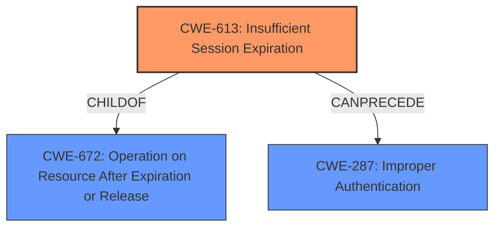

# Enhanced Analysis for CVE-2020-10709

# Summary
| CWE ID  | CWE Name                                                                   | Confidence | CWE Abstraction Level | CWE Vulnerability Mapping Label | CWE-Vulnerability Mapping Notes |
| ------- | -------------------------------------------------------------------------- | ---------- | --------------------- | ------------------------------- | ----------------------------- |
| CWE-613 | Insufficient Session Expiration                                            | 0.9        | Base                  | Primary                         | Allowed                       |
| CWE-287 | Improper Authentication                                                    | 0.6        | Class                 | Secondary                       | Discouraged                   |

## Evidence and Confidence

*   **Confidence Score:** 0.75
*   **Evidence Strength:** HIGH

## Relationship Analysis
The primary relationship is that CWE-613 **Insufficient Session Expiration** is a child of CWE-672 **Operation on Resource After Expiration or Release**, indicating a more specific type of the parent weakness. CWE-613 can also precede CWE-287 **Improper Authentication**. This relationship suggests that insufficient session expiration can lead to authentication bypass. Given that the vulnerability description focuses on the **unexpiring refresh token** and its direct impact on maintaining authentication, CWE-613 is the more fitting choice.



## Vulnerability Chain
The vulnerability chain starts with the **root cause**: the application **fails to expire refresh tokens**. This leads to the weakness: **unexpiring refresh tokens**. The impact is **persistent access** and potential **account takeover**.

## Summary of Analysis
The initial analysis focused on the **unexpiring refresh token** as the primary vulnerability.

The vulnerability description clearly states, "This flaw allows an attacker to **obtain a refresh token that does not expire**," and the "CVE Reference Links Content Summary" confirms that "the refresh tokens do not adhere to the expiration time specified by the `REFRESH_TOKEN_EXPIRE_SECONDS` setting." This directly relates to **CWE-613 Insufficient Session Expiration**.

CWE-287 **Improper Authentication** was considered because the **unexpiring token** allows persistent access, effectively bypassing the intended authentication process. However, CWE-287 is discouraged by MITRE when more specific CWEs are applicable. Since the root cause is the **lack of session expiration** rather than a flaw in the authentication mechanism itself, CWE-613 is more appropriate.

The relationship analysis further supports this decision. CWE-613 is a child of CWE-672, indicating a more specific type of resource expiration issue. The chain relationship also suggests that insufficient session expiration can lead to authentication bypass, but the primary issue is the **unexpiring token**.

Therefore, CWE-613 is the optimal level of specificity and accurately represents the vulnerability.

Relevant CWE Information:

# Enhanced Context (25 CWEs)

## CWE-212: Improper Removal of Sensitive Information Before Storage or Transfer
**Abstraction Level**: Base
**Similarity Score**: 0.80
**Source**: dense

**Description**:
The product stores, transfers, or shares a resource that contains sensitive information, but it does not properly remove that information before the product makes the resource available to unauthorized actors.

**Mapping Guidance**:
- Usage: Allowed
- Rationale: This CWE entry is at the Base level of abstraction, which is a preferred level of abstraction for mapping to the root causes of vulnerabilities.

## CWE-226: Sensitive Information in Resource Not Removed Before Reuse
**Abstraction Level**: Base
**Similarity Score**: 0.80
**Source**: dense

**Description**:
The product releases a resource such as memory or a file so that it can be made available for reuse, but it does not clear or "zeroize" the information contained in the resource before the product performs a critical state transition or makes the resource available for reuse by other entities.

**Mapping Guidance**:
- Usage: Allowed
- Rationale: This CWE entry is at the Base level of abstraction, which is a preferred level of abstraction for mapping to the root causes of vulnerabilities.

## CWE-404: Improper Resource Shutdown or Release
**Abstraction Level**: Class
**Similarity Score**: 0.78
**Source**: dense

**Description**:
The product does not release or incorrectly releases a resource before it is made available for re-use.

**Mapping Guidance**:
- Usage: Allowed-with-Review
- Rationale: This CWE entry is a Class and might have Base-level children that would be more appropriate

## CWE-668: Exposure of Resource to Wrong Sphere
**Abstraction Level**: Class
**Similarity Score**: 0.78
**Source**: dense

**Description**:
The product exposes a resource to the wrong control sphere, providing unintended actors with inappropriate access to the resource.

**Mapping Guidance**:
- Usage: Discouraged
- Rationale: CWE-668 is high-level and is often misused as a catch-all when lower-level CWE IDs might be applicable. It is sometimes used for low-information vulnerability reports [REF-1287]. It is a level-1 Class (i.e., a child of a Pillar). It is not useful for trend analysis.

## CWE-274: Improper Handling of Insufficient Privileges
**Abstraction Level**: Base
**Similarity Score**: 0.77
**Source**: dense

**Description**:
The product does not handle or incorrectly handles when it has insufficient privileges to perform an operation, leading to resultant weaknesses.

**Mapping Guidance**:
- Usage: Discouraged
- Rationale: This CWE entry could be deprecated in a future version of CWE.

## CWE-345: Insufficient Verification of Data Authenticity
**Abstraction Level**: Class
**Similarity Score**: 0.77
**Source**: dense

**Description**:
The product does not sufficiently verify the origin or authenticity of data, in a way that causes it to accept invalid data.

**Mapping Guidance**:
- Usage: Discouraged
- Rationale: This CWE entry is a level-1 Class (i.e., a child of a Pillar). It might have lower-level children that would be more appropriate

## CWE-280: Improper Handling of Insufficient Permissions or Privileges
**Abstraction Level**: Base
**Similarity Score**: 0.77
**Source**: dense

**Description**:
The product does not handle or incorrectly handles when it has insufficient privileges to access resources or functionality as specified by their permissions. This may cause it to follow unexpected code paths that may leave the product in an invalid state.

**Mapping Guidance**:
- Usage: Allowed
- Rationale: This CWE entry is at the Base level of abstraction, which is a preferred level of abstraction for mapping to the root causes of vulnerabilities.

## CWE-667: Improper Locking
**Abstraction Level**: Class
**Similarity Score**: 0.77
**Source**: dense

**Description**:
The product does not properly acquire or release a lock on a resource, leading to unexpected resource state changes and behaviors.

**Mapping Guidance**:
- Usage: Allowed-with-Review
- Rationale: This CWE entry is a Class and might have Base-level children that would be more appropriate

## CWE-754: Improper Check for Unusual or Exceptional Conditions
**Abstraction Level**: Class
**Similarity Score**: 0.77
**Source**: dense

**Description**:
The product does not check or incorrectly checks for unusual or exceptional conditions that are not expected to occur frequently during day to day operation of the product.

**Mapping Guidance**:
- Usage: Allowed-with-Review
- Rationale: This CWE entry is a Class and might have Base-level children that would be more appropriate

## CWE-639: Authorization Bypass Through User-Controlled Key
**Abstraction Level**: Base
**Similarity Score**: 0.77
**Source**: dense

**Description**:
The system's authorization functionality does not prevent one user from gaining access to another user's data or record by modifying the key value identifying the data.

**Mapping Guidance**:
- Usage: Allowed
- Rationale: This CWE entry is at the Base level of abstraction, which is a preferred level of abstraction for mapping to the root causes of vulnerabilities.

## CWE-863: Incorrect Authorization
**Abstraction Level**: Class
**Similarity Score**: 5747.32
**Source**: sparse

**Description**:
The product performs an authorization check when an actor attempts to access a resource or perform an action, but it does not correctly perform the check.

**Mapping Guidance**:
- Usage: Allowed-with-Review
- Rationale: This CWE entry is a Class and might have Base-level children that would be more appropriate

## CWE-285: Improper Authorization
**Abstraction Level**: Class
**Similarity Score**:


## CWE Relationship Analysis

Current CWEs represent these abstraction levels: .


### Vulnerability Chain Analysis

**Chain starting from CWE-667:**
- 667 (Improper Locking) - ROOT


**Chain starting from CWE-754:**
- 754 (Improper Check for Unusual or Exceptional Conditions) - ROOT


### CWE Relationship Diagram

```mermaid
graph TD
    classDef primary fill:#f96,stroke:#333,stroke-width:2px
    classDef secondary fill:#69f,stroke:#333
    classDef tertiary fill:#9e9,stroke:#333
```