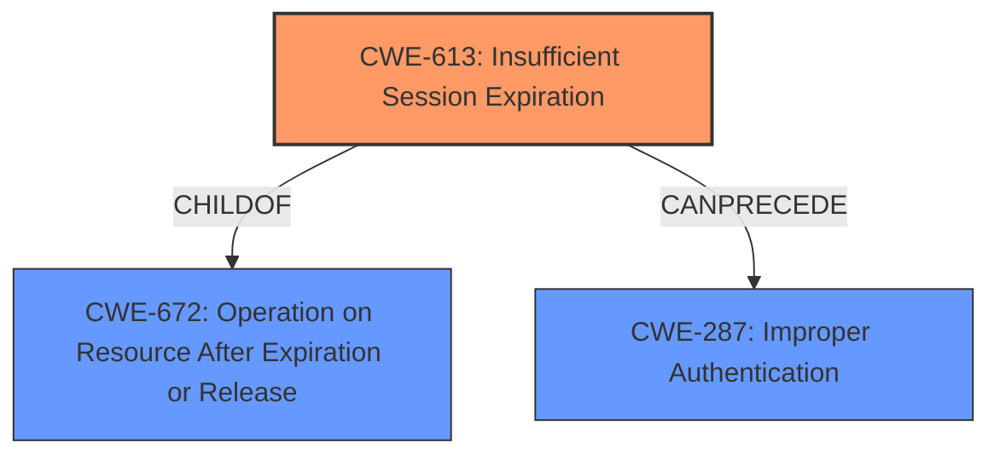

# Analysis for CVE-2020-10709

# Summary
| CWE ID  | CWE Name                                                                   | Confidence | CWE Abstraction Level | CWE Vulnerability Mapping Label | CWE-Vulnerability Mapping Notes |
| ------- | -------------------------------------------------------------------------- | ---------- | --------------------- | ------------------------------- | ----------------------------- |
| CWE-613 | Insufficient Session Expiration                                            | 0.9        | Base                  | Primary                         | Allowed                       |
| CWE-287 | Improper Authentication                                                    | 0.6        | Class                 | Secondary                       | Discouraged                   |

## Evidence and Confidence

*   **Confidence Score:** 0.75
*   **Evidence Strength:** HIGH

## Relationship Analysis
The primary relationship is that CWE-613 **Insufficient Session Expiration** is a child of CWE-672 **Operation on Resource After Expiration or Release**, indicating a more specific type of the parent weakness. CWE-613 can also precede CWE-287 **Improper Authentication**. This relationship suggests that insufficient session expiration can lead to authentication bypass. Given that the vulnerability description focuses on the **unexpiring refresh token** and its direct impact on maintaining authentication, CWE-613 is the more fitting choice.

## Vulnerability Chain
The vulnerability chain starts with the **root cause**: the application **fails to expire refresh tokens**. This leads to the weakness: **unexpiring refresh tokens**. The impact is **persistent access** and potential **account takeover**.

## Summary of Analysis
The initial analysis focused on the **unexpiring refresh token** as the primary vulnerability.

The vulnerability description clearly states, "This flaw allows an attacker to **obtain a refresh token that does not expire**," and the "CVE Reference Links Content Summary" confirms that "the refresh tokens do not adhere to the expiration time specified by the `REFRESH_TOKEN_EXPIRE_SECONDS` setting." This directly relates to **CWE-613 Insufficient Session Expiration**.

CWE-287 **Improper Authentication** was considered because the **unexpiring token** allows persistent access, effectively bypassing the intended authentication process. However, CWE-287 is discouraged by MITRE when more specific CWEs are applicable. Since the root cause is the **lack of session expiration** rather than a flaw in the authentication mechanism itself, CWE-613 is more appropriate.

The relationship analysis further supports this decision. CWE-613 is a child of CWE-672, indicating a more specific type of resource expiration issue. The chain relationship also suggests that insufficient session expiration can lead to authentication bypass, but the primary issue is the **unexpiring token**.

Therefore, CWE-613 is the optimal level of specificity and accurately represents the vulnerability.

Relevant CWE Information:

# Enhanced Context (25 CWEs)

## CWE-212: Improper Removal of Sensitive Information Before Storage or Transfer
**Abstraction Level**: Base
**Similarity Score**: 0.80
**Source**: dense

**Description**:
The product stores, transfers, or shares a resource that contains sensitive information, but it does not properly remove that information before the product makes the resource available to unauthorized actors.

**Mapping Guidance**:
- Usage: Allowed
- Rationale: This CWE entry is at the Base level of abstraction, which is a preferred level of abstraction for mapping to the root causes of vulnerabilities.

## CWE-226: Sensitive Information in Resource Not Removed Before Reuse
**Abstraction Level**: Base
**Similarity Score**: 0.80
**Source**: dense

**Description**:
The product releases a resource such as memory or a file so that it can be made available for reuse, but it does not clear or "zeroize" the information contained in the resource before the product performs a critical state transition or makes the resource available for reuse by other entities.

**Mapping Guidance**:
- Usage: Allowed
- Rationale: This CWE entry is at the Base level of abstraction, which is a preferred level of abstraction for mapping to the root causes of vulnerabilities.

## CWE-404: Improper Resource Shutdown or Release
**Abstraction Level**: Class
**Similarity Score**: 0.78
**Source**: dense

**Description**:
The product does not release or incorrectly releases a resource before it is made available for re-use.

**Mapping Guidance**:
- Usage: Allowed-with-Review
- Rationale: This CWE entry is a Class and might have Base-level children that would be more appropriate

## CWE-668: Exposure of Resource to Wrong Sphere
**Abstraction Level**: Class
**Similarity Score**: 0.78
**Source**: dense

**Description**:
The product exposes a resource to the wrong control sphere, providing unintended actors with inappropriate access to the resource.

**Mapping Guidance**:
- Usage: Discouraged
- Rationale: CWE-668 is high-level and is often misused as a catch-all when lower-level CWE IDs might be applicable. It is sometimes used for low-information vulnerability reports [REF-1287]. It is a level-1 Class (i.e., a child of a Pillar). It is not useful for trend analysis.

## CWE-274: Improper Handling of Insufficient Privileges
**Abstraction Level**: Base
**Similarity Score**: 0.77
**Source**: dense

**Description**:
The product does not handle or incorrectly handles when it has insufficient privileges to perform an operation, leading to resultant weaknesses.

**Mapping Guidance**:
- Usage: Discouraged
- Rationale: This CWE entry could be deprecated in a future version of CWE.

## CWE-345: Insufficient Verification of Data Authenticity
**Abstraction Level**: Class
**Similarity Score**: 0.77
**Source**: dense

**Description**:
The product does not sufficiently verify the origin or authenticity of data, in a way that causes it to accept invalid data.

**Mapping Guidance**:
- Usage: Discouraged
- Rationale: This CWE entry is a level-1 Class (i.e., a child of a Pillar). It might have lower-level children that would be more appropriate

## CWE-280: Improper Handling of Insufficient Permissions or Privileges
**Abstraction Level**: Base
**Similarity Score**: 0.77
**Source**: dense

**Description**:
The product does not handle or incorrectly handles when it has insufficient privileges to access resources or functionality as specified by their permissions. This may cause it to follow unexpected code paths that may leave the product in an invalid state.

**Mapping Guidance**:
- Usage: Allowed
- Rationale: This CWE entry is at the Base level of abstraction, which is a preferred level of abstraction for mapping to the root causes of vulnerabilities.

## CWE-667: Improper Locking
**Abstraction Level**: Class
**Similarity Score**: 0.77
**Source**: dense

**Description**:
The product does not properly acquire or release a lock on a resource, leading to unexpected resource state changes and behaviors.

**Mapping Guidance**:
- Usage: Allowed-with-Review
- Rationale: This CWE entry is a Class and might have Base-level children that would be more appropriate

## CWE-754: Improper Check for Unusual or Exceptional Conditions
**Abstraction Level**: Class
**Similarity Score**: 0.77
**Source**: dense

**Description**:
The product does not check or incorrectly checks for unusual or exceptional conditions that are not expected to occur frequently during day to day operation of the product.

**Mapping Guidance**:
- Usage: Allowed-with-Review
- Rationale: This CWE entry is a Class and might have Base-level children that would be more appropriate

## CWE-639: Authorization Bypass Through User-Controlled Key
**Abstraction Level**: Base
**Similarity Score**: 0.77
**Source**: dense

**Description**:
The system's authorization functionality does not prevent one user from gaining access to another user's data or record by modifying the key value identifying the data.

**Mapping Guidance**:
- Usage: Allowed
- Rationale: This CWE entry is at the Base level of abstraction, which is a preferred level of abstraction for mapping to the root causes of vulnerabilities.

## CWE-863: Incorrect Authorization
**Abstraction Level**: Class
**Similarity Score**: 5747.32
**Source**: sparse

**Description**:
The product performs an authorization check when an actor attempts to access a resource or perform an action, but it does not correctly perform the check.

**Mapping Guidance**:
- Usage: Allowed-with-Review
- Rationale: This CWE entry is a Class and might have Base-level children that would be more appropriate

## CWE-285: Improper Authorization
**Abstraction Level**: Class
**Similarity Score**:

# Enhanced Query for CVE-2020-10709

## Vulnerability Description
A security flaw was found in Ansible Tower when requesting an OAuth2 token with an OAuth2 application. Ansible Tower uses the token to provide authentication. This flaw allows an attacker to obtain a refresh token that does not expire. The original token granted to the user still has access to Ansible Tower, which allows any user that can gain access to the token to be fully authenticated to Ansible Tower. This flaw affects Ansible Tower versions before 3.6.4 and Ansible Tower versions before 3.5.6.

### Vulnerability Description Key Phrases
- **impact:** obtain a refresh token that does not expire
- **product:** Ansible Tower
- **version:** before 3.6.4 and Ansible Tower versions before 3.5.6

## CVE Reference Links Content Summary
Based on the provided content, here's the information regarding CVE-2020-10709:

**Root cause of vulnerability:**
The vulnerability stems from how Ansible Tower handles OAuth2 refresh tokens. Specifically, the refresh tokens do not adhere to the expiration time specified by the `REFRESH_TOKEN_EXPIRE_SECONDS` setting.

**Weaknesses/vulnerabilities present:**
- **Unexpiring Refresh Tokens:** The primary vulnerability is the creation of refresh tokens that do not expire, effectively granting indefinite access.

**Impact of exploitation:**
- **Persistent Access:** An attacker who obtains an unexpiring refresh token can maintain full authentication to Ansible Tower indefinitely.
- **Account takeover:** By gaining access to a refresh token, an attacker can gain full access to the resources of the corresponding user.

**Attack vectors:**
- An attacker needs to somehow obtain a valid refresh token. This could potentially happen through phishing, man-in-the-middle attacks, or by gaining access to a compromised system.
- Once they have a refresh token, they can use it to maintain access to the Ansible Tower.

**Required attacker capabilities/position:**
- The attacker needs to be able to obtain a refresh token that was generated by Ansible Tower. This requires either having existing access to the system, or gaining access to credentials in some way.
- The attacker would need to be able to use the refresh token to authenticate to Ansible Tower.

**Additional Notes:**
- The affected versions include Ansible Tower 3.5.5 and 3.6.3, as well as previous versions.
- Mitigation includes deleting the user from Ansible Tower to invalidate their tokens.
- The vulnerability is fixed in Ansible Tower 3.6.4 and 3.5.6.
- The upstream fix is available at the provided GitHub link: `<https://github.com/ansible/awx/issues/6630>`.

## Retriever Results

### Top Combined Results

| Rank | CWE ID | Name | Abstraction | Usage  | Retrievers | Individual Scores |
|------|--------|------|-------------|-------|------------|-------------------|
| 1 | 842 | Placement of User into Incorrect Group | Base | Allowed | sparse | 0.242 |
| 2 | 287 | Improper Authentication | Class | Discouraged | sparse | 0.208 |
| 3 | 214 | Invocation of Process Using Visible Sensitive Information | Base | Allowed | sparse | 0.201 |
| 4 | 285 | Improper Authorization | Class | Discouraged | sparse | 0.194 |
| 5 | 1390 | Weak Authentication | Class | Allowed-with-Review | sparse | 0.169 |
| 6 | 1270 | Generation of Incorrect Security Tokens | Base | Allowed | dense | 0.476 |
| 7 | 613 | Insufficient Session Expiration | Base | Allowed | graph | 0.002 |
| 8 | 362 | Concurrent Execution using Shared Resource with Improper Synchronization ('Race Condition') | Class | Allowed-with-Review | sparse | 0.168 |
| 9 | 863 | Incorrect Authorization | Class | Allowed-with-Review | sparse | 0.165 |
| 10 | 212 | Improper Removal of Sensitive Information Before Storage or Transfer | Base | Allowed | sparse | 0.165 |

# Complete CWE Specifications

## CWE-842: Placement of User into Incorrect Group
**Abstraction:** Base
**Status:** Incomplete

### Description
The product or the administrator places a user into an incorrect group.

### Extended Description
If the incorrect group has more access or privileges than the intended group, the user might be able to bypass intended security policy to access unexpected resources or perform unexpected actions. The access-control system might not be able to detect malicious usage of this group membership.

### Alternative Terms
None

### Relationships
ChildOf -> CWE-286

### Mapping Guidance
**Usage:** Allowed
**Rationale:** This CWE entry is at the Base level of abstraction, which is a preferred level of abstraction for mapping to the root causes of vulnerabilities.
**Comments:** Carefully read both the name and description to ensure that this mapping is an appropriate fit. Do not try to 'force' a mapping to a lower-level Base/Variant simply to comply with this preferred level of abstraction.
**Reasons:**
- Acceptable-Use

### Observed Examples
- **CVE-1999-1193:** Operating system assigns user to privileged wheel group, allowing the user to gain root privileges.
- **CVE-2010-3716:** Chain: drafted web request allows the creation of users with arbitrary group membership.
- **CVE-2008-5397:** Chain: improper processing of configuration options causes users to contain unintended group memberships.

## CWE-287: Improper Authentication
**Abstraction:** Class
**Status:** Draft

### Description
When an actor claims to have a given identity, the product does not prove or insufficiently proves that the claim is correct.

### Extended Description
Not provided

### Alternative Terms
authentification: An alternate term is "authentification", which appears to be most commonly used by people from non-English-speaking countries.
AuthN: "AuthN" is typically used as an abbreviation of "authentication" within the web application security community. It is also distinct from "AuthZ," which is an abbreviation of "authorization." The use of "Auth" as an abbreviation is discouraged, since it could be used for either authentication or authorization.
AuthC: "AuthC" is used as an abbreviation of "authentication," but it appears to used less frequently than "AuthN."

### Relationships
ChildOf -> CWE-284
ChildOf -> CWE-284

### Mapping Guidance
**Usage:** Discouraged
**Rationale:** This CWE entry might be misused when lower-level CWE entries are likely to be applicable. It is a level-1 Class (i.e., a child of a Pillar).
**Comments:** Consider children or descendants, beginning with CWE-1390: Weak Authentication or CWE-306: Missing Authentication for Critical Function.
**Reasons:**
- Frequent Misuse
**Suggested Alternatives:**
- CWE-1390: Weak Authentication
- CWE-306: Missing Authentication for Critical Function

### Additional Notes
**[Relationship]** This can be resultant from SQL injection vulnerabilities and other issues.

**[Maintenance]** The Taxonomy_Mappings to ISA/IEC 62443 were added in CWE 4.10, but they are still under review and might change in future CWE versions. These draft mappings were performed by members of the "Mapping CWE to 62443" subgroup of the CWE-CAPEC ICS/OT Special Interest Group (SIG), and their work is incomplete as of CWE 4.10. The mappings are included to facilitate discussion and review by the broader ICS/OT community, and they are likely to change in future CWE versions.

### Observed Examples
- **CVE-2022-35248:** Chat application skips validation when Central Authentication Service (CAS) is enabled, effectively removing the second factor from two-factor authentication
- **CVE-2022-36436:** Python-based authentication proxy does not enforce password authentication during the initial handshake, allowing the client to bypass authentication by specifying a 'None' authentication type.
- **CVE-2022-30034:** Chain: Web UI for a Python RPC framework does not use regex anchors to validate user login emails (CWE-777), potentially allowing bypass of OAuth (CWE-1390).

## CWE-214: Invocation of Process Using Visible Sensitive Information
**Abstraction:** Base
**Status:** Incomplete

### Description
A process is invoked with sensitive command-line arguments, environment variables, or other elements that can be seen by other processes on the operating system.

### Extended Description
Many operating systems allow a user to list information about processes that are owned by other users. Other users could see information such as command line arguments or environment variable settings. When this data contains sensitive information such as credentials, it might allow other users to launch an attack against the product or related resources.

### Alternative Terms
None

### Relationships
ChildOf -> CWE-497

### Mapping Guidance
**Usage:** Allowed
**Rationale:** This CWE entry is at the Base level of abstraction, which is a preferred level of abstraction for mapping to the root causes of vulnerabilities.
**Comments:** Carefully read both the name and description to ensure that this mapping is an appropriate fit. Do not try to 'force' a mapping to a lower-level Base/Variant simply to comply with this preferred level of abstraction.
**Reasons:**
- Acceptable-Use

### Additional Notes
**[Research Gap]** Under-studied, especially environment variables.

### Observed Examples
- **CVE-2005-1387:** password passed on command line
- **CVE-2005-2291:** password passed on command line
- **CVE-2001-1565:** username/password on command line allows local users to view via "ps" or other process listing programs

## CWE-285: Improper Authorization
**Abstraction:** Class
**Status:** Draft

### Description
The product does not perform or incorrectly performs an authorization check when an actor attempts to access a resource or perform an action.

### Extended Description

Assuming a user with a given identity, authorization is the process of determining whether that user can access a given resource, based on the user's privileges and any permissions or other access-control specifications that apply to the resource.

When access control checks are not applied consistently - or not at all - users are able to access data or perform actions that they should not be allowed to perform. This can lead to a wide range of problems, including information exposures, denial of service, and arbitrary code execution.

### Alternative Terms
AuthZ: "AuthZ" is typically used as an abbreviation of "authorization" within the web application security community. It is distinct from "AuthN" (or, sometimes, "AuthC") which is an abbreviation of "authentication." The use of "Auth" as an abbreviation is discouraged, since it could be used for either authentication or authorization.

### Relationships
ChildOf -> CWE-284
ChildOf -> CWE-284

### Mapping Guidance
**Usage:** Discouraged
**Rationale:** CWE-285 is high-level and lower-level CWEs can frequently be used instead. It is a level-1 Class (i.e., a child of a Pillar).
**Comments:** Look at CWE-285's children and consider mapping to CWEs such as CWE-862: Missing Authorization, CWE-863: Incorrect Authorization, CWE-732: Incorrect Permission Assignment for Critical Resource, or others.
**Reasons:**
- Abstraction
**Suggested Alternatives:**
- CWE-862: Missing Authorization
- CWE-863: Incorrect Authorization
- CWE-732: Incorrect Permission Assignment for Critical Resource

### Observed Examples
- **CVE-2022-24730:** Go-based continuous deployment product does not check that a user has certain privileges to update or create an app, allowing adversaries to read sensitive repository information
- **CVE-2009-3168:** Web application does not restrict access to admin scripts, allowing authenticated users to reset administrative passwords.
- **CVE-2009-2960:** Web application does not restrict access to admin scripts, allowing authenticated users to modify passwords of other users.

## CWE-1390: Weak Authentication
**Abstraction:** Class
**Status:** Incomplete

### Description
The product uses an authentication mechanism to restrict access to specific users or identities, but the mechanism does not sufficiently prove that the claimed identity is correct.

### Extended Description

Attackers may be able to bypass weak authentication faster and/or with less effort than expected.

### Alternative Terms
None

### Relationships
ChildOf -> CWE-287

### Mapping Guidance
**Usage:** Allowed-with-Review
**Rationale:** This CWE entry is a Class and might have Base-level children that would be more appropriate
**Comments:** Examine children of this entry to see if there is a better fit
**Reasons:**
- Abstraction

### Observed Examples
- **CVE-2022-30034:** Chain: Web UI for a Python RPC framework does not use regex anchors to validate user login emails (CWE-777), potentially allowing bypass of OAuth (CWE-1390).
- **CVE-2022-35248:** Chat application skips validation when Central Authentication Service (CAS) is enabled, effectively removing the second factor from two-factor authentication
- **CVE-2021-3116:** Chain: Python-based HTTP Proxy server uses the wrong boolean operators (CWE-480) causing an incorrect comparison (CWE-697) that identifies an authN failure if all three conditions are met instead of only one, allowing bypass of the proxy authentication (CWE-1390)

## CWE-1270: Generation of Incorrect Security Tokens
**Abstraction:** Base
**Status:** Incomplete

### Description
The product implements a Security Token mechanism to differentiate what actions are allowed or disallowed when a transaction originates from an entity. However, the Security Tokens generated in the system are incorrect.

### Extended Description

Systems-On-a-Chip (SoC) (Integrated circuits and hardware engines) implement Security Tokens to differentiate and identify actions originated from various agents. These actions could be "read", "write", "program", "reset", "fetch", "compute", etc. Security Tokens are generated and assigned to every agent on the SoC that is either capable of generating an action or receiving an action from another agent. Every agent could be assigned a unique, Security Token based on its trust level or privileges. Incorrectly generated Security Tokens could result in the same token used for multiple agents or multiple tokens being used for the same agent. This condition could result in a Denial-of-Service (DoS) or the execution of an action that in turn could result in privilege escalation or unintended access.

### Alternative Terms
None

### Relationships
ChildOf -> CWE-284
ChildOf -> CWE-1294

### Mapping Guidance
**Usage:** Allowed
**Rationale:** This CWE entry is at the Base level of abstraction, which is a preferred level of abstraction for mapping to the root causes of vulnerabilities.
**Comments:** Carefully read both the name and description to ensure that this mapping is an appropriate fit. Do not try to 'force' a mapping to a lower-level Base/Variant simply to comply with this preferred level of abstraction.
**Reasons:**
- Acceptable-Use

## CWE-613: Insufficient Session Expiration
**Abstraction:** Base
**Status:** Incomplete

### Description
According to WASC, "Insufficient Session Expiration is when a web site permits an attacker to reuse old session credentials or session IDs for authorization."

### Extended Description
Not provided

### Alternative Terms
None

### Relationships
ChildOf -> CWE-672
ChildOf -> CWE-672
CanPrecede -> CWE-287

### Mapping Guidance
**Usage:** Allowed
**Rationale:** This CWE entry is at the Base level of abstraction, which is a preferred level of abstraction for mapping to the root causes of vulnerabilities.
**Comments:** Carefully read both the name and description to ensure that this mapping is an appropriate fit. Do not try to 'force' a mapping to a lower-level Base/Variant simply to comply with this preferred level of abstraction.
**Reasons:**
- Acceptable-Use

### Additional Notes
**[Other]** The lack of proper session expiration may improve the likely success of certain attacks. For example, an attacker may intercept a session ID, possibly via a network sniffer or Cross-site Scripting attack. Although short session expiration times do not help if a stolen token is immediately used, they will protect against ongoing replaying of the session ID. In another scenario, a user might access a web site from a shared computer (such as at a library, Internet cafe, or open work environment). Insufficient Session Expiration could allow an attacker to use the browser's back button to access web pages previously accessed by the victim.

## CWE-362: Concurrent Execution using Shared Resource with Improper Synchronization ('Race Condition')
**Abstraction:** Class
**Status:** Draft

### Description
The product contains a concurrent code sequence that requires temporary, exclusive access to a shared resource, but a timing window exists in which the shared resource can be modified by another code sequence operating concurrently.

### Extended Description

A race condition occurs within concurrent environments, and it is effectively a property of a code sequence. Depending on the context, a code sequence may be in the form of a function call, a small number of instructions, a series of program invocations, etc.

A race condition violates these properties, which are closely related:

  - Exclusivity - the code sequence is given exclusive access to the shared resource, i.e., no other code sequence can modify properties of the shared resource before the original sequence has completed execution.

  - Atomicity - the code sequence is behaviorally atomic, i.e., no other thread or process can concurrently execute the same sequence of instructions (or a subset) against the same resource.

A race condition exists when an "interfering code sequence" can still access the shared resource, violating exclusivity.

The interfering code sequence could be "trusted" or "untrusted." A trusted interfering code sequence occurs within the product; it cannot be modified by the attacker, and it can only be invoked indirectly. An untrusted interfering code sequence can be authored directly by the attacker, and typically it is external to the vulnerable product.

### Alternative Terms
Race Condition

### Relationships
ChildOf -> CWE-691
CanPrecede -> CWE-416
CanPrecede -> CWE-476

### Mapping Guidance
**Usage:** Allowed-with-Review
**Rationale:** This CWE entry is a Class and might have Base-level children that would be more appropriate
**Comments:** Examine children of this entry to see if there is a better fit
**Reasons:**
- Abstraction

### Additional Notes
**[Maintenance]** The relationship between race conditions and synchronization problems (CWE-662) needs to be further developed. They are not necessarily two perspectives of the same core concept, since synchronization is only one technique for avoiding race conditions, and synchronization can be used for other purposes besides race condition prevention.

**[Research Gap]** Race conditions in web applications are under-studied and probably under-reported. However, in 2008 there has been growing interest in this area.

**[Research Gap]** Much of the focus of race condition research has been in Time-of-check Time-of-use (TOCTOU) variants (CWE-367), but many race conditions are related to synchronization problems that do not necessarily require a time-of-check.

**[Research Gap]** From a classification/taxonomy perspective, the relationships between concurrency and program state need closer investigation and may be useful in organizing related issues.

### Observed Examples
- **CVE-2022-29527:** Go application for cloud management creates a world-writable sudoers file that allows local attackers to inject sudo rules and escalate privileges to root by winning a race condition.
- **CVE-2021-1782:** Chain: improper locking (CWE-667) leads to race condition (CWE-362), as exploited in the wild per CISA KEV.
- **CVE-2021-0920:** Chain: mobile platform race condition (CWE-362) leading to use-after-free (CWE-416), as exploited in the wild per CISA KEV.

## CWE-863: Incorrect Authorization
**Abstraction:** Class
**Status:** Incomplete

### Description
The product performs an authorization check when an actor attempts to access a resource or perform an action, but it does not correctly perform the check.

### Extended Description
Not provided

### Alternative Terms
AuthZ: "AuthZ" is typically used as an abbreviation of "authorization" within the web application security community. It is distinct from "AuthN" (or, sometimes, "AuthC") which is an abbreviation of "authentication." The use of "Auth" as an abbreviation is discouraged, since it could be used for either authentication or authorization.

### Relationships
ChildOf -> CWE-285
ChildOf -> CWE-284

### Mapping Guidance
**Usage:** Allowed-with-Review
**Rationale:** This CWE entry is a Class and might have Base-level children that would be more appropriate
**Comments:** Examine children of this entry to see if there is a better fit
**Reasons:**
- Abstraction

### Additional Notes
**[Terminology]** 

Assuming a user with a given identity, authorization is the process of determining whether that user can access a given resource, based on the user's privileges and any permissions or other access-control specifications that apply to the resource.

### Observed Examples
- **CVE-2021-39155:** Chain: A microservice integration and management platform compares the hostname in the HTTP Host header in a case-sensitive way (CWE-178, CWE-1289), allowing bypass of the authorization policy (CWE-863) using a hostname with mixed case or other variations.
- **CVE-2019-15900:** Chain: sscanf() call is used to check if a username and group exists, but the return value of sscanf() call is not checked (CWE-252), causing an uninitialized variable to be checked (CWE-457), returning success to allow authorization bypass for executing a privileged (CWE-863).
- **CVE-2009-2213:** Gateway uses default "Allow" configuration for its authorization settings.

## CWE-212: Improper Removal of Sensitive Information Before Storage or Transfer
**Abstraction:** Base
**Status:** Incomplete

### Description
The product stores, transfers, or shares a resource that contains sensitive information, but it does not properly remove that information before the product makes the resource available to unauthorized actors.

### Extended Description

Resources that may contain sensitive data include documents, packets, messages, databases, etc. While this data may be useful to an individual user or small set of users who share the resource, it may need to be removed before the resource can be shared outside of the trusted group. The process of removal is sometimes called cleansing or scrubbing.

For example, a product for editing documents might not remove sensitive data such as reviewer comments or the local pathname where the document is stored. Or, a proxy might not remove an internal IP address from headers before making an outgoing request to an Internet site.

### Alternative Terms
None

### Relationships
ChildOf -> CWE-669
ChildOf -> CWE-669
CanPrecede -> CWE-201

### Mapping Guidance
**Usage:** Allowed
**Rationale:** This CWE entry is at the Base level of abstraction, which is a preferred level of abstraction for mapping to the root causes of vulnerabilities.
**Comments:** Carefully read both the name and description to ensure that this mapping is an appropriate fit. Do not try to 'force' a mapping to a lower-level Base/Variant simply to comply with this preferred level of abstraction.
**Reasons:**
- Acceptable-Use

### Additional Notes
**[Relationship]** This entry is intended to be different from resultant information leaks, including those that occur from improper buffer initialization and reuse, improper encryption, interaction errors, and multiple interpretation errors. This entry could be regarded as a privacy leak, depending on the type of information that is leaked.

**[Relationship]** There is a close association between CWE-226 and CWE-212. The difference is partially that of perspective. CWE-226 is geared towards the final stage of the resource lifecycle, in which the resource is deleted, eliminated, expired, or otherwise released for reuse. Technically, this involves a transfer to a different control sphere, in which the original contents of the resource are no longer relevant. CWE-212, however, is intended for sensitive data in resources that are intentionally shared with others, so they are still active. This distinction is useful from the perspective of the CWE research view (CWE-1000).

**[Terminology]** The terms "cleansing" and "scrubbing" have multiple uses within computing. In information security, these are used for the removal of sensitive data, but they are also used for the modification of incoming/outgoing data so that it conforms to specifications.

### Observed Examples
- **CVE-2019-3733:** Cryptography library does not clear heap memory before release
- **CVE-2005-0406:** Some image editors modify a JPEG image, but the original EXIF thumbnail image is left intact within the JPEG. (Also an interaction error).
- **CVE-2002-0704:** NAT feature in firewall leaks internal IP addresses in ICMP error messages.

