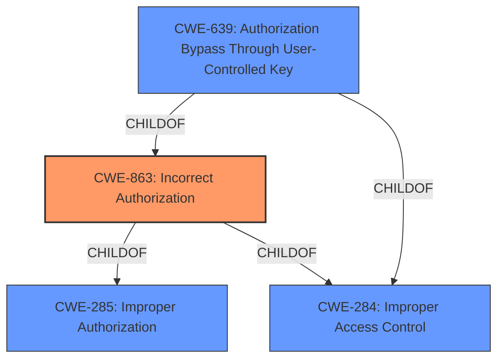

# Analysis Report for CVE-2020-10736

# Vulnerability Analysis Report: CVE-2020-10736

## Description


## Analysis (with Relationship Data)

# Summary
| CWE ID | CWE Name | Confidence | CWE Abstraction Level | CWE Vulnerability Mapping Label | CWE-Vulnerability Mapping Notes |
|---|---|---|---|---|---|
| CWE-863 | Incorrect Authorization | 0.9 | Class | Allowed-with-Review | Primary CWE. The product performs an authorization check, but it does not correctly perform the check. |
| CWE-285 | Improper Authorization | 0.7 | Class | Discouraged | Secondary Candidate. The product does not perform or incorrectly performs an authorization check. |
| CWE-639 | Authorization Bypass Through User-Controlled Key | 0.6 | Base | Allowed | Secondary Candidate. Authorization bypass by modifying the key value identifying the data. |

## Evidence and Confidence

*   **Confidence Score:** 0.9
*   **Evidence Strength:** HIGH

## Relationship Analysis
The primary CWE is CWE-863 Incorrect Authorization, which is a child of both CWE-285 Improper Authorization and CWE-284 Improper Access Control. CWE-639 Authorization Bypass Through User-Controlled Key is also a child of CWE-863 and CWE-284. The relationships indicate a hierarchy from general access control issues (CWE-284) to more specific authorization flaws (CWE-863, CWE-285) and an even more specific case of authorization bypass (CWE-639). Selecting CWE-863 provides a balance between generality and specificity, accurately reflecting the vulnerability.



## Vulnerability Chain
The vulnerability chain starts with the **improper restriction of access**, leading to an **authorization bypass**. This allows an authenticated client to **modify the configuration** and potentially conduct further attacks.
The chain: **Improper Access Control** -> **Incorrect Authorization** -> **Configuration Modification/Further Attacks**.

## Summary of Analysis
The initial assessment pointed towards authorization bypass due to the **root cause** being "**do not properly restrict access**". The detailed CVE description and root cause analysis confirm that the `ceph-mon` and `ceph-mgr` daemons **do not properly restrict access**, leading to an **authorization bypass**. The authenticated client can then modify the configuration and conduct further attacks.

The primary CWE is CWE-863 Incorrect Authorization, because the authorization check is performed but is not correctly performed.

CWE-284 Improper Access Control is too general, as it encompasses broader access control issues beyond just authorization.

CWE-285 Improper Authorization is also a strong candidate because the product does not perform the authorization check correctly. However, given that an authorization check *is* performed, but incorrectly, CWE-863 is a slightly better fit.

CWE-639 Authorization Bypass Through User-Controlled Key is more specific and applies if the bypass occurs through modifying a key value. In this case, the bypass isn't explicitly stated as being through a user-controlled key, thus CWE-863 is a better fit.

The selection of CWE-863 is based on the evidence from the CVE description, particularly the sections describing how `ceph-mon` and `ceph-mgr` daemons fail to properly validate permissions and access control.

The provided evidence and the relationship analysis support the selection of CWE-863 as the primary CWE. The abstraction level is appropriate as it is a Class-level CWE, offering a good balance between generality and specificity.

Relevant CWE Information:

# Enhanced Context (25 CWEs)
The following CWEs were identified as potentially relevant to this vulnerability:

## CWE-113: Improper Neutralization of CRLF Sequences in HTTP Headers ('HTTP Request/Response Splitting')
**Abstraction Level**: Variant
**Similarity Score**: 0.75
**Source**: dense

**Description**:
The product receives data from an HTTP agent/component (e.g., web server, proxy, browser, etc.), but it does not neutralize or incorrectly neutralizes CR and LF characters before the data is included in outgoing HTTP headers.

**Mapping Guidance**:
- Usage: Allowed
- Rationale: This CWE entry is at the Variant level of abstraction, which is a preferred level of abstraction for mapping to the root causes of vulnerabilities.


## CWE-74: Improper Neutralization of Special Elements in Output Used by a Downstream Component ('Injection')
**Abstraction Level**: Class
**Similarity Score**: 0.74
**Source**: dense

**Description**:
The product constructs all or part of a command, data structure, or record using externally-influenced input from an upstream component, but it does not neutralize or incorrectly neutralizes special elements that could modify how it is parsed or interpreted when it is sent to a downstream component.

**Mapping Guidance**:
- Usage: Discouraged
- Rationale: CWE-74 is high-level and often misused when lower-level weaknesses are more appropriate.


## CWE-41: Improper Resolution of Path Equivalence
**Abstraction Level**: Base
**Similarity Score**: 0.74
**Source**: dense

**Description**:
The product is vulnerable to file system contents disclosure through path equivalence. Path equivalence involves the use of special characters in file and directory names. The associated manipulations are intended to generate multiple names for the same object.

**Mapping Guidance**:
- Usage: Allowed
- Rationale: This CWE entry is at the Base level of abstraction, which is a preferred level of abstraction for mapping to the root causes of vulnerabilities.


## CWE-1289: Improper Validation of Unsafe Equivalence in Input
**Abstraction Level**: Base
**Similarity Score**: 0.73
**Source**: dense

**Description**:
The product receives an input value that is used as a resource identifier or other type of reference, but it does not validate or incorrectly validates that the input is equivalent to a potentially-unsafe value.

**Mapping Guidance**:
- Usage: Allowed
- Rationale: This CWE entry is at the Base level of abstraction, which is a preferred level of abstraction for mapping to the root causes of vulnerabilities.


## CWE-212: Improper Removal of Sensitive Information Before Storage or Transfer
**Abstraction Level**: Base
**Similarity Score**: 0.73
**Source**: dense

**Description**:
The product stores, transfers, or shares a resource that contains sensitive information, but it does not properly remove that information before the product makes the resource available to unauthorized actors.

**Mapping Guidance**:
- Usage: Allowed
- Rationale: This CWE entry is at the Base level of abstraction, which is a preferred level of abstraction for mapping to the root causes of vulnerabilities.


## CWE-1390: Weak Authentication
**Abstraction Level**: Class
**Similarity Score**: 0.72
**Source**: dense

**Description**:
The product uses an authentication mechanism to restrict access to specific users or identities, but the mechanism does not sufficiently prove that the claimed identity is correct.

**Mapping Guidance**:
- Usage: Allowed-with-Review
- Rationale: This CWE entry is a Class and might have Base-level children that would be more appropriate


## CWE-93: Improper Neutralization of CRLF Sequences ('CRLF Injection')
**Abstraction Level**: Base
**Similarity Score**: 0.72
**Source**: dense

**Description**:
The product uses CRLF (carriage return line feeds) as a special element, e.g. to separate lines or records, but it does not neutralize or incorrectly neutralizes CRLF sequences from inputs.

**Mapping Guidance**:
- Usage: Allowed
- Rationale: This CWE entry is at the Base level of abstraction, which is a preferred level of abstraction for mapping to the root causes of vulnerabilities.


## CWE-639: Authorization Bypass Through User-Controlled Key
**Abstraction Level**: Base
**Similarity Score**: 0.72
**Source**: dense

**Description**:
The system's authorization functionality does not prevent one user from gaining access to another user's data or record by modifying the key value identifying the data.

**Mapping Guidance**:
- Usage: Allowed
- Rationale: This CWE entry is at the Base level of abstraction, which is a preferred level of abstraction for mapping to the root causes of vulnerabilities.


## CWE-807: Reliance on Untrusted Inputs in a Security Decision
**Abstraction Level**: Base
**Similarity Score**: 0.72
**Source**: dense

**Description**:
The product uses a protection mechanism that relies on the existence or


## CWE Relationship Analysis

Current CWEs represent these abstraction levels: .


### Vulnerability Chain Analysis

**Chain starting from CWE-113:**
- 113 (Improper Neutralization of CRLF Sequences in HTTP Headers ('HTTP Request/Response Splitting')) - ROOT


**Chain starting from CWE-284:**
- 284 (Improper Access Control) - ROOT


### CWE Relationship Diagram

```mermaid
graph TD
    classDef primary fill:#f96,stroke:#333,stroke-width:2px
    classDef secondary fill:#69f,stroke:#333
    classDef tertiary fill:#9e9,stroke:#333
```


*Report generated on 2025-04-01 16:12:58*
