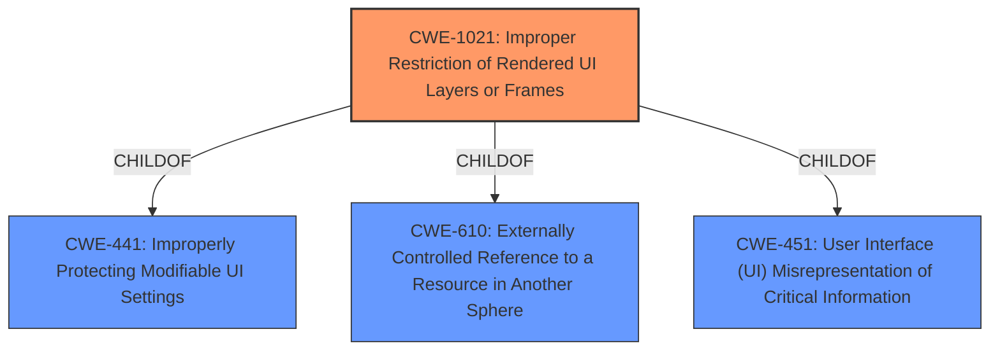

# Analysis Report for CVE-2020-10743

# Vulnerability Analysis Report: CVE-2020-10743

## Description


## Analysis (with Relationship Data)

# Summary
| CWE ID    | CWE Name                                                                    | Confidence | CWE Abstraction Level | CWE Vulnerability Mapping Label | CWE-Vulnerability Mapping Notes |
| :---------- | :-------------------------------------------------------------------------- | :--------- | :---------------------- | :------------------------------ | :------------------------------ |
| CWE-1021 | Improper Restriction of Rendered UI Layers or Frames                   | 1.0       | Base                  | Primary                          | Allowed                       |

## Evidence and Confidence

*   **Confidence Score:** 1.0
*   **Evidence Strength:** HIGH

## Relationship Analysis
The primary CWE is CWE-1021, which is a Base level CWE. The vulnerability description explicitly mentions **clickjacking**, which is an alternate term for CWE-1021. CWE-1021 is a child of CWE-441, CWE-610, and CWE-451.



## Vulnerability Chain
The vulnerability chain starts with the **missing X-Frame-Options header**, which allows the Kibana UI to be embedded in an iframe, leading to **clickjacking**, and ultimately allows an attacker to trick a user into performing arbitrary actions.

## Summary of Analysis
The initial assessment correctly identifies **clickjacking** as the primary weakness, which directly corresponds to CWE-1021. The evidence is strong, with explicit mentions of **clickjacking** in the vulnerability description and the root cause being the **missing X-Frame-Options header**.

The selection of CWE-1021 is at the optimal level of specificity because it is a Base level CWE that directly addresses the **clickjacking** vulnerability. The mapping guidance for CWE-1021 allows its use, and its description perfectly aligns with the vulnerability.

Relevant CWE Information:

# Enhanced Context (25 CWEs)

## CWE-113: Improper Neutralization of CRLF Sequences in HTTP Headers ('HTTP Request/Response Splitting')
**Abstraction Level**: Variant
**Similarity Score**: 0.78
**Source**: dense

**Description**:
The product receives data from an HTTP agent/component (e.g., web server, proxy, browser, etc.), but it does not neutralize or incorrectly neutralizes CR and LF characters before the data is included in outgoing HTTP headers.

**Mapping Guidance**:
- Usage: Allowed
- Rationale: This CWE entry is at the Variant level of abstraction, which is a preferred level of abstraction for mapping to the root causes of vulnerabilities.

## CWE-74: Improper Neutralization of Special Elements in Output Used by a Downstream Component ('Injection')
**Abstraction Level**: Class
**Similarity Score**: 0.73
**Source**: dense

**Description**:
The product constructs all or part of a command, data structure, or record using externally-influenced input from an upstream component, but it does not neutralize or incorrectly neutralizes special elements that could modify how it is parsed or interpreted when it is sent to a downstream component.

**Mapping Guidance**:
- Usage: Discouraged
- Rationale: CWE-74 is high-level and often misused when lower-level weaknesses are more appropriate.

## CWE-93: Improper Neutralization of CRLF Sequences ('CRLF Injection')
**Abstraction Level**: Base
**Similarity Score**: 0.73
**Source**: dense

**Description**:
The product uses CRLF (carriage return line feeds) as a special element, e.g. to separate lines or records, but it does not neutralize or incorrectly neutralizes CRLF sequences from inputs.

**Mapping Guidance**:
- Usage: Allowed
- Rationale: This CWE entry is at the Base level of abstraction, which is a preferred level of abstraction for mapping to the root causes of vulnerabilities.

## CWE-80: Improper Neutralization of Script-Related HTML Tags in a Web Page (Basic XSS)
**Abstraction Level**: Variant
**Similarity Score**: 0.72
**Source**: dense

**Description**:
The product receives input from an upstream component, but it does not neutralize or incorrectly neutralizes special characters such as "<", ">", and "&" that could be interpreted as web-scripting elements when they are sent to a downstream component that processes web pages.

**Mapping Guidance**:
- Usage: Allowed
- Rationale: This CWE entry is at the Variant level of abstraction, which is a preferred level of abstraction for mapping to the root causes of vulnerabilities.

## CWE-1289: Improper Validation of Unsafe Equivalence in Input
**Abstraction Level**: Base
**Similarity Score**: 0.72
**Source**: dense

**Description**:
The product receives an input value that is used as a resource identifier or other type of reference, but it does not validate or incorrectly validates that the input is equivalent to a potentially-unsafe value.

**Mapping Guidance**:
- Usage: Allowed
- Rationale: This CWE entry is at the Base level of abstraction, which is a preferred level of abstraction for mapping to the root causes of vulnerabilities.

## CWE-41: Improper Resolution of Path Equivalence
**Abstraction Level**: Base
**Similarity Score**: 0.71
**Source**: dense

**Description**:
The product is vulnerable to file system contents disclosure through path equivalence. Path equivalence involves the use of special characters in file and directory names. The associated manipulations are intended to generate multiple names for the same object.

**Mapping Guidance**:
- Usage: Allowed
- Rationale: This CWE entry is at the Base level of abstraction, which is a preferred level of abstraction for mapping to the root causes of vulnerabilities.

## CWE-184: Incomplete List of Disallowed Inputs
**Abstraction Level**: Base
**Similarity Score**: 0.71
**Source**: dense

**Description**:
The product implements a protection mechanism that relies on a list of inputs (or properties of inputs) that are not allowed by policy or otherwise require other action to neutralize before additional processing takes place, but the list is incomplete.

**Mapping Guidance**:
- Usage: Allowed
- Rationale: This CWE entry is at the Base level of abstraction, which is a preferred level of abstraction for mapping to the root causes of vulnerabilities.

## CWE-99: Improper Control of Resource Identifiers ('Resource Injection')
**Abstraction Level**: Class
**Similarity Score**: 0.71
**Source**: dense

**Description**:
The product receives input from an upstream component, but it does not restrict or incorrectly restricts the input before it is used as an identifier for a resource that may be outside the intended sphere of control.

**Mapping Guidance**:
- Usage: Allowed-with-Review
- Rationale: This CWE entry is a Class and might have Base-level children that would be more appropriate

## CWE-451: User Interface (UI) Misrepresentation of Critical Information
**Abstraction Level**: Class
**Similarity Score**: 0.71
**Source**: dense

**Description**:
The user interface (UI) does not properly represent critical information to the user, allowing the information - or its source - to be obscured or spoofed. This is often a component in phishing attacks.

**Mapping Guidance**:
- Usage: Allowed-with-Review
- Rationale: This CWE entry is a Class and might have Base-level children that would be more appropriate

## CWE-610: Externally Controlled Reference to a Resource in Another Sphere
**Abstraction Level**: Class
**Similarity Score**: 0.71
**Source**: dense

**Description**:
The product uses an externally controlled name or reference that resolves to a resource that is outside of the intended control sphere.

**Mapping Guidance**:
- Usage: Discouraged
- Rationale: This CWE entry is a level-1 Class (i.e., a child of a Pillar). It might have lower-level children that would be more appropriate

## CWE-451: User Interface (UI) Misrepresentation of Critical Information
**Abstraction Level**: Class
**Similarity Score**: 8373.33
**Source**: sparse

**Description**:
The user interface (UI) does not properly represent critical information to the user, allowing the information - or its source - to be obscured or spoofed. This is often a component in phishing attacks.

**Mapping Guidance**:
- Usage: Allowed-with-Review
- Rationale: This CWE entry is a Class and might have Base-level children that would be more


## CWE Relationship Analysis

Current CWEs represent these abstraction levels: .


### Vulnerability Chain Analysis

**Chain starting from CWE-113:**
- 113 (Improper Neutralization of CRLF Sequences in HTTP Headers ('HTTP Request/Response Splitting')) - ROOT


**Chain starting from CWE-80:**
- 80 (Improper Neutralization of Script-Related HTML Tags in a Web Page (Basic XSS)) - ROOT


### CWE Relationship Diagram

```mermaid
graph TD
    classDef primary fill:#f96,stroke:#333,stroke-width:2px
    classDef secondary fill:#69f,stroke:#333
    classDef tertiary fill:#9e9,stroke:#333
```


*Report generated on 2025-04-02 07:29:03*
