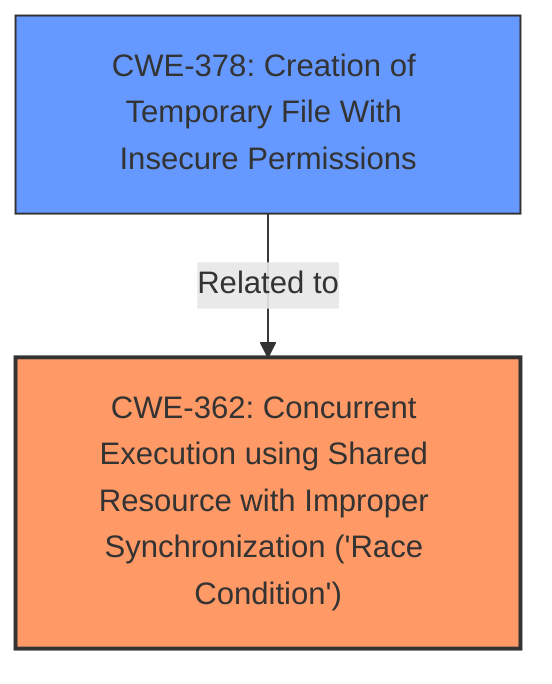

# Analysis for CVE-2020-10744

# Summary
| CWE ID  | CWE Name                                                                                            | Confidence | CWE Abstraction Level | CWE Vulnerability Mapping Label | CWE-Vulnerability Mapping Notes |
| :-------- | :-------------------------------------------------------------------------------------------------- | :----------- | :---------------------- | :-------------------------------- | :-------------------------------- |
| CWE-362   | Concurrent Execution using Shared Resource with Improper Synchronization ('**Race Condition**') | 1          | Class                   | Allowed-with-Review               | Primary CWE                       |
| CWE-378   | Creation of Temporary File With Insecure Permissions                                             | 0.7        | Base                    | Allowed                           | Secondary Candidate               |

## Evidence and Confidence

*   **Confidence Score:** 0.85
*   **Evidence Strength:** HIGH

## Relationship Analysis
The primary CWE is CWE-362 (**Race Condition**), which is a Class-level CWE. CWE-362 has a relationship to CWE-416 (Use After Free) and CWE-476 (NULL Pointer Dereference) through CanPrecede, but these are not relevant in this context. CWE-378 (Creation of Temporary File With Insecure Permissions) is a Base-level CWE and is related to the insecure temporary directory aspect of the vulnerability. The relationship between CWE-362 and CWE-378 isn't explicitly defined, but they are related in the context of this vulnerability.

## Vulnerability Chain
The vulnerability chain starts with an **incomplete fix** for a previous vulnerability (CVE-2020-1733) related to insecure temporary directory creation. This **incomplete fix** led to a **race condition** when using `become_user` from the `become` directive, potentially allowing an attacker to manipulate temporary directories.
  - **Root Cause**: **Incomplete Fix** for CVE-2020-1733, leading to...
  - **Weakness**: CWE-362 - Concurrent Execution using Shared Resource with Improper Synchronization ('**Race Condition**'), and potentially CWE-378 Creation of Temporary File With Insecure Permissions
  - **Impact**: Manipulation of temporary directories, potentially leading to unauthorized actions.

## Summary of Analysis
The primary weakness is a **race condition** (CWE-362) due to an **incomplete fix**. The evidence includes the vulnerability description and the CVE Reference Links Content Summary.

The vulnerability description key phrases explicitly mention "incomplete fix" and "**race condition**". The CVE reference details confirm that "The fix for CVE-2020-1733 was incomplete" and identify a "**Race condition** vulnerability".

The retriever results list CWE-362 as the top candidate with a score of 1.0. The description of CWE-362 matches the vulnerability details - "The product contains a concurrent code sequence that requires temporary, exclusive access to a shared resource, but a timing window exists in which the shared resource can be modified by another code sequence operating concurrently."

CWE-378 is also considered because the vulnerability involves the creation of temporary files. The CVE details mention "Insecure temporary directory creation" as a weakness.

The evidence directly supports the selection of CWE-362 as the primary CWE. The evidence for CWE-378 is less direct, but still relevant given the context of insecure temporary directories.

The selected CWEs are at the optimal level of specificity. CWE-362 is a Class, but it directly addresses the core weakness of a **race condition**. CWE-378 is at the Base level and captures the aspect of insecure temporary file creation.

# Relevant CWE Information:

# Enhanced Context (25 CWEs)

## CWE-274: Improper Handling of Insufficient Privileges
**Abstraction Level**: Base
**Similarity Score**: 0.77
**Source**: dense

**Description**:
The product does not handle or incorrectly handles when it has insufficient privileges to perform an operation, leading to resultant weaknesses.

**Mapping Guidance**:
- Usage: Discouraged
- Rationale: This CWE entry could be deprecated in a future version of CWE.

## CWE-41: Improper Resolution of Path Equivalence
**Abstraction Level**: Base
**Similarity Score**: 0.77
**Source**: dense

**Description**:
The product is vulnerable to file system contents disclosure through path equivalence. Path equivalence involves the use of special characters in file and directory names. The associated manipulations are intended to generate multiple names for the same object.

**Mapping Guidance**:
- Usage: Allowed
- Rationale: This CWE entry is at the Base level of abstraction, which is a preferred level of abstraction for mapping to the root causes of vulnerabilities.

## CWE-668: Exposure of Resource to Wrong Sphere
**Abstraction Level**: Class
**Similarity Score**: 0.77
**Source**: dense

**Description**:
The product exposes a resource to the wrong control sphere, providing unintended actors with inappropriate access to the resource.

**Mapping Guidance**:
- Usage: Discouraged
- Rationale: CWE-668 is high-level and is often misused as a catch-all when lower-level CWE IDs might be applicable. It is sometimes used for low-information vulnerability reports [REF-1287]. It is a level-1 Class (i.e., a child of a Pillar). It is not useful for trend analysis.

## CWE-280: Improper Handling of Insufficient Permissions or Privileges 
**Abstraction Level**: Base
**Similarity Score**: 0.77
**Source**: dense

**Description**:
The product does not handle or incorrectly handles when it has insufficient privileges to access resources or functionality as specified by their permissions. This may cause it to follow unexpected code paths that may leave the product in an invalid state.

**Mapping Guidance**:
- Usage: Allowed
- Rationale: This CWE entry is at the Base level of abstraction, which is a preferred level of abstraction for mapping to the root causes of vulnerabilities.

## CWE-59: Improper Link Resolution Before File Access ('Link Following')
**Abstraction Level**: Base
**Similarity Score**: 0.77
**Source**: dense

**Description**:
The product attempts to access a file based on the filename, but it does not properly prevent that filename from identifying a link or shortcut that resolves to an unintended resource.

**Mapping Guidance**:
- Usage: Allowed
- Rationale: This CWE entry is at the Base level of abstraction, which is a preferred level of abstraction for mapping to the root causes of vulnerabilities.

## CWE-404: Improper Resource Shutdown or Release
**Abstraction Level**: Class
**Similarity Score**: 0.77
**Source**: dense

**Description**:
The product does not release or incorrectly releases a resource before it is made available for re-use.

**Mapping Guidance**:
- Usage: Allowed-with-Review
- Rationale: This CWE entry is a Class and might have Base-level children that would be more appropriate

## CWE-23: Relative Path Traversal
**Abstraction Level**: Base
**Similarity Score**: 0.77
**Source**: dense

**Description**:
The product uses external input to construct a pathname that should be within a restricted directory, but it does not properly neutralize sequences such as ".." that can resolve to a location that is outside of that directory.

**Mapping Guidance**:
- Usage: Allowed
- Rationale: This CWE entry is at the Base level of abstraction, which is a preferred level of abstraction for mapping to the root causes of vulnerabilities.

## CWE-73: External Control of File Name or Path
**Abstraction Level**: Base
**Similarity Score**: 0.76
**Source**: dense

**Description**:
The product allows user input to control or influence paths or file names that are used in filesystem operations.

**Mapping Guidance**:
- Usage: Allowed
- Rationale: This CWE entry is at the Base level of abstraction, which is a preferred level of abstraction for mapping to the root causes of vulnerabilities.

## CWE-667: Improper Locking
**Abstraction Level**: Class
**Similarity Score**: 0.76
**Source**: dense

**Description**:
The product does not properly acquire or release a lock on a resource, leading to unexpected resource state changes and behaviors.

**Mapping Guidance**:
- Usage: Allowed-with-Review
- Rationale: This CWE entry is a Class and might have Base-level children that would be more appropriate

## CWE-267: Privilege Defined With Unsafe Actions
**Abstraction Level**: Base
**Similarity Score**: 0.76
**Source**: dense

**Description**:
A particular privilege, role, capability, or right can be used to perform unsafe actions that were not intended, even when it is assigned to the correct entity.

**Mapping Guidance**:
- Usage: Allowed
- Rationale: This CWE entry is at the Base level of abstraction, which is a preferred