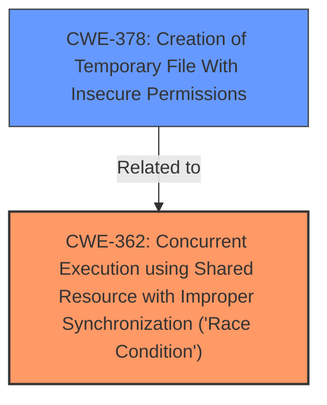

# Analysis for CVE-2020-10744

# Summary
| CWE ID  | CWE Name                                                                                            | Confidence | CWE Abstraction Level | CWE Vulnerability Mapping Label | CWE-Vulnerability Mapping Notes |
| :-------- | :-------------------------------------------------------------------------------------------------- | :----------- | :---------------------- | :-------------------------------- | :-------------------------------- |
| CWE-362   | Concurrent Execution using Shared Resource with Improper Synchronization ('**Race Condition**') | 1          | Class                   | Allowed-with-Review               | Primary CWE                       |
| CWE-378   | Creation of Temporary File With Insecure Permissions                                             | 0.7        | Base                    | Allowed                           | Secondary Candidate               |

## Evidence and Confidence

*   **Confidence Score:** 0.85
*   **Evidence Strength:** HIGH

## Relationship Analysis
The primary CWE is CWE-362 (**Race Condition**), which is a Class-level CWE. CWE-362 has a relationship to CWE-416 (Use After Free) and CWE-476 (NULL Pointer Dereference) through CanPrecede, but these are not relevant in this context. CWE-378 (Creation of Temporary File With Insecure Permissions) is a Base-level CWE and is related to the insecure temporary directory aspect of the vulnerability. The relationship between CWE-362 and CWE-378 isn't explicitly defined, but they are related in the context of this vulnerability.



## Vulnerability Chain
The vulnerability chain starts with an **incomplete fix** for a previous vulnerability (CVE-2020-1733) related to insecure temporary directory creation. This **incomplete fix** led to a **race condition** when using `become_user` from the `become` directive, potentially allowing an attacker to manipulate temporary directories.
  - **Root Cause**: **Incomplete Fix** for CVE-2020-1733, leading to...
  - **Weakness**: CWE-362 - Concurrent Execution using Shared Resource with Improper Synchronization ('**Race Condition**'), and potentially CWE-378 Creation of Temporary File With Insecure Permissions
  - **Impact**: Manipulation of temporary directories, potentially leading to unauthorized actions.

## Summary of Analysis
The primary weakness is a **race condition** (CWE-362) due to an **incomplete fix**. The evidence includes the vulnerability description and the CVE Reference Links Content Summary.

The vulnerability description key phrases explicitly mention "incomplete fix" and "**race condition**". The CVE reference details confirm that "The fix for CVE-2020-1733 was incomplete" and identify a "**Race condition** vulnerability".

The retriever results list CWE-362 as the top candidate with a score of 1.0. The description of CWE-362 matches the vulnerability details - "The product contains a concurrent code sequence that requires temporary, exclusive access to a shared resource, but a timing window exists in which the shared resource can be modified by another code sequence operating concurrently."

CWE-378 is also considered because the vulnerability involves the creation of temporary files. The CVE details mention "Insecure temporary directory creation" as a weakness.

The evidence directly supports the selection of CWE-362 as the primary CWE. The evidence for CWE-378 is less direct, but still relevant given the context of insecure temporary directories.

The selected CWEs are at the optimal level of specificity. CWE-362 is a Class, but it directly addresses the core weakness of a **race condition**. CWE-378 is at the Base level and captures the aspect of insecure temporary file creation.

# Relevant CWE Information:

# Enhanced Context (25 CWEs)

## CWE-274: Improper Handling of Insufficient Privileges
**Abstraction Level**: Base
**Similarity Score**: 0.77
**Source**: dense

**Description**:
The product does not handle or incorrectly handles when it has insufficient privileges to perform an operation, leading to resultant weaknesses.

**Mapping Guidance**:
- Usage: Discouraged
- Rationale: This CWE entry could be deprecated in a future version of CWE.

## CWE-41: Improper Resolution of Path Equivalence
**Abstraction Level**: Base
**Similarity Score**: 0.77
**Source**: dense

**Description**:
The product is vulnerable to file system contents disclosure through path equivalence. Path equivalence involves the use of special characters in file and directory names. The associated manipulations are intended to generate multiple names for the same object.

**Mapping Guidance**:
- Usage: Allowed
- Rationale: This CWE entry is at the Base level of abstraction, which is a preferred level of abstraction for mapping to the root causes of vulnerabilities.

## CWE-668: Exposure of Resource to Wrong Sphere
**Abstraction Level**: Class
**Similarity Score**: 0.77
**Source**: dense

**Description**:
The product exposes a resource to the wrong control sphere, providing unintended actors with inappropriate access to the resource.

**Mapping Guidance**:
- Usage: Discouraged
- Rationale: CWE-668 is high-level and is often misused as a catch-all when lower-level CWE IDs might be applicable. It is sometimes used for low-information vulnerability reports [REF-1287]. It is a level-1 Class (i.e., a child of a Pillar). It is not useful for trend analysis.

## CWE-280: Improper Handling of Insufficient Permissions or Privileges 
**Abstraction Level**: Base
**Similarity Score**: 0.77
**Source**: dense

**Description**:
The product does not handle or incorrectly handles when it has insufficient privileges to access resources or functionality as specified by their permissions. This may cause it to follow unexpected code paths that may leave the product in an invalid state.

**Mapping Guidance**:
- Usage: Allowed
- Rationale: This CWE entry is at the Base level of abstraction, which is a preferred level of abstraction for mapping to the root causes of vulnerabilities.

## CWE-59: Improper Link Resolution Before File Access ('Link Following')
**Abstraction Level**: Base
**Similarity Score**: 0.77
**Source**: dense

**Description**:
The product attempts to access a file based on the filename, but it does not properly prevent that filename from identifying a link or shortcut that resolves to an unintended resource.

**Mapping Guidance**:
- Usage: Allowed
- Rationale: This CWE entry is at the Base level of abstraction, which is a preferred level of abstraction for mapping to the root causes of vulnerabilities.

## CWE-404: Improper Resource Shutdown or Release
**Abstraction Level**: Class
**Similarity Score**: 0.77
**Source**: dense

**Description**:
The product does not release or incorrectly releases a resource before it is made available for re-use.

**Mapping Guidance**:
- Usage: Allowed-with-Review
- Rationale: This CWE entry is a Class and might have Base-level children that would be more appropriate

## CWE-23: Relative Path Traversal
**Abstraction Level**: Base
**Similarity Score**: 0.77
**Source**: dense

**Description**:
The product uses external input to construct a pathname that should be within a restricted directory, but it does not properly neutralize sequences such as ".." that can resolve to a location that is outside of that directory.

**Mapping Guidance**:
- Usage: Allowed
- Rationale: This CWE entry is at the Base level of abstraction, which is a preferred level of abstraction for mapping to the root causes of vulnerabilities.

## CWE-73: External Control of File Name or Path
**Abstraction Level**: Base
**Similarity Score**: 0.76
**Source**: dense

**Description**:
The product allows user input to control or influence paths or file names that are used in filesystem operations.

**Mapping Guidance**:
- Usage: Allowed
- Rationale: This CWE entry is at the Base level of abstraction, which is a preferred level of abstraction for mapping to the root causes of vulnerabilities.

## CWE-667: Improper Locking
**Abstraction Level**: Class
**Similarity Score**: 0.76
**Source**: dense

**Description**:
The product does not properly acquire or release a lock on a resource, leading to unexpected resource state changes and behaviors.

**Mapping Guidance**:
- Usage: Allowed-with-Review
- Rationale: This CWE entry is a Class and might have Base-level children that would be more appropriate

## CWE-267: Privilege Defined With Unsafe Actions
**Abstraction Level**: Base
**Similarity Score**: 0.76
**Source**: dense

**Description**:
A particular privilege, role, capability, or right can be used to perform unsafe actions that were not intended, even when it is assigned to the correct entity.

**Mapping Guidance**:
- Usage: Allowed
- Rationale: This CWE entry is at the Base level of abstraction, which is a preferred

# Enhanced Query for CVE-2020-10744

## Vulnerability Description
An **incomplete fix** was found for the fix of the flaw CVE-2020-1733 ansible insecure temporary directory when running become_user from become directive. The provided fix is insufficient to prevent the **race condition** on systems using ACLs and FUSE filesystems. Ansible Engine 2.7.18, 2.8.12, and 2.9.9 as well as previous versions are affected and Ansible Tower 3.4.5, 3.5.6 and 3.6.4 as well as previous versions are affected.

### Vulnerability Description Key Phrases
- **rootcause:** **incomplete fix**
- **weakness:** **race condition**
- **product:** Ansible Engine and Ansible Tower
- **version:** 2.7.18 and 2.8.12 and 2.9.9 and 3.4.5 and 3.5.6 and 3.6.4
- **component:** insecure temporary directory

## CVE Reference Links Content Summary
```
{
  "vulnerability_details": {
    "Root cause": "The fix for CVE-2020-1733 was incomplete. The 'mkdir -p' command used to create temporary directories was still vulnerable to race conditions on systems using ACLs and FUSE filesystems.",
    "Weaknesses": [
      "Insecure temporary directory creation",
      "Race condition vulnerability"
    ],
    "Impact": "A race condition could still occur when using `become_user` from the `become` directive, potentially allowing an attacker to manipulate temporary directories used by Ansible.",
    "Attack vectors": "Exploitation involves exploiting the race condition during the creation of temporary directories when using `become_user` with ACLs and FUSE filesystems.",
     "Required attacker capabilities": "An attacker would need the ability to influence the timing and conditions of the temporary directory creation process. Specifically, they would need to be able to race against Ansible to manipulate the directory with ACLs and FUSE filesystems."
  },
  "affected_products": [
    "Ansible Engine 2.7.18 and earlier",
    "Ansible Engine 2.8.12 and earlier",
    "Ansible Engine 2.9.9 and earlier",
    "Ansible Tower 3.4.5 and earlier",
    "Ansible Tower 3.5.6 and earlier",
    "Ansible Tower 3.6.4 and earlier"
  ],
  "fixed_versions": [
    "ansible-engine 2.7.19",
    "ansible-engine 2.8.13",
    "ansible-engine 2.9.10"
  ],
    "mitigation": "No mitigation was available at the time of discovery."
}
```

## Retriever Results

### Top Combined Results

| Rank | CWE ID | Name | Abstraction | Usage  | Retrievers | Individual Scores |
|------|--------|------|-------------|-------|------------|-------------------|
| 1 | 362 | Concurrent Execution using Shared Resource with Improper Synchronization ('Race Condition') | Class | Allowed-with-Review | alternate_terms | 1.000 |
| 2 | 214 | Invocation of Process Using Visible Sensitive Information | Base | Allowed | sparse | 0.469 |
| 3 | 212 | Improper Removal of Sensitive Information Before Storage or Transfer | Base | Allowed | sparse | 0.452 |
| 4 | 285 | Improper Authorization | Class | Discouraged | sparse | 0.436 |
| 5 | 287 | Improper Authentication | Class | Discouraged | sparse | 0.425 |
| 6 | 378 | Creation of Temporary File With Insecure Permissions | Base | Allowed | dense | 0.557 |
| 7 | 613 | Insufficient Session Expiration | Base | Allowed | graph | 0.002 |
| 8 | 22 | Improper Limitation of a Pathname to a Restricted Directory ('Path Traversal') | Base | Allowed | sparse | 0.419 |
| 9 | 1333 | Inefficient Regular Expression Complexity | Base | Allowed | sparse | 0.418 |
| 10 | 732 | Incorrect Permission Assignment for Critical Resource | Class | Allowed-with-Review | sparse | 0.416 |


# Complete CWE Specifications


## CWE-362: Concurrent Execution using Shared Resource with Improper Synchronization ('Race Condition')
**Abstraction:** Class
**Status:** Draft

### Description
The product contains a concurrent code sequence that requires temporary, exclusive access to a shared resource, but a timing window exists in which the shared resource can be modified by another code sequence operating concurrently.

### Extended Description


A race condition occurs within concurrent environments, and it is effectively a property of a code sequence. Depending on the context, a code sequence may be in the form of a function call, a small number of instructions, a series of program invocations, etc.


A race condition violates these properties, which are closely related:


  - Exclusivity - the code sequence is given exclusive access to the shared resource, i.e., no other code sequence can modify properties of the shared resource before the original sequence has completed execution.

  - Atomicity - the code sequence is behaviorally atomic, i.e., no other thread or process can concurrently execute the same sequence of instructions (or a subset) against the same resource.

A race condition exists when an "interfering code sequence" can still access the shared resource, violating exclusivity.

The interfering code sequence could be "trusted" or "untrusted." A trusted interfering code sequence occurs within the product; it cannot be modified by the attacker, and it can only be invoked indirectly. An untrusted interfering code sequence can be authored directly by the attacker, and typically it is external to the vulnerable product.


### Alternative Terms
Race Condition

### Relationships
ChildOf -> CWE-691
CanPrecede -> CWE-416
CanPrecede -> CWE-476

### Mapping Guidance
**Usage:** Allowed-with-Review
**Rationale:** This CWE entry is a Class and might have Base-level children that would be more appropriate
**Comments:** Examine children of this entry to see if there is a better fit
**Reasons:**
- Abstraction


### Additional Notes
**[Maintenance]** The relationship between race conditions and synchronization problems (CWE-662) needs to be further developed. They are not necessarily two perspectives of the same core concept, since synchronization is only one technique for avoiding race conditions, and synchronization can be used for other purposes besides race condition prevention.

**[Research Gap]** Race conditions in web applications are under-studied and probably under-reported. However, in 2008 there has been growing interest in this area.

**[Research Gap]** Much of the focus of race condition research has been in Time-of-check Time-of-use (TOCTOU) variants (CWE-367), but many race conditions are related to synchronization problems that do not necessarily require a time-of-check.

**[Research Gap]** From a classification/taxonomy perspective, the relationships between concurrency and program state need closer investigation and may be useful in organizing related issues.


### Observed Examples
- **CVE-2022-29527:** Go application for cloud management creates a world-writable sudoers file that allows local attackers to inject sudo rules and escalate privileges to root by winning a race condition.
- **CVE-2021-1782:** Chain: improper locking (CWE-667) leads to race condition (CWE-362), as exploited in the wild per CISA KEV.
- **CVE-2021-0920:** Chain: mobile platform race condition (CWE-362) leading to use-after-free (CWE-416), as exploited in the wild per CISA KEV.


## CWE-214: Invocation of Process Using Visible Sensitive Information
**Abstraction:** Base
**Status:** Incomplete

### Description
A process is invoked with sensitive command-line arguments, environment variables, or other elements that can be seen by other processes on the operating system.

### Extended Description
Many operating systems allow a user to list information about processes that are owned by other users. Other users could see information such as command line arguments or environment variable settings. When this data contains sensitive information such as credentials, it might allow other users to launch an attack against the product or related resources.

### Alternative Terms
None

### Relationships
ChildOf -> CWE-497

### Mapping Guidance
**Usage:** Allowed
**Rationale:** This CWE entry is at the Base level of abstraction, which is a preferred level of abstraction for mapping to the root causes of vulnerabilities.
**Comments:** Carefully read both the name and description to ensure that this mapping is an appropriate fit. Do not try to 'force' a mapping to a lower-level Base/Variant simply to comply with this preferred level of abstraction.
**Reasons:**
- Acceptable-Use


### Additional Notes
**[Research Gap]** Under-studied, especially environment variables.


### Observed Examples
- **CVE-2005-1387:** password passed on command line
- **CVE-2005-2291:** password passed on command line
- **CVE-2001-1565:** username/password on command line allows local users to view via "ps" or other process listing programs


## CWE-212: Improper Removal of Sensitive Information Before Storage or Transfer
**Abstraction:** Base
**Status:** Incomplete

### Description
The product stores, transfers, or shares a resource that contains sensitive information, but it does not properly remove that information before the product makes the resource available to unauthorized actors.

### Extended Description


Resources that may contain sensitive data include documents, packets, messages, databases, etc. While this data may be useful to an individual user or small set of users who share the resource, it may need to be removed before the resource can be shared outside of the trusted group. The process of removal is sometimes called cleansing or scrubbing.


For example, a product for editing documents might not remove sensitive data such as reviewer comments or the local pathname where the document is stored. Or, a proxy might not remove an internal IP address from headers before making an outgoing request to an Internet site.


### Alternative Terms
None

### Relationships
ChildOf -> CWE-669
ChildOf -> CWE-669
CanPrecede -> CWE-201

### Mapping Guidance
**Usage:** Allowed
**Rationale:** This CWE entry is at the Base level of abstraction, which is a preferred level of abstraction for mapping to the root causes of vulnerabilities.
**Comments:** Carefully read both the name and description to ensure that this mapping is an appropriate fit. Do not try to 'force' a mapping to a lower-level Base/Variant simply to comply with this preferred level of abstraction.
**Reasons:**
- Acceptable-Use


### Additional Notes
**[Relationship]** This entry is intended to be different from resultant information leaks, including those that occur from improper buffer initialization and reuse, improper encryption, interaction errors, and multiple interpretation errors. This entry could be regarded as a privacy leak, depending on the type of information that is leaked.

**[Relationship]** There is a close association between CWE-226 and CWE-212. The difference is partially that of perspective. CWE-226 is geared towards the final stage of the resource lifecycle, in which the resource is deleted, eliminated, expired, or otherwise released for reuse. Technically, this involves a transfer to a different control sphere, in which the original contents of the resource are no longer relevant. CWE-212, however, is intended for sensitive data in resources that are intentionally shared with others, so they are still active. This distinction is useful from the perspective of the CWE research view (CWE-1000).

**[Terminology]** The terms "cleansing" and "scrubbing" have multiple uses within computing. In information security, these are used for the removal of sensitive data, but they are also used for the modification of incoming/outgoing data so that it conforms to specifications.


### Observed Examples
- **CVE-2019-3733:** Cryptography library does not clear heap memory before release
- **CVE-2005-0406:** Some image editors modify a JPEG image, but the original EXIF thumbnail image is left intact within the JPEG. (Also an interaction error).
- **CVE-2002-0704:** NAT feature in firewall leaks internal IP addresses in ICMP error messages.


## CWE-285: Improper Authorization
**Abstraction:** Class
**Status:** Draft

### Description
The product does not perform or incorrectly performs an authorization check when an actor attempts to access a resource or perform an action.

### Extended Description


Assuming a user with a given identity, authorization is the process of determining whether that user can access a given resource, based on the user's privileges and any permissions or other access-control specifications that apply to the resource.


When access control checks are not applied consistently - or not at all - users are able to access data or perform actions that they should not be allowed to perform. This can lead to a wide range of problems, including information exposures, denial of service, and arbitrary code execution.


### Alternative Terms
AuthZ: "AuthZ" is typically used as an abbreviation of "authorization" within the web application security community. It is distinct from "AuthN" (or, sometimes, "AuthC") which is an abbreviation of "authentication." The use of "Auth" as an abbreviation is discouraged, since it could be used for either authentication or authorization.

### Relationships
ChildOf -> CWE-284
ChildOf -> CWE-284

### Mapping Guidance
**Usage:** Discouraged
**Rationale:** CWE-285 is high-level and lower-level CWEs can frequently be used instead. It is a level-1 Class (i.e., a child of a Pillar).
**Comments:** Look at CWE-285's children and consider mapping to CWEs such as CWE-862: Missing Authorization, CWE-863: Incorrect Authorization, CWE-732: Incorrect Permission Assignment for Critical Resource, or others.
**Reasons:**
- Abstraction
**Suggested Alternatives:**
- CWE-862: Missing Authorization
- CWE-863: Incorrect Authorization
- CWE-732: Incorrect Permission Assignment for Critical Resource


### Observed Examples
- **CVE-2022-24730:** Go-based continuous deployment product does not check that a user has certain privileges to update or create an app, allowing adversaries to read sensitive repository information
- **CVE-2009-3168:** Web application does not restrict access to admin scripts, allowing authenticated users to reset administrative passwords.
- **CVE-2009-2960:** Web application does not restrict access to admin scripts, allowing authenticated users to modify passwords of other users.


## CWE-287: Improper Authentication
**Abstraction:** Class
**Status:** Draft

### Description
When an actor claims to have a given identity, the product does not prove or insufficiently proves that the claim is correct.

### Extended Description
Not provided

### Alternative Terms
authentification: An alternate term is "authentification", which appears to be most commonly used by people from non-English-speaking countries.
AuthN: "AuthN" is typically used as an abbreviation of "authentication" within the web application security community. It is also distinct from "AuthZ," which is an abbreviation of "authorization." The use of "Auth" as an abbreviation is discouraged, since it could be used for either authentication or authorization.
AuthC: "AuthC" is used as an abbreviation of "authentication," but it appears to used less frequently than "AuthN."

### Relationships
ChildOf -> CWE-284
ChildOf -> CWE-284

### Mapping Guidance
**Usage:** Discouraged
**Rationale:** This CWE entry might be misused when lower-level CWE entries are likely to be applicable. It is a level-1 Class (i.e., a child of a Pillar).
**Comments:** Consider children or descendants, beginning with CWE-1390: Weak Authentication or CWE-306: Missing Authentication for Critical Function.
**Reasons:**
- Frequent Misuse
**Suggested Alternatives:**
- CWE-1390: Weak Authentication
- CWE-306: Missing Authentication for Critical Function


### Additional Notes
**[Relationship]** This can be resultant from SQL injection vulnerabilities and other issues.

**[Maintenance]** The Taxonomy_Mappings to ISA/IEC 62443 were added in CWE 4.10, but they are still under review and might change in future CWE versions. These draft mappings were performed by members of the "Mapping CWE to 62443" subgroup of the CWE-CAPEC ICS/OT Special Interest Group (SIG), and their work is incomplete as of CWE 4.10. The mappings are included to facilitate discussion and review by the broader ICS/OT community, and they are likely to change in future CWE versions.


### Observed Examples
- **CVE-2022-35248:** Chat application skips validation when Central Authentication Service (CAS) is enabled, effectively removing the second factor from two-factor authentication
- **CVE-2022-36436:** Python-based authentication proxy does not enforce password authentication during the initial handshake, allowing the client to bypass authentication by specifying a 'None' authentication type.
- **CVE-2022-30034:** Chain: Web UI for a Python RPC framework does not use regex anchors to validate user login emails (CWE-777), potentially allowing bypass of OAuth (CWE-1390).


## CWE-378: Creation of Temporary File With Insecure Permissions
**Abstraction:** Base
**Status:** Draft

### Description
Opening temporary files without appropriate measures or controls can leave the file, its contents and any function that it impacts vulnerable to attack.

### Extended Description
Not provided

### Alternative Terms
None

### Relationships
ChildOf -> CWE-377

### Mapping Guidance
**Usage:** Allowed
**Rationale:** This CWE entry is at the Base level of abstraction, which is a preferred level of abstraction for mapping to the root causes of vulnerabilities.
**Comments:** Carefully read both the name and description to ensure that this mapping is an appropriate fit. Do not try to 'force' a mapping to a lower-level Base/Variant simply to comply with this preferred level of abstraction.
**Reasons:**
- Acceptable-Use


### Observed Examples
- **CVE-2022-24823:** A network application framework uses the Java function createTempFile(), which will create a file that is readable by other local users of the system


## CWE-613: Insufficient Session Expiration
**Abstraction:** Base
**Status:** Incomplete

### Description
According to WASC, "Insufficient Session Expiration is when a web site permits an attacker to reuse old session credentials or session IDs for authorization."

### Extended Description
Not provided

### Alternative Terms
None

### Relationships
ChildOf -> CWE-672
ChildOf -> CWE-672
CanPrecede -> CWE-287

### Mapping Guidance
**Usage:** Allowed
**Rationale:** This CWE entry is at the Base level of abstraction, which is a preferred level of abstraction for mapping to the root causes of vulnerabilities.
**Comments:** Carefully read both the name and description to ensure that this mapping is an appropriate fit. Do not try to 'force' a mapping to a lower-level Base/Variant simply to comply with this preferred level of abstraction.
**Reasons:**
- Acceptable-Use


### Additional Notes
**[Other]** The lack of proper session expiration may improve the likely success of certain attacks. For example, an attacker may intercept a session ID, possibly via a network sniffer or Cross-site Scripting attack. Although short session expiration times do not help if a stolen token is immediately used, they will protect against ongoing replaying of the session ID. In another scenario, a user might access a web site from a shared computer (such as at a library, Internet cafe, or open work environment). Insufficient Session Expiration could allow an attacker to use the browser's back button to access web pages previously accessed by the victim.


## CWE-22: Improper Limitation of a Pathname to a Restricted Directory ('Path Traversal')
**Abstraction:** Base
**Status:** Stable

### Description
The product uses external input to construct a pathname that is intended to identify a file or directory that is located underneath a restricted parent directory, but the product does not properly neutralize special elements within the pathname that can cause the pathname to resolve to a location that is outside of the restricted directory.

### Extended Description


Many file operations are intended to take place within a restricted directory. By using special elements such as ".." and "/" separators, attackers can escape outside of the restricted location to access files or directories that are elsewhere on the system. One of the most common special elements is the "../" sequence, which in most modern operating systems is interpreted as the parent directory of the current location. This is referred to as relative path traversal. Path traversal also covers the use of absolute pathnames such as "/usr/local/bin" to access unexpected files. This is referred to as absolute path traversal.


### Alternative Terms
Directory traversal
Path traversal: "Path traversal" is preferred over "directory traversal," but both terms are attack-focused.

### Relationships
ChildOf -> CWE-706
ChildOf -> CWE-706
ChildOf -> CWE-668

### Mapping Guidance
**Usage:** Allowed
**Rationale:** This CWE entry is at the Base level of abstraction, which is a preferred level of abstraction for mapping to the root causes of vulnerabilities.
**Comments:** Carefully read both the name and description to ensure that this mapping is an appropriate fit. Do not try to 'force' a mapping to a lower-level Base/Variant simply to comply with this preferred level of abstraction.
**Reasons:**
- Acceptable-Use


### Additional Notes
**[Other]** In many programming languages, the injection of a null byte (the 0 or NUL) may allow an attacker to truncate a generated filename to apply to a wider range of files. For example, the product may add ".txt" to any pathname, thus limiting the attacker to text files, but a null injection may effectively remove this restriction.

**[Relationship]** Pathname equivalence can be regarded as a type of canonicalization error.

**[Relationship]** Some pathname equivalence issues are not directly related to directory traversal, rather are used to bypass security-relevant checks for whether a file/directory can be accessed by the attacker (e.g. a trailing "/" on a filename could bypass access rules that don't expect a trailing /, causing a server to provide the file when it normally would not).

**[Terminology]** 

Like other weaknesses, terminology is often based on the types of manipulations used, instead of the underlying weaknesses. Some people use "directory traversal" only to refer to the injection of ".." and equivalent sequences whose specific meaning is to traverse directories.


Other variants like "absolute pathname" and "drive letter" have the *effect* of directory traversal, but some people may not call it such, since it doesn't involve ".." or equivalent.


**[Research Gap]** Many variants of path traversal attacks are probably under-studied with respect to root cause. CWE-790 and CWE-182 begin to cover part of this gap.

**[Research Gap]** 

Incomplete diagnosis or reporting of vulnerabilities can make it difficult to know which variant is affected. For example, a researcher might say that "..\" is vulnerable, but not test "../" which may also be vulnerable.


Any combination of directory separators ("/", "\", etc.) and numbers of "." (e.g. "....") can produce unique variants; for example, the "//../" variant is not listed (CVE-2004-0325). See this entry's children and lower-level descendants.


### Observed Examples
- **CVE-2024-37032:** Large language model (LLM) management tool does not validate the format of a digest value (CWE-1287) from a private, untrusted model registry, enabling relative path traversal (CWE-23), a.k.a. Probllama
- **CVE-2024-4315:** Chain: API for text generation using Large Language Models (LLMs) does not include the "\" Windows folder separator in its denylist (CWE-184) when attempting to prevent Local File Inclusion via path traversal (CWE-22), allowing deletion of arbitrary files on Windows systems.
- **CVE-2022-45918:** Chain: a learning management tool debugger uses external input to locate previous session logs (CWE-73) and does not properly validate the given path (CWE-20), allowing for filesystem path traversal using "../" sequences (CWE-24)


## CWE-1333: Inefficient Regular Expression Complexity
**Abstraction:** Base
**Status:** Draft

### Description
The product uses a regular expression with an inefficient, possibly exponential worst-case computational complexity that consumes excessive CPU cycles.

### Extended Description
Some regular expression engines have a feature called "backtracking". If the token cannot match, the engine "backtracks" to a position that may result in a different token that can match.
 Backtracking becomes a weakness if all of these conditions are met:


  - The number of possible backtracking attempts are exponential relative to the length of the input.

  - The input can fail to match the regular expression.

  - The input can be long enough.

 Attackers can create crafted inputs that intentionally cause the regular expression to use excessive backtracking in a way that causes the CPU consumption to spike. 

### Alternative Terms
ReDoS: ReDoS is an abbreviation of "Regular expression Denial of Service".
Regular Expression Denial of Service: While this term is attack-focused, this is commonly used to describe the weakness.
Catastrophic backtracking: This term is used to describe the behavior of the regular expression as a negative technical impact.

### Relationships
ChildOf -> CWE-407
ChildOf -> CWE-407

### Mapping Guidance
**Usage:** Allowed
**Rationale:** This CWE entry is at the Base level of abstraction, which is a preferred level of abstraction for mapping to the root causes of vulnerabilities.
**Comments:** Carefully read both the name and description to ensure that this mapping is an appropriate fit. Do not try to 'force' a mapping to a lower-level Base/Variant simply to comply with this preferred level of abstraction.
**Reasons:**
- Acceptable-Use


### Observed Examples
- **CVE-2020-5243:** server allows ReDOS with crafted User-Agent strings, due to overlapping capture groups that cause excessive backtracking.
- **CVE-2021-21317:** npm package for user-agent parser prone to ReDoS due to overlapping capture groups
- **CVE-2019-16215:** Markdown parser uses inefficient regex when processing a message, allowing users to cause CPU consumption and delay preventing processing of other messages.


## CWE-732: Incorrect Permission Assignment for Critical Resource
**Abstraction:** Class
**Status:** Draft

### Description
The product specifies permissions for a security-critical resource in a way that allows that resource to be read or modified by unintended actors.

### Extended Description
When a resource is given a permission setting that provides access to a wider range of actors than required, it could lead to the exposure of sensitive information, or the modification of that resource by unintended parties. This is especially dangerous when the resource is related to program configuration, execution, or sensitive user data. For example, consider a misconfigured storage account for the cloud that can be read or written by a public or anonymous user.

### Alternative Terms
None

### Relationships
ChildOf -> CWE-285
ChildOf -> CWE-668

### Mapping Guidance
**Usage:** Allowed-with-Review
**Rationale:** While the name itself indicates an assignment of permissions for resources, this is often misused for vulnerabilities in which "permissions" are not checked, which is an "authorization" weakness (CWE-285 or descendants) within CWE's model [REF-1287].
**Comments:** Closely analyze the specific mistake that is allowing the resource to be exposed, and perform a CWE mapping for that mistake.
**Reasons:**
- Frequent Misuse


### Additional Notes
**[Maintenance]** The relationships between privileges, permissions, and actors (e.g. users and groups) need further refinement within the Research view. One complication is that these concepts apply to two different pillars, related to control of resources (CWE-664) and protection mechanism failures (CWE-693).


### Observed Examples
- **CVE-2022-29527:** Go application for cloud management creates a world-writable sudoers file that allows local attackers to inject sudo rules and escalate privileges to root by winning a race condition.
- **CVE-2009-3482:** Anti-virus product sets insecure "Everyone: Full Control" permissions for files under the "Program Files" folder, allowing attackers to replace executables with Trojan horses.
- **CVE-2009-3897:** Product creates directories with 0777 permissions at installation, allowing users to gain privileges and access a socket used for authentication.

