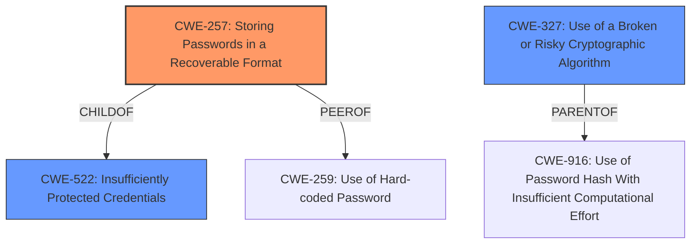

# Analysis for CVE-2020-10919

# Summary
| CWE ID | CWE Name | Confidence | CWE Abstraction Level | CWE Vulnerability Mapping Label | CWE-Vulnerability Mapping Notes |
|---|---|---|---|---|---|
| CWE-257 | Storing Passwords in a Recoverable Format | 1.0 | Base | Allowed | Primary CWE |
| CWE-327 | Use of a Broken or Risky Cryptographic Algorithm | 0.75 | Class | Allowed-with-Review | Secondary Candidate |
| CWE-522 | Insufficiently Protected Credentials | 0.75 | Class | Allowed-with-Review | Secondary Candidate |

## Evidence and Confidence

*   **Confidence Score:** 1.0
*   **Evidence Strength:** HIGH

## Relationship Analysis
The primary CWE identified is CWE-257 (Storing Passwords in a Recoverable Format), which is a Base level CWE. CWE-257 is a child of CWE-522 (Insufficiently Protected Credentials), which is a Class level CWE. CWE-257 is also a peer of CWE-259 (Use of Hard-coded Password). CWE-327 (Use of a Broken or Risky Cryptographic Algorithm) is also a Class, and is related to password hashing with insufficient computational effort (CWE-916). The choice of CWE-257 is influenced by its direct match to the vulnerability description where passwords are encrypted in a recoverable format.

## Vulnerability Chain
The chain of events starts with the **rootcause**: **recoverable encryption of passwords**, which leads to the **impact**: disclose credentials and further compromise.

## Summary of Analysis
The vulnerability description explicitly mentions that passwords are encrypted in a **recoverable format**. This aligns directly with the description of CWE-257 (Storing Passwords in a Recoverable Format): "The storage of passwords in a recoverable format makes them subject to password reuse attacks by malicious users." The "CVE Reference Links Content Summary" also confirms that the device encrypts passwords using a weak or recoverable format.

CWE-327 (Use of a Broken or Risky Cryptographic Algorithm) and CWE-522 (Insufficiently Protected Credentials) were considered as secondary CWEs. CWE-327 is a more general class of vulnerability, where a broken or risky algorithm is used. CWE-522 is also a class, which describes credentials being transmitted or stored using an insecure method. While these are applicable, CWE-257 is more specific to the **rootcause** of passwords being stored in a recoverable format.

The final selection is based on the direct evidence from the vulnerability description and the "CVE Reference Links Content Summary" section. The hierarchical relationships support the decision to choose the base level CWE, and the mapping guidance allows for the use of CWE-257.