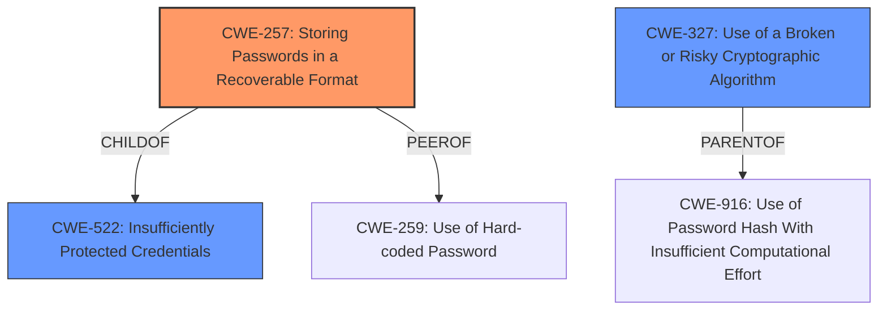

# Analysis for CVE-2020-10919

# Summary
| CWE ID | CWE Name | Confidence | CWE Abstraction Level | CWE Vulnerability Mapping Label | CWE-Vulnerability Mapping Notes |
|---|---|---|---|---|---|
| CWE-257 | Storing Passwords in a Recoverable Format | 1.0 | Base | Allowed | Primary CWE |
| CWE-327 | Use of a Broken or Risky Cryptographic Algorithm | 0.75 | Class | Allowed-with-Review | Secondary Candidate |
| CWE-522 | Insufficiently Protected Credentials | 0.75 | Class | Allowed-with-Review | Secondary Candidate |

## Evidence and Confidence

*   **Confidence Score:** 1.0
*   **Evidence Strength:** HIGH

## Relationship Analysis
The primary CWE identified is CWE-257 (Storing Passwords in a Recoverable Format), which is a Base level CWE. CWE-257 is a child of CWE-522 (Insufficiently Protected Credentials), which is a Class level CWE. CWE-257 is also a peer of CWE-259 (Use of Hard-coded Password). CWE-327 (Use of a Broken or Risky Cryptographic Algorithm) is also a Class, and is related to password hashing with insufficient computational effort (CWE-916). The choice of CWE-257 is influenced by its direct match to the vulnerability description where passwords are encrypted in a recoverable format.



## Vulnerability Chain
The chain of events starts with the **rootcause**: **recoverable encryption of passwords**, which leads to the **impact**: disclose credentials and further compromise.

## Summary of Analysis
The vulnerability description explicitly mentions that passwords are encrypted in a **recoverable format**. This aligns directly with the description of CWE-257 (Storing Passwords in a Recoverable Format): "The storage of passwords in a recoverable format makes them subject to password reuse attacks by malicious users." The "CVE Reference Links Content Summary" also confirms that the device encrypts passwords using a weak or recoverable format.

CWE-327 (Use of a Broken or Risky Cryptographic Algorithm) and CWE-522 (Insufficiently Protected Credentials) were considered as secondary CWEs. CWE-327 is a more general class of vulnerability, where a broken or risky algorithm is used. CWE-522 is also a class, which describes credentials being transmitted or stored using an insecure method. While these are applicable, CWE-257 is more specific to the **rootcause** of passwords being stored in a recoverable format.

The final selection is based on the direct evidence from the vulnerability description and the "CVE Reference Links Content Summary" section. The hierarchical relationships support the decision to choose the base level CWE, and the mapping guidance allows for the use of CWE-257.

# Enhanced Query for CVE-2020-10919

## Vulnerability Description
This vulnerability allows remote attackers to disclose sensitive information on affected installations of C-MORE HMI EA9 Firmware version 6.52 touch screen panels. Authentication is not required to exploit this vulnerability. The specific flaw exists within the handling of passwords. When transmitting passwords, the process encrypts them in a recoverable format. An attacker can leverage this vulnerability to disclose credentials, leading to further compromise. Was ZDI-CAN-10185.

### Vulnerability Description Key Phrases
- **rootcause:** **recoverable encryption of passwords**
- **impact:** disclose credentials and further compromise
- **attacker:** remote attackers
- **product:** C-MORE HMI EA9 Firmware touch screen panels
- **version:** 6.52

## CVE Reference Links Content Summary
Based on the provided content, here's a breakdown of the vulnerability:

*   **Root cause of vulnerability:** The vulnerability lies in the way C-MORE HMI EA9 touch screen panels handle passwords. When transmitting passwords, the device encrypts them using a weak or recoverable format.
*   **Weaknesses/vulnerabilities present:** Weak cryptography is used for password encryption.
*   **Impact of exploitation:** Successful exploitation allows an attacker to disclose credentials. This could potentially lead to further compromise of the system or related systems, though the advisory doesn't specify the impact beyond credential disclosure.
*  **Attack vectors:** The vulnerability can be exploited remotely and does not require authentication.
*   **Required attacker capabilities/position:** The attacker needs to be able to interact with the network where the vulnerable HMI panel is located. No authentication is needed, indicating the attack can be launched without prior access.

The provided information gives a concise description of the vulnerability.

## Retriever Results

### Top Combined Results

| Rank | CWE ID | Name | Abstraction | Usage  | Retrievers | Individual Scores |
|------|--------|------|-------------|-------|------------|-------------------|
| 1 | 321 | Use of Hard-coded Cryptographic Key | Variant | Allowed | sparse | 0.529 |
| 2 | 257 | Storing Passwords in a Recoverable Format | Base | Allowed | sparse | 0.433 |
| 3 | 259 | Use of Hard-coded Password | Variant | Allowed | sparse | 0.417 |
| 4 | 522 | Insufficiently Protected Credentials | Class | Allowed-with-Review | sparse | 0.393 |
| 5 | 306 | Missing Authentication for Critical Function | Base | Allowed | sparse | 0.373 |
| 6 | 311 | Missing Encryption of Sensitive Data | Class | Discouraged | dense | 0.645 |
| 7 | 798 | Use of Hard-coded Credentials | Base | Allowed | graph | 0.002 |
| 8 | 327 | Use of a Broken or Risky Cryptographic Algorithm | Class | Allowed-with-Review | sparse | 0.371 |
| 9 | 256 | Plaintext Storage of a Password | Base | Allowed | sparse | 0.367 |
| 10 | 697 | Incorrect Comparison | Pillar | Discouraged | sparse | 0.366 |


# Complete CWE Specifications


## CWE-321: Use of Hard-coded Cryptographic Key
**Abstraction:** Variant
**Status:** Draft

### Description
The use of a hard-coded cryptographic key significantly increases the possibility that encrypted data may be recovered.

### Extended Description
Not provided

### Alternative Terms
None

### Relationships
ChildOf -> CWE-798
ChildOf -> CWE-798
ChildOf -> CWE-798

### Mapping Guidance
**Usage:** Allowed
**Rationale:** This CWE entry is at the Variant level of abstraction, which is a preferred level of abstraction for mapping to the root causes of vulnerabilities.
**Comments:** Carefully read both the name and description to ensure that this mapping is an appropriate fit. Do not try to 'force' a mapping to a lower-level Base/Variant simply to comply with this preferred level of abstraction.
**Reasons:**
- Acceptable-Use


### Additional Notes
**[Other]** The main difference between the use of hard-coded passwords and the use of hard-coded cryptographic keys is the false sense of security that the former conveys. Many people believe that simply hashing a hard-coded password before storage will protect the information from malicious users. However, many hashes are reversible (or at least vulnerable to brute force attacks) -- and further, many authentication protocols simply request the hash itself, making it no better than a password.

**[Maintenance]** The Taxonomy_Mappings to ISA/IEC 62443 were added in CWE 4.10, but they are still under review and might change in future CWE versions. These draft mappings were performed by members of the "Mapping CWE to 62443" subgroup of the CWE-CAPEC ICS/OT Special Interest Group (SIG), and their work is incomplete as of CWE 4.10. The mappings are included to facilitate discussion and review by the broader ICS/OT community, and they are likely to change in future CWE versions.


### Observed Examples
- **CVE-2022-29960:** Engineering Workstation uses hard-coded cryptographic keys that could allow for unathorized filesystem access and privilege escalation
- **CVE-2022-30271:** Remote Terminal Unit (RTU) uses a hard-coded SSH private key that is likely to be used by default.
- **CVE-2020-10884:** WiFi router service has a hard-coded encryption key, allowing root access


## CWE-257: Storing Passwords in a Recoverable Format
**Abstraction:** Base
**Status:** Incomplete

### Description
The storage of passwords in a recoverable format makes them subject to password reuse attacks by malicious users. In fact, it should be noted that recoverable encrypted passwords provide no significant benefit over plaintext passwords since they are subject not only to reuse by malicious attackers but also by malicious insiders. If a system administrator can recover a password directly, or use a brute force search on the available information, the administrator can use the password on other accounts.

### Extended Description
Not provided

### Alternative Terms
None

### Relationships
ChildOf -> CWE-522
PeerOf -> CWE-259

### Mapping Guidance
**Usage:** Allowed
**Rationale:** This CWE entry is at the Base level of abstraction, which is a preferred level of abstraction for mapping to the root causes of vulnerabilities.
**Comments:** Carefully read both the name and description to ensure that this mapping is an appropriate fit. Do not try to 'force' a mapping to a lower-level Base/Variant simply to comply with this preferred level of abstraction.
**Reasons:**
- Acceptable-Use


### Additional Notes
**[Maintenance]** The meaning of this entry needs to be investigated more closely, especially with respect to what is meant by "recoverable."


### Observed Examples
- **CVE-2022-30018:** A messaging platform serializes all elements of User/Group objects, making private information available to adversaries


## CWE-259: Use of Hard-coded Password
**Abstraction:** Variant
**Status:** Draft

### Description
The product contains a hard-coded password, which it uses for its own inbound authentication or for outbound communication to external components.

### Extended Description


A hard-coded password typically leads to a significant authentication failure that can be difficult for the system administrator to detect. Once detected, it can be difficult to fix, so the administrator may be forced into disabling the product entirely. There are two main variations:

```
		Inbound: the product contains an authentication mechanism that checks for a hard-coded password.
		Outbound: the product connects to another system or component, and it contains hard-coded password for connecting to that component.
```
In the Inbound variant, a default administration account is created, and a simple password is hard-coded into the product and associated with that account. This hard-coded password is the same for each installation of the product, and it usually cannot be changed or disabled by system administrators without manually modifying the program, or otherwise patching the product. If the password is ever discovered or published (a common occurrence on the Internet), then anybody with knowledge of this password can access the product. Finally, since all installations of the product will have the same password, even across different organizations, this enables massive attacks such as worms to take place.

The Outbound variant applies to front-end systems that authenticate with a back-end service. The back-end service may require a fixed password which can be easily discovered. The programmer may simply hard-code those back-end credentials into the front-end product. Any user of that program may be able to extract the password. Client-side systems with hard-coded passwords pose even more of a threat, since the extraction of a password from a binary is usually very simple.


### Alternative Terms
None

### Relationships
ChildOf -> CWE-798
ChildOf -> CWE-798
ChildOf -> CWE-798
PeerOf -> CWE-321
PeerOf -> CWE-257

### Mapping Guidance
**Usage:** Allowed
**Rationale:** This CWE entry is at the Variant level of abstraction, which is a preferred level of abstraction for mapping to the root causes of vulnerabilities.
**Comments:** Carefully read both the name and description to ensure that this mapping is an appropriate fit. Do not try to 'force' a mapping to a lower-level Base/Variant simply to comply with this preferred level of abstraction.
**Reasons:**
- Acceptable-Use


### Additional Notes
**[Maintenance]** This entry could be split into multiple variants: an inbound variant (as seen in the second demonstrative example) and an outbound variant (as seen in the first demonstrative example). These variants are likely to have different consequences, detectability, etc. More importantly, from a vulnerability theory perspective, they could be characterized as different behaviors.


### Observed Examples
- **CVE-2022-29964:** Distributed Control System (DCS) has hard-coded passwords for local shell access
- **CVE-2021-37555:** Telnet service for IoT feeder for dogs and cats has hard-coded password [REF-1288]
- **CVE-2021-35033:** Firmware for a WiFi router uses a hard-coded password for a BusyBox shell, allowing bypass of authentication through the UART port


## CWE-522: Insufficiently Protected Credentials
**Abstraction:** Class
**Status:** Incomplete

### Description
The product transmits or stores authentication credentials, but it uses an insecure method that is susceptible to unauthorized interception and/or retrieval.

### Extended Description
Not provided

### Alternative Terms
None

### Relationships
ChildOf -> CWE-1390
ChildOf -> CWE-287
ChildOf -> CWE-668

### Mapping Guidance
**Usage:** Allowed-with-Review
**Rationale:** This CWE entry is a Class and might have Base-level children that would be more appropriate
**Comments:** Examine children of this entry to see if there is a better fit
**Reasons:**
- Abstraction


### Observed Examples
- **CVE-2022-30018:** A messaging platform serializes all elements of User/Group objects, making private information available to adversaries
- **CVE-2022-29959:** Initialization file contains credentials that can be decoded using a "simple string transformation"
- **CVE-2022-35411:** Python-based RPC framework enables pickle functionality by default, allowing clients to unpickle untrusted data.


## CWE-306: Missing Authentication for Critical Function
**Abstraction:** Base
**Status:** Draft

### Description
The product does not perform any authentication for functionality that requires a provable user identity or consumes a significant amount of resources.

### Extended Description
Not provided

### Alternative Terms
None

### Relationships
ChildOf -> CWE-287
ChildOf -> CWE-287

### Mapping Guidance
**Usage:** Allowed
**Rationale:** This CWE entry is at the Base level of abstraction, which is a preferred level of abstraction for mapping to the root causes of vulnerabilities.
**Comments:** Carefully read both the name and description to ensure that this mapping is an appropriate fit. Do not try to 'force' a mapping to a lower-level Base/Variant simply to comply with this preferred level of abstraction.
**Reasons:**
- Acceptable-Use


### Observed Examples
- **CVE-2022-31260:** Chain: a digital asset management program has an undisclosed backdoor in the legacy version of a PHP script (CWE-912) that could allow an unauthenticated user to export metadata (CWE-306)
- **CVE-2022-29951:** TCP-based protocol in Programmable Logic Controller (PLC) has no authentication.
- **CVE-2022-29952:** Condition Monitor firmware uses a protocol that does not require authentication.


## CWE-311: Missing Encryption of Sensitive Data
**Abstraction:** Class
**Status:** Draft

### Description
The product does not encrypt sensitive or critical information before storage or transmission.

### Extended Description
The lack of proper data encryption passes up the guarantees of confidentiality, integrity, and accountability that properly implemented encryption conveys.

### Alternative Terms
None

### Relationships
ChildOf -> CWE-693

### Mapping Guidance
**Usage:** Discouraged
**Rationale:** CWE-311 is high-level with more precise children available. It is a level-1 Class (i.e., a child of a Pillar).
**Comments:** Consider children CWE-312: Cleartext Storage of Sensitive Information or CWE-319: Cleartext Transmission of Sensitive Information.
**Reasons:**
- Abstraction


### Additional Notes
**[Relationship]** There is an overlapping relationship between insecure storage of sensitive information (CWE-922) and missing encryption of sensitive information (CWE-311). Encryption is often used to prevent an attacker from reading the sensitive data. However, encryption does not prevent the attacker from erasing or overwriting the data.


### Observed Examples
- **CVE-2009-2272:** password and username stored in cleartext in a cookie
- **CVE-2009-1466:** password stored in cleartext in a file with insecure permissions
- **CVE-2009-0152:** chat program disables SSL in some circumstances even when the user says to use SSL.


## CWE-798: Use of Hard-coded Credentials
**Abstraction:** Base
**Status:** Draft

### Description
The product contains hard-coded credentials, such as a password or cryptographic key.

### Extended Description


There are two main variations:


  - Inbound: the product contains an authentication mechanism that checks the input credentials against a hard-coded set of credentials. In this variant, a default administration account is created, and a simple password is hard-coded into the product and associated with that account. This hard-coded password is the same for each installation of the product, and it usually cannot be changed or disabled by system administrators without manually modifying the program, or otherwise patching the product. It can also be difficult for the administrator to detect.

  - Outbound: the product connects to another system or component, and it contains hard-coded credentials for connecting to that component. This variant applies to front-end systems that authenticate with a back-end service. The back-end service may require a fixed password that can be easily discovered. The programmer may simply hard-code those back-end credentials into the front-end product.


### Alternative Terms
None

### Relationships
ChildOf -> CWE-1391
ChildOf -> CWE-287
ChildOf -> CWE-344
ChildOf -> CWE-671
PeerOf -> CWE-257

### Mapping Guidance
**Usage:** Allowed
**Rationale:** This CWE entry is at the Base level of abstraction, which is a preferred level of abstraction for mapping to the root causes of vulnerabilities.
**Comments:** Carefully read both the name and description to ensure that this mapping is an appropriate fit. Do not try to 'force' a mapping to a lower-level Base/Variant simply to comply with this preferred level of abstraction.
**Reasons:**
- Acceptable-Use


### Additional Notes
**[Maintenance]** The Taxonomy_Mappings to ISA/IEC 62443 were added in CWE 4.10, but they are still under review and might change in future CWE versions. These draft mappings were performed by members of the "Mapping CWE to 62443" subgroup of the CWE-CAPEC ICS/OT Special Interest Group (SIG), and their work is incomplete as of CWE 4.10. The mappings are included to facilitate discussion and review by the broader ICS/OT community, and they are likely to change in future CWE versions.


### Observed Examples
- **CVE-2022-29953:** Condition Monitor firmware has a maintenance interface with hard-coded credentials
- **CVE-2022-29960:** Engineering Workstation uses hard-coded cryptographic keys that could allow for unathorized filesystem access and privilege escalation
- **CVE-2022-29964:** Distributed Control System (DCS) has hard-coded passwords for local shell access


## CWE-327: Use of a Broken or Risky Cryptographic Algorithm
**Abstraction:** Class
**Status:** Draft

### Description
The product uses a broken or risky cryptographic algorithm or protocol.

### Extended Description


Cryptographic algorithms are the methods by which data is scrambled to prevent observation or influence by unauthorized actors. Insecure cryptography can be exploited to expose sensitive information, modify data in unexpected ways, spoof identities of other users or devices, or other impacts.


It is very difficult to produce a secure algorithm, and even high-profile algorithms by accomplished cryptographic experts have been broken. Well-known techniques exist to break or weaken various kinds of cryptography. Accordingly, there are a small number of well-understood and heavily studied algorithms that should be used by most products. Using a non-standard or known-insecure algorithm is dangerous because a determined adversary may be able to break the algorithm and compromise whatever data has been protected.


Since the state of cryptography advances so rapidly, it is common for an algorithm to be considered "unsafe" even if it was once thought to be strong. This can happen when new attacks are discovered, or if computing power increases so much that the cryptographic algorithm no longer provides the amount of protection that was originally thought.


For a number of reasons, this weakness is even more challenging to manage with hardware deployment of cryptographic algorithms as opposed to software implementation. First, if a flaw is discovered with hardware-implemented cryptography, the flaw cannot be fixed in most cases without a recall of the product, because hardware is not easily replaceable like software. Second, because the hardware product is expected to work for years, the adversary's computing power will only increase over time.


### Alternative Terms
None

### Relationships
ChildOf -> CWE-693
PeerOf -> CWE-311

### Mapping Guidance
**Usage:** Allowed-with-Review
**Rationale:** This CWE entry is a Class and might have Base-level children that would be more appropriate
**Comments:** Examine children of this entry to see if there is a better fit
**Reasons:**
- Abstraction


### Additional Notes
**[Maintenance]** Since CWE 4.4, various cryptography-related entries, including CWE-327 and CWE-1240, have been slated for extensive research, analysis, and community consultation to define consistent terminology, improve relationships, and reduce overlap or duplication. As of CWE 4.6, this work is still ongoing.

**[Maintenance]** The Taxonomy_Mappings to ISA/IEC 62443 were added in CWE 4.10, but they are still under review and might change in future CWE versions. These draft mappings were performed by members of the "Mapping CWE to 62443" subgroup of the CWE-CAPEC ICS/OT Special Interest Group (SIG), and their work is incomplete as of CWE 4.10. The mappings are included to facilitate discussion and review by the broader ICS/OT community, and they are likely to change in future CWE versions.


### Observed Examples
- **CVE-2022-30273:** SCADA-based protocol supports a legacy encryption mode that uses Tiny Encryption Algorithm (TEA) in ECB mode, which leaks patterns in messages and cannot protect integrity
- **CVE-2022-30320:** Programmable Logic Controller (PLC) uses a protocol with a cryptographically insecure hashing algorithm for passwords.
- **CVE-2008-3775:** Product uses "ROT-25" to obfuscate the password in the registry.


## CWE-256: Plaintext Storage of a Password
**Abstraction:** Base
**Status:** Incomplete

### Description
Storing a password in plaintext may result in a system compromise.

### Extended Description
Password management issues occur when a password is stored in plaintext in an application's properties, configuration file, or memory. Storing a plaintext password in a configuration file allows anyone who can read the file access to the password-protected resource. In some contexts, even storage of a plaintext password in memory is considered a security risk if the password is not cleared immediately after it is used.

### Alternative Terms
None

### Relationships
ChildOf -> CWE-522

### Mapping Guidance
**Usage:** Allowed
**Rationale:** This CWE entry is at the Base level of abstraction, which is a preferred level of abstraction for mapping to the root causes of vulnerabilities.
**Comments:** Carefully read both the name and description to ensure that this mapping is an appropriate fit. Do not try to 'force' a mapping to a lower-level Base/Variant simply to comply with this preferred level of abstraction.
**Reasons:**
- Acceptable-Use


### Observed Examples
- **CVE-2022-30275:** Remote Terminal Unit (RTU) uses a driver that relies on a password stored in plaintext.


## CWE-697: Incorrect Comparison
**Abstraction:** Pillar
**Status:** Incomplete

### Description
The product compares two entities in a security-relevant context, but the comparison is incorrect, which may lead to resultant weaknesses.

### Extended Description


This Pillar covers several possibilities:


  - the comparison checks one factor incorrectly;

  - the comparison should consider multiple factors, but it does not check at least one of those factors at all;

  - the comparison checks the wrong factor.


### Alternative Terms
None

### Relationships
None

### Mapping Guidance
**Usage:** Discouraged
**Rationale:** This CWE entry is extremely high-level, a Pillar. However, sometimes this weakness is forced to be used due to the lack of in-depth weakness research. See Research Gaps.
**Comments:** Where feasible, consider children or descendants of this entry instead.
**Reasons:**
- Abstraction


### Additional Notes
**[Research Gap]** 

Weaknesses related to this Pillar appear to be under-studied, especially with respect to classification schemes. Input from academic and other communities could help identify and resolve gaps or organizational difficulties within CWE.


**[Maintenance]** This entry likely has some relationships with case sensitivity (CWE-178), but case sensitivity is a factor in other types of weaknesses besides comparison. Also, in cryptography, certain attacks are possible when certain comparison operations do not take place in constant time, causing a timing-related information leak (CWE-208).


### Observed Examples
- **CVE-2021-3116:** Chain: Python-based HTTP Proxy server uses the wrong boolean operators (CWE-480) causing an incorrect comparison (CWE-697) that identifies an authN failure if all three conditions are met instead of only one, allowing bypass of the proxy authentication (CWE-1390)
- **CVE-2020-15811:** Chain: Proxy uses a substring search instead of parsing the Transfer-Encoding header (CWE-697), allowing request splitting (CWE-113) and cache poisoning
- **CVE-2016-10003:** Proxy performs incorrect comparison of request headers, leading to infoleak

