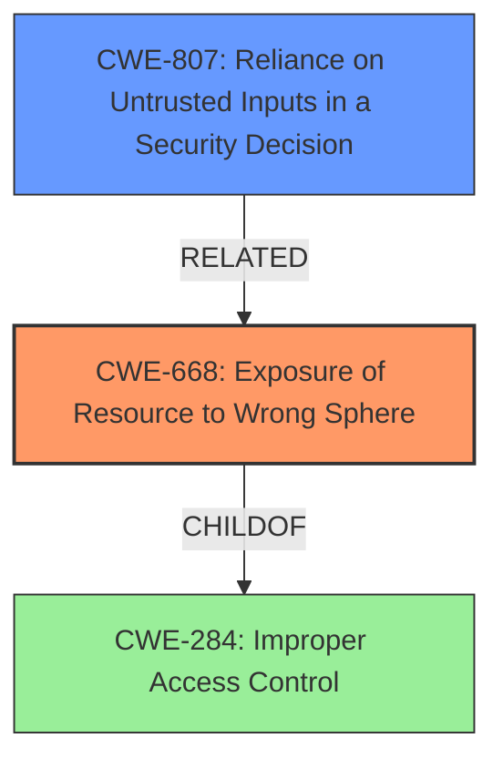

# Analysis for CVE-2020-10930

# Summary
| CWE ID | CWE Name | Confidence | CWE Abstraction Level | CWE Vulnerability Mapping Label | CWE-Vulnerability Mapping Notes |
|---|---|---|---|---|---|
| CWE-668 | Exposure of Resource to Wrong Sphere | 0.8 | Class | Allowed | Primary CWE |
| CWE-807 | Reliance on Untrusted Inputs in a Security Decision | 0.6 | Base | Allowed | Secondary Candidate |
| CWE-284 | Improper Access Control | 0.4 | Pillar | Discouraged | Secondary Candidate |

## Evidence and Confidence

*   **Confidence Score:** 0.8
*   **Evidence Strength:** HIGH

## Relationship Analysis
The primary relationship influencing the selection was the hierarchical relationship, particularly aiming for the lowest appropriate level of abstraction.

## Vulnerability Chain
The chain of weaknesses starts with **lack of proper routing of URLs** which leads to **exposure of sensitive information**. This can be mapped as follows:
1.  **Root Cause:** **Lack of proper routing of URLs**
2.  **Weakness:** Exposure of sensitive information due to the resource being exposed to the wrong sphere.
3.  **Impact:** Credential disclosure and potential further compromise.

## Summary of Analysis
The initial analysis focused on identifying the root cause and the resulting impact. The primary weakness identified was the **lack of proper routing of URLs**, which directly led to the **disclosure of sensitive information**.

The evidence for this assessment is primarily based on the "Vulnerability Description Key Phrases" and "CVE Reference Links Content Summary" sections. Specifically, the "rootcause: **lack of proper routing of URLs**" and the summary stating "The primary weakness is the absence of proper access control mechanisms for certain URLs. This allows network-adjacent attackers to bypass authentication and access sensitive data."

Based on this, CWE-668 was chosen as the primary CWE because the vulnerability results in a resource (stored credentials) being exposed to the wrong control sphere (network-adjacent attackers without authentication).

Other CWEs considered:
* CWE-807: Reliance on Untrusted Inputs in a Security Decision. This was considered because the **lack of proper routing of URLs** could be interpreted as relying on the URL itself for security decisions without proper validation.
* CWE-284: Improper Access Control. This was a broader category that applies, but CWE-668 is more specific.

The selected CWEs are at the optimal level of specificity because they directly address the root cause (**lack of proper routing of URLs** leading to resource exposure) and the immediate impact (disclosure of credentials).

Relevant CWE Information:

# Enhanced Context (25 CWEs)
The following CWEs were identified as potentially relevant to this vulnerability:

## CWE-1289: Improper Validation of Unsafe Equivalence in Input
**Abstraction Level**: Base
**Similarity Score**: 0.76
**Source**: dense

**Description**:
The product receives an input value that is used as a resource identifier or other type of reference, but it does not validate or incorrectly validates that the input is equivalent to a potentially-unsafe value.

**Mapping Guidance**:
- Usage: Allowed
- Rationale: This CWE entry is at the Base level of abstraction, which is a preferred level of abstraction for mapping to the root causes of vulnerabilities.

## CWE-41: Improper Resolution of Path Equivalence
**Abstraction Level**: Base
**Similarity Score**: 0.76
**Source**: dense

**Description**:
The product is vulnerable to file system contents disclosure through path equivalence. Path equivalence involves the use of special characters in file and directory names. The associated manipulations are intended to generate multiple names for the same object.

**Mapping Guidance**:
- Usage: Allowed
- Rationale: This CWE entry is at the Base level of abstraction, which is a preferred level of abstraction for mapping to the root causes of vulnerabilities.

## CWE-74: Improper Neutralization of Special Elements in Output Used by a Downstream Component ('Injection')
**Abstraction Level**: Class
**Similarity Score**: 0.75
**Source**: dense

**Description**:
The product constructs all or part of a command, data structure, or record using externally-influenced input from an upstream component, but it does not neutralize or incorrectly neutralizes special elements that could modify how it is parsed or interpreted when it is sent to a downstream component.

**Mapping Guidance**:
- Usage: Discouraged
- Rationale: CWE-74 is high-level and often misused when lower-level weaknesses are more appropriate.

## CWE-691: Insufficient Control Flow Management
**Abstraction Level**: Pillar
**Similarity Score**: 0.75
**Source**: dense

**Description**:
The code does not sufficiently manage its control flow during execution, creating conditions in which the control flow can be modified in unexpected ways.

**Mapping Guidance**:
- Usage: Discouraged
- Rationale: This CWE entry is extremely high-level, a Pillar. However, classification research is limited for weaknesses of this type, so there can be gaps or organizational difficulties within CWE that force use of this weakness, even at such a high level of abstraction.

## CWE-131: Incorrect Calculation of Buffer Size
**Abstraction Level**: Base
**Similarity Score**: 0.75
**Source**: dense

**Description**:
The product does not correctly calculate the size to be used when allocating a buffer, which could lead to a buffer overflow.

**Mapping Guidance**:
- Usage: Allowed
- Rationale: This CWE entry is at the Base level of abstraction, which is a preferred level of abstraction for mapping to the root causes of vulnerabilities.

## CWE-703: Improper Check or Handling of Exceptional Conditions
**Abstraction Level**: Pillar
**Similarity Score**: 0.75
**Source**: dense

**Description**:
The product does not properly anticipate or handle exceptional conditions that rarely occur during normal operation of the product.

**Mapping Guidance**:
- Usage: Discouraged
- Rationale: This CWE entry is extremely high-level, a Pillar.

## CWE-184: Incomplete List of Disallowed Inputs
**Abstraction Level**: Base
**Similarity Score**: 0.75
**Source**: dense

**Description**:
The product implements a protection mechanism that relies on a list of inputs (or properties of inputs) that are not allowed by policy or otherwise require other action to neutralize before additional processing takes place, but the list is incomplete.

**Mapping Guidance**:
- Usage: Allowed
- Rationale: This CWE entry is at the Base level of abstraction, which is a preferred level of abstraction for mapping to the root causes of vulnerabilities.

## CWE-807: Reliance on Untrusted Inputs in a Security Decision
**Abstraction Level**: Base
**Similarity Score**: 0.75
**Source**: dense

**Description**:
The product uses a protection mechanism that relies on the existence or values of an input, but the input can be modified by an untrusted actor in a way that bypasses the protection mechanism.

**Mapping Guidance**:
- Usage: Allowed
- Rationale: This CWE entry is at the Base level of abstraction, which is a preferred level of abstraction for mapping to the root causes of vulnerabilities.

## CWE-754: Improper Check for Unusual or Exceptional Conditions
**Abstraction Level**: Class
**Similarity Score**: 0.75
**Source**: dense

**Description**:
The product does not check or incorrectly checks for unusual or exceptional conditions that are not expected to occur frequently during day to day operation of the product.

**Mapping Guidance**:
- Usage: Allowed-with-Review
- Rationale: This CWE entry is a Class and might have Base-level children that would be more appropriate

## CWE-668: Exposure of Resource to Wrong Sphere
**Abstraction Level**: Class
**Similarity Score**: 0.74
**Source**: dense

**Description**:
The product exposes a resource to the wrong control sphere, providing unintended actors with inappropriate access to the resource.

**Mapping Guidance**:
- Usage: Discouraged
- Rationale: CWE-668 is high-level and is often misused as a catch-all when lower-level CWE IDs might be applicable. It is sometimes used for low-information vulnerability reports [REF-1287]. It is a level-1 Class (i.e., a child of a Pillar). It is not useful for trend analysis.

## CWE-184: Incomplete List of Disallowed Inputs
**Abstraction Level**: Base
**Similarity Score**: 7385.71
**Source**: sparse

**Description**:
The product implements a protection mechanism that relies on a list