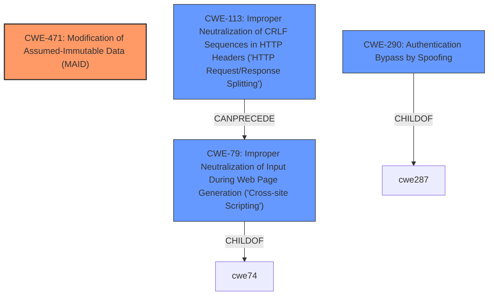

# Analysis for CVE-2020-10966

# Summary
| CWE ID | CWE Name | Confidence | CWE Abstraction Level | CWE Vulnerability Mapping Label | CWE-Vulnerability Mapping Notes |
|---|---|---|---|---|---|
| CWE-471 | Modification of Assumed-Immutable Data (MAID) | 0.8 | Base | Allowed | Primary CWE |
| CWE-113 | Improper Neutralization of CRLF Sequences in HTTP Headers ('HTTP Request/Response Splitting') | 0.5 | Variant | Allowed | Secondary Candidate |
| CWE-79 | Improper Neutralization of Input During Web Page Generation ('Cross-site Scripting') | 0.4 | Base | Allowed | Secondary Candidate |
| CWE-290 | Authentication Bypass by Spoofing | 0.3 | Base | Allowed | Secondary Candidate |

## Evidence and Confidence

*   **Confidence Score:** 0.7
*   **Evidence Strength:** HIGH

## Relationship Analysis
The primary CWE, CWE-471, is a base-level weakness where assumed-immutable data is modified. The secondary CWEs considered included CWE-113 (HTTP Request/Response Splitting), CWE-79 (Cross-site Scripting), and CWE-290 (Authentication Bypass by Spoofing).

## Vulnerability Chain
The vulnerability chain starts with the **Host header manipulation**, leading to the generation of a password reset URL containing an attacker-controlled server name. This allows for account takeover when the victim clicks the manipulated link.
  - **Root Cause:** CWE-471 Modification of Assumed-Immutable Data (MAID): The `Host` header, assumed to be a reliable source of the server name, is modified by an attacker.
  - **Weakness:** The application does not validate the `Host` header, leading to the use of an attacker-controlled server name in the password reset URL.
  - **Impact:** Account takeover due to the victim receiving and clicking a malicious reset URL.

## Summary of Analysis
The initial assessment identified **Host header manipulation** as the root cause, leading to account takeover. The analysis focused on identifying the most specific CWE to represent this vulnerability.

The primary CWE mapping is CWE-471 Modification of Assumed-Immutable Data (MAID). This is based on the fact that the `Host` header, which is assumed to be a reliable source of the server name, is being modified by the attacker.

Secondary CWEs considered were CWE-113, CWE-79, and CWE-290.
*   CWE-113 (Improper Neutralization of CRLF Sequences in HTTP Headers) was considered because **Host header manipulation** could potentially involve injecting CRLF sequences, but the primary issue is the modification of the Host header itself.
*   CWE-79 (Improper Neutralization of Input During Web Page Generation ('Cross-site Scripting')) was considered because the manipulated Host header is used in the generated password reset URL, but the core issue isn't the lack of neutralization for XSS, but the **modification of the assumed-immutable Host header**.
*   CWE-290 (Authentication Bypass by Spoofing) was considered because the **Host header manipulation** leads to a form of authentication bypass, but it is not the primary weakness.

The selection of CWE-471 is at the optimal level of specificity as it directly addresses the root cause: the **modification of the assumed-immutable Host header**. The evidence for this is derived from the vulnerability description, which states, "Host header manipulation leads to account takeover because the victim receives a reset URL containing an attacker-controlled server name." The CVE Reference Links Content Summary further supports this by highlighting that the application does not validate or sanitize the `Host` header.

Relevant CWE Information:

# Enhanced Context (25 CWEs)
The following CWEs were identified as potentially relevant to this vulnerability:

## CWE-303: Incorrect Implementation of Authentication Algorithm
**Abstraction Level**: Base
**Similarity Score**: 0.78

**Description**:
The requirements for the product dictate the use of an established authentication algorithm, but the implementation of the algorithm is incorrect.

**Mapping Guidance**:
- Usage: Allowed
- Rationale: This CWE entry is at the Base level of abstraction, which is a preferred level of abstraction for mapping to the root causes of vulnerabilities.

## CWE-1391: Use of Weak Credentials
**Abstraction Level**: Class
**Similarity Score**: 0.77

**Description**:
The product uses weak credentials (such as a default key or hard-coded password) that can be calculated, derived, reused, or guessed by an attacker.

**Mapping Guidance**:
- Usage: Allowed-with-Review
- Rationale: This CWE entry is a Class and might have Base-level children that would be more appropriate

## CWE-74: Improper Neutralization of Special Elements in Output Used by a Downstream Component ('Injection')
**Abstraction Level**: Class
**Similarity Score**: 0.77

**Description**:
The product constructs all or part of a command, data structure, or record using externally-influenced input from an upstream component, but it does not neutralize or incorrectly neutralizes special elements that could modify how it is parsed or interpreted when it is sent to a downstream component.

**Mapping Guidance**:
- Usage: Discouraged
- Rationale: CWE-74 is high-level and often misused when lower-level weaknesses are more appropriate.

## CWE-807: Reliance on Untrusted Inputs in a Security Decision
**Abstraction Level**: Base
**Similarity Score**: 0.77

**Description**:
The product uses a protection mechanism that relies on the existence or values of an input, but the input can be modified by an untrusted actor in a way that bypasses the protection mechanism.

**Mapping Guidance**:
- Usage: Allowed
- Rationale: This CWE entry is at the Base level of abstraction, which is a preferred level of abstraction for mapping to the root causes of vulnerabilities.

## CWE-1390: Weak Authentication
**Abstraction Level**: Class
**Similarity Score**: 0.77

**Description**:
The product uses an authentication mechanism to restrict access to specific users or identities, but the mechanism does not sufficiently prove that the claimed identity is correct.

**Mapping Guidance**:
- Usage: Allowed-with-Review
- Rationale: This CWE entry is a Class and might have Base-level children that would be more appropriate

## CWE-472: External Control of Assumed-Immutable Web Parameter
**Abstraction Level**: Base
**Similarity Score**: 0.77

**Description**:
The web application does not sufficiently verify inputs that are assumed to be immutable but are actually externally controllable, such as hidden form fields.

**Mapping Guidance**:
- Usage: Allowed
- Rationale: This CWE entry is at the Base level of abstraction, which is a preferred level of abstraction for mapping to the root causes of vulnerabilities.

## CWE-345: Insufficient Verification of Data Authenticity
**Abstraction Level**: Class
**Similarity Score**: 0.76

**Description**:
The product does not sufficiently verify the origin or authenticity of data, in a way that causes it to accept invalid data.

**Mapping Guidance**:
- Usage: Discouraged
- Rationale: This CWE entry is a level-1 Class (i.e., a child of a Pillar). It might have lower-level children that would be more appropriate

## CWE-294: Authentication Bypass by Capture-replay
**Abstraction Level**: Base
**Similarity Score**: 0.76

**Description**:
A capture-replay flaw exists when the design of the product makes it possible for a malicious user to sniff network traffic and bypass authentication by replaying it to the server in question to the same effect as the original message (or with minor changes).

**Mapping Guidance**:
- Usage: Allowed
- Rationale: This CWE entry is at the Base level of abstraction, which is a preferred level of abstraction for mapping to the root causes of vulnerabilities.

## CWE-288: Authentication Bypass Using an Alternate Path or Channel
**Abstraction Level**: Base
**Similarity Score**: 0.76

**Description**:
The product requires authentication, but the product has an alternate path or channel that does not require authentication.

**Mapping Guidance**:
- Usage: Allowed
- Rationale: