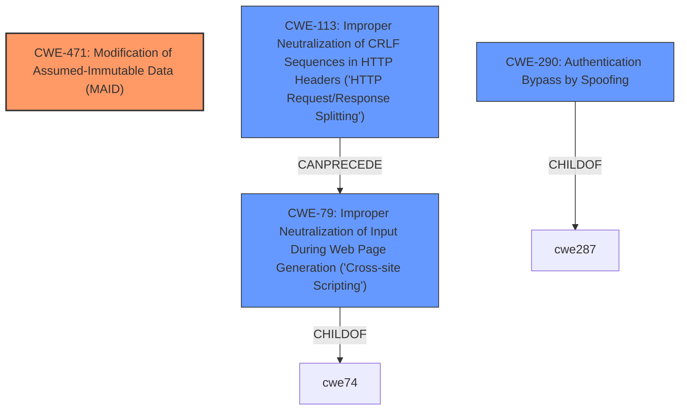

# Analysis for CVE-2020-10966

# Summary
| CWE ID | CWE Name | Confidence | CWE Abstraction Level | CWE Vulnerability Mapping Label | CWE-Vulnerability Mapping Notes |
|---|---|---|---|---|---|
| CWE-471 | Modification of Assumed-Immutable Data (MAID) | 0.8 | Base | Allowed | Primary CWE |
| CWE-113 | Improper Neutralization of CRLF Sequences in HTTP Headers ('HTTP Request/Response Splitting') | 0.5 | Variant | Allowed | Secondary Candidate |
| CWE-79 | Improper Neutralization of Input During Web Page Generation ('Cross-site Scripting') | 0.4 | Base | Allowed | Secondary Candidate |
| CWE-290 | Authentication Bypass by Spoofing | 0.3 | Base | Allowed | Secondary Candidate |

## Evidence and Confidence

*   **Confidence Score:** 0.7
*   **Evidence Strength:** HIGH

## Relationship Analysis
The primary CWE, CWE-471, is a base-level weakness where assumed-immutable data is modified. The secondary CWEs considered included CWE-113 (HTTP Request/Response Splitting), CWE-79 (Cross-site Scripting), and CWE-290 (Authentication Bypass by Spoofing).

## Vulnerability Chain
The vulnerability chain starts with the **Host header manipulation**, leading to the generation of a password reset URL containing an attacker-controlled server name. This allows for account takeover when the victim clicks the manipulated link.
  - **Root Cause:** CWE-471 Modification of Assumed-Immutable Data (MAID): The `Host` header, assumed to be a reliable source of the server name, is modified by an attacker.
  - **Weakness:** The application does not validate the `Host` header, leading to the use of an attacker-controlled server name in the password reset URL.
  - **Impact:** Account takeover due to the victim receiving and clicking a malicious reset URL.

## Summary of Analysis
The initial assessment identified **Host header manipulation** as the root cause, leading to account takeover. The analysis focused on identifying the most specific CWE to represent this vulnerability.

The primary CWE mapping is CWE-471 Modification of Assumed-Immutable Data (MAID). This is based on the fact that the `Host` header, which is assumed to be a reliable source of the server name, is being modified by the attacker.

Secondary CWEs considered were CWE-113, CWE-79, and CWE-290.
*   CWE-113 (Improper Neutralization of CRLF Sequences in HTTP Headers) was considered because **Host header manipulation** could potentially involve injecting CRLF sequences, but the primary issue is the modification of the Host header itself.
*   CWE-79 (Improper Neutralization of Input During Web Page Generation ('Cross-site Scripting')) was considered because the manipulated Host header is used in the generated password reset URL, but the core issue isn't the lack of neutralization for XSS, but the **modification of the assumed-immutable Host header**.
*   CWE-290 (Authentication Bypass by Spoofing) was considered because the **Host header manipulation** leads to a form of authentication bypass, but it is not the primary weakness.

The selection of CWE-471 is at the optimal level of specificity as it directly addresses the root cause: the **modification of the assumed-immutable Host header**. The evidence for this is derived from the vulnerability description, which states, "Host header manipulation leads to account takeover because the victim receives a reset URL containing an attacker-controlled server name." The CVE Reference Links Content Summary further supports this by highlighting that the application does not validate or sanitize the `Host` header.

Relevant CWE Information:

# Enhanced Context (25 CWEs)
The following CWEs were identified as potentially relevant to this vulnerability:

## CWE-303: Incorrect Implementation of Authentication Algorithm
**Abstraction Level**: Base
**Similarity Score**: 0.78

**Description**:
The requirements for the product dictate the use of an established authentication algorithm, but the implementation of the algorithm is incorrect.

**Mapping Guidance**:
- Usage: Allowed
- Rationale: This CWE entry is at the Base level of abstraction, which is a preferred level of abstraction for mapping to the root causes of vulnerabilities.

## CWE-1391: Use of Weak Credentials
**Abstraction Level**: Class
**Similarity Score**: 0.77

**Description**:
The product uses weak credentials (such as a default key or hard-coded password) that can be calculated, derived, reused, or guessed by an attacker.

**Mapping Guidance**:
- Usage: Allowed-with-Review
- Rationale: This CWE entry is a Class and might have Base-level children that would be more appropriate

## CWE-74: Improper Neutralization of Special Elements in Output Used by a Downstream Component ('Injection')
**Abstraction Level**: Class
**Similarity Score**: 0.77

**Description**:
The product constructs all or part of a command, data structure, or record using externally-influenced input from an upstream component, but it does not neutralize or incorrectly neutralizes special elements that could modify how it is parsed or interpreted when it is sent to a downstream component.

**Mapping Guidance**:
- Usage: Discouraged
- Rationale: CWE-74 is high-level and often misused when lower-level weaknesses are more appropriate.

## CWE-807: Reliance on Untrusted Inputs in a Security Decision
**Abstraction Level**: Base
**Similarity Score**: 0.77

**Description**:
The product uses a protection mechanism that relies on the existence or values of an input, but the input can be modified by an untrusted actor in a way that bypasses the protection mechanism.

**Mapping Guidance**:
- Usage: Allowed
- Rationale: This CWE entry is at the Base level of abstraction, which is a preferred level of abstraction for mapping to the root causes of vulnerabilities.

## CWE-1390: Weak Authentication
**Abstraction Level**: Class
**Similarity Score**: 0.77

**Description**:
The product uses an authentication mechanism to restrict access to specific users or identities, but the mechanism does not sufficiently prove that the claimed identity is correct.

**Mapping Guidance**:
- Usage: Allowed-with-Review
- Rationale: This CWE entry is a Class and might have Base-level children that would be more appropriate

## CWE-472: External Control of Assumed-Immutable Web Parameter
**Abstraction Level**: Base
**Similarity Score**: 0.77

**Description**:
The web application does not sufficiently verify inputs that are assumed to be immutable but are actually externally controllable, such as hidden form fields.

**Mapping Guidance**:
- Usage: Allowed
- Rationale: This CWE entry is at the Base level of abstraction, which is a preferred level of abstraction for mapping to the root causes of vulnerabilities.

## CWE-345: Insufficient Verification of Data Authenticity
**Abstraction Level**: Class
**Similarity Score**: 0.76

**Description**:
The product does not sufficiently verify the origin or authenticity of data, in a way that causes it to accept invalid data.

**Mapping Guidance**:
- Usage: Discouraged
- Rationale: This CWE entry is a level-1 Class (i.e., a child of a Pillar). It might have lower-level children that would be more appropriate

## CWE-294: Authentication Bypass by Capture-replay
**Abstraction Level**: Base
**Similarity Score**: 0.76

**Description**:
A capture-replay flaw exists when the design of the product makes it possible for a malicious user to sniff network traffic and bypass authentication by replaying it to the server in question to the same effect as the original message (or with minor changes).

**Mapping Guidance**:
- Usage: Allowed
- Rationale: This CWE entry is at the Base level of abstraction, which is a preferred level of abstraction for mapping to the root causes of vulnerabilities.

## CWE-288: Authentication Bypass Using an Alternate Path or Channel
**Abstraction Level**: Base
**Similarity Score**: 0.76

**Description**:
The product requires authentication, but the product has an alternate path or channel that does not require authentication.

**Mapping Guidance**:
- Usage: Allowed
- Rationale:

# Enhanced Query for CVE-2020-10966

## Vulnerability Description
In the Password Reset Module in VESTA Control Panel through 0.9.8-25 and Hestia Control Panel before 1.1.1, **Host header manipulation** leads to account takeover because the victim receives a reset URL containing an attacker-controlled server name.

### Vulnerability Description Key Phrases
- **rootcause:** **Host header manipulation**
- **impact:** account takeover
- **vector:** receiving reset URL with attacker-controlled server name
- **product:** VESTA Control Panel and Hestia Control Panel
- **version:** through 0.9.8-25 and before 1.1.1
- **component:** Password Reset Module

## CVE Reference Links Content Summary
Based on the provided content, here's a breakdown of the vulnerability described in CVE-2020-10966:

**Root Cause of Vulnerability:**

*   The vulnerability stems from the use of the `$_SERVER['HTTP_HOST']` value without proper validation in the password reset module of VESTA Control Panel and Hestia Control Panel. This value is directly incorporated into the password reset URL sent to the user via email.

**Weaknesses/Vulnerabilities Present:**

*   **Host Header Injection:** The application does not validate or sanitize the `Host` header from the HTTP request. This allows an attacker to inject a malicious hostname into the `HTTP_HOST` variable.
*   **Unvalidated Input:** The injected hostname is then used to construct the password reset link, without verification, resulting in the generation of a malicious reset URL.
*   **Lack of Context-Aware Encoding:** The application lacks proper encoding or escaping when using the HTTP Host value within the password reset email, allowing for arbitrary URL injection.

**Impact of Exploitation:**

*   **Account Takeover:** By manipulating the `Host` header, an attacker can inject a malicious domain name into the password reset email. If a user clicks on the crafted link, they will be redirected to the attacker's server instead of the legitimate password reset page. This allows the attacker to steal the reset token/code and subsequently reset the user's password and take over their account.
*   **Phishing:** Although the email is sent from the legitimate server, the malicious link can be crafted to mimic a legitimate login page, potentially tricking users into revealing their credentials.

**Attack Vectors:**

*   **Network-based:** An attacker can remotely send an HTTP request to the vulnerable password reset endpoint.
*   **HTTP Header Manipulation:** The attacker manipulates the `Host` header of the HTTP request to inject a malicious domain.

**Required Attacker Capabilities/Position:**

*   **Network Access:** The attacker needs network access to send an HTTP request to the vulnerable application.
*   **No Authentication Required:** The attacker does not need any prior authentication or access to exploit the vulnerability.
*   **User Interaction:** The attacker requires the victim user to click on the manipulated password reset link in the email.

**Additional Details from the Content:**

*   The vulnerability affects VESTA Control Panel through version 0.9.8-25 and Hestia Control Panel before version 1.1.1.
*   The fix implemented involved replacing the usage of `$_SERVER['HTTP_HOST']` with a validated hostname.
*   The provided issue report includes a detailed description of how the vulnerability can be exploited using a crafted `Host` header.
*   The fix was initially implemented without considering the port in the URL and was later corrected.

## Retriever Results

### Top Combined Results

| Rank | CWE ID | Name | Abstraction | Usage  | Retrievers | Individual Scores |
|------|--------|------|-------------|-------|------------|-------------------|
| 1 | 471 | Modification of Assumed-Immutable Data (MAID) | Base | Allowed | sparse | 0.429 |
| 2 | 74 | Improper Neutralization of Special Elements in Output Used by a Downstream Component ('Injection') | Class | Discouraged | sparse | 0.273 |
| 3 | 79 | Improper Neutralization of Input During Web Page Generation ('Cross-site Scripting') | Base | Allowed | sparse | 0.239 |
| 4 | 287 | Improper Authentication | Class | Discouraged | sparse | 0.220 |
| 5 | 89 | Improper Neutralization of Special Elements used in an SQL Command ('SQL Injection') | Base | Allowed | sparse | 0.213 |
| 6 | 620 | Unverified Password Change | Base | Allowed | dense | 0.492 |
| 7 | 321 | Use of Hard-coded Cryptographic Key | Variant | Allowed | graph | 0.003 |
| 8 | 113 | Improper Neutralization of CRLF Sequences in HTTP Headers ('HTTP Request/Response Splitting') | Variant | Allowed | sparse | 0.211 |
| 9 | 290 | Authentication Bypass by Spoofing | Base | Allowed | sparse | 0.209 |
| 10 | 306 | Missing Authentication for Critical Function | Base | Allowed | sparse | 0.207 |

# Complete CWE Specifications

## CWE-471: Modification of Assumed-Immutable Data (MAID)
**Abstraction:** Base
**Status:** Draft

### Description
The product does not properly protect an assumed-immutable element from being modified by an attacker.

### Extended Description
This occurs when a particular input is critical enough to the functioning of the application that it should not be modifiable at all, but it is. Certain resources are often assumed to be immutable when they are not, such as hidden form fields in web applications, cookies, and reverse DNS lookups.

### Alternative Terms
None

### Relationships
ChildOf -> CWE-664

### Mapping Guidance
**Usage:** Allowed
**Rationale:** This CWE entry is at the Base level of abstraction, which is a preferred level of abstraction for mapping to the root causes of vulnerabilities.
**Comments:** Carefully read both the name and description to ensure that this mapping is an appropriate fit. Do not try to 'force' a mapping to a lower-level Base/Variant simply to comply with this preferred level of abstraction.
**Reasons:**
- Acceptable-Use

### Additional Notes
**[Relationship]** MAID issues can be primary to many other weaknesses, and they are a major factor in languages that provide easy access to internal program constructs, such as PHP's register_globals and similar features. However, MAID issues can also be resultant from weaknesses that modify internal state; for example, a program might validate some data and store it in memory, but a buffer overflow could overwrite that validated data, leading to a change in program logic.

**[Theoretical]** There are many examples where the MUTABILITY property is a major factor in a vulnerability.

### Observed Examples
- **CVE-2002-1757:** Relies on $PHP_SELF variable for authentication.
- **CVE-2005-1905:** Gain privileges by modifying assumed-immutable code addresses that are accessed by a driver.

## CWE-74: Improper Neutralization of Special Elements in Output Used by a Downstream Component ('Injection')
**Abstraction:** Class
**Status:** Incomplete

### Description
The product constructs all or part of a command, data structure, or record using externally-influenced input from an upstream component, but it does not neutralize or incorrectly neutralizes special elements that could modify how it is parsed or interpreted when it is sent to a downstream component.

### Extended Description
Software or other automated logic has certain assumptions about what constitutes data and control respectively. It is the lack of verification of these assumptions for user-controlled input that leads to injection problems. Injection problems encompass a wide variety of issues -- all mitigated in very different ways and usually attempted in order to alter the control flow of the process. For this reason, the most effective way to discuss these weaknesses is to note the distinct features that classify them as injection weaknesses. The most important issue to note is that all injection problems share one thing in common -- i.e., they allow for the injection of control plane data into the user-controlled data plane. This means that the execution of the process may be altered by sending code in through legitimate data channels, using no other mechanism. While buffer overflows, and many other flaws, involve the use of some further issue to gain execution, injection problems need only for the data to be parsed.

### Alternative Terms
None

### Relationships
ChildOf -> CWE-707

### Mapping Guidance
**Usage:** Discouraged
**Rationale:** CWE-74 is high-level and often misused when lower-level weaknesses are more appropriate.
**Comments:** Examine the children and descendants of this entry to find a more precise mapping.
**Reasons:**
- Frequent Misuse
- Abstraction

### Additional Notes
**[Theoretical]** Many people treat injection only as an input validation problem (CWE-20) because many people do not distinguish between the consequence/attack (injection) and the protection mechanism that prevents the attack from succeeding. However, input validation is only one potential protection mechanism (output encoding is another), and there is a chaining relationship between improper input validation and the improper enforcement of the structure of messages to other components. Other issues not directly related to input validation, such as race conditions, could similarly impact message structure.

### Observed Examples
- **CVE-2024-5184:** API service using a large generative AI model allows direct prompt injection to leak hard-coded system prompts or execute other prompts.
- **CVE-2022-36069:** Python-based dependency management tool avoids OS command injection when generating Git commands but allows injection of optional arguments with input beginning with a dash (CWE-88), potentially allowing for code execution.
- **CVE-1999-0067:** Canonical example of OS command injection. CGI program does not neutralize "|" metacharacter when invoking a phonebook program.

## CWE-79: Improper Neutralization of Input During Web Page Generation ('Cross-site Scripting')
**Abstraction:** Base
**Status:** Stable

### Description
The product does not neutralize or incorrectly neutralizes user-controllable input before it is placed in output that is used as a web page that is served to other users.

### Extended Description

Cross-site scripting (XSS) vulnerabilities occur when:

  1. Untrusted data enters a web application, typically from a web request.

  1. The web application dynamically generates a web page that contains this untrusted data.

  1. During page generation, the application does not prevent the data from containing content that is executable by a web browser, such as JavaScript, HTML tags, HTML attributes, mouse events, Flash, ActiveX, etc.

  1. A victim visits the generated web page through a web browser, which contains malicious script that was injected using the untrusted data.

  1. Since the script comes from a web page that was sent by the web server, the victim's web browser executes the malicious script in the context of the web server's domain.

  1. This effectively violates the intention of the web browser's same-origin policy, which states that scripts in one domain should not be able to access resources or run code in a different domain.

There are three main kinds of XSS:

  -  **Type 1: Reflected XSS (or Non-Persistent)**  - The server reads data directly from the HTTP request and reflects it back in the HTTP response. Reflected XSS exploits occur when an attacker causes a victim to supply dangerous content to a vulnerable web application, which is then reflected back to the victim and executed by the web browser. The most common mechanism for delivering malicious content is to include it as a parameter in a URL that is posted publicly or e-mailed directly to the victim. URLs constructed in this manner constitute the core of many phishing schemes, whereby an attacker convinces a victim to visit a URL that refers to a vulnerable site. After the site reflects the attacker's content back to the victim, the content is executed by the victim's browser.

  -  **Type 2: Stored XSS (or Persistent)**  - The application stores dangerous data in a database, message forum, visitor log, or other trusted data store. At a later time, the dangerous data is subsequently read back into the application and included in dynamic content. From an attacker's perspective, the optimal place to inject malicious content is in an area that is displayed to either many users or particularly interesting users. Interesting users typically have elevated privileges in the application or interact with sensitive data that is valuable to the attacker. If one of these users executes malicious content, the attacker may be able to perform privileged operations on behalf of the user or gain access to sensitive data belonging to the user. For example, the attacker might inject XSS into a log message, which might not be handled properly when an administrator views the logs. 

  -  **Type 0: DOM-Based XSS**  - In DOM-based XSS, the client performs the injection of XSS into the page; in the other types, the server performs the injection. DOM-based XSS generally involves server-controlled, trusted script that is sent to the client, such as Javascript that performs sanity checks on a form before the user submits it. If the server-supplied script processes user-supplied data and then injects it back into the web page (such as with dynamic HTML), then DOM-based XSS is possible. 

Once the malicious script is injected, the attacker can perform a variety of malicious activities. The attacker could transfer private information, such as cookies that may include session information, from the victim's machine to the attacker. The attacker could send malicious requests to a web site on behalf of the victim, which could be especially dangerous to the site if the victim has administrator privileges to manage that site. Phishing attacks could be used to emulate trusted web sites and trick the victim into entering a password, allowing the attacker to compromise the victim's account on that web site. Finally, the script could exploit a vulnerability in the web browser itself possibly taking over the victim's machine, sometimes referred to as "drive-by hacking."

In many cases, the attack can be launched without the victim even being aware of it. Even with careful users, attackers frequently use a variety of methods to encode the malicious portion of the attack, such as URL encoding or Unicode, so the request looks less suspicious.

### Alternative Terms
XSS: A common abbreviation for Cross-Site Scripting.
HTML Injection: Used as a synonym of stored (Type 2) XSS.
CSS: In the early years after initial discovery of XSS, "CSS" was a commonly-used acronym. However, this would cause confusion with "Cascading Style Sheets," so usage of this acronym has declined significantly.

### Relationships
ChildOf -> CWE-74
ChildOf -> CWE-74
CanPrecede -> CWE-494
PeerOf -> CWE-352

### Mapping Guidance
**Usage:** Allowed
**Rationale:** This CWE entry is at the Base level of abstraction, which is a preferred level of abstraction for mapping to the root causes of vulnerabilities.
**Comments:** Carefully read both the name and description to ensure that this mapping is an appropriate fit. Do not try to 'force' a mapping to a lower-level Base/Variant simply to comply with this preferred level of abstraction.
**Reasons:**
- Acceptable-Use

### Additional Notes
**[Relationship]** 

There can be a close relationship between XSS and CSRF (CWE-352). An attacker might use CSRF in order to trick the victim into submitting requests to the server in which the requests contain an XSS payload. A well-known example of this was the Samy worm on MySpace [REF-956]. The worm used XSS to insert malicious HTML sequences into a user's profile and add the attacker as a MySpace friend. MySpace friends of that victim would then execute the payload to modify their own profiles, causing the worm to propagate exponentially. Since the victims did not intentionally insert the malicious script themselves, CSRF was a root cause.

**[Applicable Platform]** 

XSS flaws are very common in web applications, since they require a great deal of developer discipline to avoid them.

### Observed Examples
- **CVE-2021-25926:** Python Library Manager did not sufficiently neutralize a user-supplied search term, allowing reflected XSS.
- **CVE-2021-25963:** Python-based e-commerce platform did not escape returned content on error pages, allowing for reflected Cross-Site Scripting attacks.
- **CVE-2021-1879:** Universal XSS in mobile operating system, as exploited in the wild per CISA KEV.

## CWE-287: Improper Authentication
**Abstraction:** Class
**Status:** Draft

### Description
When an actor claims to have a given identity, the product does not prove or insufficiently proves that the claim is correct.

### Extended Description
Not provided

### Alternative Terms
authentification: An alternate term is "authentification", which appears to be most commonly used by people from non-English-speaking countries.
AuthN: "AuthN" is typically used as an abbreviation of "authentication" within the web application security community. It is also distinct from "AuthZ," which is an abbreviation of "authorization." The use of "Auth" as an abbreviation is discouraged, since it could be used for either authentication or authorization.
AuthC: "AuthC" is used as an abbreviation of "authentication," but it appears to used less frequently than "AuthN."

### Relationships
ChildOf -> CWE-284
ChildOf -> CWE-284

### Mapping Guidance
**Usage:** Discouraged
**Rationale:** This CWE entry might be misused when lower-level CWE entries are likely to be applicable. It is a level-1 Class (i.e., a child of a Pillar).
**Comments:** Consider children or descendants, beginning with CWE-1390: Weak Authentication or CWE-306: Missing Authentication for Critical Function.
**Reasons:**
- Frequent Misuse
**Suggested Alternatives:**
- CWE-1390: Weak Authentication
- CWE-306: Missing Authentication for Critical Function

### Additional Notes
**[Relationship]** This can be resultant from SQL injection vulnerabilities and other issues.

**[Maintenance]** The Taxonomy_Mappings to ISA/IEC 62443 were added in CWE 4.10, but they are still under review and might change in future CWE versions. These draft mappings were performed by members of the "Mapping CWE to 62443" subgroup of the CWE-CAPEC ICS/OT Special Interest Group (SIG), and their work is incomplete as of CWE 4.10. The mappings are included to facilitate discussion and review by the broader ICS/OT community, and they are likely to change in future CWE versions.

### Observed Examples
- **CVE-2022-35248:** Chat application skips validation when Central Authentication Service (CAS) is enabled, effectively removing the second factor from two-factor authentication
- **CVE-2022-36436:** Python-based authentication proxy does not enforce password authentication during the initial handshake, allowing the client to bypass authentication by specifying a 'None' authentication type.
- **CVE-2022-30034:** Chain: Web UI for a Python RPC framework does not use regex anchors to validate user login emails (CWE-777), potentially allowing bypass of OAuth (CWE-1390).

## CWE-89: Improper Neutralization of Special Elements used in an SQL Command ('SQL Injection')
**Abstraction:** Base
**Status:** Stable

### Description
The product constructs all or part of an SQL command using externally-influenced input from an upstream component, but it does not neutralize or incorrectly neutralizes special elements that could modify the intended SQL command when it is sent to a downstream component. Without sufficient removal or quoting of SQL syntax in user-controllable inputs, the generated SQL query can cause those inputs to be interpreted as SQL instead of ordinary user data.

### Extended Description
Not provided

### Alternative Terms
SQL injection: a common attack-oriented phrase
SQLi: a common abbreviation for "SQL injection"

### Relationships
ChildOf -> CWE-943
ChildOf -> CWE-74

### Mapping Guidance
**Usage:** Allowed
**Rationale:** This CWE entry is at the Base level of abstraction, which is a preferred level of abstraction for mapping to the root causes of vulnerabilities.
**Comments:** Carefully read both the name and description to ensure that this mapping is an appropriate fit. Do not try to 'force' a mapping to a lower-level Base/Variant simply to comply with this preferred level of abstraction.
**Reasons:**
- Acceptable-Use

### Additional Notes
**[Relationship]** SQL injection can be resultant from special character mismanagement, MAID, or denylist/allowlist problems. It can be primary to authentication errors.

### Observed Examples
- **CVE-2023-32530:** SQL injection in security product dashboard using crafted certificate fields
- **CVE-2021-42258:** SQL injection in time and billing software, as exploited in the wild per CISA KEV.
- **CVE-2021-27101:** SQL injection in file-transfer system via a crafted Host header, as exploited in the wild per CISA KEV.

## CWE-620: Unverified Password Change
**Abstraction:** Base
**Status:** Draft

### Description
When setting a new password for a user, the product does not require knowledge of the original password, or using another form of authentication.

### Extended Description
This could be used by an attacker to change passwords for another user, thus gaining the privileges associated with that user.

### Alternative Terms
None

### Relationships
ChildOf -> CWE-1390

### Mapping Guidance
**Usage:** Allowed
**Rationale:** This CWE entry is at the Base level of abstraction, which is a preferred level of abstraction for mapping to the root causes of vulnerabilities.
**Comments:** Carefully read both the name and description to ensure that this mapping is an appropriate fit. Do not try to 'force' a mapping to a lower-level Base/Variant simply to comply with this preferred level of abstraction.
**Reasons:**
- Acceptable-Use

### Observed Examples
- **CVE-2007-0681:** Web app allows remote attackers to change the passwords of arbitrary users without providing the original password, and possibly perform other unauthorized actions.
- **CVE-2000-0944:** Web application password change utility doesn't check the original password.

## CWE-321: Use of Hard-coded Cryptographic Key
**Abstraction:** Variant
**Status:** Draft

### Description
The use of a hard-coded cryptographic key significantly increases the possibility that encrypted data may be recovered.

### Extended Description
Not provided

### Alternative Terms
None

### Relationships
ChildOf -> CWE-798
ChildOf -> CWE-798
ChildOf -> CWE-798

### Mapping Guidance
**Usage:** Allowed
**Rationale:** This CWE entry is at the Variant level of abstraction, which is a preferred level of abstraction for mapping to the root causes of vulnerabilities.
**Comments:** Carefully read both the name and description to ensure that this mapping is an appropriate fit. Do not try to 'force' a mapping to a lower-level Base/Variant simply to comply with this preferred level of abstraction.
**Reasons:**
- Acceptable-Use

### Additional Notes
**[Other]** The main difference between the use of hard-coded passwords and the use of hard-coded cryptographic keys is the false sense of security that the former conveys. Many people believe that simply hashing a hard-coded password before storage will protect the information from malicious users. However, many hashes are reversible (or at least vulnerable to brute force attacks) -- and further, many authentication protocols simply request the hash itself, making it no better than a password.

**[Maintenance]** The Taxonomy_Mappings to ISA/IEC 62443 were added in CWE 4.10, but they are still under review and might change in future CWE versions. These draft mappings were performed by members of the "Mapping CWE to 62443" subgroup of the CWE-CAPEC ICS/OT Special Interest Group (SIG), and their work is incomplete as of CWE 4.10. The mappings are included to facilitate discussion and review by the broader ICS/OT community, and they are likely to change in future CWE versions.

### Observed Examples
- **CVE-2022-29960:** Engineering Workstation uses hard-coded cryptographic keys that could allow for unathorized filesystem access and privilege escalation
- **CVE-2022-30271:** Remote Terminal Unit (RTU) uses a hard-coded SSH private key that is likely to be used by default.
- **CVE-2020-10884:** WiFi router service has a hard-coded encryption key, allowing root access

## CWE-113: Improper Neutralization of CRLF Sequences in HTTP Headers ('HTTP Request/Response Splitting')
**Abstraction:** Variant
**Status:** Incomplete

### Description
The product receives data from an HTTP agent/component (e.g., web server, proxy, browser, etc.), but it does not neutralize or incorrectly neutralizes CR and LF characters before the data is included in outgoing HTTP headers.

### Extended Description

 HTTP agents or components may include a web server, load balancer, reverse proxy, web caching proxy, application firewall, web browser, etc. Regardless of the role, they are expected to maintain coherent, consistent HTTP communication state across all components. However, including unexpected data in an HTTP header allows an attacker to specify the entirety of the HTTP message that is rendered by the client HTTP agent (e.g., web browser) or back-end HTTP agent (e.g., web server), whether the message is part of a request or a response. 

When an HTTP request contains unexpected CR and LF characters, the server may respond with an output stream that is interpreted as "splitting" the stream into two different HTTP messages instead of one. CR is carriage return, also given by %0d or \r, and LF is line feed, also given by %0a or \n.

In addition to CR and LF characters, other valid/RFC compliant special characters and unique character encodings can be utilized, such as HT (horizontal tab, also given by %09 or \t) and SP (space, also given as + sign or %20).

These types of unvalidated and unexpected data in HTTP message headers allow an attacker to control the second "split" message to mount attacks such as server-side request forgery, cross-site scripting, and cache poisoning attacks.

HTTP response splitting weaknesses may be present when:

  1. Data enters a web application through an untrusted source, most frequently an HTTP request.

  1. The data is included in an HTTP response header sent to a web user without neutralizing malicious characters that can be interpreted as separator characters for headers.

### Alternative Terms
HTTP Request Splitting
HTTP Response Splitting

### Relationships
ChildOf -> CWE-93
CanPrecede -> CWE-79
ChildOf -> CWE-20
ChildOf -> CWE-436

### Mapping Guidance
**Usage:** Allowed
**Rationale:** This CWE entry is at the Variant level of abstraction, which is a preferred level of abstraction for mapping to the root causes of vulnerabilities.
**Comments:** Carefully read both the name and description to ensure that this mapping is an appropriate fit. Do not try to 'force' a mapping to a lower-level Base/Variant simply to comply with this preferred level of abstraction.
**Reasons:**
- Acceptable-Use

### Observed Examples
- **CVE-2020-15811:** Chain: Proxy uses a substring search instead of parsing the Transfer-Encoding header (CWE-697), allowing request splitting (CWE-113) and cache poisoning
- **CVE-2021-41084:** Scala-based HTTP interface allows request splitting and response splitting through header names, header values, status reasons, and URIs
- **CVE-2018-12116:** Javascript-based framework allows request splitting through a path option of an HTTP request

## CWE-290: Authentication Bypass by Spoofing
**Abstraction:** Base
**Status:** Incomplete

### Description
This attack-focused weakness is caused by incorrectly implemented authentication schemes that are subject to spoofing attacks.

### Extended Description
Not provided

### Alternative Terms
None

### Relationships
ChildOf -> CWE-1390
ChildOf -> CWE-287

### Mapping Guidance
**Usage:** Allowed
**Rationale:** This CWE entry is at the Base level of abstraction, which is a preferred level of abstraction for mapping to the root causes of vulnerabilities.
**Comments:** Carefully read both the name and description to ensure that this mapping is an appropriate fit. Do not try to 'force' a mapping to a lower-level Base/Variant simply to comply with this preferred level of abstraction.
**Reasons:**
- Acceptable-Use

### Additional Notes
**[Relationship]** This can be resultant from insufficient verification.

### Observed Examples
- **CVE-2022-30319:** S-bus functionality in a home automation product performs access control using an IP allowlist, which can be bypassed by a forged IP address.
- **CVE-2009-1048:** VOIP product allows authentication bypass using 127.0.0.1 in the Host header.

## CWE-306: Missing Authentication for Critical Function
**Abstraction:** Base
**Status:** Draft

### Description
The product does not perform any authentication for functionality that requires a provable user identity or consumes a significant amount of resources.

### Extended Description
Not provided

### Alternative Terms
None

### Relationships
ChildOf -> CWE-287
ChildOf -> CWE-287

### Mapping Guidance
**Usage:** Allowed
**Rationale:** This CWE entry is at the Base level of abstraction, which is a preferred level of abstraction for mapping to the root causes of vulnerabilities.
**Comments:** Carefully read both the name and description to ensure that this mapping is an appropriate fit. Do not try to 'force' a mapping to a lower-level Base/Variant simply to comply with this preferred level of abstraction.
**Reasons:**
- Acceptable-Use

### Observed Examples
- **CVE-2022-31260:** Chain: a digital asset management program has an undisclosed backdoor in the legacy version of a PHP script (CWE-912) that could allow an unauthenticated user to export metadata (CWE-306)
- **CVE-2022-29951:** TCP-based protocol in Programmable Logic Controller (PLC) has no authentication.
- **CVE-2022-29952:** Condition Monitor firmware uses a protocol that does not require authentication.

