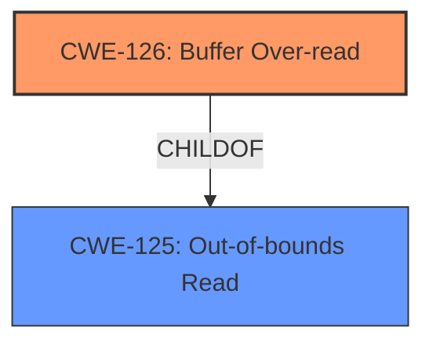

# Raw Analyzer Response for CVE-2020-11159

# Summary
| CWE ID | CWE Name | Confidence | CWE Abstraction Level | CWE Vulnerability Mapping Label | CWE-Vulnerability Mapping Notes |
|---|---|---|---|---|---|
| CWE-126 | Buffer Over-read | 1.0 | Variant | Allowed | Primary CWE |

## Evidence and Confidence

*   **Confidence Score:** 1.0
*   **Evidence Strength:** HIGH

## Relationship Analysis
The primary relationship considered was the hierarchical one between CWE-125 (Out-of-bounds Read) and its variant CWE-126 (Buffer Over-read). Since the vulnerability specifically mentions a "buffer over-read", selecting the variant CWE-126 is the most accurate and specific choice. The other relationships such as CanPrecede and CanFollow were not applicable in this case as they describe vulnerability chains that aren't explicitly mentioned in the description.

## Vulnerability Chain
The vulnerability chain starts with the **weakness** which is an **out-of-bounds read**, leading to a buffer over-read. This is a direct cause-and-effect relationship described in the vulnerability description. There isn't sufficient information to map further potential consequences or prerequisite causes.

## Summary of Analysis
The initial analysis focused on identifying the most specific CWE that matches the **weakness** described in the vulnerability. The description clearly states a "buffer over-read", which directly corresponds to CWE-126. The retriever results also ranked CWE-126 as the top candidate with a score of 0.729. The relationships, especially the child-of relationship between CWE-125 and CWE-126, reinforced the selection of the more specific CWE-126. The final decision is strongly based on the explicit mention of "buffer over-read" in the "Vulnerability Description Key Phrases".
> **Vulnerability Description Key Phrases**
> - **weakness:** **out-of-bounds read**
> - **impact:** buffer over-read

The selection of CWE-126 is at the optimal level of specificity because it accurately describes the **impact** of the vulnerability. Other CWEs like CWE-125 are more general, while others like CWE-787 (Out-of-bounds Write) describe a different type of vulnerability.

Relevant CWE Information:

# Enhanced Context (25 CWEs)

## CWE-126: Buffer Over-read
**Abstraction:** Variant
**Status:** Draft

### Description
The product reads from a buffer using buffer access mechanisms such as indexes or pointers that reference memory locations after the targeted buffer.

### Extended Description
This typically occurs when the pointer or its index is incremented to a position beyond the bounds of the buffer or when pointer arithmetic results in a position outside of the valid memory location to name a few. This may result in exposure of sensitive information or possibly a crash.

### Alternative Terms
None

### Relationships
ChildOf -> CWE-125
ChildOf -> CWE-788

### Mapping Guidance
**Usage:** Allowed
**Rationale:** This CWE entry is at the Variant level of abstraction, which is a preferred level of abstraction for mapping to the root causes of vulnerabilities.
**Comments:** Carefully read both the name and description to ensure that this mapping is an appropriate fit. Do not try to 'force' a mapping to a lower-level Base/Variant simply to comply with this preferred level of abstraction.
**Reasons:**
- Acceptable-Use

### Additional Notes
**[Relationship]** These problems may be resultant from missing sentinel values (CWE-463) or trusting a user-influenced input length variable.

### Observed Examples
- **CVE-2022-1733:** Text editor has out-of-bounds read past end of line while indenting C code
- **CVE-2014-0160:** Chain: "Heartbleed" bug receives an inconsistent length parameter (CWE-130) enabling an out-of-bounds read (CWE-126), returning memory that could include private cryptographic keys and other sensitive data.
- **CVE-2009-2523:** Chain: product does not handle when an input string is not NULL terminated, leading to buffer over-read or heap-based buffer overflow.