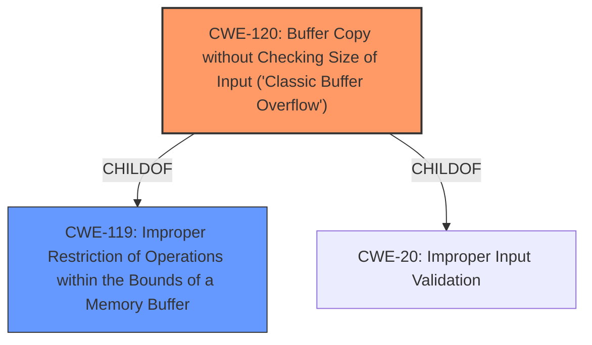

# Raw Analyzer Response for CVE-2020-11165

# Summary
| CWE ID    | CWE Name                                                                   | Confidence | CWE Abstraction Level | CWE Vulnerability Mapping Label | CWE-Vulnerability Mapping Notes |
| :-------- | :------------------------------------------------------------------------- | :--------- | :---------------------- | :------------------------------ | :------------------------------ |
| CWE-120   | Buffer Copy without Checking Size of Input ('Classic **Buffer Overflow**') | 0.9        | Base                    | Primary                         | Allowed-with-Review             |
| CWE-119   | Improper Restriction of Operations within the Bounds of a Memory Buffer   | 0.7        | Class                   | Secondary                       | Discouraged                     |

## Evidence and Confidence

*   **Confidence Score:** 0.9
*   **Evidence Strength:** HIGH

## Relationship Analysis
The primary CWE is CWE-120, which is a base level CWE and a child of the class-level CWE-119. CWE-120 describes a specific type of **buffer overflow** where data is copied to a buffer without checking the size of the input. The vulnerability description clearly indicates a **buffer overflow** due to missing length validation during a buffer copy operation. CWE-119 is a more general case of improper restriction of operations within memory bounds.

## Vulnerability Chain
The vulnerability chain begins with the **lack of** input size validation, leading to a **buffer overflow** during the copy operation, and culminating in memory corruption.

## Summary of Analysis
The vulnerability description explicitly mentions a **buffer overflow** occurring because the length of the buffer isn't validated before copying the message from HLOS. This aligns strongly with CWE-120, which describes a **buffer overflow** resulting from copying data into a buffer without checking the input size. CWE-119 is a broader category that encompasses any out-of-bounds read or write operation, and while it's related, CWE-120 provides a more precise characterization of the vulnerability.

The evidence lies in the **Vulnerability Description**: "Memory corruption due to **buffer overflow** while copying the message provided by HLOS into buffer **without validating the length of buffer**...".

I am overriding the general mapping guidance of "Discouraged" for CWE-119, because it is still related, and the retriever listed it as the top combined result. It is still a valid entry to show context.

Relevant CWE Information:

# Enhanced Context (25 CWEs)
The following CWEs were identified as potentially relevant to this vulnerability:

## CWE-131: Incorrect Calculation of Buffer Size
**Abstraction Level**: Base
**Similarity Score**: 0.81
**Source**: dense

**Description**:
The product does not correctly calculate the size to be used when allocating a buffer, which could lead to a buffer overflow.

**Mapping Guidance**:
- Usage: Allowed
- Rationale: This CWE entry is at the Base level of abstraction, which is a preferred level of abstraction for mapping to the root causes of vulnerabilities.

## CWE-805: Buffer Access with Incorrect Length Value
**Abstraction Level**: Base
**Similarity Score**: 0.80
**Source**: dense

**Description**:
The product uses a sequential operation to read or write a buffer, but it uses an incorrect length value that causes it to access memory that is outside of the bounds of the buffer.

**Mapping Guidance**:
- Usage: Allowed
- Rationale: This CWE entry is at the Base level of abstraction, which is a preferred level of abstraction for mapping to the root causes of vulnerabilities.

## CWE-124: Buffer Underwrite ('Buffer Underflow')
**Abstraction Level**: Base
**Similarity Score**: 0.80
**Source**: dense

**Description**:
The product writes to a buffer using an index or pointer that references a memory location prior to the beginning of the buffer.

**Mapping Guidance**:
- Usage: Allowed
- Rationale: This CWE entry is at the Base level of abstraction, which is a preferred level of abstraction for mapping to the root causes of vulnerabilities.

## CWE-191: Integer Underflow (Wrap or Wraparound)
**Abstraction Level**: Base
**Similarity Score**: 0.79
**Source**: dense

**Description**:
The product subtracts one value from another, such that the result is less than the minimum allowable integer value, which produces a value that is not equal to the correct result.

**Mapping Guidance**:
- Usage: Allowed
- Rationale: This CWE entry is at the Base level of abstraction, which is a preferred level of abstraction for mapping to the root causes of vulnerabilities.

## CWE-126: Buffer Over-read
**Abstraction Level**: Variant
**Similarity Score**: 0.77
**Source**: dense

**Description**:
The product reads from a buffer using buffer access mechanisms such as indexes or pointers that reference memory locations after the targeted buffer.

**Mapping Guidance**:
- Usage: Allowed
- Rationale: This CWE entry is at the Variant level of abstraction, which is a preferred level of abstraction for mapping to the root causes of vulnerabilities.

## CWE-681: Incorrect Conversion between Numeric Types
**Abstraction Level**: Base
**Similarity Score**: 0.77
**Source**: dense

**Description**:
When converting from one data type to another, such as long to integer, data can be omitted or translated in a way that produces unexpected values. If the resulting values are used in a sensitive context, then dangerous behaviors may occur.

**Mapping Guidance**:
- Usage: Allowed
- Rationale: This CWE entry is at the Base level of abstraction, which is a preferred level of abstraction for mapping to the root causes of vulnerabilities.

## CWE-680: Integer Overflow to Buffer Overflow
**Abstraction Level**: Compound
**Similarity Score**: 0.76
**Source**: dense

**Description**:
The product performs a calculation to determine how much memory to allocate, but an integer overflow can occur that causes less memory to be allocated than expected, leading to a buffer overflow.

**Mapping Guidance**:
- Usage: Discouraged
- Rationale: This CWE entry is a named chain, which combines multiple weaknesses.

## CWE-119: Improper Restriction of Operations within the Bounds of a Memory Buffer
**Abstraction Level**: Class
**Similarity Score**: 0.76
**Source**: dense

**Description**:
The product performs operations on a memory buffer, but it reads from or writes to a memory location outside the buffer's intended boundary. This may result in read or write operations on unexpected memory locations that could be linked to other variables, data structures, or internal program data.

**Mapping Guidance**:
- Usage: Discouraged
- Rationale: CWE-119 is commonly misused in low-information vulnerability reports when lower-level CWEs could be used instead, or when more details about the vulnerability are available.

## CWE-682: Incorrect Calculation
**Abstraction Level**: Pillar
**Similarity Score**: 0.75
**Source**: dense

**Description**:
The product performs a calculation that generates incorrect or unintended results that are later used in security-critical decisions or resource management.

**Mapping Guidance**:
- Usage: Discouraged
- Rationale: This CWE entry is extremely high-level, a Pillar. In many cases, lower-level children or descendants are more appropriate. However, sometimes this weakness is forced to be used due to the lack of in-depth weakness research. See Research Gaps.

## CWE-190: Integer Overflow or Wraparound
**Abstraction Level**: Base
**Similarity Score**: 0.75
**Source**: dense

**Description**:
The product performs a calculation that can
         produce an integer overflow or wraparound when the logic
         assumes that the resulting value will always be larger than
         the original value. This occurs when an integer value is
         incremented to a value that is too large to store in the
         associated representation. When this occurs, the value may
         become a very small or negative number.

**Mapping Guidance**:
- Usage: Allowed
- Rationale: This CWE entry is at the Base level of abstraction, which is a preferred level of abstraction for mapping to the root causes of vulnerabilities.

## CWE-190: Integer Overflow or Wraparound
**Abstraction Level**: Base
**Similarity Score**: 6796.47
**Source**: sparse

**Description**:
The product performs a calculation that can
         produce an integer overflow or wraparound when the logic
         assumes that the resulting value will always be larger than
         the original value. This occurs when an integer value is
         incremented to a value that is too large to store in the
         associated