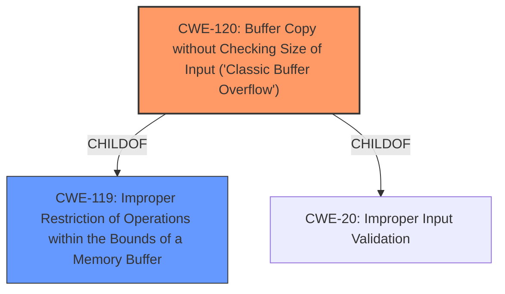

# Analysis for CVE-2020-11165

# Summary
| CWE ID    | CWE Name                                                                   | Confidence | CWE Abstraction Level | CWE Vulnerability Mapping Label | CWE-Vulnerability Mapping Notes |
| :-------- | :------------------------------------------------------------------------- | :--------- | :---------------------- | :------------------------------ | :------------------------------ |
| CWE-120   | Buffer Copy without Checking Size of Input ('Classic **Buffer Overflow**') | 0.9        | Base                    | Primary                         | Allowed-with-Review             |
| CWE-119   | Improper Restriction of Operations within the Bounds of a Memory Buffer   | 0.7        | Class                   | Secondary                       | Discouraged                     |

## Evidence and Confidence

*   **Confidence Score:** 0.9
*   **Evidence Strength:** HIGH

## Relationship Analysis
The primary CWE is CWE-120, which is a base level CWE and a child of the class-level CWE-119. CWE-120 describes a specific type of **buffer overflow** where data is copied to a buffer without checking the size of the input. The vulnerability description clearly indicates a **buffer overflow** due to missing length validation during a buffer copy operation. CWE-119 is a more general case of improper restriction of operations within memory bounds.

## Vulnerability Chain
The vulnerability chain begins with the **lack of** input size validation, leading to a **buffer overflow** during the copy operation, and culminating in memory corruption.

## Summary of Analysis
The vulnerability description explicitly mentions a **buffer overflow** occurring because the length of the buffer isn't validated before copying the message from HLOS. This aligns strongly with CWE-120, which describes a **buffer overflow** resulting from copying data into a buffer without checking the input size. CWE-119 is a broader category that encompasses any out-of-bounds read or write operation, and while it's related, CWE-120 provides a more precise characterization of the vulnerability.

The evidence lies in the **Vulnerability Description**: "Memory corruption due to **buffer overflow** while copying the message provided by HLOS into buffer **without validating the length of buffer**...".

I am overriding the general mapping guidance of "Discouraged" for CWE-119, because it is still related, and the retriever listed it as the top combined result. It is still a valid entry to show context.

Relevant CWE Information:

# Enhanced Context (25 CWEs)
The following CWEs were identified as potentially relevant to this vulnerability:

## CWE-131: Incorrect Calculation of Buffer Size
**Abstraction Level**: Base
**Similarity Score**: 0.81
**Source**: dense

**Description**:
The product does not correctly calculate the size to be used when allocating a buffer, which could lead to a buffer overflow.

**Mapping Guidance**:
- Usage: Allowed
- Rationale: This CWE entry is at the Base level of abstraction, which is a preferred level of abstraction for mapping to the root causes of vulnerabilities.

## CWE-805: Buffer Access with Incorrect Length Value
**Abstraction Level**: Base
**Similarity Score**: 0.80
**Source**: dense

**Description**:
The product uses a sequential operation to read or write a buffer, but it uses an incorrect length value that causes it to access memory that is outside of the bounds of the buffer.

**Mapping Guidance**:
- Usage: Allowed
- Rationale: This CWE entry is at the Base level of abstraction, which is a preferred level of abstraction for mapping to the root causes of vulnerabilities.

## CWE-124: Buffer Underwrite ('Buffer Underflow')
**Abstraction Level**: Base
**Similarity Score**: 0.80
**Source**: dense

**Description**:
The product writes to a buffer using an index or pointer that references a memory location prior to the beginning of the buffer.

**Mapping Guidance**:
- Usage: Allowed
- Rationale: This CWE entry is at the Base level of abstraction, which is a preferred level of abstraction for mapping to the root causes of vulnerabilities.

## CWE-191: Integer Underflow (Wrap or Wraparound)
**Abstraction Level**: Base
**Similarity Score**: 0.79
**Source**: dense

**Description**:
The product subtracts one value from another, such that the result is less than the minimum allowable integer value, which produces a value that is not equal to the correct result.

**Mapping Guidance**:
- Usage: Allowed
- Rationale: This CWE entry is at the Base level of abstraction, which is a preferred level of abstraction for mapping to the root causes of vulnerabilities.

## CWE-126: Buffer Over-read
**Abstraction Level**: Variant
**Similarity Score**: 0.77
**Source**: dense

**Description**:
The product reads from a buffer using buffer access mechanisms such as indexes or pointers that reference memory locations after the targeted buffer.

**Mapping Guidance**:
- Usage: Allowed
- Rationale: This CWE entry is at the Variant level of abstraction, which is a preferred level of abstraction for mapping to the root causes of vulnerabilities.

## CWE-681: Incorrect Conversion between Numeric Types
**Abstraction Level**: Base
**Similarity Score**: 0.77
**Source**: dense

**Description**:
When converting from one data type to another, such as long to integer, data can be omitted or translated in a way that produces unexpected values. If the resulting values are used in a sensitive context, then dangerous behaviors may occur.

**Mapping Guidance**:
- Usage: Allowed
- Rationale: This CWE entry is at the Base level of abstraction, which is a preferred level of abstraction for mapping to the root causes of vulnerabilities.

## CWE-680: Integer Overflow to Buffer Overflow
**Abstraction Level**: Compound
**Similarity Score**: 0.76
**Source**: dense

**Description**:
The product performs a calculation to determine how much memory to allocate, but an integer overflow can occur that causes less memory to be allocated than expected, leading to a buffer overflow.

**Mapping Guidance**:
- Usage: Discouraged
- Rationale: This CWE entry is a named chain, which combines multiple weaknesses.

## CWE-119: Improper Restriction of Operations within the Bounds of a Memory Buffer
**Abstraction Level**: Class
**Similarity Score**: 0.76
**Source**: dense

**Description**:
The product performs operations on a memory buffer, but it reads from or writes to a memory location outside the buffer's intended boundary. This may result in read or write operations on unexpected memory locations that could be linked to other variables, data structures, or internal program data.

**Mapping Guidance**:
- Usage: Discouraged
- Rationale: CWE-119 is commonly misused in low-information vulnerability reports when lower-level CWEs could be used instead, or when more details about the vulnerability are available.

## CWE-682: Incorrect Calculation
**Abstraction Level**: Pillar
**Similarity Score**: 0.75
**Source**: dense

**Description**:
The product performs a calculation that generates incorrect or unintended results that are later used in security-critical decisions or resource management.

**Mapping Guidance**:
- Usage: Discouraged
- Rationale: This CWE entry is extremely high-level, a Pillar. In many cases, lower-level children or descendants are more appropriate. However, sometimes this weakness is forced to be used due to the lack of in-depth weakness research. See Research Gaps.

## CWE-190: Integer Overflow or Wraparound
**Abstraction Level**: Base
**Similarity Score**: 0.75
**Source**: dense

**Description**:
The product performs a calculation that can
         produce an integer overflow or wraparound when the logic
         assumes that the resulting value will always be larger than
         the original value. This occurs when an integer value is
         incremented to a value that is too large to store in the
         associated representation. When this occurs, the value may
         become a very small or negative number.

**Mapping Guidance**:
- Usage: Allowed
- Rationale: This CWE entry is at the Base level of abstraction, which is a preferred level of abstraction for mapping to the root causes of vulnerabilities.

## CWE-190: Integer Overflow or Wraparound
**Abstraction Level**: Base
**Similarity Score**: 6796.47
**Source**: sparse

**Description**:
The product performs a calculation that can
         produce an integer overflow or wraparound when the logic
         assumes that the resulting value will always be larger than
         the original value. This occurs when an integer value is
         incremented to a value that is too large to store in the
         associated

# Enhanced Query for CVE-2020-11165

## Vulnerability Description
Memory corruption due to **buffer overflow** while copying the message provided by HLOS into buffer without validating the length of buffer in Snapdragon Auto, Snapdragon Compute, Snapdragon Connectivity, Snapdragon Consumer IOT, Snapdragon Industrial IOT, Snapdragon Mobile, Snapdragon Wired Infrastructure and Networking

### Vulnerability Description Key Phrases
- **weakness:** **buffer overflow**
- **impact:** Memory corruption
- **product:** Snapdragon Auto and Snapdragon Compute and Snapdragon Connectivity and Snapdragon Consumer IOT and Snapdragon Industrial IOT and Snapdragon Mobile and Snapdragon Wired Infrastructure and Networking

## Retriever Results

### Top Combined Results

| Rank | CWE ID | Name | Abstraction | Usage  | Retrievers | Individual Scores |
|------|--------|------|-------------|-------|------------|-------------------|
| 1 | 119 | Improper Restriction of Operations within the Bounds of a Memory Buffer | Class | Discouraged | alternate_terms | 1.000 |
| 2 | 190 | Integer Overflow or Wraparound | Base | Allowed | alternate_terms | 0.800 |
| 3 | 120 | Buffer Copy without Checking Size of Input ('Classic Buffer Overflow') | Base | Allowed-with-Review | alternate_terms | 0.700 |
| 4 | 126 | Buffer Over-read | Variant | Allowed | sparse | 0.477 |
| 5 | 124 | Buffer Underwrite ('Buffer Underflow') | Base | Allowed | sparse | 0.406 |
| 6 | 1285 | Improper Validation of Specified Index, Position, or Offset in Input | Base | Allowed | dense | 0.594 |
| 7 | 128 | Wrap-around Error | Base | Allowed | graph | 0.003 |
| 8 | 1284 | Improper Validation of Specified Quantity in Input | Base | Allowed | sparse | 0.384 |
| 9 | 1314 | Missing Write Protection for Parametric Data Values | Base | Allowed | sparse | 0.371 |
| 10 | 131 | Incorrect Calculation of Buffer Size | Base | Allowed | sparse | 0.366 |

# Complete CWE Specifications

## CWE-119: Improper Restriction of Operations within the Bounds of a Memory Buffer
**Abstraction:** Class
**Status:** Stable

### Description
The product performs operations on a memory buffer, but it reads from or writes to a memory location outside the buffer's intended boundary. This may result in read or write operations on unexpected memory locations that could be linked to other variables, data structures, or internal program data.

### Extended Description
Not provided

### Alternative Terms
Buffer Overflow: This term has many different meanings to different audiences. From a CWE mapping perspective, this term should be avoided where possible. Some researchers, developers, and tools intend for it to mean "write past the end of a buffer," whereas others use the same term to mean "any read or write outside the boundaries of a buffer, whether before the beginning of the buffer or after the end of the buffer." Others could mean "any action after the end of a buffer, whether it is a read or write." Since the term is commonly used for exploitation and for vulnerabilities, it further confuses things.
buffer overrun: Some prominent vendors and researchers use the term "buffer overrun," but most people use "buffer overflow." See the alternate term for "buffer overflow" for context.
memory safety: Generally used for techniques that avoid weaknesses related to memory access, such as those identified by CWE-119 and its descendants. However, the term is not formal, and there is likely disagreement between practitioners as to which weaknesses are implicitly covered by the "memory safety" term.

### Relationships
ChildOf -> CWE-118
ChildOf -> CWE-20

### Mapping Guidance
**Usage:** Discouraged
**Rationale:** CWE-119 is commonly misused in low-information vulnerability reports when lower-level CWEs could be used instead, or when more details about the vulnerability are available.
**Comments:** Look at CWE-119's children and consider mapping to CWEs such as CWE-787: Out-of-bounds Write, CWE-125: Out-of-bounds Read, or others.
**Reasons:**
- Frequent Misuse

### Additional Notes
**[Applicable Platform]** 

It is possible in any programming languages without memory management support to attempt an operation outside of the bounds of a memory buffer, but the consequences will vary widely depending on the language, platform, and chip architecture.

### Observed Examples
- **CVE-2021-22991:** Incorrect URI normalization in application traffic product leads to buffer overflow, as exploited in the wild per CISA KEV.
- **CVE-2020-29557:** Buffer overflow in Wi-Fi router web interface, as exploited in the wild per CISA KEV.
- **CVE-2009-2550:** Classic stack-based buffer overflow in media player using a long entry in a playlist

## CWE-190: Integer Overflow or Wraparound
**Abstraction:** Base
**Status:** Stable

### Description
The product performs a calculation that can
         produce an integer overflow or wraparound when the logic
         assumes that the resulting value will always be larger than
         the original value. This occurs when an integer value is
         incremented to a value that is too large to store in the
         associated representation. When this occurs, the value may
         become a very small or negative number.

### Extended Description
Not provided

### Alternative Terms
Overflow: The terms "overflow" and "wraparound" are used interchangeably by some people, but they can have more precise distinctions by others. See Terminology Notes.
Wraparound: The terms "overflow" and "wraparound" are used interchangeably by some people, but they can have more precise distinctions by others. See Terminology Notes.
wrap, wrap-around, wrap around: Alternate spellings of "wraparound"

### Relationships
ChildOf -> CWE-682
ChildOf -> CWE-682
ChildOf -> CWE-20
CanPrecede -> CWE-119

### Mapping Guidance
**Usage:** Allowed
**Rationale:** This CWE entry is at the Base level of abstraction, which is a preferred level of abstraction for mapping to the root causes of vulnerabilities.
**Comments:** Be careful of terminology problems with "overflow," "underflow," and "wraparound" - see Terminology Notes. Carefully read both the name and description to ensure that this mapping is an appropriate fit. Do not try to 'force' a mapping to a lower-level Base/Variant simply to comply with this preferred level of abstraction.
**Reasons:**
- Acceptable-Use
**Suggested Alternatives:**
- CWE-191: Integer Underflow (Wrap or Wraparound). Consider CWE-191 when the result is less than the minimum value that can be represented (sometimes called "underflows").

### Additional Notes
**[Relationship]** Integer overflows can be primary to buffer overflows when they cause less memory to be allocated than expected.

**[Terminology]** 

"Integer overflow" is sometimes used to cover several types of errors, including signedness errors, or buffer overflows that involve manipulation of integer data types instead of characters. Part of the confusion results from the fact that 0xffffffff is -1 in a signed context. Other confusion also arises because of the role that integer overflows have in chains.

A "wraparound" is a well-defined, standard behavior that follows specific rules for how to handle situations when the intended numeric value is too large or too small to be represented, as specified in standards such as C11.

"Overflow" is sometimes conflated with "wraparound" but typically indicates a non-standard or undefined behavior.

The "overflow" term is sometimes used to indicate cases where either the maximum or the minimum is exceeded, but others might only use "overflow" to indicate exceeding the maximum while using "underflow" for exceeding the minimum.

Some people use "overflow" to mean any value outside the representable range - whether greater than the maximum, or less than the minimum - but CWE uses "underflow" for cases in which the intended result is less than the minimum.

See [REF-1440] for additional explanation of the ambiguity of terminology.

**[Other]** While there may be circumstances in which the logic intentionally relies on wrapping - such as with modular arithmetic in timers or counters - it can have security consequences if the wrap is unexpected. This is especially the case if the integer overflow can be triggered using user-supplied inputs.

### Observed Examples
- **CVE-2021-43537:** Chain: in a web browser, an unsigned 64-bit integer is forcibly cast to a 32-bit integer (CWE-681) and potentially leading to an integer overflow (CWE-190). If an integer overflow occurs, this can cause heap memory corruption (CWE-122)
- **CVE-2022-21668:** Chain: Python library does not limit the resources used to process images that specify a very large number of bands (CWE-1284), leading to excessive memory consumption (CWE-789) or an integer overflow (CWE-190).
- **CVE-2022-0545:** Chain: 3D renderer has an integer overflow (CWE-190) leading to write-what-where condition (CWE-123) using a crafted image.

## CWE-120: Buffer Copy without Checking Size of Input ('Classic Buffer Overflow')
**Abstraction:** Base
**Status:** Incomplete

### Description
The product copies an input buffer to an output buffer without verifying that the size of the input buffer is less than the size of the output buffer, leading to a buffer overflow.

### Extended Description
A buffer overflow condition exists when a product attempts to put more data in a buffer than it can hold, or when it attempts to put data in a memory area outside of the boundaries of a buffer. The simplest type of error, and the most common cause of buffer overflows, is the "classic" case in which the product copies the buffer without restricting how much is copied. Other variants exist, but the existence of a classic overflow strongly suggests that the programmer is not considering even the most basic of security protections.

### Alternative Terms
Classic Buffer Overflow: This term was frequently used by vulnerability researchers during approximately 1995 to 2005 to differentiate buffer copies without length checks (which had been known about for decades) from other emerging weaknesses that still involved invalid accesses of buffers, as vulnerability researchers began to develop advanced exploitation techniques.
Unbounded Transfer

### Relationships
ChildOf -> CWE-119
ChildOf -> CWE-119
ChildOf -> CWE-119
ChildOf -> CWE-119
CanPrecede -> CWE-123
ChildOf -> CWE-20

### Mapping Guidance
**Usage:** Allowed-with-Review
**Rationale:** There are some indications that this CWE ID might be misused and selected simply because it mentions "buffer overflow" - an increasingly vague term. This CWE entry is only appropriate for "Buffer Copy" operations (not buffer reads), in which where there is no "Checking [the] Size of Input", and (by implication of the copy) writing past the end of the buffer.
**Comments:** If the vulnerability being analyzed involves out-of-bounds reads, then consider CWE-125 or descendants. For root cause analysis: if there is any input validation, consider children of CWE-20 such as CWE-1284. If there is a calculation error for buffer sizes, consider CWE-131 or similar.
**Reasons:**
- Frequent Misuse

### Additional Notes
**[Relationship]** At the code level, stack-based and heap-based overflows do not differ significantly, so there usually is not a need to distinguish them. From the attacker perspective, they can be quite different, since different techniques are required to exploit them.

**[Terminology]** Many issues that are now called "buffer overflows" are substantively different than the "classic" overflow, including entirely different bug types that rely on overflow exploit techniques, such as integer signedness errors, integer overflows, and format string bugs. This imprecise terminology can make it difficult to determine which variant is being reported.

### Observed Examples
- **CVE-2000-1094:** buffer overflow using command with long argument
- **CVE-1999-0046:** buffer overflow in local program using long environment variable
- **CVE-2002-1337:** buffer overflow in comment characters, when product increments a counter for a ">" but does not decrement for "<"

## CWE-126: Buffer Over-read
**Abstraction:** Variant
**Status:** Draft

### Description
The product reads from a buffer using buffer access mechanisms such as indexes or pointers that reference memory locations after the targeted buffer.

### Extended Description
This typically occurs when the pointer or its index is incremented to a position beyond the bounds of the buffer or when pointer arithmetic results in a position outside of the valid memory location to name a few. This may result in exposure of sensitive information or possibly a crash.

### Alternative Terms
None

### Relationships
ChildOf -> CWE-125
ChildOf -> CWE-788

### Mapping Guidance
**Usage:** Allowed
**Rationale:** This CWE entry is at the Variant level of abstraction, which is a preferred level of abstraction for mapping to the root causes of vulnerabilities.
**Comments:** Carefully read both the name and description to ensure that this mapping is an appropriate fit. Do not try to 'force' a mapping to a lower-level Base/Variant simply to comply with this preferred level of abstraction.
**Reasons:**
- Acceptable-Use

### Additional Notes
**[Relationship]** These problems may be resultant from missing sentinel values (CWE-463) or trusting a user-influenced input length variable.

### Observed Examples
- **CVE-2022-1733:** Text editor has out-of-bounds read past end of line while indenting C code
- **CVE-2014-0160:** Chain: "Heartbleed" bug receives an inconsistent length parameter (CWE-130) enabling an out-of-bounds read (CWE-126), returning memory that could include private cryptographic keys and other sensitive data.
- **CVE-2009-2523:** Chain: product does not handle when an input string is not NULL terminated, leading to buffer over-read or heap-based buffer overflow.

## CWE-124: Buffer Underwrite ('Buffer Underflow')
**Abstraction:** Base
**Status:** Incomplete

### Description
The product writes to a buffer using an index or pointer that references a memory location prior to the beginning of the buffer.

### Extended Description
This typically occurs when a pointer or its index is decremented to a position before the buffer, when pointer arithmetic results in a position before the beginning of the valid memory location, or when a negative index is used.

### Alternative Terms
buffer underrun: Some prominent vendors and researchers use the term "buffer underrun". "Buffer underflow" is more commonly used, although both terms are also sometimes used to describe a buffer under-read (CWE-127).

### Relationships
ChildOf -> CWE-786
ChildOf -> CWE-787

### Mapping Guidance
**Usage:** Allowed
**Rationale:** This CWE entry is at the Base level of abstraction, which is a preferred level of abstraction for mapping to the root causes of vulnerabilities.
**Comments:** Carefully read both the name and description to ensure that this mapping is an appropriate fit. Do not try to 'force' a mapping to a lower-level Base/Variant simply to comply with this preferred level of abstraction.
**Reasons:**
- Acceptable-Use

### Additional Notes
**[Relationship]** This could be resultant from several errors, including a bad offset or an array index that decrements before the beginning of the buffer (see CWE-129).

### Observed Examples
- **CVE-2021-24018:** buffer underwrite in firmware verification routine allows code execution via a crafted firmware image
- **CVE-2002-2227:** Unchecked length of SSLv2 challenge value leads to buffer underflow.
- **CVE-2007-4580:** Buffer underflow from a small size value with a large buffer (length parameter inconsistency, CWE-130)

## CWE-1285: Improper Validation of Specified Index, Position, or Offset in Input
**Abstraction:** Base
**Status:** Incomplete

### Description
The product receives input that is expected to specify an index, position, or offset into an indexable resource such as a buffer or file, but it does not validate or incorrectly validates that the specified index/position/offset has the required properties.

### Extended Description

Often, indexable resources such as memory buffers or files can be accessed using a specific position, index, or offset, such as an index for an array or a position for a file. When untrusted input is not properly validated before it is used as an index, attackers could access (or attempt to access) unauthorized portions of these resources. This could be used to cause buffer overflows, excessive resource allocation, or trigger unexpected failures. 

### Alternative Terms
None

### Relationships
ChildOf -> CWE-20

### Mapping Guidance
**Usage:** Allowed
**Rationale:** This CWE entry is at the Base level of abstraction, which is a preferred level of abstraction for mapping to the root causes of vulnerabilities.
**Comments:** Carefully read both the name and description to ensure that this mapping is an appropriate fit. Do not try to 'force' a mapping to a lower-level Base/Variant simply to comply with this preferred level of abstraction.
**Reasons:**
- Acceptable-Use

### Additional Notes
**[Maintenance]** This entry is still under development and will continue to see updates and content improvements.

### Observed Examples
- **CVE-2005-0369:** large ID in packet used as array index
- **CVE-2001-1009:** negative array index as argument to POP LIST command

## CWE-128: Wrap-around Error
**Abstraction:** Base
**Status:** Incomplete

### Description
Wrap around errors occur whenever a value is incremented past the maximum value for its type and therefore "wraps around" to a very small, negative, or undefined value.

### Extended Description
Not provided

### Alternative Terms
None

### Relationships
ChildOf -> CWE-682
CanPrecede -> CWE-119
PeerOf -> CWE-190

### Mapping Guidance
**Usage:** Allowed
**Rationale:** This CWE entry is at the Base level of abstraction, which is a preferred level of abstraction for mapping to the root causes of vulnerabilities.
**Comments:** Carefully read both the name and description to ensure that this mapping is an appropriate fit. Do not try to 'force' a mapping to a lower-level Base/Variant simply to comply with this preferred level of abstraction.
**Reasons:**
- Acceptable-Use

### Additional Notes
**[Relationship]** The relationship between overflow and wrap-around needs to be examined more closely, since several entries (including CWE-190) are closely related.

## CWE-1284: Improper Validation of Specified Quantity in Input
**Abstraction:** Base
**Status:** Incomplete

### Description
The product receives input that is expected to specify a quantity (such as size or length), but it does not validate or incorrectly validates that the quantity has the required properties.

### Extended Description

Specified quantities include size, length, frequency, price, rate, number of operations, time, and others. Code may rely on specified quantities to allocate resources, perform calculations, control iteration, etc. When the quantity is not properly validated, then attackers can specify malicious quantities to cause excessive resource allocation, trigger unexpected failures, enable buffer overflows, etc.

### Alternative Terms
None

### Relationships
ChildOf -> CWE-20
ChildOf -> CWE-20
CanPrecede -> CWE-789

### Mapping Guidance
**Usage:** Allowed
**Rationale:** This CWE entry is at the Base level of abstraction, which is a preferred level of abstraction for mapping to the root causes of vulnerabilities.
**Comments:** Carefully read both the name and description to ensure that this mapping is an appropriate fit. Do not try to 'force' a mapping to a lower-level Base/Variant simply to comply with this preferred level of abstraction.
**Reasons:**
- Acceptable-Use

### Additional Notes
**[Maintenance]** This entry is still under development and will continue to see updates and content improvements.

### Observed Examples
- **CVE-2022-21668:** Chain: Python library does not limit the resources used to process images that specify a very large number of bands (CWE-1284), leading to excessive memory consumption (CWE-789) or an integer overflow (CWE-190).
- **CVE-2008-1440:** lack of validation of length field leads to infinite loop
- **CVE-2008-2374:** lack of validation of string length fields allows memory consumption or buffer over-read

## CWE-1314: Missing Write Protection for Parametric Data Values
**Abstraction:** Base
**Status:** Draft

### Description
The device does not write-protect the parametric data values for sensors that scale the sensor value, allowing untrusted software to manipulate the apparent result and potentially damage hardware or cause operational failure.

### Extended Description

Various sensors are used by hardware to detect any devices operating outside of the design limits. The threshold limit values are set by hardware fuses or trusted software such as the BIOS. These limits may be related to thermal, power, voltage, current, and frequency. Hardware mechanisms may be used to protect against alteration of the threshold limit values by untrusted software.

The limit values are generally programmed in standard units for the type of value being read. However, the hardware-sensor blocks may report the settings in different units depending upon sensor design and operation. The raw sensor output value is converted to the desired units using a scale conversion based on the parametric data programmed into the sensor. The final converted value is then compared with the previously programmed limits.

While the limit values are usually protected, the sensor parametric data values may not be. By changing the parametric data, safe operational limits may be bypassed.

### Alternative Terms
None

### Relationships
ChildOf -> CWE-862
PeerOf -> CWE-1299

### Mapping Guidance
**Usage:** Allowed
**Rationale:** This CWE entry is at the Base level of abstraction, which is a preferred level of abstraction for mapping to the root causes of vulnerabilities.
**Comments:** Carefully read both the name and description to ensure that this mapping is an appropriate fit. Do not try to 'force' a mapping to a lower-level Base/Variant simply to comply with this preferred level of abstraction.
**Reasons:**
- Acceptable-Use

### Observed Examples
- **CVE-2017-8252:** Kernel can inject faults in computations during the execution of TrustZone leading to information disclosure in Snapdragon Auto, Snapdragon Compute, Snapdragon Connectivity, Snapdragon Consumer Electronics Connectivity, Snapdragon Consumer IOT, Snapdragon Industrial IOT, Snapdragon IoT, Snapdragon Mobile, Snapdragon Voice and Music, Snapdragon Wearables, Snapdragon Wired Infrastructure and Networking.

## CWE-131: Incorrect Calculation of Buffer Size
**Abstraction:** Base
**Status:** Draft

### Description
The product does not correctly calculate the size to be used when allocating a buffer, which could lead to a buffer overflow.

### Extended Description
Not provided

### Alternative Terms
None

### Relationships
ChildOf -> CWE-682
ChildOf -> CWE-682
ChildOf -> CWE-682
ChildOf -> CWE-682
CanPrecede -> CWE-119

### Mapping Guidance
**Usage:** Allowed
**Rationale:** This CWE entry is at the Base level of abstraction, which is a preferred level of abstraction for mapping to the root causes of vulnerabilities.
**Comments:** Carefully read both the name and description to ensure that this mapping is an appropriate fit. Do not try to 'force' a mapping to a lower-level Base/Variant simply to comply with this preferred level of abstraction.
**Reasons:**
- Acceptable-Use

### Additional Notes
**[Maintenance]** 

This is a broad category. Some examples include:

  - simple math errors,

  - incorrectly updating parallel counters,

  - not accounting for size differences when "transforming" one input to another format (e.g. URL canonicalization or other transformation that can generate a result that's larger than the original input, i.e. "expansion").

This level of detail is rarely available in public reports, so it is difficult to find good examples.

**[Maintenance]** 

This weakness may be a composite or a chain. It also may contain layering or perspective differences.

This issue may be associated with many different types of incorrect calculations (CWE-682), although the integer overflow (CWE-190) is probably the most prevalent. This can be primary to resource consumption problems (CWE-400), including uncontrolled memory allocation (CWE-789). However, its relationship with out-of-bounds buffer access (CWE-119) must also be considered.

### Observed Examples
- **CVE-2020-17087:** Chain: integer truncation (CWE-197) causes small buffer allocation (CWE-131) leading to out-of-bounds write (CWE-787) in kernel pool, as exploited in the wild per CISA KEV.
- **CVE-2004-1363:** substitution overflow: buffer overflow using environment variables that are expanded after the length check is performed
- **CVE-2004-0747:** substitution overflow: buffer overflow using expansion of environment variables

