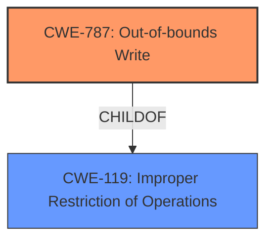

# Analysis for CVE-2020-11176

# Summary
| CWE ID | CWE Name | Confidence | CWE Abstraction Level | CWE Vulnerability Mapping Label | CWE-Vulnerability Mapping Notes |
|---|---|---|---|---|---|
| CWE-787 | Out-of-bounds Write | 1.0 | Base | Allowed | Primary CWE |

## Evidence and Confidence

*   **Confidence Score:** 1.0
*   **Evidence Strength:** HIGH

## Relationship Analysis
The primary relationship that influenced the decision was the parent-child relationship between CWE-787 (Out-of-bounds Write) and CWE-119 (Improper Restriction of Operations within the Bounds of a Memory Buffer). While CWE-119 is a broader category, CWE-787 provides a more specific classification for the described vulnerability. The chain relationships (CanFollow) from CWE-787 to other CWEs related to memory corruption (CWE-825, CWE-824, CWE-823, CWE-822) reinforces the potential impact of this vulnerability.

## Vulnerability Chain
The vulnerability chain starts with processing a server certificate from an IPSec server, leading to certificate validation for the subject alternative name API causing a **heap overflow** (CWE-787), which then leads to memory corruption.
  - Initial Flaw: Processing a server certificate from IPSec server.
  - Weakness: Certificate validation leads to a **heap overflow**.
  - Impact: Memory corruption.

## Summary of Analysis
The analysis is based on the provided evidence, specifically the vulnerability description key phrases which highlight the **heap overflow** as the primary **weakness**.

The vulnerability description clearly states that a **heap overflow** occurs during certificate validation, leading to memory corruption. This aligns directly with the description of CWE-787 (Out-of-bounds Write), which involves writing data past the end or before the beginning of the intended buffer.

The retriever results also listed CWE-787, but with a low score from graph analysis, while the dense results gave an Integer Overflow as highest. Even with the Integer Overflow and other potential candidates, the description explicitly indicates a **heap overflow**. Since the description has a clear statement of the rootcause, the best mapping is to CWE-787.

Other CWEs Considered but Not Used:

*   CWE-190 (Integer Overflow or Wraparound): While integer overflows can sometimes lead to heap overflows, the description explicitly mentions a **heap overflow** rather than an integer overflow.
*   CWE-126 (Buffer Over-read): This involves reading data out of bounds, not writing.
*   CWE-415 (Double Free): This is a different type of memory corruption issue.
*   CWE-822 (Untrusted Pointer Dereference) and CWE-823 (Use of Out-of-range Pointer Offset): These relate to pointer issues, but the description focuses on a **heap overflow** during certificate validation.
*   CWE-1285 (Improper Validation of Specified Index, Position, or Offset in Input) and CWE-1284 (Improper Validation of Specified Quantity in Input): These could be contributing factors, but the direct result is a **heap overflow**.
*   CWE-367 (Time-of-check Time-of-use (TOCTOU) Race Condition): There's no indication of a race condition in the description.
*   CWE-124 (Buffer Underwrite ('Buffer Underflow')): This involves writing before the beginning of the buffer, not after the end.

The choice of CWE-787 is at the optimal level of specificity because it directly reflects the **heap overflow** mentioned in the vulnerability description. The evidence clearly supports this classification, and the relationship analysis reinforces the potential impact of the vulnerability.