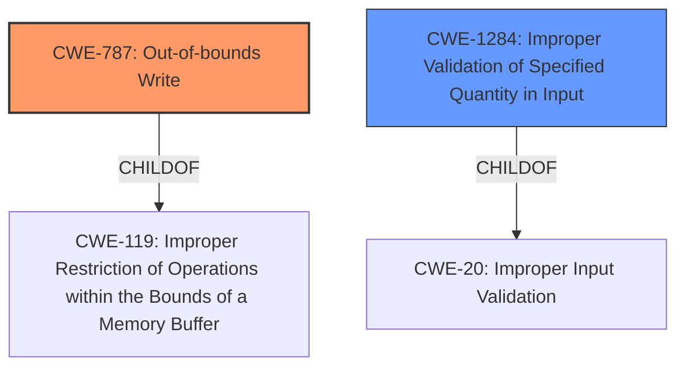

# Enhanced Analysis for CVE-2020-11182

# Summary
| CWE ID | CWE Name | Confidence | CWE Abstraction Level | CWE Vulnerability Mapping Label | CWE-Vulnerability Mapping Notes |
|---|---|---|---|---|---|
| CWE-787 | Out-of-bounds Write | 0.8 | Base | Primary | Allowed |
| CWE-1284 | Improper Validation of Specified Quantity in Input | 0.6 | Base | Secondary | Allowed |

## Evidence and Confidence

*   **Confidence Score:** 0.7
*   **Evidence Strength:** MEDIUM

## Relationship Analysis
The primary relationship influencing the CWE selection is the parent-child relationship between CWE-119 (Improper Restriction of Operations within the Bounds of a Memory Buffer) and CWE-787 (Out-of-bounds Write). The vulnerability description mentions a **heap overflow** due to a **lack of check of length** of data received, pointing directly to an out-of-bounds write condition. CWE-1284 (Improper Validation of Specified Quantity in Input) is also related, as the **lack of check of length** could be viewed as improper validation of the size of the input data.



## Vulnerability Chain
The vulnerability chain starts with the **lack of check of length** of user-supplied data, leading to a **heap overflow**, which is a form of out-of-bounds write. The chain can be represented as:

**Improper Input Validation** (CWE-20 -> CWE-1284) -> **Out-of-bounds Write** (CWE-787)

## Summary of Analysis
The analysis indicates a high likelihood of CWE-787 (Out-of-bounds Write) being the primary weakness due to the explicit mention of a **heap overflow** resulting from a **lack of check of length**. This directly aligns with the definition of CWE-787. CWE-1284 is a secondary consideration, as the **lack of check of length** is directly related to improper input validation.

The evidence supporting this assessment is found in the vulnerability description: "Possible **heap overflow** while parsing NAL header due to **lack of check of length** of data received from user".

The selected CWEs are at the optimal level of specificity because CWE-787 directly describes the **heap overflow** condition, and CWE-1284 describes the **lack of check of length** of user-supplied data. These are both Base level CWEs, which is the preferred level of abstraction for root cause analysis.

Relevant CWE Information:

# Enhanced Context (25 CWEs)
The following CWEs were identified as potentially relevant to this vulnerability:

## CWE-822: Untrusted Pointer Dereference
**Abstraction Level**: Base
**Similarity Score**: 0.81
**Source**: dense

**Description**:
The product obtains a value from an untrusted source, converts this value to a pointer, and dereferences the resulting pointer.
(Not Selected) The description doesn't suggest the vulnerability is caused by pointer dereferencing.

## CWE-823: Use of Out-of-range Pointer Offset
**Abstraction Level**: Base
**Similarity Score**: 0.80
**Source**: dense

**Description**:
The product performs pointer arithmetic on a valid pointer, but it uses an offset that can point outside of the intended range of valid memory locations for the resulting pointer.
(Not Selected) The description doesn't suggest the vulnerability is related to pointer arithmetic.

## CWE-191: Integer Underflow (Wrap or Wraparound)
**Abstraction Level**: Base
**Similarity Score**: 0.80
**Source**: dense

**Description**:
The product subtracts one value from another, such that the result is less than the minimum allowable integer value, which produces a value that is not equal to the correct result.
(Not Selected) The description doesn't suggest the vulnerability is related to integer underflow.

## CWE-131: Incorrect Calculation of Buffer Size
**Abstraction Level**: Base
**Similarity Score**: 0.79
**Source**: dense

**Description**:
The product does not correctly calculate the size to be used when allocating a buffer, which could lead to a buffer overflow.
(Not Selected) While a **heap overflow** is mentioned, the root cause as stated in the description is related to a **lack of check of length**.

## CWE-824: Access of Uninitialized Pointer
**Abstraction Level**: Base
**Similarity Score**: 0.78
**Source**: dense

**Description**:
The product accesses or uses a pointer that has not been initialized.
(Not Selected) The description doesn't suggest the vulnerability is related to uninitialized pointer.

## CWE-805: Buffer Access with Incorrect Length Value
**Abstraction Level**: Base
**Similarity Score**: 0.77
**Source**: dense

**Description**:
The product uses a sequential operation to read or write a buffer, but it uses an incorrect length value that causes it to access memory that is outside of the bounds of the buffer.
(Not Selected) The description suggests the vulnerability is more directly related to a **lack of check of length** rather than the usage of incorrect length value.

## CWE-667: Improper Locking
**Abstraction Level**: Class
**Similarity Score**: 0.77
**Source**: dense

**Description**:
The product does not properly acquire or release a lock on a resource, leading to unexpected resource state changes and behaviors.
(Not Selected) The description doesn't suggest the vulnerability is related to locking.

## CWE-124: Buffer Underwrite ('Buffer Underflow')
**Abstraction Level**: Base
**Similarity Score**: 0.77
**Source**: dense

**Description**:
The product writes to a buffer using an index or pointer that references a memory location prior to the beginning of the buffer.
(Not Selected) The description indicates a **heap overflow** rather than a buffer underflow.

## CWE-126: Buffer Over-read
**Abstraction Level**: Variant
**Similarity Score**: 0.77
**Source**: dense

**Description**:
The product reads from a buffer using buffer access mechanisms such as indexes or pointers that reference memory locations after the targeted buffer.
(Not Selected) The description indicates a **heap overflow** which is related to writing rather than reading.

## CWE-476: NULL Pointer Dereference
**Abstraction Level**: Base
**Similarity Score**: 0.77
**Source**: dense

**Description**:
The product dereferences a pointer that it expects to be valid but is NULL.
(Not Selected) The description doesn't suggest the vulnerability is caused by NULL pointer dereference.

## CWE-190: Integer Overflow or Wraparound
**Abstraction Level**: Base
**Similarity Score**: 6871.14
**Source**: sparse

**Description**:
The product performs a calculation that can
         produce an integer overflow or wraparound when the logic
         assumes that the resulting value will always be larger than
         the original value. This occurs when an integer value is
         incremented to a value that is too large to store in the
         associated representation. When this occurs, the value may
         become a very small or negative number.
(Not Selected) While CWE-190 can precede CWE-119, the description focuses on a **lack of check of length**, making it less directly relevant.

## CWE-823: Use of Out-of-range Pointer Offset
**Abstraction Level**: Base
**Similarity Score**: 6722.97
**Source**: sparse

**Description**:
The product performs pointer arithmetic on a valid pointer, but it uses an offset that can point outside of the intended range of valid memory locations for the resulting pointer.
(Not Selected) The description does not indicate that pointer arithmetic is involved.

## CWE-125: Out-of-bounds Read
**Abstraction Level**: Base
**Similarity Score**: 6457.40
**Source**: sparse

**Description**:
The product reads data past the end, or before the beginning, of the intended buffer.
(Not Selected) The description indicates a **heap overflow**, which is a writing issue, not a reading one.

## CWE-1284: Improper Validation of Specified Quantity in Input
**Abstraction Level**: Base
**Similarity Score**: 6422.69
**Source**: sparse

**Description**:
The product receives input that is expected to specify a quantity (such as size or length), but it does not validate or incorrectly validates that the quantity has the required properties.
(Selected


## CWE Relationship Analysis

Current CWEs represent these abstraction levels: .


### Vulnerability Chain Analysis

**Chain starting from CWE-823:**
- 823 (Use of Out-of-range Pointer Offset) - ROOT


**Chain starting from CWE-787:**
- 787 (Out-of-bounds Write) - ROOT


### CWE Relationship Diagram

```mermaid
graph TD
    classDef primary fill:#f96,stroke:#333,stroke-width:2px
    classDef secondary fill:#69f,stroke:#333
    classDef tertiary fill:#9e9,stroke:#333
```