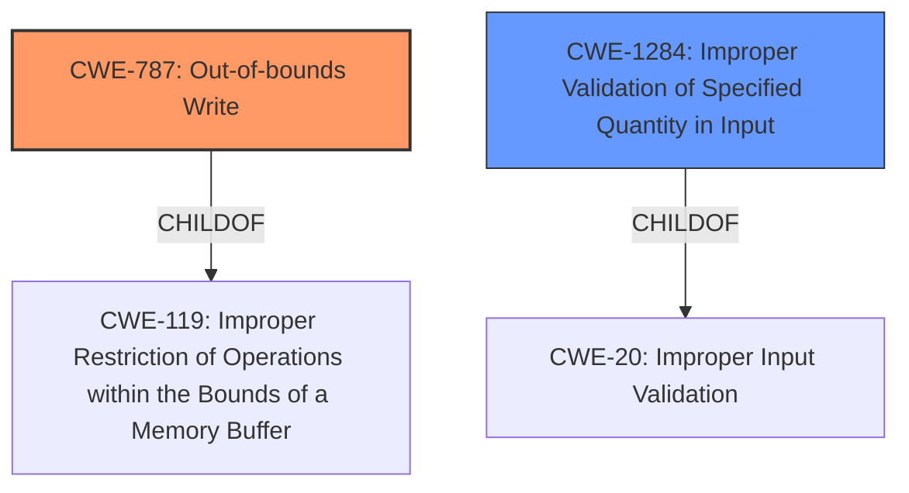

# Analysis for CVE-2020-11182

# Summary
| CWE ID | CWE Name | Confidence | CWE Abstraction Level | CWE Vulnerability Mapping Label | CWE-Vulnerability Mapping Notes |
|---|---|---|---|---|---|
| CWE-787 | Out-of-bounds Write | 0.8 | Base | Primary | Allowed |
| CWE-1284 | Improper Validation of Specified Quantity in Input | 0.6 | Base | Secondary | Allowed |

## Evidence and Confidence

*   **Confidence Score:** 0.7
*   **Evidence Strength:** MEDIUM

## Relationship Analysis
The primary relationship influencing the CWE selection is the parent-child relationship between CWE-119 (Improper Restriction of Operations within the Bounds of a Memory Buffer) and CWE-787 (Out-of-bounds Write). The vulnerability description mentions a **heap overflow** due to a **lack of check of length** of data received, pointing directly to an out-of-bounds write condition. CWE-1284 (Improper Validation of Specified Quantity in Input) is also related, as the **lack of check of length** could be viewed as improper validation of the size of the input data.

## Vulnerability Chain
The vulnerability chain starts with the **lack of check of length** of user-supplied data, leading to a **heap overflow**, which is a form of out-of-bounds write. The chain can be represented as:

**Improper Input Validation** (CWE-20 -> CWE-1284) -> **Out-of-bounds Write** (CWE-787)

## Summary of Analysis
The analysis indicates a high likelihood of CWE-787 (Out-of-bounds Write) being the primary weakness due to the explicit mention of a **heap overflow** resulting from a **lack of check of length**. This directly aligns with the definition of CWE-787. CWE-1284 is a secondary consideration, as the **lack of check of length** is directly related to improper input validation.

The evidence supporting this assessment is found in the vulnerability description: "Possible **heap overflow** while parsing NAL header due to **lack of check of length** of data received from user".

The selected CWEs are at the optimal level of specificity because CWE-787 directly describes the **heap overflow** condition, and CWE-1284 describes the **lack of check of length** of user-supplied data. These are both Base level CWEs, which is the preferred level of abstraction for root cause analysis.

Relevant CWE Information:

# Enhanced Context (25 CWEs)
The following CWEs were identified as potentially relevant to this vulnerability:

## CWE-822: Untrusted Pointer Dereference
**Abstraction Level**: Base
**Similarity Score**: 0.81
**Source**: dense

**Description**:
The product obtains a value from an untrusted source, converts this value to a pointer, and dereferences the resulting pointer.
(Not Selected) The description doesn't suggest the vulnerability is caused by pointer dereferencing.

## CWE-823: Use of Out-of-range Pointer Offset
**Abstraction Level**: Base
**Similarity Score**: 0.80
**Source**: dense

**Description**:
The product performs pointer arithmetic on a valid pointer, but it uses an offset that can point outside of the intended range of valid memory locations for the resulting pointer.
(Not Selected) The description doesn't suggest the vulnerability is related to pointer arithmetic.

## CWE-191: Integer Underflow (Wrap or Wraparound)
**Abstraction Level**: Base
**Similarity Score**: 0.80
**Source**: dense

**Description**:
The product subtracts one value from another, such that the result is less than the minimum allowable integer value, which produces a value that is not equal to the correct result.
(Not Selected) The description doesn't suggest the vulnerability is related to integer underflow.

## CWE-131: Incorrect Calculation of Buffer Size
**Abstraction Level**: Base
**Similarity Score**: 0.79
**Source**: dense

**Description**:
The product does not correctly calculate the size to be used when allocating a buffer, which could lead to a buffer overflow.
(Not Selected) While a **heap overflow** is mentioned, the root cause as stated in the description is related to a **lack of check of length**.

## CWE-824: Access of Uninitialized Pointer
**Abstraction Level**: Base
**Similarity Score**: 0.78
**Source**: dense

**Description**:
The product accesses or uses a pointer that has not been initialized.
(Not Selected) The description doesn't suggest the vulnerability is related to uninitialized pointer.

## CWE-805: Buffer Access with Incorrect Length Value
**Abstraction Level**: Base
**Similarity Score**: 0.77
**Source**: dense

**Description**:
The product uses a sequential operation to read or write a buffer, but it uses an incorrect length value that causes it to access memory that is outside of the bounds of the buffer.
(Not Selected) The description suggests the vulnerability is more directly related to a **lack of check of length** rather than the usage of incorrect length value.

## CWE-667: Improper Locking
**Abstraction Level**: Class
**Similarity Score**: 0.77
**Source**: dense

**Description**:
The product does not properly acquire or release a lock on a resource, leading to unexpected resource state changes and behaviors.
(Not Selected) The description doesn't suggest the vulnerability is related to locking.

## CWE-124: Buffer Underwrite ('Buffer Underflow')
**Abstraction Level**: Base
**Similarity Score**: 0.77
**Source**: dense

**Description**:
The product writes to a buffer using an index or pointer that references a memory location prior to the beginning of the buffer.
(Not Selected) The description indicates a **heap overflow** rather than a buffer underflow.

## CWE-126: Buffer Over-read
**Abstraction Level**: Variant
**Similarity Score**: 0.77
**Source**: dense

**Description**:
The product reads from a buffer using buffer access mechanisms such as indexes or pointers that reference memory locations after the targeted buffer.
(Not Selected) The description indicates a **heap overflow** which is related to writing rather than reading.

## CWE-476: NULL Pointer Dereference
**Abstraction Level**: Base
**Similarity Score**: 0.77
**Source**: dense

**Description**:
The product dereferences a pointer that it expects to be valid but is NULL.
(Not Selected) The description doesn't suggest the vulnerability is caused by NULL pointer dereference.

## CWE-190: Integer Overflow or Wraparound
**Abstraction Level**: Base
**Similarity Score**: 6871.14
**Source**: sparse

**Description**:
The product performs a calculation that can
         produce an integer overflow or wraparound when the logic
         assumes that the resulting value will always be larger than
         the original value. This occurs when an integer value is
         incremented to a value that is too large to store in the
         associated representation. When this occurs, the value may
         become a very small or negative number.
(Not Selected) While CWE-190 can precede CWE-119, the description focuses on a **lack of check of length**, making it less directly relevant.

## CWE-823: Use of Out-of-range Pointer Offset
**Abstraction Level**: Base
**Similarity Score**: 6722.97
**Source**: sparse

**Description**:
The product performs pointer arithmetic on a valid pointer, but it uses an offset that can point outside of the intended range of valid memory locations for the resulting pointer.
(Not Selected) The description does not indicate that pointer arithmetic is involved.

## CWE-125: Out-of-bounds Read
**Abstraction Level**: Base
**Similarity Score**: 6457.40
**Source**: sparse

**Description**:
The product reads data past the end, or before the beginning, of the intended buffer.
(Not Selected) The description indicates a **heap overflow**, which is a writing issue, not a reading one.

## CWE-1284: Improper Validation of Specified Quantity in Input
**Abstraction Level**: Base
**Similarity Score**: 6422.69
**Source**: sparse

**Description**:
The product receives input that is expected to specify a quantity (such as size or length), but it does not validate or incorrectly validates that the quantity has the required properties.
(Selected

# Enhanced Query for CVE-2020-11182

## Vulnerability Description
Possible **heap overflow** while parsing NAL header due to lack of check of length of data received from user in Snapdragon Auto, Snapdragon Compute, Snapdragon Connectivity, Snapdragon Consumer IOT, Snapdragon Industrial IOT, Snapdragon Mobile

### Vulnerability Description Key Phrases
- **weakness:** **heap overflow**
- **product:** Snapdragon Auto and Snapdragon Compute and Snapdragon Connectivity and Snapdragon Consumer IOT and Snapdragon Industrial IOT and Snapdragon Mobile

## Retriever Results

### Top Combined Results

| Rank | CWE ID | Name | Abstraction | Usage  | Retrievers | Individual Scores |
|------|--------|------|-------------|-------|------------|-------------------|
| 1 | 190 | Integer Overflow or Wraparound | Base | Allowed | alternate_terms | 0.800 |
| 2 | 126 | Buffer Over-read | Variant | Allowed | sparse | 0.401 |
| 3 | 415 | Double Free | Variant | Allowed | sparse | 0.335 |
| 4 | 1284 | Improper Validation of Specified Quantity in Input | Base | Allowed | sparse | 0.332 |
| 5 | 124 | Buffer Underwrite ('Buffer Underflow') | Base | Allowed | sparse | 0.332 |
| 6 | 1285 | Improper Validation of Specified Index, Position, or Offset in Input | Base | Allowed | dense | 0.563 |
| 7 | 131 | Incorrect Calculation of Buffer Size | Base | Allowed | graph | 0.003 |
| 8 | 823 | Use of Out-of-range Pointer Offset | Base | Allowed | sparse | 0.328 |
| 9 | 367 | Time-of-check Time-of-use (TOCTOU) Race Condition | Base | Allowed | sparse | 0.316 |
| 10 | 822 | Untrusted Pointer Dereference | Base | Allowed | sparse | 0.305 |

# Complete CWE Specifications

## CWE-190: Integer Overflow or Wraparound
**Abstraction:** Base
**Status:** Stable

### Description
The product performs a calculation that can
         produce an integer overflow or wraparound when the logic
         assumes that the resulting value will always be larger than
         the original value. This occurs when an integer value is
         incremented to a value that is too large to store in the
         associated representation. When this occurs, the value may
         become a very small or negative number.

### Extended Description
Not provided

### Alternative Terms
Overflow: The terms "overflow" and "wraparound" are used interchangeably by some people, but they can have more precise distinctions by others. See Terminology Notes.
Wraparound: The terms "overflow" and "wraparound" are used interchangeably by some people, but they can have more precise distinctions by others. See Terminology Notes.
wrap, wrap-around, wrap around: Alternate spellings of "wraparound"

### Relationships
ChildOf -> CWE-682
ChildOf -> CWE-682
ChildOf -> CWE-20
CanPrecede -> CWE-119

### Mapping Guidance
**Usage:** Allowed
**Rationale:** This CWE entry is at the Base level of abstraction, which is a preferred level of abstraction for mapping to the root causes of vulnerabilities.
**Comments:** Be careful of terminology problems with "overflow," "underflow," and "wraparound" - see Terminology Notes. Carefully read both the name and description to ensure that this mapping is an appropriate fit. Do not try to 'force' a mapping to a lower-level Base/Variant simply to comply with this preferred level of abstraction.
**Reasons:**
- Acceptable-Use
**Suggested Alternatives:**
- CWE-191: Integer Underflow (Wrap or Wraparound). Consider CWE-191 when the result is less than the minimum value that can be represented (sometimes called "underflows").

### Additional Notes
**[Relationship]** Integer overflows can be primary to buffer overflows when they cause less memory to be allocated than expected.

**[Terminology]** 

"Integer overflow" is sometimes used to cover several types of errors, including signedness errors, or buffer overflows that involve manipulation of integer data types instead of characters. Part of the confusion results from the fact that 0xffffffff is -1 in a signed context. Other confusion also arises because of the role that integer overflows have in chains.

A "wraparound" is a well-defined, standard behavior that follows specific rules for how to handle situations when the intended numeric value is too large or too small to be represented, as specified in standards such as C11.

"Overflow" is sometimes conflated with "wraparound" but typically indicates a non-standard or undefined behavior.

The "overflow" term is sometimes used to indicate cases where either the maximum or the minimum is exceeded, but others might only use "overflow" to indicate exceeding the maximum while using "underflow" for exceeding the minimum.

Some people use "overflow" to mean any value outside the representable range - whether greater than the maximum, or less than the minimum - but CWE uses "underflow" for cases in which the intended result is less than the minimum.

See [REF-1440] for additional explanation of the ambiguity of terminology.

**[Other]** While there may be circumstances in which the logic intentionally relies on wrapping - such as with modular arithmetic in timers or counters - it can have security consequences if the wrap is unexpected. This is especially the case if the integer overflow can be triggered using user-supplied inputs.

### Observed Examples
- **CVE-2021-43537:** Chain: in a web browser, an unsigned 64-bit integer is forcibly cast to a 32-bit integer (CWE-681) and potentially leading to an integer overflow (CWE-190). If an integer overflow occurs, this can cause heap memory corruption (CWE-122)
- **CVE-2022-21668:** Chain: Python library does not limit the resources used to process images that specify a very large number of bands (CWE-1284), leading to excessive memory consumption (CWE-789) or an integer overflow (CWE-190).
- **CVE-2022-0545:** Chain: 3D renderer has an integer overflow (CWE-190) leading to write-what-where condition (CWE-123) using a crafted image.

## CWE-126: Buffer Over-read
**Abstraction:** Variant
**Status:** Draft

### Description
The product reads from a buffer using buffer access mechanisms such as indexes or pointers that reference memory locations after the targeted buffer.

### Extended Description
This typically occurs when the pointer or its index is incremented to a position beyond the bounds of the buffer or when pointer arithmetic results in a position outside of the valid memory location to name a few. This may result in exposure of sensitive information or possibly a crash.

### Alternative Terms
None

### Relationships
ChildOf -> CWE-125
ChildOf -> CWE-788

### Mapping Guidance
**Usage:** Allowed
**Rationale:** This CWE entry is at the Variant level of abstraction, which is a preferred level of abstraction for mapping to the root causes of vulnerabilities.
**Comments:** Carefully read both the name and description to ensure that this mapping is an appropriate fit. Do not try to 'force' a mapping to a lower-level Base/Variant simply to comply with this preferred level of abstraction.
**Reasons:**
- Acceptable-Use

### Additional Notes
**[Relationship]** These problems may be resultant from missing sentinel values (CWE-463) or trusting a user-influenced input length variable.

### Observed Examples
- **CVE-2022-1733:** Text editor has out-of-bounds read past end of line while indenting C code
- **CVE-2014-0160:** Chain: "Heartbleed" bug receives an inconsistent length parameter (CWE-130) enabling an out-of-bounds read (CWE-126), returning memory that could include private cryptographic keys and other sensitive data.
- **CVE-2009-2523:** Chain: product does not handle when an input string is not NULL terminated, leading to buffer over-read or heap-based buffer overflow.

## CWE-415: Double Free
**Abstraction:** Variant
**Status:** Draft

### Description
The product calls free() twice on the same memory address, potentially leading to modification of unexpected memory locations.

### Extended Description
When a program calls free() twice with the same argument, the program's memory management data structures become corrupted. This corruption can cause the program to crash or, in some circumstances, cause two later calls to malloc() to return the same pointer. If malloc() returns the same value twice and the program later gives the attacker control over the data that is written into this doubly-allocated memory, the program becomes vulnerable to a buffer overflow attack.

### Alternative Terms
Double-free

### Relationships
ChildOf -> CWE-825
ChildOf -> CWE-1341
ChildOf -> CWE-672
ChildOf -> CWE-672
ChildOf -> CWE-672
ChildOf -> CWE-666
PeerOf -> CWE-416
PeerOf -> CWE-123

### Mapping Guidance
**Usage:** Allowed
**Rationale:** This CWE entry is at the Variant level of abstraction, which is a preferred level of abstraction for mapping to the root causes of vulnerabilities.
**Comments:** Carefully read both the name and description to ensure that this mapping is an appropriate fit. Do not try to 'force' a mapping to a lower-level Base/Variant simply to comply with this preferred level of abstraction.
**Reasons:**
- Acceptable-Use

### Additional Notes
**[Relationship]** This is usually resultant from another weakness, such as an unhandled error or race condition between threads. It could also be primary to weaknesses such as buffer overflows.

**[Theoretical]** It could be argued that Double Free would be most appropriately located as a child of "Use after Free", but "Use" and "Release" are considered to be distinct operations within vulnerability theory, therefore this is more accurately "Release of a Resource after Expiration or Release", which doesn't exist yet.

### Observed Examples
- **CVE-2006-5051:** Chain: Signal handler contains too much functionality (CWE-828), introducing a race condition (CWE-362) that leads to a double free (CWE-415).
- **CVE-2004-0642:** Double free resultant from certain error conditions.
- **CVE-2004-0772:** Double free resultant from certain error conditions.

## CWE-1284: Improper Validation of Specified Quantity in Input
**Abstraction:** Base
**Status:** Incomplete

### Description
The product receives input that is expected to specify a quantity (such as size or length), but it does not validate or incorrectly validates that the quantity has the required properties.

### Extended Description

Specified quantities include size, length, frequency, price, rate, number of operations, time, and others. Code may rely on specified quantities to allocate resources, perform calculations, control iteration, etc. When the quantity is not properly validated, then attackers can specify malicious quantities to cause excessive resource allocation, trigger unexpected failures, enable buffer overflows, etc.

### Alternative Terms
None

### Relationships
ChildOf -> CWE-20
ChildOf -> CWE-20
CanPrecede -> CWE-789

### Mapping Guidance
**Usage:** Allowed
**Rationale:** This CWE entry is at the Base level of abstraction, which is a preferred level of abstraction for mapping to the root causes of vulnerabilities.
**Comments:** Carefully read both the name and description to ensure that this mapping is an appropriate fit. Do not try to 'force' a mapping to a lower-level Base/Variant simply to comply with this preferred level of abstraction.
**Reasons:**
- Acceptable-Use

### Additional Notes
**[Maintenance]** This entry is still under development and will continue to see updates and content improvements.

### Observed Examples
- **CVE-2022-21668:** Chain: Python library does not limit the resources used to process images that specify a very large number of bands (CWE-1284), leading to excessive memory consumption (CWE-789) or an integer overflow (CWE-190).
- **CVE-2008-1440:** lack of validation of length field leads to infinite loop
- **CVE-2008-2374:** lack of validation of string length fields allows memory consumption or buffer over-read

## CWE-124: Buffer Underwrite ('Buffer Underflow')
**Abstraction:** Base
**Status:** Incomplete

### Description
The product writes to a buffer using an index or pointer that references a memory location prior to the beginning of the buffer.

### Extended Description
This typically occurs when a pointer or its index is decremented to a position before the buffer, when pointer arithmetic results in a position before the beginning of the valid memory location, or when a negative index is used.

### Alternative Terms
buffer underrun: Some prominent vendors and researchers use the term "buffer underrun". "Buffer underflow" is more commonly used, although both terms are also sometimes used to describe a buffer under-read (CWE-127).

### Relationships
ChildOf -> CWE-786
ChildOf -> CWE-787

### Mapping Guidance
**Usage:** Allowed
**Rationale:** This CWE entry is at the Base level of abstraction, which is a preferred level of abstraction for mapping to the root causes of vulnerabilities.
**Comments:** Carefully read both the name and description to ensure that this mapping is an appropriate fit. Do not try to 'force' a mapping to a lower-level Base/Variant simply to comply with this preferred level of abstraction.
**Reasons:**
- Acceptable-Use

### Additional Notes
**[Relationship]** This could be resultant from several errors, including a bad offset or an array index that decrements before the beginning of the buffer (see CWE-129).

### Observed Examples
- **CVE-2021-24018:** buffer underwrite in firmware verification routine allows code execution via a crafted firmware image
- **CVE-2002-2227:** Unchecked length of SSLv2 challenge value leads to buffer underflow.
- **CVE-2007-4580:** Buffer underflow from a small size value with a large buffer (length parameter inconsistency, CWE-130)

## CWE-1285: Improper Validation of Specified Index, Position, or Offset in Input
**Abstraction:** Base
**Status:** Incomplete

### Description
The product receives input that is expected to specify an index, position, or offset into an indexable resource such as a buffer or file, but it does not validate or incorrectly validates that the specified index/position/offset has the required properties.

### Extended Description

Often, indexable resources such as memory buffers or files can be accessed using a specific position, index, or offset, such as an index for an array or a position for a file. When untrusted input is not properly validated before it is used as an index, attackers could access (or attempt to access) unauthorized portions of these resources. This could be used to cause buffer overflows, excessive resource allocation, or trigger unexpected failures. 

### Alternative Terms
None

### Relationships
ChildOf -> CWE-20

### Mapping Guidance
**Usage:** Allowed
**Rationale:** This CWE entry is at the Base level of abstraction, which is a preferred level of abstraction for mapping to the root causes of vulnerabilities.
**Comments:** Carefully read both the name and description to ensure that this mapping is an appropriate fit. Do not try to 'force' a mapping to a lower-level Base/Variant simply to comply with this preferred level of abstraction.
**Reasons:**
- Acceptable-Use

### Additional Notes
**[Maintenance]** This entry is still under development and will continue to see updates and content improvements.

### Observed Examples
- **CVE-2005-0369:** large ID in packet used as array index
- **CVE-2001-1009:** negative array index as argument to POP LIST command

## CWE-131: Incorrect Calculation of Buffer Size
**Abstraction:** Base
**Status:** Draft

### Description
The product does not correctly calculate the size to be used when allocating a buffer, which could lead to a buffer overflow.

### Extended Description
Not provided

### Alternative Terms
None

### Relationships
ChildOf -> CWE-682
ChildOf -> CWE-682
ChildOf -> CWE-682
ChildOf -> CWE-682
CanPrecede -> CWE-119

### Mapping Guidance
**Usage:** Allowed
**Rationale:** This CWE entry is at the Base level of abstraction, which is a preferred level of abstraction for mapping to the root causes of vulnerabilities.
**Comments:** Carefully read both the name and description to ensure that this mapping is an appropriate fit. Do not try to 'force' a mapping to a lower-level Base/Variant simply to comply with this preferred level of abstraction.
**Reasons:**
- Acceptable-Use

### Additional Notes
**[Maintenance]** 

This is a broad category. Some examples include:

  - simple math errors,

  - incorrectly updating parallel counters,

  - not accounting for size differences when "transforming" one input to another format (e.g. URL canonicalization or other transformation that can generate a result that's larger than the original input, i.e. "expansion").

This level of detail is rarely available in public reports, so it is difficult to find good examples.

**[Maintenance]** 

This weakness may be a composite or a chain. It also may contain layering or perspective differences.

This issue may be associated with many different types of incorrect calculations (CWE-682), although the integer overflow (CWE-190) is probably the most prevalent. This can be primary to resource consumption problems (CWE-400), including uncontrolled memory allocation (CWE-789). However, its relationship with out-of-bounds buffer access (CWE-119) must also be considered.

### Observed Examples
- **CVE-2020-17087:** Chain: integer truncation (CWE-197) causes small buffer allocation (CWE-131) leading to out-of-bounds write (CWE-787) in kernel pool, as exploited in the wild per CISA KEV.
- **CVE-2004-1363:** substitution overflow: buffer overflow using environment variables that are expanded after the length check is performed
- **CVE-2004-0747:** substitution overflow: buffer overflow using expansion of environment variables

## CWE-823: Use of Out-of-range Pointer Offset
**Abstraction:** Base
**Status:** Incomplete

### Description
The product performs pointer arithmetic on a valid pointer, but it uses an offset that can point outside of the intended range of valid memory locations for the resulting pointer.

### Extended Description

While a pointer can contain a reference to any arbitrary memory location, a program typically only intends to use the pointer to access limited portions of memory, such as contiguous memory used to access an individual array.

Programs may use offsets in order to access fields or sub-elements stored within structured data. The offset might be out-of-range if it comes from an untrusted source, is the result of an incorrect calculation, or occurs because of another error.

If an attacker can control or influence the offset so that it points outside of the intended boundaries of the structure, then the attacker may be able to read or write to memory locations that are used elsewhere in the product. As a result, the attack might change the state of the product as accessed through program variables, cause a crash or instable behavior, and possibly lead to code execution.

### Alternative Terms
Untrusted pointer offset: This term is narrower than the concept of "out-of-range" offset, since the offset might be the result of a calculation or other error that does not depend on any externally-supplied values.

### Relationships
ChildOf -> CWE-119
ChildOf -> CWE-119
ChildOf -> CWE-119
CanPrecede -> CWE-125
CanPrecede -> CWE-787

### Mapping Guidance
**Usage:** Allowed
**Rationale:** This CWE entry is at the Base level of abstraction, which is a preferred level of abstraction for mapping to the root causes of vulnerabilities.
**Comments:** Carefully read both the name and description to ensure that this mapping is an appropriate fit. Do not try to 'force' a mapping to a lower-level Base/Variant simply to comply with this preferred level of abstraction.
**Reasons:**
- Acceptable-Use

### Additional Notes
**[Maintenance]** There are close relationships between incorrect pointer dereferences and other weaknesses related to buffer operations. There may not be sufficient community agreement regarding these relationships. Further study is needed to determine when these relationships are chains, composites, perspective/layering, or other types of relationships. As of September 2010, most of the relationships are being captured as chains.

**[Terminology]** Many weaknesses related to pointer dereferences fall under the general term of "memory corruption" or "memory safety." As of September 2010, there is no commonly-used terminology that covers the lower-level variants.

### Observed Examples
- **CVE-2010-2160:** Invalid offset in undocumented opcode leads to memory corruption.
- **CVE-2010-1281:** Multimedia player uses untrusted value from a file when using file-pointer calculations.
- **CVE-2009-3129:** Spreadsheet program processes a record with an invalid size field, which is later used as an offset.

## CWE-367: Time-of-check Time-of-use (TOCTOU) Race Condition
**Abstraction:** Base
**Status:** Incomplete

### Description
The product checks the state of a resource before using that resource, but the resource's state can change between the check and the use in a way that invalidates the results of the check. This can cause the product to perform invalid actions when the resource is in an unexpected state.

### Extended Description
This weakness can be security-relevant when an attacker can influence the state of the resource between check and use. This can happen with shared resources such as files, memory, or even variables in multithreaded programs.

### Alternative Terms
TOCTTOU: The TOCTTOU acronym expands to "Time Of Check To Time Of Use".
TOCCTOU: The TOCCTOU acronym is most likely a typo of TOCTTOU, but it has been used in some influential documents, so the typo is repeated fairly frequently.

### Relationships
ChildOf -> CWE-362
ChildOf -> CWE-362

### Mapping Guidance
**Usage:** Allowed
**Rationale:** This CWE entry is at the Base level of abstraction, which is a preferred level of abstraction for mapping to the root causes of vulnerabilities.
**Comments:** Carefully read both the name and description to ensure that this mapping is an appropriate fit. Do not try to 'force' a mapping to a lower-level Base/Variant simply to comply with this preferred level of abstraction.
**Reasons:**
- Acceptable-Use

### Additional Notes
**[Relationship]** TOCTOU issues do not always involve symlinks, and not every symlink issue is a TOCTOU problem.

**[Research Gap]** Non-symlink TOCTOU issues are not reported frequently, but they are likely to occur in code that attempts to be secure.

### Observed Examples
- **CVE-2015-1743:** TOCTOU in sandbox process allows installation of untrusted browser add-ons by replacing a file after it has been verified, but before it is executed
- **CVE-2003-0813:** A multi-threaded race condition allows remote attackers to cause a denial of service (crash or reboot) by causing two threads to process the same RPC request, which causes one thread to use memory after it has been freed.
- **CVE-2004-0594:** PHP flaw allows remote attackers to execute arbitrary code by aborting execution before the initialization of key data structures is complete.

## CWE-822: Untrusted Pointer Dereference
**Abstraction:** Base
**Status:** Incomplete

### Description
The product obtains a value from an untrusted source, converts this value to a pointer, and dereferences the resulting pointer.

### Extended Description

An attacker can supply a pointer for memory locations that the product is not expecting. If the pointer is dereferenced for a write operation, the attack might allow modification of critical state variables, cause a crash, or execute code. If the dereferencing operation is for a read, then the attack might allow reading of sensitive data, cause a crash, or set a variable to an unexpected value (since the value will be read from an unexpected memory location).

There are several variants of this weakness, including but not necessarily limited to:

  - The untrusted value is directly invoked as a function call.

  - In OS kernels or drivers where there is a boundary between "userland" and privileged memory spaces, an untrusted pointer might enter through an API or system call (see CWE-781 for one such example).

  - Inadvertently accepting the value from an untrusted control sphere when it did not have to be accepted as input at all. This might occur when the code was originally developed to be run by a single user in a non-networked environment, and the code is then ported to or otherwise exposed to a networked environment.

### Alternative Terms
None

### Relationships
ChildOf -> CWE-119
ChildOf -> CWE-119
ChildOf -> CWE-119
CanPrecede -> CWE-125
CanPrecede -> CWE-787

### Mapping Guidance
**Usage:** Allowed
**Rationale:** This CWE entry is at the Base level of abstraction, which is a preferred level of abstraction for mapping to the root causes of vulnerabilities.
**Comments:** Carefully read both the name and description to ensure that this mapping is an appropriate fit. Do not try to 'force' a mapping to a lower-level Base/Variant simply to comply with this preferred level of abstraction.
**Reasons:**
- Acceptable-Use

### Additional Notes
**[Maintenance]** There are close relationships between incorrect pointer dereferences and other weaknesses related to buffer operations. There may not be sufficient community agreement regarding these relationships. Further study is needed to determine when these relationships are chains, composites, perspective/layering, or other types of relationships. As of September 2010, most of the relationships are being captured as chains.

**[Terminology]** Many weaknesses related to pointer dereferences fall under the general term of "memory corruption" or "memory safety." As of September 2010, there is no commonly-used terminology that covers the lower-level variants.

### Observed Examples
- **CVE-2007-5655:** message-passing framework interprets values in packets as pointers, causing a crash.
- **CVE-2010-2299:** labeled as a "type confusion" issue, also referred to as a "stale pointer." However, the bug ID says "contents are simply interpreted as a pointer... renderer ordinarily doesn't supply this pointer directly". The "handle" in the untrusted area is replaced in one function, but not another - thus also, effectively, exposure to wrong sphere (CWE-668).
- **CVE-2009-1719:** Untrusted dereference using undocumented constructor.

