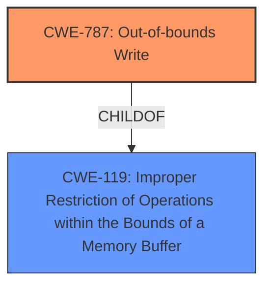

# Enhanced Analysis for CVE-2020-11210

# Summary
| CWE ID | CWE Name | Confidence | CWE Abstraction Level | CWE Vulnerability Mapping Label | CWE-Vulnerability Mapping Notes |
|---|---|---|---|---|---|
| CWE-787 | Out-of-bounds Write | 0.75 | Base | Allowed | Primary CWE |
| CWE-119 | Improper Restriction of Operations within the Bounds of a Memory Buffer | 0.6 | Class | Allowed | Secondary Candidate |

## Evidence and Confidence

*   **Confidence Score:** 0.7
*   **Evidence Strength:** MEDIUM

## Relationship Analysis
The primary relationship that influenced my decision was the parent-child relationship between CWE-787 and CWE-119. CWE-787 is a more specific case of CWE-119, representing an out-of-bounds write, which aligns with the **memory corruption** impact described in the vulnerability.



## Vulnerability Chain
The vulnerability chain starts with an **improper XPU configuration**, leading to a potential out-of-bounds write condition that results in **memory corruption** in the RPM region.
  - Root Cause: **Improper XPU configuration**
  - Weakness: Out-of-bounds write (CWE-787)
  - Impact: Memory corruption

## Summary of Analysis
The analysis is primarily based on the provided vulnerability description and key phrases, which indicate that the **improper XPU configuration** leads to **memory corruption**. The selection of CWE-787 as the primary CWE is based on its specific description of an out-of-bounds write, which aligns with the reported impact.

The evidence supporting the selection of CWE-787 is the vulnerability description stating "Possible **memory corruption** in RPM region due to **improper XPU configuration**". This directly implies a potential write operation outside the intended memory boundaries.

The relationship graph shows that CWE-787 is a child of CWE-119, indicating that it is a more specific type of memory boundary violation. This specificity makes it a more appropriate choice than CWE-119 alone.

The selection of CWE-787 is at the optimal level of specificity because it directly describes the out-of-bounds write condition leading to **memory corruption**. While other CWEs were considered, such as CWE-822 (Untrusted Pointer Dereference) and CWE-823 (Use of Out-of-range Pointer Offset), they do not directly address the write aspect of the **memory corruption** issue as clearly as CWE-787.

Relevant CWE Information:

# Enhanced Context (25 CWEs)
The following CWEs were identified as potentially relevant to this vulnerability:

## CWE-822: Untrusted Pointer Dereference
**Abstraction Level**: Base
**Similarity Score**: 0.79
**Source**: dense

**Description**:
The product obtains a value from an untrusted source, converts this value to a pointer, and dereferences the resulting pointer.

**Mapping Guidance**:
- Usage: Allowed
- Rationale: This CWE entry is at the Base level of abstraction, which is a preferred level of abstraction for mapping to the root causes of vulnerabilities.

## CWE-823: Use of Out-of-range Pointer Offset
**Abstraction Level**: Base
**Similarity Score**: 0.79
**Source**: dense

**Description**:
The product performs pointer arithmetic on a valid pointer, but it uses an offset that can point outside of the intended range of valid memory locations for the resulting pointer.

**Mapping Guidance**:
- Usage: Allowed
- Rationale: This CWE entry is at the Base level of abstraction, which is a preferred level of abstraction for mapping to the root causes of vulnerabilities.

## CWE-252: Unchecked Return Value
**Abstraction Level**: Base
**Similarity Score**: 0.79
**Source**: dense

**Description**:
The product does not check the return value from a method or function, which can prevent it from detecting unexpected states and conditions.

**Mapping Guidance**:
- Usage: Allowed
- Rationale: This CWE entry is at the Base level of abstraction, which is a preferred level of abstraction for mapping to the root causes of vulnerabilities.

## CWE-667: Improper Locking
**Abstraction Level**: Class
**Similarity Score**: 0.78
**Source**: dense

**Description**:
The product does not properly acquire or release a lock on a resource, leading to unexpected resource state changes and behaviors.

**Mapping Guidance**:
- Usage: Allowed-with-Review
- Rationale: This CWE entry is a Class and might have Base-level children that would be more appropriate

## CWE-824: Access of Uninitialized Pointer
**Abstraction Level**: Base
**Similarity Score**: 0.77
**Source**: dense

**Description**:
The product accesses or uses a pointer that has not been initialized.

**Mapping Guidance**:
- Usage: Allowed
- Rationale: This CWE entry is at the Base level of abstraction, which is a preferred level of abstraction for mapping to the root causes of vulnerabilities.

## CWE-226: Sensitive Information in Resource Not Removed Before Reuse
**Abstraction Level**: Base
**Similarity Score**: 0.77
**Source**: dense

**Description**:
The product releases a resource such as memory or a file so that it can be made available for reuse, but it does not clear or "zeroize" the information contained in the resource before the product performs a critical state transition or makes the resource available for reuse by other entities.

**Mapping Guidance**:
- Usage: Allowed
- Rationale: This CWE entry is at the Base level of abstraction, which is a preferred level of abstraction for mapping to the root causes of vulnerabilities.

## CWE-131: Incorrect Calculation of Buffer Size
**Abstraction Level**: Base
**Similarity Score**: 0.77
**Source**: dense

**Description**:
The product does not correctly calculate the size to be used when allocating a buffer, which could lead to a buffer overflow.

**Mapping Guidance**:
- Usage: Allowed
- Rationale: This CWE entry is at the Base level of abstraction, which is a preferred level of abstraction for mapping to the root causes of vulnerabilities.

## CWE-404: Improper Resource Shutdown or Release
**Abstraction Level**: Class
**Similarity Score**: 0.77
**Source**: dense

**Description**:
The product does not release or incorrectly releases a resource before it is made available for re-use.

**Mapping Guidance**:
- Usage: Allowed-with-Review
- Rationale: This CWE entry is a Class and might have Base-level children that would be more appropriate

## CWE-754: Improper Check for Unusual or Exceptional Conditions
**Abstraction Level**: Class
**Similarity Score**: 0.76
**Source**: dense

**Description**:
The product does not check or incorrectly checks for unusual or exceptional conditions that are not expected to occur frequently during day to day operation of the product.

**Mapping Guidance**:
- Usage: Allowed-with-Review
- Rationale: This CWE entry is a Class and might have Base-level children that would be more appropriate

## CWE-191: Integer Underflow (Wrap or Wraparound)
**Abstraction Level**: Base
**Similarity Score**: 0.76
**Source**: dense

**Description**:
The product subtracts one value from another, such that the result is less than the minimum allowable integer value, which produces a value that is not equal to the correct result.

**Mapping Guidance**:
- Usage: Allowed
- Rationale: This CWE entry is at the Base level of abstraction, which is a preferred level of abstraction for mapping to the root causes of vulnerabilities.

## CWE-823: Use of Out-of-range Pointer Offset
**Abstraction Level**: Base
**Similarity Score**: 6393.49
**Source**: sparse

**Description**:
The product performs pointer arithmetic on a valid pointer, but it uses an offset that can point outside of the intended range of valid memory locations for the resulting pointer.

**Mapping Guidance**:
- Usage: Allowed
- Rationale: This CWE entry is at the Base level of abstraction, which is a preferred level of abstraction for mapping to the root causes of vulnerabilities.

## CWE-252: Unchecked Return Value
**Abstraction Level**: Base
**Similarity Score**: 6276.67
**Source**: sparse

**Description**:
The product does not check the return value from a method or function, which can prevent it from detecting unexpected states and conditions.

**Mapping Guidance**:
- Usage: Allowed
- Rationale: This CWE entry is at the Base level of abstraction, which is a preferred level of abstraction for mapping to the root causes of vulnerabilities.

## CWE-822: Untrusted Pointer Dere


## CWE Relationship Analysis

Current CWEs represent these abstraction levels: .


### Vulnerability Chain Analysis

**Chain starting from CWE-823:**
- 823 (Use of Out-of-range Pointer Offset) - ROOT


**Chain starting from CWE-787:**
- 787 (Out-of-bounds Write) - ROOT


### CWE Relationship Diagram

```mermaid
graph TD
    classDef primary fill:#f96,stroke:#333,stroke-width:2px
    classDef secondary fill:#69f,stroke:#333
    classDef tertiary fill:#9e9,stroke:#333
```