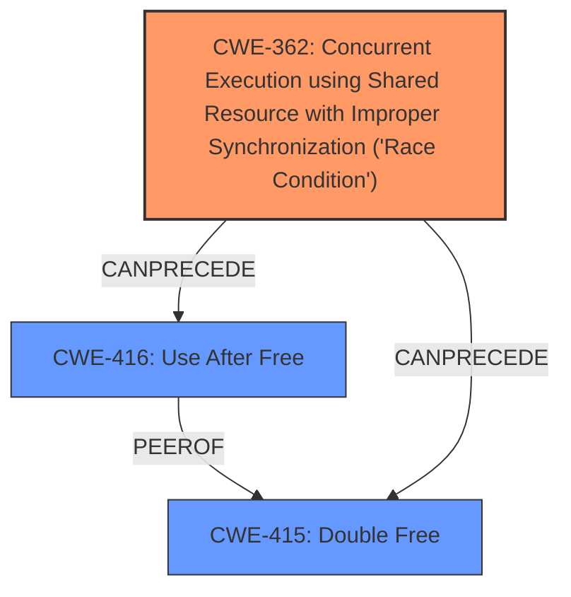

# Analysis for CVE-2020-11231

# Summary
| CWE ID | CWE Name | Confidence | CWE Abstraction Level | CWE Vulnerability Mapping Label | CWE-Vulnerability Mapping Notes |
|---|---|---|---|---|---|
| CWE-362 | Concurrent Execution using Shared Resource with Improper Synchronization ('Race Condition') | 0.9 | Class | Allowed-with-Review | Primary CWE |
| CWE-416 | Use After Free | 0.6 | Variant | Allowed | Secondary Candidate |
| CWE-415 | Double Free | 0.6 | Variant | Allowed | Secondary Candidate |

## Evidence and Confidence

*   **Confidence Score:** 0.7
*   **Evidence Strength:** MEDIUM

## Relationship Analysis
The primary CWE is CWE-362, representing the race condition due to concurrent execution on a shared resource.
CWE-362 is a class-level CWE, and child CWEs like CWE-366 (Race Condition within a Thread) could be more specific.
However, without more information, CWE-362 is the most appropriate.
CWE-416 and CWE-415 are potential consequences of the race condition, where memory corruption (heap corruption) occurs due to use-after-free or double-free conditions. These are peer vulnerabilities.
The abstraction levels also influence the choice. CWE-362 is a class, while CWE-415 and CWE-416 are variants, representing specific types of memory corruption that could arise from the race condition.

## Vulnerability Chain
The vulnerability chain starts with **concurrent access to a shared resource** (CWE-362). This leads to corruption of pointers and reference counters, which ultimately results in heap corruption. The heap corruption can manifest as use-after-free (CWE-416) or double-free (CWE-415) conditions.

## Summary of Analysis
The initial assessment focused on identifying the **root cause** and potential consequences of the vulnerability. The description explicitly mentions **concurrent access to a shared resource** as the **root cause**, which aligns with CWE-362. The resulting heap corruption suggests memory management issues like use-after-free or double-free.

The evidence from the vulnerability description key phrases: "**rootcause:** **concurrent access to shared resource**" supports the selection of CWE-362. The statement that "Two threads call one or both functions concurrently leading to corruption of pointers and reference counters which in turn can lead to heap corruption" strongly supports the classification.

The graph relationships show that CWE-362 can precede CWE-416 and CWE-415. This indicates that the race condition can lead to these memory corruption issues.

The selected CWEs are at an appropriate level of specificity. CWE-362 captures the general **root cause** of the race condition, while CWE-416 and CWE-415 represent the potential consequences of heap corruption. More information would be required to select more specific variants of CWE-362.

Relevant CWE Information:

# Enhanced Context (25 CWEs)

## CWE-191: Integer Underflow (Wrap or Wraparound)
**Abstraction Level**: Base
**Similarity Score**: 0.80
**Source**: dense

**Description**:
The product subtracts one value from another, such that the result is less than the minimum allowable integer value, which produces a value that is not equal to the correct result.

**Mapping Guidance**:
- Usage: Allowed
- Rationale: This CWE entry is at the Base level of abstraction, which is a preferred level of abstraction for mapping to the root causes of vulnerabilities.

## CWE-190: Integer Overflow or Wraparound
**Abstraction Level**: Base
**Similarity Score**: 0.77
**Source**: dense

**Description**:
The product performs a calculation that can
         produce an integer overflow or wraparound when the logic
         assumes that the resulting value will always be larger than
         the original value. This occurs when an integer value is
         incremented to a value that is too large to store in the
         associated representation. When this occurs, the value may
         become a very small or negative number.

**Mapping Guidance**:
- Usage: Allowed
- Rationale: This CWE entry is at the Base level of abstraction, which is a preferred level of abstraction for mapping to the root causes of vulnerabilities.

## CWE-197: Numeric Truncation Error
**Abstraction Level**: Base
**Similarity Score**: 0.77
**Source**: dense

**Description**:
Truncation errors occur when a primitive is cast to a primitive of a smaller size and data is lost in the conversion.

**Mapping Guidance**:
- Usage: Allowed
- Rationale: This CWE entry is at the Base level of abstraction, which is a preferred level of abstraction for mapping to the root causes of vulnerabilities.

## CWE-131: Incorrect Calculation of Buffer Size
**Abstraction Level**: Base
**Similarity Score**: 0.77
**Source**: dense

**Description**:
The product does not correctly calculate the size to be used when allocating a buffer, which could lead to a buffer overflow.

**Mapping Guidance**:
- Usage: Allowed
- Rationale: This CWE entry is at the Base level of abstraction, which is a preferred level of abstraction for mapping to the root causes of vulnerabilities.

## CWE-680: Integer Overflow to Buffer Overflow
**Abstraction Level**: Compound
**Similarity Score**: 0.77
**Source**: dense

**Description**:
The product performs a calculation to determine how much memory to allocate, but an integer overflow can occur that causes less memory to be allocated than expected, leading to a buffer overflow.

**Mapping Guidance**:
- Usage: Discouraged
- Rationale: This CWE entry is a named chain, which combines multiple weaknesses.

## CWE-681: Incorrect Conversion between Numeric Types
**Abstraction Level**: Base
**Similarity Score**: 0.77
**Source**: dense

**Description**:
When converting from one data type to another, such as long to integer, data can be omitted or translated in a way that produces unexpected values. If the resulting values are used in a sensitive context, then dangerous behaviors may occur.

**Mapping Guidance**:
- Usage: Allowed
- Rationale: This CWE entry is at the Base level of abstraction, which is a preferred level of abstraction for mapping to the root causes of vulnerabilities.

## CWE-823: Use of Out-of-range Pointer Offset
**Abstraction Level**: Base
**Similarity Score**: 0.76
**Source**: dense

**Description**:
The product performs pointer arithmetic on a valid pointer, but it uses an offset that can point outside of the intended range of valid memory locations for the resulting pointer.

**Mapping Guidance**:
- Usage: Allowed
- Rationale: This CWE entry is at the Base level of abstraction, which is a preferred level of abstraction for mapping to the root causes of vulnerabilities.

## CWE-667: Improper Locking
**Abstraction Level**: Class
**Similarity Score**: 0.76
**Source**: dense

**Description**:
The product does not properly acquire or release a lock on a resource, leading to unexpected resource state changes and behaviors.

**Mapping Guidance**:
- Usage: Allowed-with-Review
- Rationale: This CWE entry is a Class and might have Base-level children that would be more appropriate

## CWE-362: Concurrent Execution using Shared Resource with Improper Synchronization ('Race Condition')
**Abstraction Level**: Class
**Similarity Score**: 0.75
**Source**: dense

**Description**:
The product contains a concurrent code sequence that requires temporary, exclusive access to a shared resource, but a timing window exists in which the shared resource can be modified by another code sequence operating concurrently.

**Mapping Guidance**:
- Usage: Allowed-with-Review
- Rationale: This CWE entry is a Class and might have Base-level children that would be more appropriate

## CWE-366: Race Condition within a Thread
**Abstraction Level**: Base
**Similarity Score**: 0.75
**Source**: dense

**Description**:
If two threads of execution use a resource simultaneously, there exists the possibility that resources may be used while invalid, in turn making the state of execution undefined.

**Mapping Guidance**:
- Usage: Allowed
- Rationale: This CWE entry is at the Base level of abstraction, which is a preferred level of abstraction for mapping to the root causes of vulnerabilities.

## CWE-190: Integer Overflow or Wraparound
**Abstraction Level**: Base
**Similarity Score**: 6853.95
**