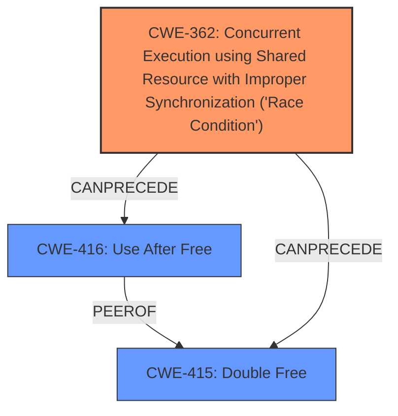

# Analysis for CVE-2020-11231

# Summary
| CWE ID | CWE Name | Confidence | CWE Abstraction Level | CWE Vulnerability Mapping Label | CWE-Vulnerability Mapping Notes |
|---|---|---|---|---|---|
| CWE-362 | Concurrent Execution using Shared Resource with Improper Synchronization ('Race Condition') | 0.9 | Class | Allowed-with-Review | Primary CWE |
| CWE-416 | Use After Free | 0.6 | Variant | Allowed | Secondary Candidate |
| CWE-415 | Double Free | 0.6 | Variant | Allowed | Secondary Candidate |

## Evidence and Confidence

*   **Confidence Score:** 0.7
*   **Evidence Strength:** MEDIUM

## Relationship Analysis
The primary CWE is CWE-362, representing the race condition due to concurrent execution on a shared resource.
CWE-362 is a class-level CWE, and child CWEs like CWE-366 (Race Condition within a Thread) could be more specific.
However, without more information, CWE-362 is the most appropriate.
CWE-416 and CWE-415 are potential consequences of the race condition, where memory corruption (heap corruption) occurs due to use-after-free or double-free conditions. These are peer vulnerabilities.
The abstraction levels also influence the choice. CWE-362 is a class, while CWE-415 and CWE-416 are variants, representing specific types of memory corruption that could arise from the race condition.

## Vulnerability Chain
The vulnerability chain starts with **concurrent access to a shared resource** (CWE-362). This leads to corruption of pointers and reference counters, which ultimately results in heap corruption. The heap corruption can manifest as use-after-free (CWE-416) or double-free (CWE-415) conditions.

## Summary of Analysis
The initial assessment focused on identifying the **root cause** and potential consequences of the vulnerability. The description explicitly mentions **concurrent access to a shared resource** as the **root cause**, which aligns with CWE-362. The resulting heap corruption suggests memory management issues like use-after-free or double-free.

The evidence from the vulnerability description key phrases: "**rootcause:** **concurrent access to shared resource**" supports the selection of CWE-362. The statement that "Two threads call one or both functions concurrently leading to corruption of pointers and reference counters which in turn can lead to heap corruption" strongly supports the classification.

The graph relationships show that CWE-362 can precede CWE-416 and CWE-415. This indicates that the race condition can lead to these memory corruption issues.

The selected CWEs are at an appropriate level of specificity. CWE-362 captures the general **root cause** of the race condition, while CWE-416 and CWE-415 represent the potential consequences of heap corruption. More information would be required to select more specific variants of CWE-362.

Relevant CWE Information:

# Enhanced Context (25 CWEs)

## CWE-191: Integer Underflow (Wrap or Wraparound)
**Abstraction Level**: Base
**Similarity Score**: 0.80
**Source**: dense

**Description**:
The product subtracts one value from another, such that the result is less than the minimum allowable integer value, which produces a value that is not equal to the correct result.

**Mapping Guidance**:
- Usage: Allowed
- Rationale: This CWE entry is at the Base level of abstraction, which is a preferred level of abstraction for mapping to the root causes of vulnerabilities.

## CWE-190: Integer Overflow or Wraparound
**Abstraction Level**: Base
**Similarity Score**: 0.77
**Source**: dense

**Description**:
The product performs a calculation that can
         produce an integer overflow or wraparound when the logic
         assumes that the resulting value will always be larger than
         the original value. This occurs when an integer value is
         incremented to a value that is too large to store in the
         associated representation. When this occurs, the value may
         become a very small or negative number.

**Mapping Guidance**:
- Usage: Allowed
- Rationale: This CWE entry is at the Base level of abstraction, which is a preferred level of abstraction for mapping to the root causes of vulnerabilities.

## CWE-197: Numeric Truncation Error
**Abstraction Level**: Base
**Similarity Score**: 0.77
**Source**: dense

**Description**:
Truncation errors occur when a primitive is cast to a primitive of a smaller size and data is lost in the conversion.

**Mapping Guidance**:
- Usage: Allowed
- Rationale: This CWE entry is at the Base level of abstraction, which is a preferred level of abstraction for mapping to the root causes of vulnerabilities.

## CWE-131: Incorrect Calculation of Buffer Size
**Abstraction Level**: Base
**Similarity Score**: 0.77
**Source**: dense

**Description**:
The product does not correctly calculate the size to be used when allocating a buffer, which could lead to a buffer overflow.

**Mapping Guidance**:
- Usage: Allowed
- Rationale: This CWE entry is at the Base level of abstraction, which is a preferred level of abstraction for mapping to the root causes of vulnerabilities.

## CWE-680: Integer Overflow to Buffer Overflow
**Abstraction Level**: Compound
**Similarity Score**: 0.77
**Source**: dense

**Description**:
The product performs a calculation to determine how much memory to allocate, but an integer overflow can occur that causes less memory to be allocated than expected, leading to a buffer overflow.

**Mapping Guidance**:
- Usage: Discouraged
- Rationale: This CWE entry is a named chain, which combines multiple weaknesses.

## CWE-681: Incorrect Conversion between Numeric Types
**Abstraction Level**: Base
**Similarity Score**: 0.77
**Source**: dense

**Description**:
When converting from one data type to another, such as long to integer, data can be omitted or translated in a way that produces unexpected values. If the resulting values are used in a sensitive context, then dangerous behaviors may occur.

**Mapping Guidance**:
- Usage: Allowed
- Rationale: This CWE entry is at the Base level of abstraction, which is a preferred level of abstraction for mapping to the root causes of vulnerabilities.

## CWE-823: Use of Out-of-range Pointer Offset
**Abstraction Level**: Base
**Similarity Score**: 0.76
**Source**: dense

**Description**:
The product performs pointer arithmetic on a valid pointer, but it uses an offset that can point outside of the intended range of valid memory locations for the resulting pointer.

**Mapping Guidance**:
- Usage: Allowed
- Rationale: This CWE entry is at the Base level of abstraction, which is a preferred level of abstraction for mapping to the root causes of vulnerabilities.

## CWE-667: Improper Locking
**Abstraction Level**: Class
**Similarity Score**: 0.76
**Source**: dense

**Description**:
The product does not properly acquire or release a lock on a resource, leading to unexpected resource state changes and behaviors.

**Mapping Guidance**:
- Usage: Allowed-with-Review
- Rationale: This CWE entry is a Class and might have Base-level children that would be more appropriate

## CWE-362: Concurrent Execution using Shared Resource with Improper Synchronization ('Race Condition')
**Abstraction Level**: Class
**Similarity Score**: 0.75
**Source**: dense

**Description**:
The product contains a concurrent code sequence that requires temporary, exclusive access to a shared resource, but a timing window exists in which the shared resource can be modified by another code sequence operating concurrently.

**Mapping Guidance**:
- Usage: Allowed-with-Review
- Rationale: This CWE entry is a Class and might have Base-level children that would be more appropriate

## CWE-366: Race Condition within a Thread
**Abstraction Level**: Base
**Similarity Score**: 0.75
**Source**: dense

**Description**:
If two threads of execution use a resource simultaneously, there exists the possibility that resources may be used while invalid, in turn making the state of execution undefined.

**Mapping Guidance**:
- Usage: Allowed
- Rationale: This CWE entry is at the Base level of abstraction, which is a preferred level of abstraction for mapping to the root causes of vulnerabilities.

## CWE-190: Integer Overflow or Wraparound
**Abstraction Level**: Base
**Similarity Score**: 6853.95
**

# Enhanced Query for CVE-2020-11231

## Vulnerability Description
Two threads call one or both functions concurrently leading to corruption of pointers and reference counters which in turn can lead to heap corruption in Snapdragon Compute, Snapdragon Connectivity, Snapdragon Consumer IOT, Snapdragon Industrial IOT, Snapdragon Mobile

### Vulnerability Description Key Phrases
- **rootcause:** **concurrent access to shared resource**
- **impact:** heap corruption
- **product:** Snapdragon

## Retriever Results

### Top Combined Results

| Rank | CWE ID | Name | Abstraction | Usage  | Retrievers | Individual Scores |
|------|--------|------|-------------|-------|------------|-------------------|
| 1 | 415 | Double Free | Variant | Allowed | sparse | 0.456 |
| 2 | 367 | Time-of-check Time-of-use (TOCTOU) Race Condition | Base | Allowed | sparse | 0.382 |
| 3 | 822 | Untrusted Pointer Dereference | Base | Allowed | sparse | 0.379 |
| 4 | 126 | Buffer Over-read | Variant | Allowed | sparse | 0.375 |
| 5 | 823 | Use of Out-of-range Pointer Offset | Base | Allowed | sparse | 0.360 |
| 6 | 1421 | Exposure of Sensitive Information in Shared Microarchitectural Structures during Transient Execution | Base | Allowed | dense | 0.543 |
| 7 | 781 | Improper Address Validation in IOCTL with METHOD_NEITHER I/O Control Code | Variant | Allowed | graph | 0.003 |
| 8 | 390 | Detection of Error Condition Without Action | Base | Allowed | sparse | 0.341 |
| 9 | 362 | Concurrent Execution using Shared Resource with Improper Synchronization ('Race Condition') | Class | Allowed-with-Review | sparse | 0.332 |
| 10 | 190 | Integer Overflow or Wraparound | Base | Allowed | sparse | 0.321 |

# Complete CWE Specifications

## CWE-415: Double Free
**Abstraction:** Variant
**Status:** Draft

### Description
The product calls free() twice on the same memory address, potentially leading to modification of unexpected memory locations.

### Extended Description
When a program calls free() twice with the same argument, the program's memory management data structures become corrupted. This corruption can cause the program to crash or, in some circumstances, cause two later calls to malloc() to return the same pointer. If malloc() returns the same value twice and the program later gives the attacker control over the data that is written into this doubly-allocated memory, the program becomes vulnerable to a buffer overflow attack.

### Alternative Terms
Double-free

### Relationships
ChildOf -> CWE-825
ChildOf -> CWE-1341
ChildOf -> CWE-672
ChildOf -> CWE-672
ChildOf -> CWE-672
ChildOf -> CWE-666
PeerOf -> CWE-416
PeerOf -> CWE-123

### Mapping Guidance
**Usage:** Allowed
**Rationale:** This CWE entry is at the Variant level of abstraction, which is a preferred level of abstraction for mapping to the root causes of vulnerabilities.
**Comments:** Carefully read both the name and description to ensure that this mapping is an appropriate fit. Do not try to 'force' a mapping to a lower-level Base/Variant simply to comply with this preferred level of abstraction.
**Reasons:**
- Acceptable-Use

### Additional Notes
**[Relationship]** This is usually resultant from another weakness, such as an unhandled error or race condition between threads. It could also be primary to weaknesses such as buffer overflows.

**[Theoretical]** It could be argued that Double Free would be most appropriately located as a child of "Use after Free", but "Use" and "Release" are considered to be distinct operations within vulnerability theory, therefore this is more accurately "Release of a Resource after Expiration or Release", which doesn't exist yet.

### Observed Examples
- **CVE-2006-5051:** Chain: Signal handler contains too much functionality (CWE-828), introducing a race condition (CWE-362) that leads to a double free (CWE-415).
- **CVE-2004-0642:** Double free resultant from certain error conditions.
- **CVE-2004-0772:** Double free resultant from certain error conditions.

## CWE-367: Time-of-check Time-of-use (TOCTOU) Race Condition
**Abstraction:** Base
**Status:** Incomplete

### Description
The product checks the state of a resource before using that resource, but the resource's state can change between the check and the use in a way that invalidates the results of the check. This can cause the product to perform invalid actions when the resource is in an unexpected state.

### Extended Description
This weakness can be security-relevant when an attacker can influence the state of the resource between check and use. This can happen with shared resources such as files, memory, or even variables in multithreaded programs.

### Alternative Terms
TOCTTOU: The TOCTTOU acronym expands to "Time Of Check To Time Of Use".
TOCCTOU: The TOCCTOU acronym is most likely a typo of TOCTTOU, but it has been used in some influential documents, so the typo is repeated fairly frequently.

### Relationships
ChildOf -> CWE-362
ChildOf -> CWE-362

### Mapping Guidance
**Usage:** Allowed
**Rationale:** This CWE entry is at the Base level of abstraction, which is a preferred level of abstraction for mapping to the root causes of vulnerabilities.
**Comments:** Carefully read both the name and description to ensure that this mapping is an appropriate fit. Do not try to 'force' a mapping to a lower-level Base/Variant simply to comply with this preferred level of abstraction.
**Reasons:**
- Acceptable-Use

### Additional Notes
**[Relationship]** TOCTOU issues do not always involve symlinks, and not every symlink issue is a TOCTOU problem.

**[Research Gap]** Non-symlink TOCTOU issues are not reported frequently, but they are likely to occur in code that attempts to be secure.

### Observed Examples
- **CVE-2015-1743:** TOCTOU in sandbox process allows installation of untrusted browser add-ons by replacing a file after it has been verified, but before it is executed
- **CVE-2003-0813:** A multi-threaded race condition allows remote attackers to cause a denial of service (crash or reboot) by causing two threads to process the same RPC request, which causes one thread to use memory after it has been freed.
- **CVE-2004-0594:** PHP flaw allows remote attackers to execute arbitrary code by aborting execution before the initialization of key data structures is complete.

## CWE-822: Untrusted Pointer Dereference
**Abstraction:** Base
**Status:** Incomplete

### Description
The product obtains a value from an untrusted source, converts this value to a pointer, and dereferences the resulting pointer.

### Extended Description

An attacker can supply a pointer for memory locations that the product is not expecting. If the pointer is dereferenced for a write operation, the attack might allow modification of critical state variables, cause a crash, or execute code. If the dereferencing operation is for a read, then the attack might allow reading of sensitive data, cause a crash, or set a variable to an unexpected value (since the value will be read from an unexpected memory location).

There are several variants of this weakness, including but not necessarily limited to:

  - The untrusted value is directly invoked as a function call.

  - In OS kernels or drivers where there is a boundary between "userland" and privileged memory spaces, an untrusted pointer might enter through an API or system call (see CWE-781 for one such example).

  - Inadvertently accepting the value from an untrusted control sphere when it did not have to be accepted as input at all. This might occur when the code was originally developed to be run by a single user in a non-networked environment, and the code is then ported to or otherwise exposed to a networked environment.

### Alternative Terms
None

### Relationships
ChildOf -> CWE-119
ChildOf -> CWE-119
ChildOf -> CWE-119
CanPrecede -> CWE-125
CanPrecede -> CWE-787

### Mapping Guidance
**Usage:** Allowed
**Rationale:** This CWE entry is at the Base level of abstraction, which is a preferred level of abstraction for mapping to the root causes of vulnerabilities.
**Comments:** Carefully read both the name and description to ensure that this mapping is an appropriate fit. Do not try to 'force' a mapping to a lower-level Base/Variant simply to comply with this preferred level of abstraction.
**Reasons:**
- Acceptable-Use

### Additional Notes
**[Maintenance]** There are close relationships between incorrect pointer dereferences and other weaknesses related to buffer operations. There may not be sufficient community agreement regarding these relationships. Further study is needed to determine when these relationships are chains, composites, perspective/layering, or other types of relationships. As of September 2010, most of the relationships are being captured as chains.

**[Terminology]** Many weaknesses related to pointer dereferences fall under the general term of "memory corruption" or "memory safety." As of September 2010, there is no commonly-used terminology that covers the lower-level variants.

### Observed Examples
- **CVE-2007-5655:** message-passing framework interprets values in packets as pointers, causing a crash.
- **CVE-2010-2299:** labeled as a "type confusion" issue, also referred to as a "stale pointer." However, the bug ID says "contents are simply interpreted as a pointer... renderer ordinarily doesn't supply this pointer directly". The "handle" in the untrusted area is replaced in one function, but not another - thus also, effectively, exposure to wrong sphere (CWE-668).
- **CVE-2009-1719:** Untrusted dereference using undocumented constructor.

## CWE-126: Buffer Over-read
**Abstraction:** Variant
**Status:** Draft

### Description
The product reads from a buffer using buffer access mechanisms such as indexes or pointers that reference memory locations after the targeted buffer.

### Extended Description
This typically occurs when the pointer or its index is incremented to a position beyond the bounds of the buffer or when pointer arithmetic results in a position outside of the valid memory location to name a few. This may result in exposure of sensitive information or possibly a crash.

### Alternative Terms
None

### Relationships
ChildOf -> CWE-125
ChildOf -> CWE-788

### Mapping Guidance
**Usage:** Allowed
**Rationale:** This CWE entry is at the Variant level of abstraction, which is a preferred level of abstraction for mapping to the root causes of vulnerabilities.
**Comments:** Carefully read both the name and description to ensure that this mapping is an appropriate fit. Do not try to 'force' a mapping to a lower-level Base/Variant simply to comply with this preferred level of abstraction.
**Reasons:**
- Acceptable-Use

### Additional Notes
**[Relationship]** These problems may be resultant from missing sentinel values (CWE-463) or trusting a user-influenced input length variable.

### Observed Examples
- **CVE-2022-1733:** Text editor has out-of-bounds read past end of line while indenting C code
- **CVE-2014-0160:** Chain: "Heartbleed" bug receives an inconsistent length parameter (CWE-130) enabling an out-of-bounds read (CWE-126), returning memory that could include private cryptographic keys and other sensitive data.
- **CVE-2009-2523:** Chain: product does not handle when an input string is not NULL terminated, leading to buffer over-read or heap-based buffer overflow.

## CWE-823: Use of Out-of-range Pointer Offset
**Abstraction:** Base
**Status:** Incomplete

### Description
The product performs pointer arithmetic on a valid pointer, but it uses an offset that can point outside of the intended range of valid memory locations for the resulting pointer.

### Extended Description

While a pointer can contain a reference to any arbitrary memory location, a program typically only intends to use the pointer to access limited portions of memory, such as contiguous memory used to access an individual array.

Programs may use offsets in order to access fields or sub-elements stored within structured data. The offset might be out-of-range if it comes from an untrusted source, is the result of an incorrect calculation, or occurs because of another error.

If an attacker can control or influence the offset so that it points outside of the intended boundaries of the structure, then the attacker may be able to read or write to memory locations that are used elsewhere in the product. As a result, the attack might change the state of the product as accessed through program variables, cause a crash or instable behavior, and possibly lead to code execution.

### Alternative Terms
Untrusted pointer offset: This term is narrower than the concept of "out-of-range" offset, since the offset might be the result of a calculation or other error that does not depend on any externally-supplied values.

### Relationships
ChildOf -> CWE-119
ChildOf -> CWE-119
ChildOf -> CWE-119
CanPrecede -> CWE-125
CanPrecede -> CWE-787

### Mapping Guidance
**Usage:** Allowed
**Rationale:** This CWE entry is at the Base level of abstraction, which is a preferred level of abstraction for mapping to the root causes of vulnerabilities.
**Comments:** Carefully read both the name and description to ensure that this mapping is an appropriate fit. Do not try to 'force' a mapping to a lower-level Base/Variant simply to comply with this preferred level of abstraction.
**Reasons:**
- Acceptable-Use

### Additional Notes
**[Maintenance]** There are close relationships between incorrect pointer dereferences and other weaknesses related to buffer operations. There may not be sufficient community agreement regarding these relationships. Further study is needed to determine when these relationships are chains, composites, perspective/layering, or other types of relationships. As of September 2010, most of the relationships are being captured as chains.

**[Terminology]** Many weaknesses related to pointer dereferences fall under the general term of "memory corruption" or "memory safety." As of September 2010, there is no commonly-used terminology that covers the lower-level variants.

### Observed Examples
- **CVE-2010-2160:** Invalid offset in undocumented opcode leads to memory corruption.
- **CVE-2010-1281:** Multimedia player uses untrusted value from a file when using file-pointer calculations.
- **CVE-2009-3129:** Spreadsheet program processes a record with an invalid size field, which is later used as an offset.

## CWE-1421: Exposure of Sensitive Information in Shared Microarchitectural Structures during Transient Execution
**Abstraction:** Base
**Status:** Incomplete

### Description

			A processor event may allow transient operations to access
			architecturally restricted data (for example, in another address
			space) in a shared microarchitectural structure (for example, a CPU
			cache), potentially exposing the data over a covert channel.
		  

### Extended Description

Many commodity processors have Instruction Set Architecture (ISA) features that protect software components from one another. These features can include memory segmentation, virtual memory, privilege rings, trusted execution environments, and virtual machines, among others. For example, virtual memory provides each process with its own address space, which prevents processes from accessing each other's private data. Many of these features can be used to form hardware-enforced security boundaries between software components.

Many commodity processors also share microarchitectural resources that cache (temporarily store) data, which may be confidential. These resources may be shared across processor contexts, including across SMT threads, privilege rings, or others.

When transient operations allow access to ISA-protected data in a shared microarchitectural resource, this might violate users' expectations of the ISA feature that is bypassed. For example, if transient operations can access a victim's private data in a shared microarchitectural resource, then the operations' microarchitectural side effects may correspond to the accessed data. If an attacker can trigger these transient operations and observe their side effects through a covert channel [REF-1400], then the attacker may be able to infer the victim's private data. Private data could include sensitive program data, OS/VMM data, page table data (such as memory addresses), system configuration data (see Demonstrative Example 3), or any other data that the attacker does not have the required privileges to access.

### Alternative Terms
None

### Relationships
ChildOf -> CWE-1420
ChildOf -> CWE-1420

### Mapping Guidance
**Usage:** Allowed
**Rationale:** This CWE entry is at the Base level of abstraction, which is a preferred level of abstraction for mapping to the root causes of vulnerabilities
**Comments:** If a weakness can potentially be exploited to infer data that is accessible inside or outside the current processor context, then the weakness could map to CWE-1421 and to another CWE such as CWE-1420.
**Reasons:**
- Acceptable-Use

### Observed Examples
- **CVE-2017-5715:** A fault may allow transient user-mode operations to access kernel data cached in the L1D, potentially exposing the data over a covert channel.
- **CVE-2018-3615:** A fault may allow transient non-enclave operations to access SGX enclave data cached in the L1D, potentially exposing the data over a covert channel.
- **CVE-2019-1135:** A TSX Asynchronous Abort may allow transient operations to access architecturally restricted data, potentially exposing the data over a covert channel.

## CWE-781: Improper Address Validation in IOCTL with METHOD_NEITHER I/O Control Code
**Abstraction:** Variant
**Status:** Draft

### Description
The product defines an IOCTL that uses METHOD_NEITHER for I/O, but it does not validate or incorrectly validates the addresses that are provided.

### Extended Description
When an IOCTL uses the METHOD_NEITHER option for I/O control, it is the responsibility of the IOCTL to validate the addresses that have been supplied to it. If validation is missing or incorrect, attackers can supply arbitrary memory addresses, leading to code execution or a denial of service.

### Alternative Terms
None

### Relationships
ChildOf -> CWE-1285
CanPrecede -> CWE-822

### Mapping Guidance
**Usage:** Allowed
**Rationale:** This CWE entry is at the Variant level of abstraction, which is a preferred level of abstraction for mapping to the root causes of vulnerabilities.
**Comments:** Carefully read both the name and description to ensure that this mapping is an appropriate fit. Do not try to 'force' a mapping to a lower-level Base/Variant simply to comply with this preferred level of abstraction.
**Reasons:**
- Acceptable-Use

### Additional Notes
**[Applicable Platform]** 

Because IOCTL functionality is typically performing low-level actions and closely interacts with the operating system, this weakness may only appear in code that is written in low-level languages.

**[Research Gap]** 

While this type of issue has been known since 2006, it is probably still under-studied and under-reported. Most of the focus has been on high-profile software and security products, but other kinds of system software also use drivers. Since exploitation requires the development of custom code, it requires some skill to find this weakness.

Because exploitation typically requires local privileges, it might not be a priority for active attackers. However, remote exploitation may be possible for software such as device drivers. Even when remote vectors are not available, it may be useful as the final privilege-escalation step in multi-stage remote attacks against application-layer software, or as the primary attack by a local user on a multi-user system.

### Observed Examples
- **CVE-2006-2373:** Driver for file-sharing and messaging protocol allows attackers to execute arbitrary code.
- **CVE-2009-0686:** Anti-virus product does not validate addresses, allowing attackers to gain SYSTEM privileges.
- **CVE-2009-0824:** DVD software allows attackers to cause a crash.

## CWE-390: Detection of Error Condition Without Action
**Abstraction:** Base
**Status:** Draft

### Description
The product detects a specific error, but takes no actions to handle the error.

### Extended Description
Not provided

### Alternative Terms
None

### Relationships
ChildOf -> CWE-755
CanPrecede -> CWE-401

### Mapping Guidance
**Usage:** Allowed
**Rationale:** This CWE entry is at the Base level of abstraction, which is a preferred level of abstraction for mapping to the root causes of vulnerabilities.
**Comments:** Carefully read both the name and description to ensure that this mapping is an appropriate fit. Do not try to 'force' a mapping to a lower-level Base/Variant simply to comply with this preferred level of abstraction.
**Reasons:**
- Acceptable-Use

### Observed Examples
- **CVE-2022-21820:** A GPU data center manager detects an error due to a malformed request but does not act on it, leading to memory corruption.

## CWE-362: Concurrent Execution using Shared Resource with Improper Synchronization ('Race Condition')
**Abstraction:** Class
**Status:** Draft

### Description
The product contains a concurrent code sequence that requires temporary, exclusive access to a shared resource, but a timing window exists in which the shared resource can be modified by another code sequence operating concurrently.

### Extended Description

A race condition occurs within concurrent environments, and it is effectively a property of a code sequence. Depending on the context, a code sequence may be in the form of a function call, a small number of instructions, a series of program invocations, etc.

A race condition violates these properties, which are closely related:

  - Exclusivity - the code sequence is given exclusive access to the shared resource, i.e., no other code sequence can modify properties of the shared resource before the original sequence has completed execution.

  - Atomicity - the code sequence is behaviorally atomic, i.e., no other thread or process can concurrently execute the same sequence of instructions (or a subset) against the same resource.

A race condition exists when an "interfering code sequence" can still access the shared resource, violating exclusivity.

The interfering code sequence could be "trusted" or "untrusted." A trusted interfering code sequence occurs within the product; it cannot be modified by the attacker, and it can only be invoked indirectly. An untrusted interfering code sequence can be authored directly by the attacker, and typically it is external to the vulnerable product.

### Alternative Terms
Race Condition

### Relationships
ChildOf -> CWE-691
CanPrecede -> CWE-416
CanPrecede -> CWE-476

### Mapping Guidance
**Usage:** Allowed-with-Review
**Rationale:** This CWE entry is a Class and might have Base-level children that would be more appropriate
**Comments:** Examine children of this entry to see if there is a better fit
**Reasons:**
- Abstraction

### Additional Notes
**[Maintenance]** The relationship between race conditions and synchronization problems (CWE-662) needs to be further developed. They are not necessarily two perspectives of the same core concept, since synchronization is only one technique for avoiding race conditions, and synchronization can be used for other purposes besides race condition prevention.

**[Research Gap]** Race conditions in web applications are under-studied and probably under-reported. However, in 2008 there has been growing interest in this area.

**[Research Gap]** Much of the focus of race condition research has been in Time-of-check Time-of-use (TOCTOU) variants (CWE-367), but many race conditions are related to synchronization problems that do not necessarily require a time-of-check.

**[Research Gap]** From a classification/taxonomy perspective, the relationships between concurrency and program state need closer investigation and may be useful in organizing related issues.

### Observed Examples
- **CVE-2022-29527:** Go application for cloud management creates a world-writable sudoers file that allows local attackers to inject sudo rules and escalate privileges to root by winning a race condition.
- **CVE-2021-1782:** Chain: improper locking (CWE-667) leads to race condition (CWE-362), as exploited in the wild per CISA KEV.
- **CVE-2021-0920:** Chain: mobile platform race condition (CWE-362) leading to use-after-free (CWE-416), as exploited in the wild per CISA KEV.

## CWE-190: Integer Overflow or Wraparound
**Abstraction:** Base
**Status:** Stable

### Description
The product performs a calculation that can
         produce an integer overflow or wraparound when the logic
         assumes that the resulting value will always be larger than
         the original value. This occurs when an integer value is
         incremented to a value that is too large to store in the
         associated representation. When this occurs, the value may
         become a very small or negative number.

### Extended Description
Not provided

### Alternative Terms
Overflow: The terms "overflow" and "wraparound" are used interchangeably by some people, but they can have more precise distinctions by others. See Terminology Notes.
Wraparound: The terms "overflow" and "wraparound" are used interchangeably by some people, but they can have more precise distinctions by others. See Terminology Notes.
wrap, wrap-around, wrap around: Alternate spellings of "wraparound"

### Relationships
ChildOf -> CWE-682
ChildOf -> CWE-682
ChildOf -> CWE-20
CanPrecede -> CWE-119

### Mapping Guidance
**Usage:** Allowed
**Rationale:** This CWE entry is at the Base level of abstraction, which is a preferred level of abstraction for mapping to the root causes of vulnerabilities.
**Comments:** Be careful of terminology problems with "overflow," "underflow," and "wraparound" - see Terminology Notes. Carefully read both the name and description to ensure that this mapping is an appropriate fit. Do not try to 'force' a mapping to a lower-level Base/Variant simply to comply with this preferred level of abstraction.
**Reasons:**
- Acceptable-Use
**Suggested Alternatives:**
- CWE-191: Integer Underflow (Wrap or Wraparound). Consider CWE-191 when the result is less than the minimum value that can be represented (sometimes called "underflows").

### Additional Notes
**[Relationship]** Integer overflows can be primary to buffer overflows when they cause less memory to be allocated than expected.

**[Terminology]** 

"Integer overflow" is sometimes used to cover several types of errors, including signedness errors, or buffer overflows that involve manipulation of integer data types instead of characters. Part of the confusion results from the fact that 0xffffffff is -1 in a signed context. Other confusion also arises because of the role that integer overflows have in chains.

A "wraparound" is a well-defined, standard behavior that follows specific rules for how to handle situations when the intended numeric value is too large or too small to be represented, as specified in standards such as C11.

"Overflow" is sometimes conflated with "wraparound" but typically indicates a non-standard or undefined behavior.

The "overflow" term is sometimes used to indicate cases where either the maximum or the minimum is exceeded, but others might only use "overflow" to indicate exceeding the maximum while using "underflow" for exceeding the minimum.

Some people use "overflow" to mean any value outside the representable range - whether greater than the maximum, or less than the minimum - but CWE uses "underflow" for cases in which the intended result is less than the minimum.

See [REF-1440] for additional explanation of the ambiguity of terminology.

**[Other]** While there may be circumstances in which the logic intentionally relies on wrapping - such as with modular arithmetic in timers or counters - it can have security consequences if the wrap is unexpected. This is especially the case if the integer overflow can be triggered using user-supplied inputs.

### Observed Examples
- **CVE-2021-43537:** Chain: in a web browser, an unsigned 64-bit integer is forcibly cast to a 32-bit integer (CWE-681) and potentially leading to an integer overflow (CWE-190). If an integer overflow occurs, this can cause heap memory corruption (CWE-122)
- **CVE-2022-21668:** Chain: Python library does not limit the resources used to process images that specify a very large number of bands (CWE-1284), leading to excessive memory consumption (CWE-789) or an integer overflow (CWE-190).
- **CVE-2022-0545:** Chain: 3D renderer has an integer overflow (CWE-190) leading to write-what-where condition (CWE-123) using a crafted image.

