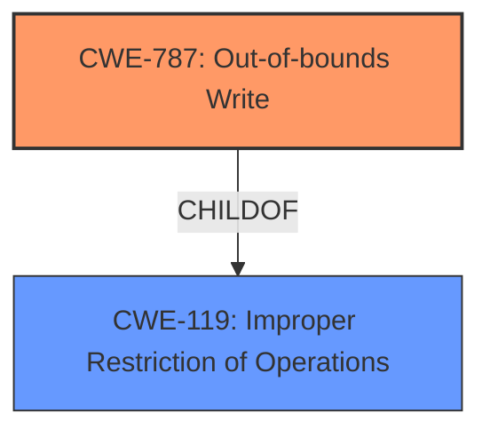

# Analysis for CVE-2020-11236

# Summary
| CWE ID | CWE Name | Confidence | CWE Abstraction Level | CWE Vulnerability Mapping Label | CWE-Vulnerability Mapping Notes |
|---|---|---|---|---|---|
| CWE-787 | Out-of-bounds Write | 0.9 | Base | Allowed | Primary CWE |

## Evidence and Confidence

*   **Confidence Score:** 0.9
*   **Evidence Strength:** HIGH

## Relationship Analysis
The primary relationship that influenced my decision was the ChildOf relationship between CWE-787 and CWE-119 (Improper Restriction of Operations Within the Bounds of a Memory Buffer). While CWE-119 is a broader category, the vulnerability specifically involves writing data outside the intended buffer, making CWE-787 the more precise choice. The Retriever Results also highly ranked CWE-787, reinforcing this decision.

## Vulnerability Chain
The vulnerability chain is relatively straightforward:

1.  **Root Cause:** **invalid value of total dimension in the non-histogram type KPI**
2.  **Weakness:** **Memory corruption** due to out-of-bounds write
3.  **Impact:** Denial of service

## Summary of Analysis
The primary factor influencing my assessment is the explicit mention of "**memory corruption**" arising from an "**invalid value of total dimension in the non-histogram type KPI**". This strongly suggests that the vulnerability involves writing data outside the intended memory boundaries.

The Retriever Results also support this assessment, with CWE-787 (Out-of-bounds Write) being the top-ranked CWE. The description of CWE-787 directly aligns with the vulnerability description, as it involves writing data past the end or before the beginning of the intended buffer.

The relationship graph shows that CWE-787 is a child of CWE-119 (Improper Restriction of Operations Within the Bounds of a Memory Buffer). While CWE-119 is a broader category, CWE-787 is a more specific representation of the vulnerability, as it explicitly involves writing data outside the intended buffer.

Based on the evidence and relationship analysis, I am confident that CWE-787 is the most appropriate classification for this vulnerability.

Relevant CWE Information:

# Enhanced Context (25 CWEs)
The following CWEs were identified as potentially relevant to this vulnerability:

## CWE-131: Incorrect Calculation of Buffer Size
**Abstraction Level**: Base
**Similarity Score**: 0.79
**Source**: dense

**Description**:
The product does not correctly calculate the size to be used when allocating a buffer, which could lead to a buffer overflow.

**Mapping Guidance**:
- Usage: Allowed
- Rationale: This CWE entry is at the Base level of abstraction, which is a preferred level of abstraction for mapping to the root causes of vulnerabilities.

*This CWE was considered, but the description doesn't align as well as CWE-787. There isn't sufficient evidence to suggest the root cause is an incorrect buffer size calculation.*

## CWE-703: Improper Check or Handling of Exceptional Conditions
**Abstraction Level**: Pillar
**Similarity Score**: 0.79
**Source**: dense

**Description**:
The product does not properly anticipate or handle exceptional conditions that rarely occur during normal operation of the product.

**Mapping Guidance**:
- Usage: Discouraged
- Rationale: This CWE entry is extremely high-level, a Pillar.

*This CWE was not selected because it is too high-level.*

## CWE-754: Improper Check for Unusual or Exceptional Conditions
**Abstraction Level**: Class
**Similarity Score**: 0.78
**Source**: dense

**Description**:
The product does not check or incorrectly checks for unusual or exceptional conditions that are not expected to occur frequently during day to day operation of the product.

**Mapping Guidance**:
- Usage: Allowed-with-Review
- Rationale: This CWE entry is a Class and might have Base-level children that would be more appropriate

*This CWE was not selected because it is too high-level.*

## CWE-129: Improper Validation of Array Index
**Abstraction Level**: Variant
**Similarity Score**: 0.78
**Source**: dense

**Description**:
The product uses untrusted input when calculating or using an array index, but the product does not validate or incorrectly validates the index to ensure the index references a valid position within the array.

**Mapping Guidance**:
- Usage: Allowed
- Rationale: This CWE entry is at the Variant level of abstraction, which is a preferred level of abstraction for mapping to the root causes of vulnerabilities.

*This CWE was considered, but there isn't enough evidence to suggest that the issue specifically involves an array index.*

## CWE-667: Improper Locking
**Abstraction Level**: Class
**Similarity Score**: 0.78
**Source**: dense

**Description**:
The product does not properly acquire or release a lock on a resource, leading to unexpected resource state changes and behaviors.

**Mapping Guidance**:
- Usage: Allowed-with-Review
- Rationale: This CWE entry is a Class and might have Base-level children that would be more appropriate

*This CWE was not selected because it is too high-level.*

## CWE-404: Improper Resource Shutdown or Release
**Abstraction Level**: Class
**Similarity Score**: 0.78
**Source**: dense

**Description**:
The product does not release or incorrectly releases a resource before it is made available for re-use.

**Mapping Guidance**:
- Usage: Allowed-with-Review
- Rationale: This CWE entry is a Class and might have Base-level children that would be more appropriate

*This CWE was not selected because it is too high-level.*

## CWE-252: Unchecked Return Value
**Abstraction Level**: Base
**Similarity Score**: 0.78
**Source**: dense

**Description**:
The product does not check the return value from a method or function, which can prevent it from detecting unexpected states and conditions.

**Mapping Guidance**:
- Usage: Allowed
- Rationale: This CWE entry is at the Base level of abstraction, which is a preferred level of abstraction for mapping to the root causes of vulnerabilities.

*This CWE was not selected because there isn't enough evidence to suggest the root cause is an unchecked return value.*

## CWE-125: Out-of-bounds Read
**Abstraction Level**: Base
**Similarity Score**: 0.78
**Source**: dense

**Description**:
The product reads data past the end, or before the beginning, of the intended buffer.

**Mapping Guidance**:
- Usage: Allowed
- Rationale: This CWE entry is at the Base level of abstraction, which is a preferred level of abstraction for mapping to the root causes of vulnerabilities.

*This CWE was not selected because the Vulnerability Description explicitly calls out memory corruption, which is more associated with writing.*

## CWE-824: Access of Uninitialized Pointer
**Abstraction Level**: Base
**Similarity Score**: 0.77
**Source**: dense

**Description**:
The product accesses or uses a pointer that has not been initialized.

**Mapping Guidance**:
- Usage: Allowed
- Rationale: This CWE entry is at the Base level of abstraction, which is a preferred level of abstraction for mapping to the root causes of vulnerabilities.

*This CWE was not selected because there isn't enough evidence to suggest the root cause is an uninitialized pointer.*

## CWE-367: Time-of-check Time-of-use (TOCTOU) Race Condition
**Abstraction Level**: Base
**Similarity Score**: 0.77
**Source**: dense

**Description**:
The product checks the state of a resource before using that resource, but the resource's state can change between the check and the use in a way that invalidates the results of the check. This can cause the product to perform invalid actions when the resource is in an unexpected state.

**Mapping Guidance**:
- Usage: Allowed
- Rationale: This CWE entry is at the Base level of abstraction, which is a preferred level of abstraction for mapping to the root causes of vulnerabilities.

*This CWE was not selected because there isn't enough evidence to suggest the root cause is a TOCTOU race condition.*

## CWE-823: Use of Out-of-range Pointer Offset
**Abstraction Level**: Base
**Similarity Score**: 5718.32
**Source**: sparse

**Description**:
The product performs pointer arithmetic on a valid pointer, but it uses an offset that can point outside of the intended range of valid memory locations for the resulting pointer.

**Mapping Guidance**:
- Usage: Allowed
- Rationale: This CWE entry is at the Base level of abstraction, which is a preferred level of abstraction for mapping to the root causes of vulnerabilities.

*This CWE was considered, but the description doesn't align as well as CWE-78