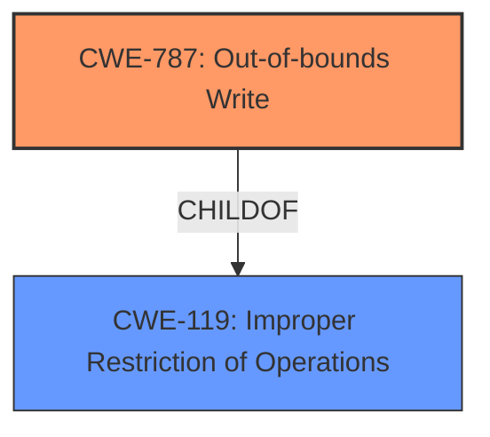

# Analysis for CVE-2020-11236

# Summary
| CWE ID | CWE Name | Confidence | CWE Abstraction Level | CWE Vulnerability Mapping Label | CWE-Vulnerability Mapping Notes |
|---|---|---|---|---|---|
| CWE-787 | Out-of-bounds Write | 0.9 | Base | Allowed | Primary CWE |

## Evidence and Confidence

*   **Confidence Score:** 0.9
*   **Evidence Strength:** HIGH

## Relationship Analysis
The primary relationship that influenced my decision was the ChildOf relationship between CWE-787 and CWE-119 (Improper Restriction of Operations Within the Bounds of a Memory Buffer). While CWE-119 is a broader category, the vulnerability specifically involves writing data outside the intended buffer, making CWE-787 the more precise choice. The Retriever Results also highly ranked CWE-787, reinforcing this decision.

## Vulnerability Chain
The vulnerability chain is relatively straightforward:

1.  **Root Cause:** **invalid value of total dimension in the non-histogram type KPI**
2.  **Weakness:** **Memory corruption** due to out-of-bounds write
3.  **Impact:** Denial of service

## Summary of Analysis
The primary factor influencing my assessment is the explicit mention of "**memory corruption**" arising from an "**invalid value of total dimension in the non-histogram type KPI**". This strongly suggests that the vulnerability involves writing data outside the intended memory boundaries.

The Retriever Results also support this assessment, with CWE-787 (Out-of-bounds Write) being the top-ranked CWE. The description of CWE-787 directly aligns with the vulnerability description, as it involves writing data past the end or before the beginning of the intended buffer.

The relationship graph shows that CWE-787 is a child of CWE-119 (Improper Restriction of Operations Within the Bounds of a Memory Buffer). While CWE-119 is a broader category, CWE-787 is a more specific representation of the vulnerability, as it explicitly involves writing data outside the intended buffer.

Based on the evidence and relationship analysis, I am confident that CWE-787 is the most appropriate classification for this vulnerability.

Relevant CWE Information:

# Enhanced Context (25 CWEs)
The following CWEs were identified as potentially relevant to this vulnerability:

## CWE-131: Incorrect Calculation of Buffer Size
**Abstraction Level**: Base
**Similarity Score**: 0.79
**Source**: dense

**Description**:
The product does not correctly calculate the size to be used when allocating a buffer, which could lead to a buffer overflow.

**Mapping Guidance**:
- Usage: Allowed
- Rationale: This CWE entry is at the Base level of abstraction, which is a preferred level of abstraction for mapping to the root causes of vulnerabilities.

*This CWE was considered, but the description doesn't align as well as CWE-787. There isn't sufficient evidence to suggest the root cause is an incorrect buffer size calculation.*

## CWE-703: Improper Check or Handling of Exceptional Conditions
**Abstraction Level**: Pillar
**Similarity Score**: 0.79
**Source**: dense

**Description**:
The product does not properly anticipate or handle exceptional conditions that rarely occur during normal operation of the product.

**Mapping Guidance**:
- Usage: Discouraged
- Rationale: This CWE entry is extremely high-level, a Pillar.

*This CWE was not selected because it is too high-level.*

## CWE-754: Improper Check for Unusual or Exceptional Conditions
**Abstraction Level**: Class
**Similarity Score**: 0.78
**Source**: dense

**Description**:
The product does not check or incorrectly checks for unusual or exceptional conditions that are not expected to occur frequently during day to day operation of the product.

**Mapping Guidance**:
- Usage: Allowed-with-Review
- Rationale: This CWE entry is a Class and might have Base-level children that would be more appropriate

*This CWE was not selected because it is too high-level.*

## CWE-129: Improper Validation of Array Index
**Abstraction Level**: Variant
**Similarity Score**: 0.78
**Source**: dense

**Description**:
The product uses untrusted input when calculating or using an array index, but the product does not validate or incorrectly validates the index to ensure the index references a valid position within the array.

**Mapping Guidance**:
- Usage: Allowed
- Rationale: This CWE entry is at the Variant level of abstraction, which is a preferred level of abstraction for mapping to the root causes of vulnerabilities.

*This CWE was considered, but there isn't enough evidence to suggest that the issue specifically involves an array index.*

## CWE-667: Improper Locking
**Abstraction Level**: Class
**Similarity Score**: 0.78
**Source**: dense

**Description**:
The product does not properly acquire or release a lock on a resource, leading to unexpected resource state changes and behaviors.

**Mapping Guidance**:
- Usage: Allowed-with-Review
- Rationale: This CWE entry is a Class and might have Base-level children that would be more appropriate

*This CWE was not selected because it is too high-level.*

## CWE-404: Improper Resource Shutdown or Release
**Abstraction Level**: Class
**Similarity Score**: 0.78
**Source**: dense

**Description**:
The product does not release or incorrectly releases a resource before it is made available for re-use.

**Mapping Guidance**:
- Usage: Allowed-with-Review
- Rationale: This CWE entry is a Class and might have Base-level children that would be more appropriate

*This CWE was not selected because it is too high-level.*

## CWE-252: Unchecked Return Value
**Abstraction Level**: Base
**Similarity Score**: 0.78
**Source**: dense

**Description**:
The product does not check the return value from a method or function, which can prevent it from detecting unexpected states and conditions.

**Mapping Guidance**:
- Usage: Allowed
- Rationale: This CWE entry is at the Base level of abstraction, which is a preferred level of abstraction for mapping to the root causes of vulnerabilities.

*This CWE was not selected because there isn't enough evidence to suggest the root cause is an unchecked return value.*

## CWE-125: Out-of-bounds Read
**Abstraction Level**: Base
**Similarity Score**: 0.78
**Source**: dense

**Description**:
The product reads data past the end, or before the beginning, of the intended buffer.

**Mapping Guidance**:
- Usage: Allowed
- Rationale: This CWE entry is at the Base level of abstraction, which is a preferred level of abstraction for mapping to the root causes of vulnerabilities.

*This CWE was not selected because the Vulnerability Description explicitly calls out memory corruption, which is more associated with writing.*

## CWE-824: Access of Uninitialized Pointer
**Abstraction Level**: Base
**Similarity Score**: 0.77
**Source**: dense

**Description**:
The product accesses or uses a pointer that has not been initialized.

**Mapping Guidance**:
- Usage: Allowed
- Rationale: This CWE entry is at the Base level of abstraction, which is a preferred level of abstraction for mapping to the root causes of vulnerabilities.

*This CWE was not selected because there isn't enough evidence to suggest the root cause is an uninitialized pointer.*

## CWE-367: Time-of-check Time-of-use (TOCTOU) Race Condition
**Abstraction Level**: Base
**Similarity Score**: 0.77
**Source**: dense

**Description**:
The product checks the state of a resource before using that resource, but the resource's state can change between the check and the use in a way that invalidates the results of the check. This can cause the product to perform invalid actions when the resource is in an unexpected state.

**Mapping Guidance**:
- Usage: Allowed
- Rationale: This CWE entry is at the Base level of abstraction, which is a preferred level of abstraction for mapping to the root causes of vulnerabilities.

*This CWE was not selected because there isn't enough evidence to suggest the root cause is a TOCTOU race condition.*

## CWE-823: Use of Out-of-range Pointer Offset
**Abstraction Level**: Base
**Similarity Score**: 5718.32
**Source**: sparse

**Description**:
The product performs pointer arithmetic on a valid pointer, but it uses an offset that can point outside of the intended range of valid memory locations for the resulting pointer.

**Mapping Guidance**:
- Usage: Allowed
- Rationale: This CWE entry is at the Base level of abstraction, which is a preferred level of abstraction for mapping to the root causes of vulnerabilities.

*This CWE was considered, but the description doesn't align as well as CWE-78

# Enhanced Query for CVE-2020-11236

## Vulnerability Description
**Memory corruption** due to **invalid value of total dimension in the non-histogram type KPI** could lead to a denial of service in Snapdragon Auto, Snapdragon Compute, Snapdragon Connectivity, Snapdragon Mobile

### Vulnerability Description Key Phrases
- **rootcause:** **invalid value of total dimension in the non-histogram type KPI**
- **weakness:** **Memory corruption**
- **impact:** denial of service
- **product:** Snapdragon Auto and Snapdragon Compute and Snapdragon Connectivity and Snapdragon Mobile

## Retriever Results

### Top Combined Results

| Rank | CWE ID | Name | Abstraction | Usage  | Retrievers | Individual Scores |
|------|--------|------|-------------|-------|------------|-------------------|
| 1 | 787 | Out-of-bounds Write | Base | Allowed | alternate_terms | 1.000 |
| 2 | 476 | NULL Pointer Dereference | Base | Allowed | sparse | 0.350 |
| 3 | 823 | Use of Out-of-range Pointer Offset | Base | Allowed | sparse | 0.341 |
| 4 | 822 | Untrusted Pointer Dereference | Base | Allowed | sparse | 0.331 |
| 5 | 415 | Double Free | Variant | Allowed | sparse | 0.320 |
| 6 | 1285 | Improper Validation of Specified Index, Position, or Offset in Input | Base | Allowed | dense | 0.564 |
| 7 | 123 | Write-what-where Condition | Base | Allowed | graph | 0.003 |
| 8 | 367 | Time-of-check Time-of-use (TOCTOU) Race Condition | Base | Allowed | sparse | 0.319 |
| 9 | 392 | Missing Report of Error Condition | Base | Allowed | sparse | 0.313 |
| 10 | 1284 | Improper Validation of Specified Quantity in Input | Base | Allowed | sparse | 0.311 |

# Complete CWE Specifications

## CWE-787: Out-of-bounds Write
**Abstraction:** Base
**Status:** Draft

### Description
The product writes data past the end, or before the beginning, of the intended buffer.

### Extended Description
Not provided

### Alternative Terms
Memory Corruption: Often used to describe the consequences of writing to memory outside the bounds of a buffer, or to memory that is otherwise invalid.

### Relationships
ChildOf -> CWE-119
ChildOf -> CWE-119
ChildOf -> CWE-119
ChildOf -> CWE-119

### Mapping Guidance
**Usage:** Allowed
**Rationale:** This CWE entry is at the Base level of abstraction, which is a preferred level of abstraction for mapping to the root causes of vulnerabilities.
**Comments:** Carefully read both the name and description to ensure that this mapping is an appropriate fit. Do not try to 'force' a mapping to a lower-level Base/Variant simply to comply with this preferred level of abstraction.
**Reasons:**
- Acceptable-Use

### Observed Examples
- **CVE-2023-1017:** The reference implementation code for a Trusted Platform Module does not implement length checks on data, allowing for an attacker to write 2 bytes past the end of a buffer.
- **CVE-2021-21220:** Chain: insufficient input validation (CWE-20) in browser allows heap corruption (CWE-787), as exploited in the wild per CISA KEV.
- **CVE-2021-28664:** GPU kernel driver allows memory corruption because a user can obtain read/write access to read-only pages, as exploited in the wild per CISA KEV.

## CWE-476: NULL Pointer Dereference
**Abstraction:** Base
**Status:** Stable

### Description
The product dereferences a pointer that it expects to be valid but is NULL.

### Extended Description
Not provided

### Alternative Terms
NPD: Common abbreviation for Null Pointer Dereference
null deref: Common abbreviation for Null Pointer Dereference
NPE: Common abbreviation for Null Pointer Exception
nil pointer dereference: used for access of nil in Go programs

### Relationships
ChildOf -> CWE-710
ChildOf -> CWE-754
ChildOf -> CWE-754

### Mapping Guidance
**Usage:** Allowed
**Rationale:** This CWE entry is at the Base level of abstraction, which is a preferred level of abstraction for mapping to the root causes of vulnerabilities.
**Comments:** Carefully read both the name and description to ensure that this mapping is an appropriate fit. Do not try to 'force' a mapping to a lower-level Base/Variant simply to comply with this preferred level of abstraction.
**Reasons:**
- Acceptable-Use

### Observed Examples
- **CVE-2005-3274:** race condition causes a table to be corrupted if a timer activates while it is being modified, leading to resultant NULL dereference; also involves locking.
- **CVE-2002-1912:** large number of packets leads to NULL dereference
- **CVE-2005-0772:** packet with invalid error status value triggers NULL dereference

## CWE-823: Use of Out-of-range Pointer Offset
**Abstraction:** Base
**Status:** Incomplete

### Description
The product performs pointer arithmetic on a valid pointer, but it uses an offset that can point outside of the intended range of valid memory locations for the resulting pointer.

### Extended Description

While a pointer can contain a reference to any arbitrary memory location, a program typically only intends to use the pointer to access limited portions of memory, such as contiguous memory used to access an individual array.

Programs may use offsets in order to access fields or sub-elements stored within structured data. The offset might be out-of-range if it comes from an untrusted source, is the result of an incorrect calculation, or occurs because of another error.

If an attacker can control or influence the offset so that it points outside of the intended boundaries of the structure, then the attacker may be able to read or write to memory locations that are used elsewhere in the product. As a result, the attack might change the state of the product as accessed through program variables, cause a crash or instable behavior, and possibly lead to code execution.

### Alternative Terms
Untrusted pointer offset: This term is narrower than the concept of "out-of-range" offset, since the offset might be the result of a calculation or other error that does not depend on any externally-supplied values.

### Relationships
ChildOf -> CWE-119
ChildOf -> CWE-119
ChildOf -> CWE-119
CanPrecede -> CWE-125
CanPrecede -> CWE-787

### Mapping Guidance
**Usage:** Allowed
**Rationale:** This CWE entry is at the Base level of abstraction, which is a preferred level of abstraction for mapping to the root causes of vulnerabilities.
**Comments:** Carefully read both the name and description to ensure that this mapping is an appropriate fit. Do not try to 'force' a mapping to a lower-level Base/Variant simply to comply with this preferred level of abstraction.
**Reasons:**
- Acceptable-Use

### Additional Notes
**[Maintenance]** There are close relationships between incorrect pointer dereferences and other weaknesses related to buffer operations. There may not be sufficient community agreement regarding these relationships. Further study is needed to determine when these relationships are chains, composites, perspective/layering, or other types of relationships. As of September 2010, most of the relationships are being captured as chains.

**[Terminology]** Many weaknesses related to pointer dereferences fall under the general term of "memory corruption" or "memory safety." As of September 2010, there is no commonly-used terminology that covers the lower-level variants.

### Observed Examples
- **CVE-2010-2160:** Invalid offset in undocumented opcode leads to memory corruption.
- **CVE-2010-1281:** Multimedia player uses untrusted value from a file when using file-pointer calculations.
- **CVE-2009-3129:** Spreadsheet program processes a record with an invalid size field, which is later used as an offset.

## CWE-822: Untrusted Pointer Dereference
**Abstraction:** Base
**Status:** Incomplete

### Description
The product obtains a value from an untrusted source, converts this value to a pointer, and dereferences the resulting pointer.

### Extended Description

An attacker can supply a pointer for memory locations that the product is not expecting. If the pointer is dereferenced for a write operation, the attack might allow modification of critical state variables, cause a crash, or execute code. If the dereferencing operation is for a read, then the attack might allow reading of sensitive data, cause a crash, or set a variable to an unexpected value (since the value will be read from an unexpected memory location).

There are several variants of this weakness, including but not necessarily limited to:

  - The untrusted value is directly invoked as a function call.

  - In OS kernels or drivers where there is a boundary between "userland" and privileged memory spaces, an untrusted pointer might enter through an API or system call (see CWE-781 for one such example).

  - Inadvertently accepting the value from an untrusted control sphere when it did not have to be accepted as input at all. This might occur when the code was originally developed to be run by a single user in a non-networked environment, and the code is then ported to or otherwise exposed to a networked environment.

### Alternative Terms
None

### Relationships
ChildOf -> CWE-119
ChildOf -> CWE-119
ChildOf -> CWE-119
CanPrecede -> CWE-125
CanPrecede -> CWE-787

### Mapping Guidance
**Usage:** Allowed
**Rationale:** This CWE entry is at the Base level of abstraction, which is a preferred level of abstraction for mapping to the root causes of vulnerabilities.
**Comments:** Carefully read both the name and description to ensure that this mapping is an appropriate fit. Do not try to 'force' a mapping to a lower-level Base/Variant simply to comply with this preferred level of abstraction.
**Reasons:**
- Acceptable-Use

### Additional Notes
**[Maintenance]** There are close relationships between incorrect pointer dereferences and other weaknesses related to buffer operations. There may not be sufficient community agreement regarding these relationships. Further study is needed to determine when these relationships are chains, composites, perspective/layering, or other types of relationships. As of September 2010, most of the relationships are being captured as chains.

**[Terminology]** Many weaknesses related to pointer dereferences fall under the general term of "memory corruption" or "memory safety." As of September 2010, there is no commonly-used terminology that covers the lower-level variants.

### Observed Examples
- **CVE-2007-5655:** message-passing framework interprets values in packets as pointers, causing a crash.
- **CVE-2010-2299:** labeled as a "type confusion" issue, also referred to as a "stale pointer." However, the bug ID says "contents are simply interpreted as a pointer... renderer ordinarily doesn't supply this pointer directly". The "handle" in the untrusted area is replaced in one function, but not another - thus also, effectively, exposure to wrong sphere (CWE-668).
- **CVE-2009-1719:** Untrusted dereference using undocumented constructor.

## CWE-415: Double Free
**Abstraction:** Variant
**Status:** Draft

### Description
The product calls free() twice on the same memory address, potentially leading to modification of unexpected memory locations.

### Extended Description
When a program calls free() twice with the same argument, the program's memory management data structures become corrupted. This corruption can cause the program to crash or, in some circumstances, cause two later calls to malloc() to return the same pointer. If malloc() returns the same value twice and the program later gives the attacker control over the data that is written into this doubly-allocated memory, the program becomes vulnerable to a buffer overflow attack.

### Alternative Terms
Double-free

### Relationships
ChildOf -> CWE-825
ChildOf -> CWE-1341
ChildOf -> CWE-672
ChildOf -> CWE-672
ChildOf -> CWE-672
ChildOf -> CWE-666
PeerOf -> CWE-416
PeerOf -> CWE-123

### Mapping Guidance
**Usage:** Allowed
**Rationale:** This CWE entry is at the Variant level of abstraction, which is a preferred level of abstraction for mapping to the root causes of vulnerabilities.
**Comments:** Carefully read both the name and description to ensure that this mapping is an appropriate fit. Do not try to 'force' a mapping to a lower-level Base/Variant simply to comply with this preferred level of abstraction.
**Reasons:**
- Acceptable-Use

### Additional Notes
**[Relationship]** This is usually resultant from another weakness, such as an unhandled error or race condition between threads. It could also be primary to weaknesses such as buffer overflows.

**[Theoretical]** It could be argued that Double Free would be most appropriately located as a child of "Use after Free", but "Use" and "Release" are considered to be distinct operations within vulnerability theory, therefore this is more accurately "Release of a Resource after Expiration or Release", which doesn't exist yet.

### Observed Examples
- **CVE-2006-5051:** Chain: Signal handler contains too much functionality (CWE-828), introducing a race condition (CWE-362) that leads to a double free (CWE-415).
- **CVE-2004-0642:** Double free resultant from certain error conditions.
- **CVE-2004-0772:** Double free resultant from certain error conditions.

## CWE-1285: Improper Validation of Specified Index, Position, or Offset in Input
**Abstraction:** Base
**Status:** Incomplete

### Description
The product receives input that is expected to specify an index, position, or offset into an indexable resource such as a buffer or file, but it does not validate or incorrectly validates that the specified index/position/offset has the required properties.

### Extended Description

Often, indexable resources such as memory buffers or files can be accessed using a specific position, index, or offset, such as an index for an array or a position for a file. When untrusted input is not properly validated before it is used as an index, attackers could access (or attempt to access) unauthorized portions of these resources. This could be used to cause buffer overflows, excessive resource allocation, or trigger unexpected failures. 

### Alternative Terms
None

### Relationships
ChildOf -> CWE-20

### Mapping Guidance
**Usage:** Allowed
**Rationale:** This CWE entry is at the Base level of abstraction, which is a preferred level of abstraction for mapping to the root causes of vulnerabilities.
**Comments:** Carefully read both the name and description to ensure that this mapping is an appropriate fit. Do not try to 'force' a mapping to a lower-level Base/Variant simply to comply with this preferred level of abstraction.
**Reasons:**
- Acceptable-Use

### Additional Notes
**[Maintenance]** This entry is still under development and will continue to see updates and content improvements.

### Observed Examples
- **CVE-2005-0369:** large ID in packet used as array index
- **CVE-2001-1009:** negative array index as argument to POP LIST command

## CWE-123: Write-what-where Condition
**Abstraction:** Base
**Status:** Draft

### Description
Any condition where the attacker has the ability to write an arbitrary value to an arbitrary location, often as the result of a buffer overflow.

### Extended Description
Not provided

### Alternative Terms
None

### Relationships
ChildOf -> CWE-787
ChildOf -> CWE-119
ChildOf -> CWE-119

### Mapping Guidance
**Usage:** Allowed
**Rationale:** This CWE entry is at the Base level of abstraction, which is a preferred level of abstraction for mapping to the root causes of vulnerabilities.
**Comments:** Carefully read both the name and description to ensure that this mapping is an appropriate fit. Do not try to 'force' a mapping to a lower-level Base/Variant simply to comply with this preferred level of abstraction.
**Reasons:**
- Acceptable-Use

### Observed Examples
- **CVE-2022-21668:** Chain: Python library does not limit the resources used to process images that specify a very large number of bands (CWE-1284), leading to excessive memory consumption (CWE-789) or an integer overflow (CWE-190).
- **CVE-2022-0545:** Chain: 3D renderer has an integer overflow (CWE-190) leading to write-what-where condition (CWE-123) using a crafted image.

## CWE-367: Time-of-check Time-of-use (TOCTOU) Race Condition
**Abstraction:** Base
**Status:** Incomplete

### Description
The product checks the state of a resource before using that resource, but the resource's state can change between the check and the use in a way that invalidates the results of the check. This can cause the product to perform invalid actions when the resource is in an unexpected state.

### Extended Description
This weakness can be security-relevant when an attacker can influence the state of the resource between check and use. This can happen with shared resources such as files, memory, or even variables in multithreaded programs.

### Alternative Terms
TOCTTOU: The TOCTTOU acronym expands to "Time Of Check To Time Of Use".
TOCCTOU: The TOCCTOU acronym is most likely a typo of TOCTTOU, but it has been used in some influential documents, so the typo is repeated fairly frequently.

### Relationships
ChildOf -> CWE-362
ChildOf -> CWE-362

### Mapping Guidance
**Usage:** Allowed
**Rationale:** This CWE entry is at the Base level of abstraction, which is a preferred level of abstraction for mapping to the root causes of vulnerabilities.
**Comments:** Carefully read both the name and description to ensure that this mapping is an appropriate fit. Do not try to 'force' a mapping to a lower-level Base/Variant simply to comply with this preferred level of abstraction.
**Reasons:**
- Acceptable-Use

### Additional Notes
**[Relationship]** TOCTOU issues do not always involve symlinks, and not every symlink issue is a TOCTOU problem.

**[Research Gap]** Non-symlink TOCTOU issues are not reported frequently, but they are likely to occur in code that attempts to be secure.

### Observed Examples
- **CVE-2015-1743:** TOCTOU in sandbox process allows installation of untrusted browser add-ons by replacing a file after it has been verified, but before it is executed
- **CVE-2003-0813:** A multi-threaded race condition allows remote attackers to cause a denial of service (crash or reboot) by causing two threads to process the same RPC request, which causes one thread to use memory after it has been freed.
- **CVE-2004-0594:** PHP flaw allows remote attackers to execute arbitrary code by aborting execution before the initialization of key data structures is complete.

## CWE-392: Missing Report of Error Condition
**Abstraction:** Base
**Status:** Draft

### Description
The product encounters an error but does not provide a status code or return value to indicate that an error has occurred.

### Extended Description
Not provided

### Alternative Terms
None

### Relationships
ChildOf -> CWE-755
ChildOf -> CWE-684
ChildOf -> CWE-703
ChildOf -> CWE-703

### Mapping Guidance
**Usage:** Allowed
**Rationale:** This CWE entry is at the Base level of abstraction, which is a preferred level of abstraction for mapping to the root causes of vulnerabilities.
**Comments:** Carefully read both the name and description to ensure that this mapping is an appropriate fit. Do not try to 'force' a mapping to a lower-level Base/Variant simply to comply with this preferred level of abstraction.
**Reasons:**
- Acceptable-Use

### Observed Examples
- **[REF-1374]:** Chain: JavaScript-based cryptocurrency library can fall back to the insecure Math.random() function instead of reporting a failure (CWE-392), thus reducing the entropy (CWE-332) and leading to generation of non-unique cryptographic keys for Bitcoin wallets (CWE-1391)
- **CVE-2004-0063:** Function returns "OK" even if another function returns a different status code than expected, leading to accepting an invalid PIN number.
- **CVE-2002-1446:** Error checking routine in PKCS#11 library returns "OK" status even when invalid signature is detected, allowing spoofed messages.

## CWE-1284: Improper Validation of Specified Quantity in Input
**Abstraction:** Base
**Status:** Incomplete

### Description
The product receives input that is expected to specify a quantity (such as size or length), but it does not validate or incorrectly validates that the quantity has the required properties.

### Extended Description

Specified quantities include size, length, frequency, price, rate, number of operations, time, and others. Code may rely on specified quantities to allocate resources, perform calculations, control iteration, etc. When the quantity is not properly validated, then attackers can specify malicious quantities to cause excessive resource allocation, trigger unexpected failures, enable buffer overflows, etc.

### Alternative Terms
None

### Relationships
ChildOf -> CWE-20
ChildOf -> CWE-20
CanPrecede -> CWE-789

### Mapping Guidance
**Usage:** Allowed
**Rationale:** This CWE entry is at the Base level of abstraction, which is a preferred level of abstraction for mapping to the root causes of vulnerabilities.
**Comments:** Carefully read both the name and description to ensure that this mapping is an appropriate fit. Do not try to 'force' a mapping to a lower-level Base/Variant simply to comply with this preferred level of abstraction.
**Reasons:**
- Acceptable-Use

### Additional Notes
**[Maintenance]** This entry is still under development and will continue to see updates and content improvements.

### Observed Examples
- **CVE-2022-21668:** Chain: Python library does not limit the resources used to process images that specify a very large number of bands (CWE-1284), leading to excessive memory consumption (CWE-789) or an integer overflow (CWE-190).
- **CVE-2008-1440:** lack of validation of length field leads to infinite loop
- **CVE-2008-2374:** lack of validation of string length fields allows memory consumption or buffer over-read

