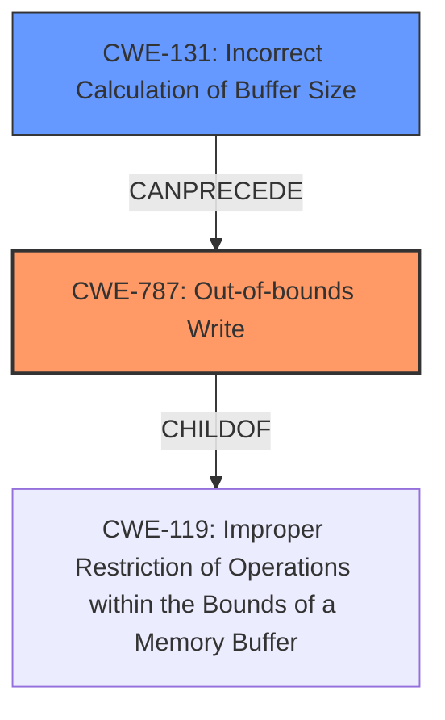

# Enhanced Analysis for CVE-2020-11240

# Summary
| CWE ID | CWE Name | Confidence | CWE Abstraction Level | CWE Vulnerability Mapping Label | CWE-Vulnerability Mapping Notes |
|---|---|---|---|---|---|
| CWE-787 | Out-of-bounds Write | 1.0 | Base | Allowed | Primary CWE |
| CWE-131 | Incorrect Calculation of Buffer Size | 0.7 | Base | Allowed | Secondary Candidate |

## Evidence and Confidence

*   **Confidence Score:** 0.85
*   **Evidence Strength:** HIGH

## Relationship Analysis
The primary CWE selected is CWE-787, which represents an out-of-bounds write. This is related to CWE-119, which represents improper restrictions of operations within the bounds of a memory buffer. CWE-131, incorrect calculation of buffer size, is a frequent cause of out-of-bounds writes as an undersized buffer is allocated.



## Vulnerability Chain
The vulnerability chain begins with an **incorrect calculation of the buffer size** (CWE-131). This leads to a buffer being allocated that is too small. Subsequently, when data is written to this undersized buffer, it results in an **out-of-bounds write** (CWE-787), causing memory corruption.

## Summary of Analysis
The initial assessment identified CWE-787 as the primary candidate due to the explicit mention of **memory corruption** stemming from insufficient storage allocation. The retriever results also ranked CWE-787 as the top candidate.

The analysis focused on the **root cause** of the vulnerability. The vulnerability description key phrases highlight the **rootcause**: "**ioctl command size was incorrectly set to the size of a pointer and not enough storage is allocated for the copy of the user argument**". This clearly indicates an **incorrect calculation of the buffer size** (CWE-131) as a contributing factor.

The relationships between CWEs influenced the final selection. CWE-131 can precede CWE-787, suggesting a potential chain. The selection of CWE-787 is at the base level of specificity, aligning with the identified weakness.

The vulnerability description clearly states the **rootcause** as an **incorrectly set ioctl command size**, resulting in insufficient storage allocation. This leads to **memory corruption**, which manifests as an out-of-bounds write. Therefore, CWE-787 is the most appropriate primary CWE, with CWE-131 as a secondary CWE to represent the root cause of the size miscalculation.

Relevant CWE Information:

# Enhanced Context (25 CWEs)
The following CWEs were identified as potentially relevant to this vulnerability:

## CWE-131: Incorrect Calculation of Buffer Size
**Abstraction Level**: Base
**Similarity Score**: 0.80
**Source**: dense

**Description**:
The product does not correctly calculate the size to be used when allocating a buffer, which could lead to a buffer overflow.

**Mapping Guidance**:
- Usage: Allowed
- Rationale: This CWE entry is at the Base level of abstraction, which is a preferred level of abstraction for mapping to the root causes of vulnerabilities.

## CWE-787: Out-of-bounds Write
**Abstraction Level**: Base
**Similarity Score**: 4.33
**Source**: graph

**Description**:
CWE-787: Out-of-bounds Write

**Mapping Guidance**:
- Usage: Allowed
- Rationale: This CWE entry is at the Base level of abstraction, which is a preferred level of abstraction for mapping to the root causes of vulnerabilities.

### Technical Explanation for CWE-787:
The vulnerability's details align with the characteristics of CWE-787, where data is written beyond the intended buffer boundaries. The **incorrectly set ioctl command size** causes an insufficient buffer allocation, leading to the out-of-bounds write.
- Security Implications: Memory corruption can lead to arbitrary code execution, denial of service, or information disclosure.
- Parent-Child Relationships: CWE-787 is a child of CWE-119, indicating a broader class of memory corruption issues.
- Primary Weakness: CWE-787 is the primary weakness because it is the direct result of the size miscalculation.
- MITRE Mapping Guidance: The mapping guidance allows for the use of CWE-787 at the base level of abstraction.

### Technical Explanation for CWE-131:
The vulnerability's details align with the characteristics of CWE-131, where the size to be used when allocating a buffer is not correctly calculated. The **rootcause** of the issue is the **ioctl command size was incorrectly set to the size of a pointer and not enough storage is allocated for the copy of the user argument**.
- Security Implications: Integer overflows, buffer overflows, or other memory-related errors.
- Parent-Child Relationships: CWE-131 is a child of CWE-682.
- Secondary Weakness: CWE-131 is the secondary weakness because it is the root cause of the buffer size miscalculation.
- MITRE Mapping Guidance: The mapping guidance allows for the use of CWE-131 at the base level of abstraction.

### Considered but not used:
- CWE-822: Untrusted Pointer Dereference - While a pointer is involved in the size miscalculation, the core issue is not directly related to the dereferencing of an untrusted pointer.
- CWE-823: Use of Out-of-range Pointer Offset - Similar to CWE-822, the vulnerability is not primarily about an out-of-range pointer offset but rather about the incorrect size calculation.
- CWE-126: Buffer Over-read - This is about reading past the buffer but the description indicates that it is a write issue.
- CWE-1285: Improper Validation of Specified Index, Position, or Offset in Input - While the ioctl command size is an input, this is not the best fit since the root cause is not about validation of the command.
- CWE-781: Improper Address Validation in IOCTL with METHOD_NEITHER I/O Control Code - The ioctl is present but the issue is not around validating addresses.
- CWE-367: Time-of-check Time-of-use (TOCTOU) Race Condition - This is not relevant because there is no race condition present.
- CWE-124: Buffer Underwrite ('Buffer Underflow') - This is about writing prior to the buffer which is not present in this description.
- CWE-415: Double Free - This is not relevant because there is no double free condition present.


## CWE Relationship Analysis

Current CWEs represent these abstraction levels: .


### Vulnerability Chain Analysis

**Chain starting from CWE-823:**
- 823 (Use of Out-of-range Pointer Offset) - ROOT


**Chain starting from CWE-787:**
- 787 (Out-of-bounds Write) - ROOT


### CWE Relationship Diagram

```mermaid
graph TD
    classDef primary fill:#f96,stroke:#333,stroke-width:2px
    classDef secondary fill:#69f,stroke:#333
    classDef tertiary fill:#9e9,stroke:#333
```