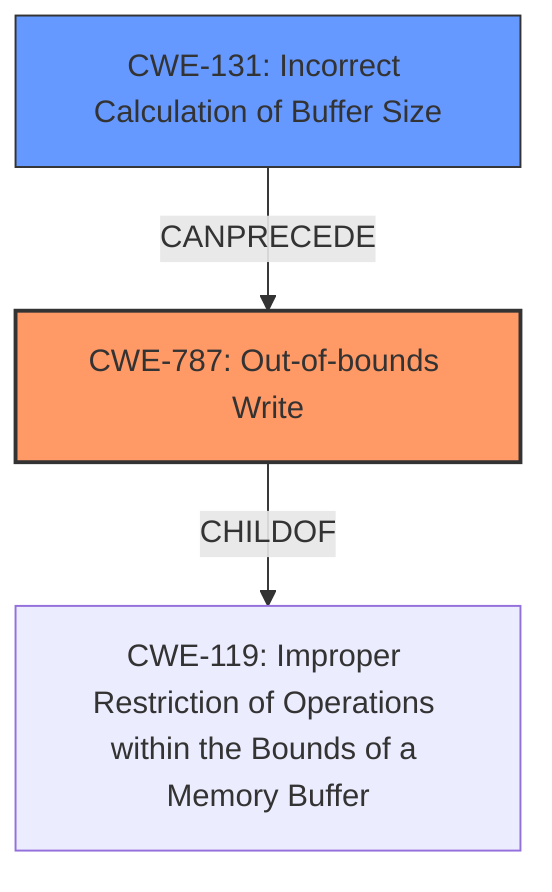

# Analysis for CVE-2020-11240

# Summary
| CWE ID | CWE Name | Confidence | CWE Abstraction Level | CWE Vulnerability Mapping Label | CWE-Vulnerability Mapping Notes |
|---|---|---|---|---|---|
| CWE-787 | Out-of-bounds Write | 1.0 | Base | Allowed | Primary CWE |
| CWE-131 | Incorrect Calculation of Buffer Size | 0.7 | Base | Allowed | Secondary Candidate |

## Evidence and Confidence

*   **Confidence Score:** 0.85
*   **Evidence Strength:** HIGH

## Relationship Analysis
The primary CWE selected is CWE-787, which represents an out-of-bounds write. This is related to CWE-119, which represents improper restrictions of operations within the bounds of a memory buffer. CWE-131, incorrect calculation of buffer size, is a frequent cause of out-of-bounds writes as an undersized buffer is allocated.

## Vulnerability Chain
The vulnerability chain begins with an **incorrect calculation of the buffer size** (CWE-131). This leads to a buffer being allocated that is too small. Subsequently, when data is written to this undersized buffer, it results in an **out-of-bounds write** (CWE-787), causing memory corruption.

## Summary of Analysis
The initial assessment identified CWE-787 as the primary candidate due to the explicit mention of **memory corruption** stemming from insufficient storage allocation. The retriever results also ranked CWE-787 as the top candidate.

The analysis focused on the **root cause** of the vulnerability. The vulnerability description key phrases highlight the **rootcause**: "**ioctl command size was incorrectly set to the size of a pointer and not enough storage is allocated for the copy of the user argument**". This clearly indicates an **incorrect calculation of the buffer size** (CWE-131) as a contributing factor.

The relationships between CWEs influenced the final selection. CWE-131 can precede CWE-787, suggesting a potential chain. The selection of CWE-787 is at the base level of specificity, aligning with the identified weakness.

The vulnerability description clearly states the **rootcause** as an **incorrectly set ioctl command size**, resulting in insufficient storage allocation. This leads to **memory corruption**, which manifests as an out-of-bounds write. Therefore, CWE-787 is the most appropriate primary CWE, with CWE-131 as a secondary CWE to represent the root cause of the size miscalculation.

Relevant CWE Information:

# Enhanced Context (25 CWEs)
The following CWEs were identified as potentially relevant to this vulnerability:

## CWE-131: Incorrect Calculation of Buffer Size
**Abstraction Level**: Base
**Similarity Score**: 0.80
**Source**: dense

**Description**:
The product does not correctly calculate the size to be used when allocating a buffer, which could lead to a buffer overflow.

**Mapping Guidance**:
- Usage: Allowed
- Rationale: This CWE entry is at the Base level of abstraction, which is a preferred level of abstraction for mapping to the root causes of vulnerabilities.

## CWE-787: Out-of-bounds Write
**Abstraction Level**: Base
**Similarity Score**: 4.33
**Source**: graph

**Description**:
CWE-787: Out-of-bounds Write

**Mapping Guidance**:
- Usage: Allowed
- Rationale: This CWE entry is at the Base level of abstraction, which is a preferred level of abstraction for mapping to the root causes of vulnerabilities.

### Technical Explanation for CWE-787:
The vulnerability's details align with the characteristics of CWE-787, where data is written beyond the intended buffer boundaries. The **incorrectly set ioctl command size** causes an insufficient buffer allocation, leading to the out-of-bounds write.
- Security Implications: Memory corruption can lead to arbitrary code execution, denial of service, or information disclosure.
- Parent-Child Relationships: CWE-787 is a child of CWE-119, indicating a broader class of memory corruption issues.
- Primary Weakness: CWE-787 is the primary weakness because it is the direct result of the size miscalculation.
- MITRE Mapping Guidance: The mapping guidance allows for the use of CWE-787 at the base level of abstraction.

### Technical Explanation for CWE-131:
The vulnerability's details align with the characteristics of CWE-131, where the size to be used when allocating a buffer is not correctly calculated. The **rootcause** of the issue is the **ioctl command size was incorrectly set to the size of a pointer and not enough storage is allocated for the copy of the user argument**.
- Security Implications: Integer overflows, buffer overflows, or other memory-related errors.
- Parent-Child Relationships: CWE-131 is a child of CWE-682.
- Secondary Weakness: CWE-131 is the secondary weakness because it is the root cause of the buffer size miscalculation.
- MITRE Mapping Guidance: The mapping guidance allows for the use of CWE-131 at the base level of abstraction.

### Considered but not used:
- CWE-822: Untrusted Pointer Dereference - While a pointer is involved in the size miscalculation, the core issue is not directly related to the dereferencing of an untrusted pointer.
- CWE-823: Use of Out-of-range Pointer Offset - Similar to CWE-822, the vulnerability is not primarily about an out-of-range pointer offset but rather about the incorrect size calculation.
- CWE-126: Buffer Over-read - This is about reading past the buffer but the description indicates that it is a write issue.
- CWE-1285: Improper Validation of Specified Index, Position, or Offset in Input - While the ioctl command size is an input, this is not the best fit since the root cause is not about validation of the command.
- CWE-781: Improper Address Validation in IOCTL with METHOD_NEITHER I/O Control Code - The ioctl is present but the issue is not around validating addresses.
- CWE-367: Time-of-check Time-of-use (TOCTOU) Race Condition - This is not relevant because there is no race condition present.
- CWE-124: Buffer Underwrite ('Buffer Underflow') - This is about writing prior to the buffer which is not present in this description.
- CWE-415: Double Free - This is not relevant because there is no double free condition present.

# Enhanced Query for CVE-2020-11240

## Vulnerability Description
Memory corruption due to **ioctl command size was incorrectly set to the size of a pointer and not enough storage is allocated for the copy of the user argument** in Snapdragon Auto, Snapdragon Compute, Snapdragon Connectivity, Snapdragon Consumer IOT, Snapdragon Industrial IOT, Snapdragon Mobile, Snapdragon Voice & Music, Snapdragon Wearables

### Vulnerability Description Key Phrases
- **rootcause:** **ioctl command size was incorrectly set to the size of a pointer and not enough storage is allocated for the copy of the user argument**
- **weakness:** **memory corruption**
- **product:** Snapdragon

## Retriever Results

### Top Combined Results

| Rank | CWE ID | Name | Abstraction | Usage  | Retrievers | Individual Scores |
|------|--------|------|-------------|-------|------------|-------------------|
| 1 | 787 | Out-of-bounds Write | Base | Allowed | alternate_terms | 1.000 |
| 2 | 131 | Incorrect Calculation of Buffer Size | Base | Allowed | sparse | 0.621 |
| 3 | 822 | Untrusted Pointer Dereference | Base | Allowed | sparse | 0.607 |
| 4 | 823 | Use of Out-of-range Pointer Offset | Base | Allowed | sparse | 0.595 |
| 5 | 126 | Buffer Over-read | Variant | Allowed | sparse | 0.592 |
| 6 | 1285 | Improper Validation of Specified Index, Position, or Offset in Input | Base | Allowed | dense | 0.563 |
| 7 | 781 | Improper Address Validation in IOCTL with METHOD_NEITHER I/O Control Code | Variant | Allowed | graph | 0.003 |
| 8 | 367 | Time-of-check Time-of-use (TOCTOU) Race Condition | Base | Allowed | sparse | 0.564 |
| 9 | 124 | Buffer Underwrite ('Buffer Underflow') | Base | Allowed | sparse | 0.564 |
| 10 | 415 | Double Free | Variant | Allowed | sparse | 0.562 |

# Complete CWE Specifications

## CWE-787: Out-of-bounds Write
**Abstraction:** Base
**Status:** Draft

### Description
The product writes data past the end, or before the beginning, of the intended buffer.

### Extended Description
Not provided

### Alternative Terms
Memory Corruption: Often used to describe the consequences of writing to memory outside the bounds of a buffer, or to memory that is otherwise invalid.

### Relationships
ChildOf -> CWE-119
ChildOf -> CWE-119
ChildOf -> CWE-119
ChildOf -> CWE-119

### Mapping Guidance
**Usage:** Allowed
**Rationale:** This CWE entry is at the Base level of abstraction, which is a preferred level of abstraction for mapping to the root causes of vulnerabilities.
**Comments:** Carefully read both the name and description to ensure that this mapping is an appropriate fit. Do not try to 'force' a mapping to a lower-level Base/Variant simply to comply with this preferred level of abstraction.
**Reasons:**
- Acceptable-Use

### Observed Examples
- **CVE-2023-1017:** The reference implementation code for a Trusted Platform Module does not implement length checks on data, allowing for an attacker to write 2 bytes past the end of a buffer.
- **CVE-2021-21220:** Chain: insufficient input validation (CWE-20) in browser allows heap corruption (CWE-787), as exploited in the wild per CISA KEV.
- **CVE-2021-28664:** GPU kernel driver allows memory corruption because a user can obtain read/write access to read-only pages, as exploited in the wild per CISA KEV.

## CWE-131: Incorrect Calculation of Buffer Size
**Abstraction:** Base
**Status:** Draft

### Description
The product does not correctly calculate the size to be used when allocating a buffer, which could lead to a buffer overflow.

### Extended Description
Not provided

### Alternative Terms
None

### Relationships
ChildOf -> CWE-682
ChildOf -> CWE-682
ChildOf -> CWE-682
ChildOf -> CWE-682
CanPrecede -> CWE-119

### Mapping Guidance
**Usage:** Allowed
**Rationale:** This CWE entry is at the Base level of abstraction, which is a preferred level of abstraction for mapping to the root causes of vulnerabilities.
**Comments:** Carefully read both the name and description to ensure that this mapping is an appropriate fit. Do not try to 'force' a mapping to a lower-level Base/Variant simply to comply with this preferred level of abstraction.
**Reasons:**
- Acceptable-Use

### Additional Notes
**[Maintenance]** 

This is a broad category. Some examples include:

  - simple math errors,

  - incorrectly updating parallel counters,

  - not accounting for size differences when "transforming" one input to another format (e.g. URL canonicalization or other transformation that can generate a result that's larger than the original input, i.e. "expansion").

This level of detail is rarely available in public reports, so it is difficult to find good examples.

**[Maintenance]** 

This weakness may be a composite or a chain. It also may contain layering or perspective differences.

This issue may be associated with many different types of incorrect calculations (CWE-682), although the integer overflow (CWE-190) is probably the most prevalent. This can be primary to resource consumption problems (CWE-400), including uncontrolled memory allocation (CWE-789). However, its relationship with out-of-bounds buffer access (CWE-119) must also be considered.

### Observed Examples
- **CVE-2020-17087:** Chain: integer truncation (CWE-197) causes small buffer allocation (CWE-131) leading to out-of-bounds write (CWE-787) in kernel pool, as exploited in the wild per CISA KEV.
- **CVE-2004-1363:** substitution overflow: buffer overflow using environment variables that are expanded after the length check is performed
- **CVE-2004-0747:** substitution overflow: buffer overflow using expansion of environment variables

## CWE-822: Untrusted Pointer Dereference
**Abstraction:** Base
**Status:** Incomplete

### Description
The product obtains a value from an untrusted source, converts this value to a pointer, and dereferences the resulting pointer.

### Extended Description

An attacker can supply a pointer for memory locations that the product is not expecting. If the pointer is dereferenced for a write operation, the attack might allow modification of critical state variables, cause a crash, or execute code. If the dereferencing operation is for a read, then the attack might allow reading of sensitive data, cause a crash, or set a variable to an unexpected value (since the value will be read from an unexpected memory location).

There are several variants of this weakness, including but not necessarily limited to:

  - The untrusted value is directly invoked as a function call.

  - In OS kernels or drivers where there is a boundary between "userland" and privileged memory spaces, an untrusted pointer might enter through an API or system call (see CWE-781 for one such example).

  - Inadvertently accepting the value from an untrusted control sphere when it did not have to be accepted as input at all. This might occur when the code was originally developed to be run by a single user in a non-networked environment, and the code is then ported to or otherwise exposed to a networked environment.

### Alternative Terms
None

### Relationships
ChildOf -> CWE-119
ChildOf -> CWE-119
ChildOf -> CWE-119
CanPrecede -> CWE-125
CanPrecede -> CWE-787

### Mapping Guidance
**Usage:** Allowed
**Rationale:** This CWE entry is at the Base level of abstraction, which is a preferred level of abstraction for mapping to the root causes of vulnerabilities.
**Comments:** Carefully read both the name and description to ensure that this mapping is an appropriate fit. Do not try to 'force' a mapping to a lower-level Base/Variant simply to comply with this preferred level of abstraction.
**Reasons:**
- Acceptable-Use

### Additional Notes
**[Maintenance]** There are close relationships between incorrect pointer dereferences and other weaknesses related to buffer operations. There may not be sufficient community agreement regarding these relationships. Further study is needed to determine when these relationships are chains, composites, perspective/layering, or other types of relationships. As of September 2010, most of the relationships are being captured as chains.

**[Terminology]** Many weaknesses related to pointer dereferences fall under the general term of "memory corruption" or "memory safety." As of September 2010, there is no commonly-used terminology that covers the lower-level variants.

### Observed Examples
- **CVE-2007-5655:** message-passing framework interprets values in packets as pointers, causing a crash.
- **CVE-2010-2299:** labeled as a "type confusion" issue, also referred to as a "stale pointer." However, the bug ID says "contents are simply interpreted as a pointer... renderer ordinarily doesn't supply this pointer directly". The "handle" in the untrusted area is replaced in one function, but not another - thus also, effectively, exposure to wrong sphere (CWE-668).
- **CVE-2009-1719:** Untrusted dereference using undocumented constructor.

## CWE-823: Use of Out-of-range Pointer Offset
**Abstraction:** Base
**Status:** Incomplete

### Description
The product performs pointer arithmetic on a valid pointer, but it uses an offset that can point outside of the intended range of valid memory locations for the resulting pointer.

### Extended Description

While a pointer can contain a reference to any arbitrary memory location, a program typically only intends to use the pointer to access limited portions of memory, such as contiguous memory used to access an individual array.

Programs may use offsets in order to access fields or sub-elements stored within structured data. The offset might be out-of-range if it comes from an untrusted source, is the result of an incorrect calculation, or occurs because of another error.

If an attacker can control or influence the offset so that it points outside of the intended boundaries of the structure, then the attacker may be able to read or write to memory locations that are used elsewhere in the product. As a result, the attack might change the state of the product as accessed through program variables, cause a crash or instable behavior, and possibly lead to code execution.

### Alternative Terms
Untrusted pointer offset: This term is narrower than the concept of "out-of-range" offset, since the offset might be the result of a calculation or other error that does not depend on any externally-supplied values.

### Relationships
ChildOf -> CWE-119
ChildOf -> CWE-119
ChildOf -> CWE-119
CanPrecede -> CWE-125
CanPrecede -> CWE-787

### Mapping Guidance
**Usage:** Allowed
**Rationale:** This CWE entry is at the Base level of abstraction, which is a preferred level of abstraction for mapping to the root causes of vulnerabilities.
**Comments:** Carefully read both the name and description to ensure that this mapping is an appropriate fit. Do not try to 'force' a mapping to a lower-level Base/Variant simply to comply with this preferred level of abstraction.
**Reasons:**
- Acceptable-Use

### Additional Notes
**[Maintenance]** There are close relationships between incorrect pointer dereferences and other weaknesses related to buffer operations. There may not be sufficient community agreement regarding these relationships. Further study is needed to determine when these relationships are chains, composites, perspective/layering, or other types of relationships. As of September 2010, most of the relationships are being captured as chains.

**[Terminology]** Many weaknesses related to pointer dereferences fall under the general term of "memory corruption" or "memory safety." As of September 2010, there is no commonly-used terminology that covers the lower-level variants.

### Observed Examples
- **CVE-2010-2160:** Invalid offset in undocumented opcode leads to memory corruption.
- **CVE-2010-1281:** Multimedia player uses untrusted value from a file when using file-pointer calculations.
- **CVE-2009-3129:** Spreadsheet program processes a record with an invalid size field, which is later used as an offset.

## CWE-126: Buffer Over-read
**Abstraction:** Variant
**Status:** Draft

### Description
The product reads from a buffer using buffer access mechanisms such as indexes or pointers that reference memory locations after the targeted buffer.

### Extended Description
This typically occurs when the pointer or its index is incremented to a position beyond the bounds of the buffer or when pointer arithmetic results in a position outside of the valid memory location to name a few. This may result in exposure of sensitive information or possibly a crash.

### Alternative Terms
None

### Relationships
ChildOf -> CWE-125
ChildOf -> CWE-788

### Mapping Guidance
**Usage:** Allowed
**Rationale:** This CWE entry is at the Variant level of abstraction, which is a preferred level of abstraction for mapping to the root causes of vulnerabilities.
**Comments:** Carefully read both the name and description to ensure that this mapping is an appropriate fit. Do not try to 'force' a mapping to a lower-level Base/Variant simply to comply with this preferred level of abstraction.
**Reasons:**
- Acceptable-Use

### Additional Notes
**[Relationship]** These problems may be resultant from missing sentinel values (CWE-463) or trusting a user-influenced input length variable.

### Observed Examples
- **CVE-2022-1733:** Text editor has out-of-bounds read past end of line while indenting C code
- **CVE-2014-0160:** Chain: "Heartbleed" bug receives an inconsistent length parameter (CWE-130) enabling an out-of-bounds read (CWE-126), returning memory that could include private cryptographic keys and other sensitive data.
- **CVE-2009-2523:** Chain: product does not handle when an input string is not NULL terminated, leading to buffer over-read or heap-based buffer overflow.

## CWE-1285: Improper Validation of Specified Index, Position, or Offset in Input
**Abstraction:** Base
**Status:** Incomplete

### Description
The product receives input that is expected to specify an index, position, or offset into an indexable resource such as a buffer or file, but it does not validate or incorrectly validates that the specified index/position/offset has the required properties.

### Extended Description

Often, indexable resources such as memory buffers or files can be accessed using a specific position, index, or offset, such as an index for an array or a position for a file. When untrusted input is not properly validated before it is used as an index, attackers could access (or attempt to access) unauthorized portions of these resources. This could be used to cause buffer overflows, excessive resource allocation, or trigger unexpected failures. 

### Alternative Terms
None

### Relationships
ChildOf -> CWE-20

### Mapping Guidance
**Usage:** Allowed
**Rationale:** This CWE entry is at the Base level of abstraction, which is a preferred level of abstraction for mapping to the root causes of vulnerabilities.
**Comments:** Carefully read both the name and description to ensure that this mapping is an appropriate fit. Do not try to 'force' a mapping to a lower-level Base/Variant simply to comply with this preferred level of abstraction.
**Reasons:**
- Acceptable-Use

### Additional Notes
**[Maintenance]** This entry is still under development and will continue to see updates and content improvements.

### Observed Examples
- **CVE-2005-0369:** large ID in packet used as array index
- **CVE-2001-1009:** negative array index as argument to POP LIST command

## CWE-781: Improper Address Validation in IOCTL with METHOD_NEITHER I/O Control Code
**Abstraction:** Variant
**Status:** Draft

### Description
The product defines an IOCTL that uses METHOD_NEITHER for I/O, but it does not validate or incorrectly validates the addresses that are provided.

### Extended Description
When an IOCTL uses the METHOD_NEITHER option for I/O control, it is the responsibility of the IOCTL to validate the addresses that have been supplied to it. If validation is missing or incorrect, attackers can supply arbitrary memory addresses, leading to code execution or a denial of service.

### Alternative Terms
None

### Relationships
ChildOf -> CWE-1285
CanPrecede -> CWE-822

### Mapping Guidance
**Usage:** Allowed
**Rationale:** This CWE entry is at the Variant level of abstraction, which is a preferred level of abstraction for mapping to the root causes of vulnerabilities.
**Comments:** Carefully read both the name and description to ensure that this mapping is an appropriate fit. Do not try to 'force' a mapping to a lower-level Base/Variant simply to comply with this preferred level of abstraction.
**Reasons:**
- Acceptable-Use

### Additional Notes
**[Applicable Platform]** 

Because IOCTL functionality is typically performing low-level actions and closely interacts with the operating system, this weakness may only appear in code that is written in low-level languages.

**[Research Gap]** 

While this type of issue has been known since 2006, it is probably still under-studied and under-reported. Most of the focus has been on high-profile software and security products, but other kinds of system software also use drivers. Since exploitation requires the development of custom code, it requires some skill to find this weakness.

Because exploitation typically requires local privileges, it might not be a priority for active attackers. However, remote exploitation may be possible for software such as device drivers. Even when remote vectors are not available, it may be useful as the final privilege-escalation step in multi-stage remote attacks against application-layer software, or as the primary attack by a local user on a multi-user system.

### Observed Examples
- **CVE-2006-2373:** Driver for file-sharing and messaging protocol allows attackers to execute arbitrary code.
- **CVE-2009-0686:** Anti-virus product does not validate addresses, allowing attackers to gain SYSTEM privileges.
- **CVE-2009-0824:** DVD software allows attackers to cause a crash.

## CWE-367: Time-of-check Time-of-use (TOCTOU) Race Condition
**Abstraction:** Base
**Status:** Incomplete

### Description
The product checks the state of a resource before using that resource, but the resource's state can change between the check and the use in a way that invalidates the results of the check. This can cause the product to perform invalid actions when the resource is in an unexpected state.

### Extended Description
This weakness can be security-relevant when an attacker can influence the state of the resource between check and use. This can happen with shared resources such as files, memory, or even variables in multithreaded programs.

### Alternative Terms
TOCTTOU: The TOCTTOU acronym expands to "Time Of Check To Time Of Use".
TOCCTOU: The TOCCTOU acronym is most likely a typo of TOCTTOU, but it has been used in some influential documents, so the typo is repeated fairly frequently.

### Relationships
ChildOf -> CWE-362
ChildOf -> CWE-362

### Mapping Guidance
**Usage:** Allowed
**Rationale:** This CWE entry is at the Base level of abstraction, which is a preferred level of abstraction for mapping to the root causes of vulnerabilities.
**Comments:** Carefully read both the name and description to ensure that this mapping is an appropriate fit. Do not try to 'force' a mapping to a lower-level Base/Variant simply to comply with this preferred level of abstraction.
**Reasons:**
- Acceptable-Use

### Additional Notes
**[Relationship]** TOCTOU issues do not always involve symlinks, and not every symlink issue is a TOCTOU problem.

**[Research Gap]** Non-symlink TOCTOU issues are not reported frequently, but they are likely to occur in code that attempts to be secure.

### Observed Examples
- **CVE-2015-1743:** TOCTOU in sandbox process allows installation of untrusted browser add-ons by replacing a file after it has been verified, but before it is executed
- **CVE-2003-0813:** A multi-threaded race condition allows remote attackers to cause a denial of service (crash or reboot) by causing two threads to process the same RPC request, which causes one thread to use memory after it has been freed.
- **CVE-2004-0594:** PHP flaw allows remote attackers to execute arbitrary code by aborting execution before the initialization of key data structures is complete.

## CWE-124: Buffer Underwrite ('Buffer Underflow')
**Abstraction:** Base
**Status:** Incomplete

### Description
The product writes to a buffer using an index or pointer that references a memory location prior to the beginning of the buffer.

### Extended Description
This typically occurs when a pointer or its index is decremented to a position before the buffer, when pointer arithmetic results in a position before the beginning of the valid memory location, or when a negative index is used.

### Alternative Terms
buffer underrun: Some prominent vendors and researchers use the term "buffer underrun". "Buffer underflow" is more commonly used, although both terms are also sometimes used to describe a buffer under-read (CWE-127).

### Relationships
ChildOf -> CWE-786
ChildOf -> CWE-787

### Mapping Guidance
**Usage:** Allowed
**Rationale:** This CWE entry is at the Base level of abstraction, which is a preferred level of abstraction for mapping to the root causes of vulnerabilities.
**Comments:** Carefully read both the name and description to ensure that this mapping is an appropriate fit. Do not try to 'force' a mapping to a lower-level Base/Variant simply to comply with this preferred level of abstraction.
**Reasons:**
- Acceptable-Use

### Additional Notes
**[Relationship]** This could be resultant from several errors, including a bad offset or an array index that decrements before the beginning of the buffer (see CWE-129).

### Observed Examples
- **CVE-2021-24018:** buffer underwrite in firmware verification routine allows code execution via a crafted firmware image
- **CVE-2002-2227:** Unchecked length of SSLv2 challenge value leads to buffer underflow.
- **CVE-2007-4580:** Buffer underflow from a small size value with a large buffer (length parameter inconsistency, CWE-130)

## CWE-415: Double Free
**Abstraction:** Variant
**Status:** Draft

### Description
The product calls free() twice on the same memory address, potentially leading to modification of unexpected memory locations.

### Extended Description
When a program calls free() twice with the same argument, the program's memory management data structures become corrupted. This corruption can cause the program to crash or, in some circumstances, cause two later calls to malloc() to return the same pointer. If malloc() returns the same value twice and the program later gives the attacker control over the data that is written into this doubly-allocated memory, the program becomes vulnerable to a buffer overflow attack.

### Alternative Terms
Double-free

### Relationships
ChildOf -> CWE-825
ChildOf -> CWE-1341
ChildOf -> CWE-672
ChildOf -> CWE-672
ChildOf -> CWE-672
ChildOf -> CWE-666
PeerOf -> CWE-416
PeerOf -> CWE-123

### Mapping Guidance
**Usage:** Allowed
**Rationale:** This CWE entry is at the Variant level of abstraction, which is a preferred level of abstraction for mapping to the root causes of vulnerabilities.
**Comments:** Carefully read both the name and description to ensure that this mapping is an appropriate fit. Do not try to 'force' a mapping to a lower-level Base/Variant simply to comply with this preferred level of abstraction.
**Reasons:**
- Acceptable-Use

### Additional Notes
**[Relationship]** This is usually resultant from another weakness, such as an unhandled error or race condition between threads. It could also be primary to weaknesses such as buffer overflows.

**[Theoretical]** It could be argued that Double Free would be most appropriately located as a child of "Use after Free", but "Use" and "Release" are considered to be distinct operations within vulnerability theory, therefore this is more accurately "Release of a Resource after Expiration or Release", which doesn't exist yet.

### Observed Examples
- **CVE-2006-5051:** Chain: Signal handler contains too much functionality (CWE-828), introducing a race condition (CWE-362) that leads to a double free (CWE-415).
- **CVE-2004-0642:** Double free resultant from certain error conditions.
- **CVE-2004-0772:** Double free resultant from certain error conditions.

