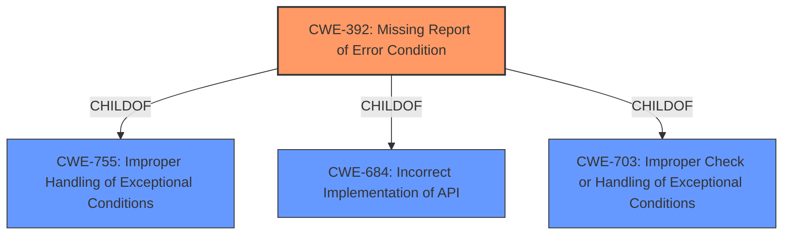

# Raw Analyzer Response for CVE-2020-11243

# Summary
| CWE ID | CWE Name | Confidence | CWE Abstraction Level | CWE Vulnerability Mapping Label | CWE-Vulnerability Mapping Notes |
|---|---|---|---|---|---|
| CWE-392 | Missing Report of Error Condition | 0.8 | Base | Allowed | Primary CWE |

## Evidence and Confidence

*   **Confidence Score:** 0.8
*   **Evidence Strength:** MEDIUM

## Relationship Analysis
The primary CWE selected is CWE-392, which has parent relationships to high-level categories such as CWE-755, CWE-684, and CWE-703. These relationships suggest a broader context of error handling. There are no direct child relationships. The analysis focuses on the base level of abstraction for accurate representation.

## Vulnerability Chain
The chain of events is as follows:
1.  Connection setup validation fails.
2.  RRC **fails to report this error condition** to NAS (CWE-392).
3.  RRC sends a connection establishment success message to NAS.
4.  This leads to a denial of service.

## Summary of Analysis
The initial analysis focused on identifying the **root cause** of the denial-of-service vulnerability. The vulnerability description states that "RRC sends a connection establishment success to NAS even though connection setup validation returns failure." This indicates a **failure to properly report the error condition**, which directly aligns with CWE-392 ("Missing Report of Error Condition").

The retriever results also suggested considering CWE-392 as a top candidate.

The confidence in this assessment is high (0.8) because the evidence directly supports the chosen CWE. The selection of CWE-392 is at the base level, which is the optimal level of specificity for this vulnerability.

Other CWEs Considered:
*   CWE-367 (Time-of-check Time-of-use (TOCTOU) Race Condition): While race conditions can lead to errors, the primary issue here is the failure to report an existing error, not a race condition.
*   CWE-126 (Buffer Over-read): This CWE is not relevant because the vulnerability is not related to reading beyond buffer boundaries.
*   CWE-390 (Detection of Error Condition Without Action): Similar to CWE-392, but CWE-392 is more specific in that the error is not reported.
*   CWE-822 (Untrusted Pointer Dereference) and CWE-823 (Use of Out-of-range Pointer Offset): These CWEs are not related because the vulnerability does not involve pointer dereferencing or pointer arithmetic.
*   CWE-1288 (Improper Validation of Consistency within Input): This CWE is not relevant because the vulnerability is not related to inconsistent input.
*   CWE-781 (Improper Address Validation in IOCTL with METHOD\_NEITHER I/O Control Code): This is not relevant as it's specific to IOCTL and not the described issue.
*   CWE-415 (Double Free): This CWE is not related because the vulnerability does not involve freeing memory.

Relevant CWE Information:

# Enhanced Context (25 CWEs)
The following CWEs were identified as potentially relevant to this vulnerability:

## CWE-822: Untrusted Pointer Dereference
**Abstraction Level**: Base
**Similarity Score**: 0.80
**Source**: dense

**Description**:
The product obtains a value from an untrusted source, converts this value to a pointer, and dereferences the resulting pointer.

**Mapping Guidance**:
- Usage: Allowed
- Rationale: This CWE entry is at the Base level of abstraction, which is a preferred level of abstraction for mapping to the root causes of vulnerabilities.

## CWE-823: Use of Out-of-range Pointer Offset
**Abstraction Level**: Base
**Similarity Score**: 0.80
**Source**: dense

**Description**:
The product performs pointer arithmetic on a valid pointer, but it uses an offset that can point outside of the intended range of valid memory locations for the resulting pointer.

**Mapping Guidance**:
- Usage: Allowed
- Rationale: This CWE entry is at the Base level of abstraction, which is a preferred level of abstraction for mapping to the root causes of vulnerabilities.

## CWE-131: Incorrect Calculation of Buffer Size
**Abstraction Level**: Base
**Similarity Score**: 0.79
**Source**: dense

**Description**:
The product does not correctly calculate the size to be used when allocating a buffer, which could lead to a buffer overflow.

**Mapping Guidance**:
- Usage: Allowed
- Rationale: This CWE entry is at the Base level of abstraction, which is a preferred level of abstraction for mapping to the root causes of vulnerabilities.

## CWE-824: Access of Uninitialized Pointer
**Abstraction Level**: Base
**Similarity Score**: 0.78
**Source**: dense

**Description**:
The product accesses or uses a pointer that has not been initialized.

**Mapping Guidance**:
- Usage: Allowed
- Rationale: This CWE entry is at the Base level of abstraction, which is a preferred level of abstraction for mapping to the root causes of vulnerabilities.

## CWE-667: Improper Locking
**Abstraction Level**: Class
**Similarity Score**: 0.78
**Source**: dense

**Description**:
The product does not properly acquire or release a lock on a resource, leading to unexpected resource state changes and behaviors.

**Mapping Guidance**:
- Usage: Allowed-with-Review
- Rationale: This CWE entry is a Class and might have Base-level children that would be more appropriate

## CWE-703: Improper Check or Handling of Exceptional Conditions
**Abstraction Level**: Pillar
**Similarity Score**: 0.78
**Source**: dense

**Description**:
The product does not properly anticipate or handle exceptional conditions that rarely occur during normal operation of the product.

**Mapping Guidance**:
- Usage: Discouraged
- Rationale: This CWE entry is extremely high-level, a Pillar.

## CWE-191: Integer Underflow (Wrap or Wraparound)
**Abstraction Level**: Base
**Similarity Score**: 0.77
**Source**: dense

**Description**:
The product subtracts one value from another, such that the result is less than the minimum allowable integer value, which produces a value that is not equal to the correct result.

**Mapping Guidance**:
- Usage: Allowed
- Rationale: This CWE entry is at the Base level of abstraction, which is a preferred level of abstraction for mapping to the root causes of vulnerabilities.

## CWE-754: Improper Check for Unusual or Exceptional Conditions
**Abstraction Level**: Class
**Similarity Score**: 0.77
**Source**: dense

**Description**:
The product does not check or incorrectly checks for unusual or exceptional conditions that are not expected to occur frequently during day to day operation of the product.

**Mapping Guidance**:
- Usage: Allowed-with-Review
- Rationale: This CWE entry is a Class and might have Base-level children that would be more appropriate

## CWE-129: Improper Validation of Array Index
**Abstraction Level**: Variant
**Similarity Score**: 0.77
**Source**: dense

**Description**:
The product uses untrusted input when calculating or using an array index, but the product does not validate or incorrectly validates the index to ensure the index references a valid position within the array.

**Mapping Guidance**:
- Usage: Allowed
- Rationale: This CWE entry is at the Variant level of abstraction, which is a preferred level of abstraction for mapping to the root causes of vulnerabilities.

## CWE-476: NULL Pointer Dereference
**Abstraction Level**: Base
**Similarity Score**: 0.77
**Source**: dense

**Description**:
The product dereferences a pointer that it expects to be valid but is NULL.

**Mapping Guidance**:
- Usage: Allowed
- Rationale: This CWE entry is at the Base level of abstraction, which is a preferred level of abstraction for mapping to the root causes of vulnerabilities.

## CWE-823: Use of Out-of-range Pointer Offset
**Abstraction Level**: Base
**Similarity Score**: 5602.82
**Source**: sparse

**Description**:
The product performs pointer arithmetic on a valid pointer, but it uses an offset that can point outside of the intended range of valid memory locations for the resulting pointer.

**Mapping