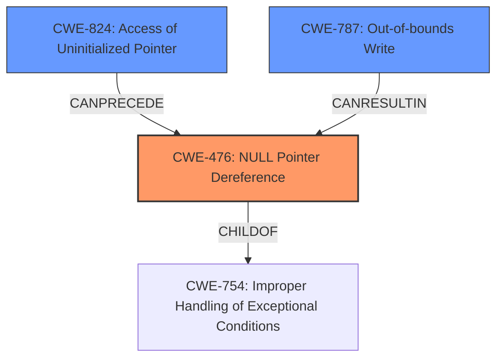

# Raw Analyzer Response for CVE-2020-11254

# Summary
| CWE ID  | CWE Name                                            | Confidence | CWE Abstraction Level | CWE Vulnerability Mapping Label | CWE-Vulnerability Mapping Notes |
| :------- | :-------------------------------------------------- | :--------- | :---------------------- | :------------------------------ | :------------------------------ |
| CWE-476 | NULL Pointer Dereference                            | 0.9        | Base                    | Allowed                         | Primary CWE                     |
| CWE-824 | Access of Uninitialized Pointer                     | 0.7        | Base                    | Allowed                         | Secondary Candidate             |
| CWE-787 | Out-of-bounds Write                                 | 0.6        | Base                    | Allowed                         | Secondary Candidate             |

## Evidence and Confidence

*   **Confidence Score:** 0.8
*   **Evidence Strength:** HIGH

## Relationship Analysis
The primary relationship that influenced the decision was the parent-child relationship between CWE-754 (Improper Handling of Exceptional Conditions) and CWE-476 (NULL Pointer Dereference). CWE-476 is a specific type of improper handling of an exceptional condition, where the exceptional condition is that a pointer is unexpectedly NULL.

## Vulnerability Chain
The vulnerability chain starts with the **dereferencing session ctx pointer without checking if pointer is valid**. This leads to a **memory corruption**. The chain is therefore:

1.  **Missing check for NULL pointer** (Implicit)
2.  **CWE-476: NULL Pointer Dereference**
3.  **Memory corruption** (Impact)

## Summary of Analysis
The analysis is based on the provided vulnerability description, specifically the key phrase "dereferencing session ctx pointer without checking if pointer is valid".

The description clearly states that the vulnerability occurs because the code **fails to check if a pointer is valid** before dereferencing it. This directly corresponds to CWE-476 (NULL Pointer Dereference), which describes the scenario where a program dereferences a pointer that is expected to be valid but is NULL. The **memory corruption** is the consequence of dereferencing a NULL pointer.

The graph relationships support the choice of CWE-476. While other CWEs like CWE-787 (Out-of-bounds Write) and CWE-823 (Use of Out-of-range Pointer Offset) were considered, they do not directly address the root cause, which is the missing NULL check.

CWE-476 is at the Base level of abstraction, which is the preferred level for mapping root causes. It is also a more specific CWE than its parent, CWE-754 (Improper Handling of Exceptional Conditions).

The evidence supporting CWE-476 is the vulnerability description itself: "**dereferencing session ctx pointer without checking if pointer is valid**".

Relevant CWE Information:

# Enhanced Context (25 CWEs)

## CWE-124: Buffer Underwrite ('Buffer Underflow')
**Abstraction Level**: Base
**Similarity Score**: 0.79

## CWE-131: Incorrect Calculation of Buffer Size
**Abstraction Level**: Base
**Similarity Score**: 0.79

## CWE-822: Untrusted Pointer Dereference
**Abstraction Level**: Base
**Similarity Score**: 0.79

## CWE-191: Integer Underflow (Wrap or Wraparound)
**Abstraction Level**: Base
**Similarity Score**: 0.78

## CWE-252: Unchecked Return Value
**Abstraction Level**: Base
**Similarity Score**: 0.78

## CWE-823: Use of Out-of-range Pointer Offset
**Abstraction Level**: Base
**Similarity Score**: 0.78

## CWE-824: Access of Uninitialized Pointer
**Abstraction Level**: Base
**Similarity Score**: 0.77

## CWE-667: Improper Locking
**Abstraction Level**: Class
**Similarity Score**: 0.77

## CWE-805: Buffer Access with Incorrect Length Value
**Abstraction Level**: Base
**Similarity Score**: 0.77

## CWE-127: Buffer Under-read
**Abstraction Level**: Variant
**Similarity Score**: 0.77

## CWE-823: Use of Out-of-range Pointer Offset
**Abstraction Level**: Base
**Similarity Score**: 5949.78

## CWE-252: Unchecked Return Value
**Abstraction Level**: Base
**Similarity Score**: 5705.76

## CWE-822: Untrusted Pointer Dereference
**Abstraction Level**: Base
**Similarity Score**: 5544.81

## CWE-476: NULL Pointer Dereference
**Abstraction Level**: Base
**Similarity Score**: 5510.72

## CWE-125: Out-of-bounds Read
**Abstraction Level**: Base
**Similarity Score**: 5317.18

## CWE-123: Write-what-where Condition
**Abstraction Level**: base
**Similarity Score**: 5.03

## CWE-416: Use After Free
**Abstraction Level**: variant
**Similarity Score**: 4.53

## CWE-787: Out-of-bounds Write
**Abstraction Level**: base
**Similarity Score**: 4.33

## CWE-825: Expired Pointer Dereference
**Abstraction Level**: base
**Similarity Score**: 4.33

## CWE-190: Integer Overflow or Wraparound
**Abstraction Level**: base
**Similarity Score**: 4.33

## CWE-1341: Multiple Releases of Same Resource or Handle
**Abstraction Level**: base
**Similarity Score**: 4.33

## CWE-1284: Improper Validation of Specified Quantity in Input
**Abstraction Level**: base
**Similarity Score**: 4.33

## CWE-415: Double Free
**Abstraction Level**: variant
**Similarity Score**: 4.01

## CWE-781: Improper Address Validation in IOCTL with METHOD_NEITHER I/O Control Code
**Abstraction Level**: variant
**Similarity Score**: 3.88

## CWE-170: Improper Null Termination
**Abstraction Level**: base
**Similarity Score**: 3.57

**CWE-476: NULL Pointer Dereference** is the primary CWE because the vulnerability description explicitly mentions that the code **dereferences a pointer without checking if it is valid**, which is the exact definition of a NULL pointer dereference.

**CWE-824: Access of Uninitialized Pointer** was considered because if the pointer is not initialized, it could lead to it being NULL and then dereferenced. However, the description specifically mentions the lack of a check, which is more aligned with CWE-476.

**CWE-787: Out-of-bounds Write** was considered because the consequence of the NULL pointer dereference is **memory corruption**, which can sometimes be caused by an out-of-bounds write. However, the root cause is the NULL pointer dereference, not an out-of-bounds write.