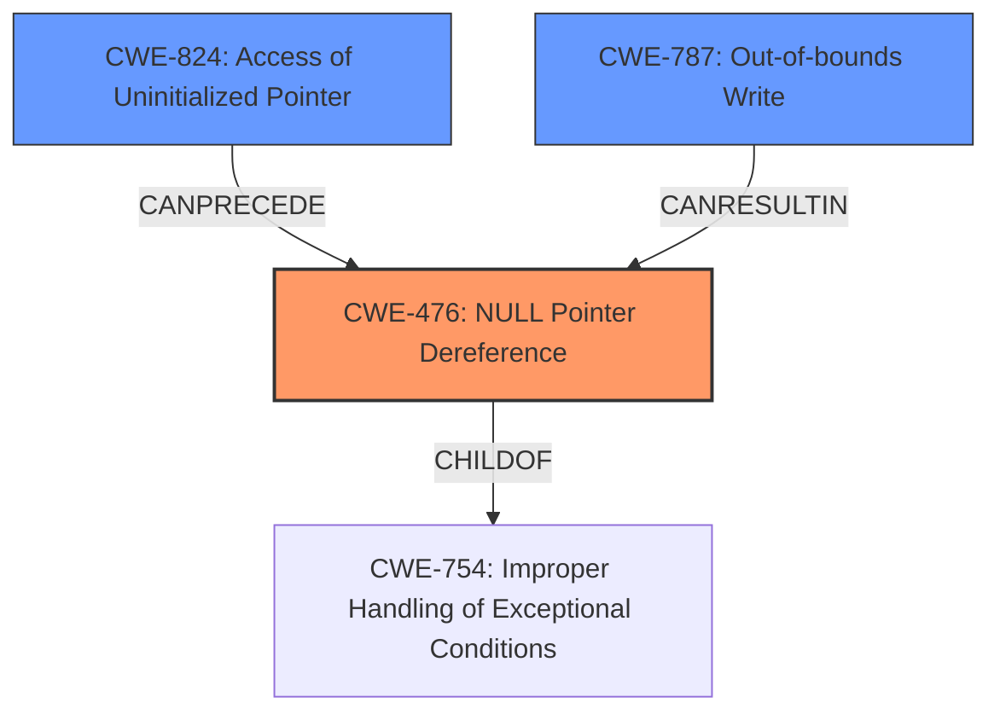

# Analysis for CVE-2020-11254

# Summary
| CWE ID  | CWE Name                                            | Confidence | CWE Abstraction Level | CWE Vulnerability Mapping Label | CWE-Vulnerability Mapping Notes |
| :------- | :-------------------------------------------------- | :--------- | :---------------------- | :------------------------------ | :------------------------------ |
| CWE-476 | NULL Pointer Dereference                            | 0.9        | Base                    | Allowed                         | Primary CWE                     |
| CWE-824 | Access of Uninitialized Pointer                     | 0.7        | Base                    | Allowed                         | Secondary Candidate             |
| CWE-787 | Out-of-bounds Write                                 | 0.6        | Base                    | Allowed                         | Secondary Candidate             |

## Evidence and Confidence

*   **Confidence Score:** 0.8
*   **Evidence Strength:** HIGH

## Relationship Analysis
The primary relationship that influenced the decision was the parent-child relationship between CWE-754 (Improper Handling of Exceptional Conditions) and CWE-476 (NULL Pointer Dereference). CWE-476 is a specific type of improper handling of an exceptional condition, where the exceptional condition is that a pointer is unexpectedly NULL.

## Vulnerability Chain
The vulnerability chain starts with the **dereferencing session ctx pointer without checking if pointer is valid**. This leads to a **memory corruption**. The chain is therefore:

1.  **Missing check for NULL pointer** (Implicit)
2.  **CWE-476: NULL Pointer Dereference**
3.  **Memory corruption** (Impact)

## Summary of Analysis
The analysis is based on the provided vulnerability description, specifically the key phrase "dereferencing session ctx pointer without checking if pointer is valid".

The description clearly states that the vulnerability occurs because the code **fails to check if a pointer is valid** before dereferencing it. This directly corresponds to CWE-476 (NULL Pointer Dereference), which describes the scenario where a program dereferences a pointer that is expected to be valid but is NULL. The **memory corruption** is the consequence of dereferencing a NULL pointer.

The graph relationships support the choice of CWE-476. While other CWEs like CWE-787 (Out-of-bounds Write) and CWE-823 (Use of Out-of-range Pointer Offset) were considered, they do not directly address the root cause, which is the missing NULL check.

CWE-476 is at the Base level of abstraction, which is the preferred level for mapping root causes. It is also a more specific CWE than its parent, CWE-754 (Improper Handling of Exceptional Conditions).

The evidence supporting CWE-476 is the vulnerability description itself: "**dereferencing session ctx pointer without checking if pointer is valid**".

Relevant CWE Information:

# Enhanced Context (25 CWEs)

## CWE-124: Buffer Underwrite ('Buffer Underflow')
**Abstraction Level**: Base
**Similarity Score**: 0.79

## CWE-131: Incorrect Calculation of Buffer Size
**Abstraction Level**: Base
**Similarity Score**: 0.79

## CWE-822: Untrusted Pointer Dereference
**Abstraction Level**: Base
**Similarity Score**: 0.79

## CWE-191: Integer Underflow (Wrap or Wraparound)
**Abstraction Level**: Base
**Similarity Score**: 0.78

## CWE-252: Unchecked Return Value
**Abstraction Level**: Base
**Similarity Score**: 0.78

## CWE-823: Use of Out-of-range Pointer Offset
**Abstraction Level**: Base
**Similarity Score**: 0.78

## CWE-824: Access of Uninitialized Pointer
**Abstraction Level**: Base
**Similarity Score**: 0.77

## CWE-667: Improper Locking
**Abstraction Level**: Class
**Similarity Score**: 0.77

## CWE-805: Buffer Access with Incorrect Length Value
**Abstraction Level**: Base
**Similarity Score**: 0.77

## CWE-127: Buffer Under-read
**Abstraction Level**: Variant
**Similarity Score**: 0.77

## CWE-823: Use of Out-of-range Pointer Offset
**Abstraction Level**: Base
**Similarity Score**: 5949.78

## CWE-252: Unchecked Return Value
**Abstraction Level**: Base
**Similarity Score**: 5705.76

## CWE-822: Untrusted Pointer Dereference
**Abstraction Level**: Base
**Similarity Score**: 5544.81

## CWE-476: NULL Pointer Dereference
**Abstraction Level**: Base
**Similarity Score**: 5510.72

## CWE-125: Out-of-bounds Read
**Abstraction Level**: Base
**Similarity Score**: 5317.18

## CWE-123: Write-what-where Condition
**Abstraction Level**: base
**Similarity Score**: 5.03

## CWE-416: Use After Free
**Abstraction Level**: variant
**Similarity Score**: 4.53

## CWE-787: Out-of-bounds Write
**Abstraction Level**: base
**Similarity Score**: 4.33

## CWE-825: Expired Pointer Dereference
**Abstraction Level**: base
**Similarity Score**: 4.33

## CWE-190: Integer Overflow or Wraparound
**Abstraction Level**: base
**Similarity Score**: 4.33

## CWE-1341: Multiple Releases of Same Resource or Handle
**Abstraction Level**: base
**Similarity Score**: 4.33

## CWE-1284: Improper Validation of Specified Quantity in Input
**Abstraction Level**: base
**Similarity Score**: 4.33

## CWE-415: Double Free
**Abstraction Level**: variant
**Similarity Score**: 4.01

## CWE-781: Improper Address Validation in IOCTL with METHOD_NEITHER I/O Control Code
**Abstraction Level**: variant
**Similarity Score**: 3.88

## CWE-170: Improper Null Termination
**Abstraction Level**: base
**Similarity Score**: 3.57

**CWE-476: NULL Pointer Dereference** is the primary CWE because the vulnerability description explicitly mentions that the code **dereferences a pointer without checking if it is valid**, which is the exact definition of a NULL pointer dereference.

**CWE-824: Access of Uninitialized Pointer** was considered because if the pointer is not initialized, it could lead to it being NULL and then dereferenced. However, the description specifically mentions the lack of a check, which is more aligned with CWE-476.

**CWE-787: Out-of-bounds Write** was considered because the consequence of the NULL pointer dereference is **memory corruption**, which can sometimes be caused by an out-of-bounds write. However, the root cause is the NULL pointer dereference, not an out-of-bounds write.

# Enhanced Query for CVE-2020-11254

## Vulnerability Description
**Memory corruption** during buffer allocation due to **dereferencing session ctx pointer without checking if pointer is valid** in Snapdragon Auto, Snapdragon Compute, Snapdragon Connectivity, Snapdragon Mobile

### Vulnerability Description Key Phrases
- **rootcause:** **dereferencing session ctx pointer without checking if pointer is valid**
- **weakness:** **Memory corruption**
- **product:** Snapdragon Auto, Snapdragon Compute, Snapdragon Connectivity, Snapdragon Mobile

## Retriever Results

### Top Combined Results

| Rank | CWE ID | Name | Abstraction | Usage  | Retrievers | Individual Scores |
|------|--------|------|-------------|-------|------------|-------------------|
| 1 | 787 | Out-of-bounds Write | Base | Allowed | alternate_terms | 1.000 |
| 2 | 476 | NULL Pointer Dereference | Base | Allowed | sparse | 0.351 |
| 3 | 823 | Use of Out-of-range Pointer Offset | Base | Allowed | sparse | 0.329 |
| 4 | 822 | Untrusted Pointer Dereference | Base | Allowed | sparse | 0.327 |
| 5 | 415 | Double Free | Variant | Allowed | sparse | 0.295 |
| 6 | 1285 | Improper Validation of Specified Index, Position, or Offset in Input | Base | Allowed | dense | 0.562 |
| 7 | 123 | Write-what-where Condition | Base | Allowed | graph | 0.003 |
| 8 | 126 | Buffer Over-read | Variant | Allowed | sparse | 0.269 |
| 9 | 124 | Buffer Underwrite ('Buffer Underflow') | Base | Allowed | sparse | 0.269 |
| 10 | 252 | Unchecked Return Value | Base | Allowed | sparse | 0.254 |

# Complete CWE Specifications

## CWE-787: Out-of-bounds Write
**Abstraction:** Base
**Status:** Draft

### Description
The product writes data past the end, or before the beginning, of the intended buffer.

### Extended Description
Not provided

### Alternative Terms
Memory Corruption: Often used to describe the consequences of writing to memory outside the bounds of a buffer, or to memory that is otherwise invalid.

### Relationships
ChildOf -> CWE-119
ChildOf -> CWE-119
ChildOf -> CWE-119
ChildOf -> CWE-119

### Mapping Guidance
**Usage:** Allowed
**Rationale:** This CWE entry is at the Base level of abstraction, which is a preferred level of abstraction for mapping to the root causes of vulnerabilities.
**Comments:** Carefully read both the name and description to ensure that this mapping is an appropriate fit. Do not try to 'force' a mapping to a lower-level Base/Variant simply to comply with this preferred level of abstraction.
**Reasons:**
- Acceptable-Use

### Observed Examples
- **CVE-2023-1017:** The reference implementation code for a Trusted Platform Module does not implement length checks on data, allowing for an attacker to write 2 bytes past the end of a buffer.
- **CVE-2021-21220:** Chain: insufficient input validation (CWE-20) in browser allows heap corruption (CWE-787), as exploited in the wild per CISA KEV.
- **CVE-2021-28664:** GPU kernel driver allows memory corruption because a user can obtain read/write access to read-only pages, as exploited in the wild per CISA KEV.

## CWE-476: NULL Pointer Dereference
**Abstraction:** Base
**Status:** Stable

### Description
The product dereferences a pointer that it expects to be valid but is NULL.

### Extended Description
Not provided

### Alternative Terms
NPD: Common abbreviation for Null Pointer Dereference
null deref: Common abbreviation for Null Pointer Dereference
NPE: Common abbreviation for Null Pointer Exception
nil pointer dereference: used for access of nil in Go programs

### Relationships
ChildOf -> CWE-710
ChildOf -> CWE-754
ChildOf -> CWE-754

### Mapping Guidance
**Usage:** Allowed
**Rationale:** This CWE entry is at the Base level of abstraction, which is a preferred level of abstraction for mapping to the root causes of vulnerabilities.
**Comments:** Carefully read both the name and description to ensure that this mapping is an appropriate fit. Do not try to 'force' a mapping to a lower-level Base/Variant simply to comply with this preferred level of abstraction.
**Reasons:**
- Acceptable-Use

### Observed Examples
- **CVE-2005-3274:** race condition causes a table to be corrupted if a timer activates while it is being modified, leading to resultant NULL dereference; also involves locking.
- **CVE-2002-1912:** large number of packets leads to NULL dereference
- **CVE-2005-0772:** packet with invalid error status value triggers NULL dereference

## CWE-823: Use of Out-of-range Pointer Offset
**Abstraction:** Base
**Status:** Incomplete

### Description
The product performs pointer arithmetic on a valid pointer, but it uses an offset that can point outside of the intended range of valid memory locations for the resulting pointer.

### Extended Description

While a pointer can contain a reference to any arbitrary memory location, a program typically only intends to use the pointer to access limited portions of memory, such as contiguous memory used to access an individual array.

Programs may use offsets in order to access fields or sub-elements stored within structured data. The offset might be out-of-range if it comes from an untrusted source, is the result of an incorrect calculation, or occurs because of another error.

If an attacker can control or influence the offset so that it points outside of the intended boundaries of the structure, then the attacker may be able to read or write to memory locations that are used elsewhere in the product. As a result, the attack might change the state of the product as accessed through program variables, cause a crash or instable behavior, and possibly lead to code execution.

### Alternative Terms
Untrusted pointer offset: This term is narrower than the concept of "out-of-range" offset, since the offset might be the result of a calculation or other error that does not depend on any externally-supplied values.

### Relationships
ChildOf -> CWE-119
ChildOf -> CWE-119
ChildOf -> CWE-119
CanPrecede -> CWE-125
CanPrecede -> CWE-787

### Mapping Guidance
**Usage:** Allowed
**Rationale:** This CWE entry is at the Base level of abstraction, which is a preferred level of abstraction for mapping to the root causes of vulnerabilities.
**Comments:** Carefully read both the name and description to ensure that this mapping is an appropriate fit. Do not try to 'force' a mapping to a lower-level Base/Variant simply to comply with this preferred level of abstraction.
**Reasons:**
- Acceptable-Use

### Additional Notes
**[Maintenance]** There are close relationships between incorrect pointer dereferences and other weaknesses related to buffer operations. There may not be sufficient community agreement regarding these relationships. Further study is needed to determine when these relationships are chains, composites, perspective/layering, or other types of relationships. As of September 2010, most of the relationships are being captured as chains.

**[Terminology]** Many weaknesses related to pointer dereferences fall under the general term of "memory corruption" or "memory safety." As of September 2010, there is no commonly-used terminology that covers the lower-level variants.

### Observed Examples
- **CVE-2010-2160:** Invalid offset in undocumented opcode leads to memory corruption.
- **CVE-2010-1281:** Multimedia player uses untrusted value from a file when using file-pointer calculations.
- **CVE-2009-3129:** Spreadsheet program processes a record with an invalid size field, which is later used as an offset.

## CWE-822: Untrusted Pointer Dereference
**Abstraction:** Base
**Status:** Incomplete

### Description
The product obtains a value from an untrusted source, converts this value to a pointer, and dereferences the resulting pointer.

### Extended Description

An attacker can supply a pointer for memory locations that the product is not expecting. If the pointer is dereferenced for a write operation, the attack might allow modification of critical state variables, cause a crash, or execute code. If the dereferencing operation is for a read, then the attack might allow reading of sensitive data, cause a crash, or set a variable to an unexpected value (since the value will be read from an unexpected memory location).

There are several variants of this weakness, including but not necessarily limited to:

  - The untrusted value is directly invoked as a function call.

  - In OS kernels or drivers where there is a boundary between "userland" and privileged memory spaces, an untrusted pointer might enter through an API or system call (see CWE-781 for one such example).

  - Inadvertently accepting the value from an untrusted control sphere when it did not have to be accepted as input at all. This might occur when the code was originally developed to be run by a single user in a non-networked environment, and the code is then ported to or otherwise exposed to a networked environment.

### Alternative Terms
None

### Relationships
ChildOf -> CWE-119
ChildOf -> CWE-119
ChildOf -> CWE-119
CanPrecede -> CWE-125
CanPrecede -> CWE-787

### Mapping Guidance
**Usage:** Allowed
**Rationale:** This CWE entry is at the Base level of abstraction, which is a preferred level of abstraction for mapping to the root causes of vulnerabilities.
**Comments:** Carefully read both the name and description to ensure that this mapping is an appropriate fit. Do not try to 'force' a mapping to a lower-level Base/Variant simply to comply with this preferred level of abstraction.
**Reasons:**
- Acceptable-Use

### Additional Notes
**[Maintenance]** There are close relationships between incorrect pointer dereferences and other weaknesses related to buffer operations. There may not be sufficient community agreement regarding these relationships. Further study is needed to determine when these relationships are chains, composites, perspective/layering, or other types of relationships. As of September 2010, most of the relationships are being captured as chains.

**[Terminology]** Many weaknesses related to pointer dereferences fall under the general term of "memory corruption" or "memory safety." As of September 2010, there is no commonly-used terminology that covers the lower-level variants.

### Observed Examples
- **CVE-2007-5655:** message-passing framework interprets values in packets as pointers, causing a crash.
- **CVE-2010-2299:** labeled as a "type confusion" issue, also referred to as a "stale pointer." However, the bug ID says "contents are simply interpreted as a pointer... renderer ordinarily doesn't supply this pointer directly". The "handle" in the untrusted area is replaced in one function, but not another - thus also, effectively, exposure to wrong sphere (CWE-668).
- **CVE-2009-1719:** Untrusted dereference using undocumented constructor.

## CWE-415: Double Free
**Abstraction:** Variant
**Status:** Draft

### Description
The product calls free() twice on the same memory address, potentially leading to modification of unexpected memory locations.

### Extended Description
When a program calls free() twice with the same argument, the program's memory management data structures become corrupted. This corruption can cause the program to crash or, in some circumstances, cause two later calls to malloc() to return the same pointer. If malloc() returns the same value twice and the program later gives the attacker control over the data that is written into this doubly-allocated memory, the program becomes vulnerable to a buffer overflow attack.

### Alternative Terms
Double-free

### Relationships
ChildOf -> CWE-825
ChildOf -> CWE-1341
ChildOf -> CWE-672
ChildOf -> CWE-672
ChildOf -> CWE-672
ChildOf -> CWE-666
PeerOf -> CWE-416
PeerOf -> CWE-123

### Mapping Guidance
**Usage:** Allowed
**Rationale:** This CWE entry is at the Variant level of abstraction, which is a preferred level of abstraction for mapping to the root causes of vulnerabilities.
**Comments:** Carefully read both the name and description to ensure that this mapping is an appropriate fit. Do not try to 'force' a mapping to a lower-level Base/Variant simply to comply with this preferred level of abstraction.
**Reasons:**
- Acceptable-Use

### Additional Notes
**[Relationship]** This is usually resultant from another weakness, such as an unhandled error or race condition between threads. It could also be primary to weaknesses such as buffer overflows.

**[Theoretical]** It could be argued that Double Free would be most appropriately located as a child of "Use after Free", but "Use" and "Release" are considered to be distinct operations within vulnerability theory, therefore this is more accurately "Release of a Resource after Expiration or Release", which doesn't exist yet.

### Observed Examples
- **CVE-2006-5051:** Chain: Signal handler contains too much functionality (CWE-828), introducing a race condition (CWE-362) that leads to a double free (CWE-415).
- **CVE-2004-0642:** Double free resultant from certain error conditions.
- **CVE-2004-0772:** Double free resultant from certain error conditions.

## CWE-1285: Improper Validation of Specified Index, Position, or Offset in Input
**Abstraction:** Base
**Status:** Incomplete

### Description
The product receives input that is expected to specify an index, position, or offset into an indexable resource such as a buffer or file, but it does not validate or incorrectly validates that the specified index/position/offset has the required properties.

### Extended Description

Often, indexable resources such as memory buffers or files can be accessed using a specific position, index, or offset, such as an index for an array or a position for a file. When untrusted input is not properly validated before it is used as an index, attackers could access (or attempt to access) unauthorized portions of these resources. This could be used to cause buffer overflows, excessive resource allocation, or trigger unexpected failures. 

### Alternative Terms
None

### Relationships
ChildOf -> CWE-20

### Mapping Guidance
**Usage:** Allowed
**Rationale:** This CWE entry is at the Base level of abstraction, which is a preferred level of abstraction for mapping to the root causes of vulnerabilities.
**Comments:** Carefully read both the name and description to ensure that this mapping is an appropriate fit. Do not try to 'force' a mapping to a lower-level Base/Variant simply to comply with this preferred level of abstraction.
**Reasons:**
- Acceptable-Use

### Additional Notes
**[Maintenance]** This entry is still under development and will continue to see updates and content improvements.

### Observed Examples
- **CVE-2005-0369:** large ID in packet used as array index
- **CVE-2001-1009:** negative array index as argument to POP LIST command

## CWE-123: Write-what-where Condition
**Abstraction:** Base
**Status:** Draft

### Description
Any condition where the attacker has the ability to write an arbitrary value to an arbitrary location, often as the result of a buffer overflow.

### Extended Description
Not provided

### Alternative Terms
None

### Relationships
ChildOf -> CWE-787
ChildOf -> CWE-119
ChildOf -> CWE-119

### Mapping Guidance
**Usage:** Allowed
**Rationale:** This CWE entry is at the Base level of abstraction, which is a preferred level of abstraction for mapping to the root causes of vulnerabilities.
**Comments:** Carefully read both the name and description to ensure that this mapping is an appropriate fit. Do not try to 'force' a mapping to a lower-level Base/Variant simply to comply with this preferred level of abstraction.
**Reasons:**
- Acceptable-Use

### Observed Examples
- **CVE-2022-21668:** Chain: Python library does not limit the resources used to process images that specify a very large number of bands (CWE-1284), leading to excessive memory consumption (CWE-789) or an integer overflow (CWE-190).
- **CVE-2022-0545:** Chain: 3D renderer has an integer overflow (CWE-190) leading to write-what-where condition (CWE-123) using a crafted image.

## CWE-126: Buffer Over-read
**Abstraction:** Variant
**Status:** Draft

### Description
The product reads from a buffer using buffer access mechanisms such as indexes or pointers that reference memory locations after the targeted buffer.

### Extended Description
This typically occurs when the pointer or its index is incremented to a position beyond the bounds of the buffer or when pointer arithmetic results in a position outside of the valid memory location to name a few. This may result in exposure of sensitive information or possibly a crash.

### Alternative Terms
None

### Relationships
ChildOf -> CWE-125
ChildOf -> CWE-788

### Mapping Guidance
**Usage:** Allowed
**Rationale:** This CWE entry is at the Variant level of abstraction, which is a preferred level of abstraction for mapping to the root causes of vulnerabilities.
**Comments:** Carefully read both the name and description to ensure that this mapping is an appropriate fit. Do not try to 'force' a mapping to a lower-level Base/Variant simply to comply with this preferred level of abstraction.
**Reasons:**
- Acceptable-Use

### Additional Notes
**[Relationship]** These problems may be resultant from missing sentinel values (CWE-463) or trusting a user-influenced input length variable.

### Observed Examples
- **CVE-2022-1733:** Text editor has out-of-bounds read past end of line while indenting C code
- **CVE-2014-0160:** Chain: "Heartbleed" bug receives an inconsistent length parameter (CWE-130) enabling an out-of-bounds read (CWE-126), returning memory that could include private cryptographic keys and other sensitive data.
- **CVE-2009-2523:** Chain: product does not handle when an input string is not NULL terminated, leading to buffer over-read or heap-based buffer overflow.

## CWE-124: Buffer Underwrite ('Buffer Underflow')
**Abstraction:** Base
**Status:** Incomplete

### Description
The product writes to a buffer using an index or pointer that references a memory location prior to the beginning of the buffer.

### Extended Description
This typically occurs when a pointer or its index is decremented to a position before the buffer, when pointer arithmetic results in a position before the beginning of the valid memory location, or when a negative index is used.

### Alternative Terms
buffer underrun: Some prominent vendors and researchers use the term "buffer underrun". "Buffer underflow" is more commonly used, although both terms are also sometimes used to describe a buffer under-read (CWE-127).

### Relationships
ChildOf -> CWE-786
ChildOf -> CWE-787

### Mapping Guidance
**Usage:** Allowed
**Rationale:** This CWE entry is at the Base level of abstraction, which is a preferred level of abstraction for mapping to the root causes of vulnerabilities.
**Comments:** Carefully read both the name and description to ensure that this mapping is an appropriate fit. Do not try to 'force' a mapping to a lower-level Base/Variant simply to comply with this preferred level of abstraction.
**Reasons:**
- Acceptable-Use

### Additional Notes
**[Relationship]** This could be resultant from several errors, including a bad offset or an array index that decrements before the beginning of the buffer (see CWE-129).

### Observed Examples
- **CVE-2021-24018:** buffer underwrite in firmware verification routine allows code execution via a crafted firmware image
- **CVE-2002-2227:** Unchecked length of SSLv2 challenge value leads to buffer underflow.
- **CVE-2007-4580:** Buffer underflow from a small size value with a large buffer (length parameter inconsistency, CWE-130)

## CWE-252: Unchecked Return Value
**Abstraction:** Base
**Status:** Draft

### Description
The product does not check the return value from a method or function, which can prevent it from detecting unexpected states and conditions.

### Extended Description
Two common programmer assumptions are "this function call can never fail" and "it doesn't matter if this function call fails". If an attacker can force the function to fail or otherwise return a value that is not expected, then the subsequent program logic could lead to a vulnerability, because the product is not in a state that the programmer assumes. For example, if the program calls a function to drop privileges but does not check the return code to ensure that privileges were successfully dropped, then the program will continue to operate with the higher privileges.

### Alternative Terms
None

### Relationships
ChildOf -> CWE-754
ChildOf -> CWE-754
CanPrecede -> CWE-476

### Mapping Guidance
**Usage:** Allowed
**Rationale:** This CWE entry is at the Base level of abstraction, which is a preferred level of abstraction for mapping to the root causes of vulnerabilities.
**Comments:** Carefully read both the name and description to ensure that this mapping is an appropriate fit. Do not try to 'force' a mapping to a lower-level Base/Variant simply to comply with this preferred level of abstraction.
**Reasons:**
- Acceptable-Use

### Observed Examples
- **CVE-2020-17533:** Chain: unchecked return value (CWE-252) of some functions for policy enforcement leads to authorization bypass (CWE-862)
- **CVE-2020-6078:** Chain: The return value of a function returning a pointer is not checked for success (CWE-252) resulting in the later use of an uninitialized variable (CWE-456) and a null pointer dereference (CWE-476)
- **CVE-2019-15900:** Chain: sscanf() call is used to check if a username and group exists, but the return value of sscanf() call is not checked (CWE-252), causing an uninitialized variable to be checked (CWE-457), returning success to allow authorization bypass for executing a privileged (CWE-863).

