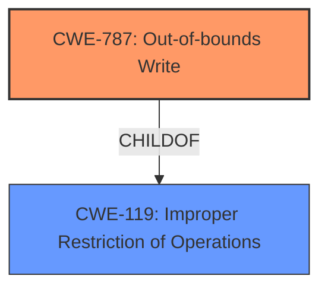

# Analysis for CVE-2020-11256

# Summary
| CWE ID | CWE Name | Confidence | CWE Abstraction Level | CWE Vulnerability Mapping Label | CWE-Vulnerability Mapping Notes |
|---|---|---|---|---|---|
| CWE-787 | Out-of-bounds Write | 1.0 | Base | Allowed | Primary CWE |

## Evidence and Confidence

*   **Confidence Score:** 1.0
*   **Evidence Strength:** HIGH

## Relationship Analysis
The primary CWE is CWE-787 **Out-of-bounds Write**, which is a base level CWE. CWE-787 is a child of CWE-119 **Improper Restriction of Operations within the Bounds of a Memory Buffer**. There is no evidence to suggest any other relationships apply.

## Vulnerability Chain
The vulnerability chain is: **lack of check of validation of pointer to buffer** leading to **memory corruption** due to an **Out-of-bounds Write**.

## Summary of Analysis
The initial analysis identified **memory corruption** due to a **lack of check of validation of pointer to buffer** passed to trustzone. The retriever results indicated CWE-787 **Out-of-bounds Write** as the top candidate. The vulnerability description states "**Memory corruption** due to **lack of check of validation of pointer to buffer** passed to trustzone".

The selection of CWE-787 is based on the alternate term of "Memory Corruption" which is often used to describe the consequences of writing to memory outside the bounds of a buffer, or to memory that is otherwise invalid.

The other CWEs considered from the Retriever Results were not selected because they didn't directly address the root cause of the vulnerability, which is writing data past the end or before the beginning of the intended buffer.

Relevant CWE Information:

# Enhanced Context (25 CWEs)
The following CWEs were identified as potentially relevant to this vulnerability:

## CWE-1289: Improper Validation of Unsafe Equivalence in Input
**Abstraction Level**: Base
**Similarity Score**: 0.81
**Source**: dense

**Description**:
The product receives an input value that is used as a resource identifier or other type of reference, but it does not validate or incorrectly validates that the input is equivalent to a potentially-unsafe value.

**Mapping Guidance**:
- Usage: Allowed
- Rationale: This CWE entry is at the Base level of abstraction, which is a preferred level of abstraction for mapping to the root causes of vulnerabilities.

## CWE-1288: Improper Validation of Consistency within Input
**Abstraction Level**: Base
**Similarity Score**: 0.79
**Source**: dense

**Description**:
The product receives a complex input with multiple elements or fields that must be consistent with each other, but it does not validate or incorrectly validates that the input is actually consistent.

**Mapping Guidance**:
- Usage: Allowed
- Rationale: This CWE entry is at the Base level of abstraction, which is a preferred level of abstraction for mapping to the root causes of vulnerabilities.

## CWE-807: Reliance on Untrusted Inputs in a Security Decision
**Abstraction Level**: Base
**Similarity Score**: 0.77
**Source**: dense

**Description**:
The product uses a protection mechanism that relies on the existence or values of an input, but the input can be modified by an untrusted actor in a way that bypasses the protection mechanism.

**Mapping Guidance**:
- Usage: Allowed
- Rationale: This CWE entry is at the Base level of abstraction, which is a preferred level of abstraction for mapping to the root causes of vulnerabilities.

## CWE-179: Incorrect Behavior Order: Early Validation
**Abstraction Level**: Base
**Similarity Score**: 0.76
**Source**: dense

**Description**:
The product validates input before applying protection mechanisms that modify the input, which could allow an attacker to bypass the validation via dangerous inputs that only arise after the modification.

**Mapping Guidance**:
- Usage: Allowed
- Rationale: This CWE entry is at the Base level of abstraction, which is a preferred level of abstraction for mapping to the root causes of vulnerabilities.

## CWE-606: Unchecked Input for Loop Condition
**Abstraction Level**: Base
**Similarity Score**: 0.76
**Source**: dense

**Description**:
The product does not properly check inputs that are used for loop conditions, potentially leading to a denial of service or other consequences because of excessive looping.

**Mapping Guidance**:
- Usage: Allowed
- Rationale: This CWE entry is at the Base level of abstraction, which is a preferred level of abstraction for mapping to the root causes of vulnerabilities.

## CWE-183: Permissive List of Allowed Inputs
**Abstraction Level**: Base
**Similarity Score**: 0.76
**Source**: dense

**Description**:
The product implements a protection mechanism that relies on a list of inputs (or properties of inputs) that are explicitly allowed by policy because the inputs are assumed to be safe, but the list is too permissive - that is, it allows an input that is unsafe, leading to resultant weaknesses.

**Mapping Guidance**:
- Usage: Allowed
- Rationale: This CWE entry is at the Base level of abstraction, which is a preferred level of abstraction for mapping to the root causes of vulnerabilities.

## CWE-115: Misinterpretation of Input
**Abstraction Level**: Base
**Similarity Score**: 0.76
**Source**: dense

**Description**:
The product misinterprets an input, whether from an attacker or another product, in a security-relevant fashion.

**Mapping Guidance**:
- Usage: Allowed
- Rationale: This CWE entry is at the Base level of abstraction, which is a preferred level of abstraction for mapping to the root causes of vulnerabilities.

## CWE-184: Incomplete List of Disallowed Inputs
**Abstraction Level**: Base
**Similarity Score**: 0.75
**Source**: dense

**Description**:
The product implements a protection mechanism that relies on a list of inputs (or properties of inputs) that are not allowed by policy or otherwise require other action to neutralize before additional processing takes place, but the list is incomplete.

**Mapping Guidance**:
- Usage: Allowed
- Rationale: This CWE entry is at the Base level of abstraction, which is a preferred level of abstraction for mapping to the root causes of vulnerabilities.

## CWE-252: Unchecked Return Value
**Abstraction Level**: Base
**Similarity Score**: 0.75
**Source**: dense

**Description**:
The product does not check the return value from a method or function, which can prevent it from detecting unexpected states and conditions.

**Mapping Guidance**:
- Usage: Allowed
- Rationale: This CWE entry is at the Base level of abstraction, which is a preferred level of abstraction for mapping to the root causes of vulnerabilities.

## CWE-681: Incorrect Conversion between Numeric Types
**Abstraction Level**: Base
**Similarity Score**: 0.75
**Source**: dense

**Description**:
When converting from one data type to another, such as long to integer, data can be omitted or translated in a way that produces unexpected values. If the resulting values are used in a sensitive context, then dangerous behaviors may occur.

**Mapping Guidance**:
- Usage: Allowed
- Rationale: This CWE entry is at the Base level of abstraction, which is a preferred level of abstraction for mapping to the root causes of vulnerabilities.

## CWE-190: Integer Overflow or Wraparound
**Abstraction Level**: Base
**Similarity Score**: 7733.11
**Source**: sparse

**Description**:
The product performs a calculation that can
         produce an integer overflow or wraparound when the logic
         assumes that the resulting value will always be larger than
         the original value. This occurs when an integer value is
         incremented to a value that is too large to store in the
         associated representation. When this occurs, the value may
         become a very small or negative number.

**Mapping Guidance**:
- Usage: Allowed
- Rationale: This CWE entry is at the Base level of abstraction, which is a preferred level of abstraction for mapping to the root causes of vulnerabilities.

## CWE-823: Use of Out-of-range Pointer Offset
**Abstraction Level**: Base
**Similarity Score**: 7645.50
**Source**: sparse

**Description**:
The product performs pointer arithmetic on a valid pointer, but it uses an offset that can point outside of the intended range of valid memory locations for the resulting pointer.

**Mapping Guidance**:
- Usage: Allowed
- Rationale: This CWE entry is at the Base level of abstraction, which is a preferred level of abstraction for mapping to the root causes of vulnerabilities.

## CWE-1284: Improper Validation of Specified Quantity in Input
**Abstraction Level**: Base
**Similarity Score**: 7398.55
**Source**: sparse

**Description**:
The