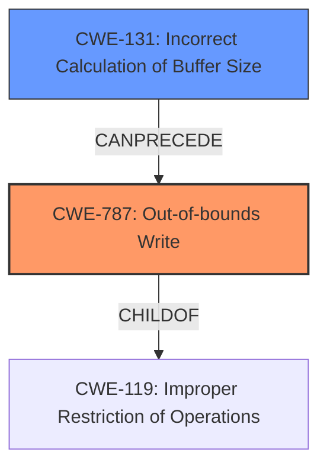

# Enhanced Analysis for CVE-2020-11261

# Summary
| CWE ID | CWE Name | Confidence | CWE Abstraction Level | CWE Vulnerability Mapping Label | CWE-Vulnerability Mapping Notes |
|---|---|---|---|---|---|
| CWE-787 | Out-of-bounds Write | 0.8 | Base | Allowed | Primary CWE |
| CWE-131 | Incorrect Calculation of Buffer Size | 0.6 | Base | Allowed | Secondary CWE |

## Evidence and Confidence

*   **Confidence Score:** 0.7
*   **Evidence Strength:** MEDIUM

## Relationship Analysis
The primary weakness is an **Out-of-bounds Write (CWE-787)**, which stems from writing data beyond the allocated buffer. This is often caused by an **Incorrect Calculation of Buffer Size (CWE-131)**. The hierarchical relationship is that CWE-787 is a consequence of CWE-131.



## Vulnerability Chain
The vulnerability chain starts with the **improper check to return error when user application requests memory allocation of a huge size**. This leads to the potential for an **incorrect buffer size calculation**, which ultimately results in a **memory corruption** due to an **out-of-bounds write**.

## Summary of Analysis
The analysis is based on the provided vulnerability description, which indicates an **improper check to return error when user application requests memory allocation of a huge size** leading to **memory corruption**. The key phrase identifies the root cause as an **improper check** and the weakness as **memory corruption**.

The retriever results highlight **CWE-787 (Out-of-bounds Write)** as the top candidate with a score of 1.000 and the alternate term "Memory Corruption" which is mentioned in the vulnerability description. This aligns with the vulnerability description of writing data outside the intended buffer.

**CWE-131 (Incorrect Calculation of Buffer Size)** is considered as a secondary CWE. The description indicates that the product does not correctly calculate the size to be used when allocating a buffer, which could lead to a buffer overflow. While the description mentions "huge size", it also suggests an issue in handling memory allocation requests. This is considered a reasonable but less direct mapping, hence the lower confidence.

The selection of **CWE-787** is at the base level, which is the optimal level of specificity based on the available evidence.

Relevant CWE Information:

# Enhanced Context (25 CWEs)
The following CWEs were identified as potentially relevant to this vulnerability:

## CWE-131: Incorrect Calculation of Buffer Size
**Abstraction Level**: Base
**Similarity Score**: 0.83
**Source**: dense

**Description**:
The product does not correctly calculate the size to be used when allocating a buffer, which could lead to a buffer overflow.

**Mapping Guidance**:
- Usage: Allowed
- Rationale: This CWE entry is at the Base level of abstraction, which is a preferred level of abstraction for mapping to the root causes of vulnerabilities.

## CWE-787: Out-of-bounds Write
**Abstraction:** Base
**Status:** Draft

### Description
The product writes data past the end, or before the beginning, of the intended buffer.

### Extended Description
Not provided

### Alternative Terms
Memory Corruption: Often used to describe the consequences of writing to memory outside the bounds of a buffer, or to memory that is otherwise invalid.

### Relationships
ChildOf -> CWE-119
ChildOf -> CWE-119
ChildOf -> CWE-119
ChildOf -> CWE-119

### Mapping Guidance
**Usage:** Allowed
**Rationale:** This CWE entry is at the Base level of abstraction, which is a preferred level of abstraction for mapping to the root causes of vulnerabilities.
**Comments:** Carefully read both the name and description to ensure that this mapping is an appropriate fit. Do not try to 'force' a mapping to a lower-level Base/Variant simply to comply with this preferred level of abstraction.
**Reasons:**
- Acceptable-Use


## CWE Relationship Analysis

Current CWEs represent these abstraction levels: .


### Vulnerability Chain Analysis

**Chain starting from CWE-787:**
- 787 (Out-of-bounds Write) - ROOT


**Chain starting from CWE-131:**
- 131 (Incorrect Calculation of Buffer Size) - ROOT


### CWE Relationship Diagram

```mermaid
graph TD
    classDef primary fill:#f96,stroke:#333,stroke-width:2px
    classDef secondary fill:#69f,stroke:#333
    classDef tertiary fill:#9e9,stroke:#333
```