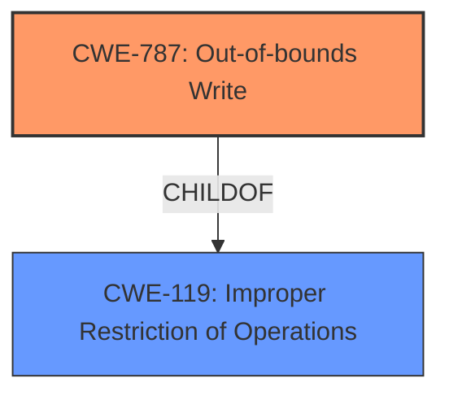

# Raw Analyzer Response for CVE-2020-11279

# Summary
| CWE ID | CWE Name | Confidence | CWE Abstraction Level | CWE Vulnerability Mapping Label | CWE-Vulnerability Mapping Notes |
|---|---|---|---|---|---|
| CWE-787 | Out-of-bounds Write | 1.0 | Base | Allowed | Primary CWE |

## Evidence and Confidence

*   **Confidence Score:** 1.0
*   **Evidence Strength:** HIGH

## Relationship Analysis
The primary CWE selected is CWE-787, which is a base-level CWE, indicating it's a specific root cause. This CWE is a child of CWE-119 (Improper Restriction of Operations within the Bounds of a Memory Buffer). The analysis focused on identifying the root cause of the **memory corruption**, which was determined to be an **improper length check**. The relationship analysis confirms that CWE-787 is the appropriate level of specificity and aligns with the provided description.

## Vulnerability Chain
The vulnerability chain starts with the **improper length check** leading to the **memory corruption**, specifically an out-of-bounds write.
  - Root Cause: **Improper Length Check**
  - Weakness: **Memory Corruption** due to Out-of-bounds Write

## Summary of Analysis
The initial analysis correctly identified CWE-787 as the primary weakness. The vulnerability description clearly indicates a **memory corruption** issue stemming from an **improper length check**. This aligns perfectly with CWE-787's description of writing data past the end of a buffer. The retriever results also support this choice, with CWE-787 having the highest score.

The evidence is clear from the vulnerability description: "Memory corruption while processing crafted SDES packets due to **improper length check** in sdes packets received". This statement directly links the **improper length check** to **memory corruption**, which is a key indicator of an out-of-bounds write.

The graph relationships influenced the selection by confirming that CWE-787 is a specific type of memory buffer issue, making it more appropriate than its parent class, CWE-119. The selection of CWE-787 is at the optimal level of specificity because it directly addresses the root cause (**improper length check** leading to out-of-bounds write) rather than just the symptom (**memory corruption**).

Relevant CWE Information:

# Enhanced Context (25 CWEs)
The following CWEs were identified as potentially relevant to this vulnerability:

## CWE-131: Incorrect Calculation of Buffer Size
**Abstraction Level**: Base
**Similarity Score**: 0.78
**Source**: dense

**Description**:
The product does not correctly calculate the size to be used when allocating a buffer, which could lead to a buffer overflow.

**Mapping Guidance**:
- Usage: Allowed
- Rationale: This CWE entry is at the Base level of abstraction, which is a preferred level of abstraction for mapping to the root causes of vulnerabilities.

*Reason for not selecting:* While this CWE could be related, the provided description focuses on **improper length check** of *received* packets, not the calculation of buffer size for allocation.

## CWE-667: Improper Locking
**Abstraction Level**: Class
**Similarity Score**: 0.77
**Source**: dense

**Description**:
The product does not properly acquire or release a lock on a resource, leading to unexpected resource state changes and behaviors.

**Mapping Guidance**:
- Usage: Allowed-with-Review
- Rationale: This CWE entry is a Class and might have Base-level children that would be more appropriate

*Reason for not selecting:* This CWE is not related to the vulnerability description which highlights **memory corruption** and **improper length check**, and not concurrency or locking issues.

## CWE-754: Improper Check for Unusual or Exceptional Conditions
**Abstraction Level**: Class
**Similarity Score**: 0.76
**Source**: dense

**Description**:
The product does not check or incorrectly checks for unusual or exceptional conditions that are not expected to occur frequently during day to day operation of the product.

**Mapping Guidance**:
- Usage: Allowed-with-Review
- Rationale: This CWE entry is a Class and might have Base-level children that would be more appropriate

*Reason for not selecting:* The vulnerability is focused on a specific **improper length check**, not a general lack of handling unusual conditions.

## CWE-703: Improper Check or Handling of Exceptional Conditions
**Abstraction Level**: Pillar
**Similarity Score**: 0.76
**Source**: dense

**Description**:
The product does not properly anticipate or handle exceptional conditions that rarely occur during normal operation of the product.

**Mapping Guidance**:
- Usage: Discouraged
- Rationale: This CWE entry is extremely high-level, a Pillar.

*Reason for not selecting:* This CWE is too high-level and doesn't provide specific information about the **improper length check** that caused the issue.

## CWE-129: Improper Validation of Array Index
**Abstraction Level**: Variant
**Similarity Score**: 0.76
**Source**: dense

**Description**:
The product uses untrusted input when calculating or using an array index, but the product does not validate or incorrectly validates the index to ensure the index references a valid position within the array.

**Mapping Guidance**:
- Usage: Allowed
- Rationale: This CWE entry is at the Variant level of abstraction, which is a preferred level of abstraction for mapping to the root causes of vulnerabilities.

*Reason for not selecting:* While related to validation, this CWE focuses on array indices, whereas the vulnerability description refers to a general **improper length check**.

## CWE-824: Access of Uninitialized Pointer
**Abstraction Level**: Base
**Similarity Score**: 0.76
**Source**: dense

**Description**:
The product accesses or uses a pointer that has not been initialized.

**Mapping Guidance**:
- Usage: Allowed
- Rationale: This CWE entry is at the Base level of abstraction, which is a preferred level of abstraction for mapping to the root causes of vulnerabilities.

*Reason for not selecting:* This CWE is not relevant as the vulnerability description does not suggest issues with pointer initialization.

## CWE-226: Sensitive Information in Resource Not Removed Before Reuse
**Abstraction Level**: Base
**Similarity Score**: 0.76
**Source**: dense

**Description**:
The product releases a resource such as memory or a file so that it can be made available for reuse, but it does not clear or "zeroize" the information contained in the resource before the product performs a critical state transition or makes the resource available for reuse by other entities.

**Mapping Guidance**:
- Usage: Allowed
- Rationale: This CWE entry is at the Base level of abstraction, which is a preferred level of abstraction for mapping to the root causes of vulnerabilities.

*Reason for not selecting:* This CWE describes sensitive data leakage during resource reuse, which is unrelated to the **improper length check** described in the vulnerability.

## CWE-404: Improper Resource Shutdown or Release
**Abstraction Level**: Class
**Similarity Score**: 0.75
**Source**: dense

**Description**:
The product does not release or incorrectly releases a resource before it is made available for re-use.

**Mapping Guidance**:
- Usage: Allowed-with-Review
- Rationale: This CWE entry is a Class and might have Base-level children that would be more appropriate

*Reason for not selecting:* The vulnerability isn't about resource management, but about an **improper length check** when processing data.

## CWE-755: Improper Handling of Exceptional Conditions
**Abstraction Level**: Class
**Similarity Score**: 0.75
**Source**: dense

**Description**:
The product does not handle or incorrectly handles an exceptional condition.

**Mapping Guidance**:
- Usage: Discouraged
- Rationale: This CWE entry is a level-1 Class (i.e., a child of a Pillar). It might have lower-level children that would be more appropriate

*Reason for not selecting:* Too generic; the issue is a specific **improper length check**, not a general lack of exception handling.

## CWE-191: Integer Underflow (Wrap or Wraparound)
**Abstraction Level**: Base
**Similarity Score**: 0.75
**Source**: dense

**Description**:
The product subtracts one value from another, such that the result is less than the minimum allowable integer value, which produces a value that is not equal to the correct result.

**Mapping Guidance**:
- Usage: Allowed
- Rationale: This CWE entry is at the Base level of abstraction, which is a preferred level of abstraction for mapping to the root causes of vulnerabilities.

*Reason for not selecting:* Integer underflow is not directly indicated in the description. The focus is on an **improper length check** related to incoming data.

## CWE-823: Use of Out-of-range Pointer