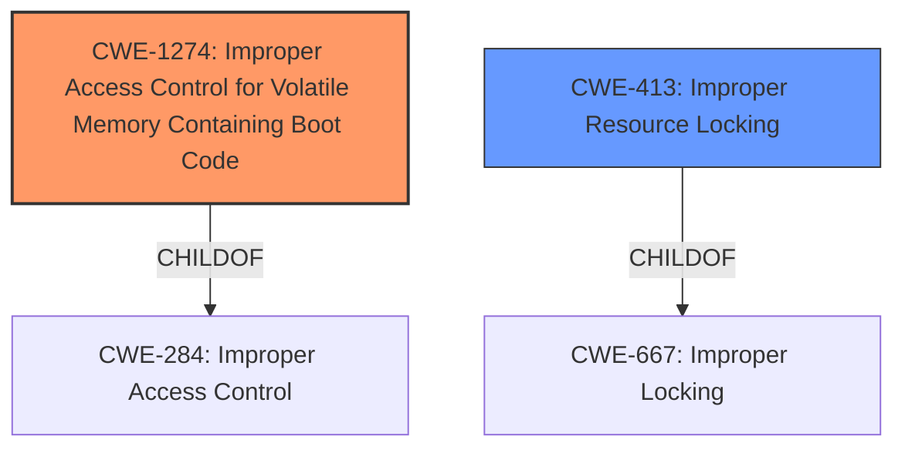

# Analysis for CVE-2020-11284

# Summary
| CWE ID | CWE Name | Confidence | CWE Abstraction Level | CWE Vulnerability Mapping Label | CWE-Vulnerability Mapping Notes |
|---|---|---|---|---|---|
| CWE-1274 | Improper Access Control for Volatile Memory Containing Boot Code | 0.9 | Base | Allowed | Primary CWE |
| CWE-413 | Improper Resource Locking | 0.6 | Base | Allowed | Secondary Candidate |

## Evidence and Confidence

*   **Confidence Score:** 0.75
*   **Evidence Strength:** MEDIUM

## Relationship Analysis
The primary CWE selected is CWE-1274, which directly addresses the **improper access control** over volatile memory containing boot code. It is a child of CWE-284 (Improper Access Control). CWE-413 is a related concern about resource locking, and it's a child of CWE-667 (Improper Locking).

## Vulnerability Chain
The chain begins with an **improper system call sequence** (the **root cause**) that allows a non-secure boot loader to unlock and modify memory. This leads to the memory region becoming an untrusted source of input for the secure boot loader. The **improper access control** (CWE-1274) over the volatile memory allows the modification of boot code, which can bypass the secure boot process and lead to arbitrary code execution.

## Summary of Analysis
Initially, the **improper system call sequence** was hard to pin down, so looking at the retriever results for potential CWEs was key. The primary driver for selecting CWE-1274 is that the vulnerability description states that locked memory can be unlocked and modified by a non-secure boot loader. This directly aligns with the description of CWE-1274: "The product conducts a secure-boot process... but it does not have sufficient access control or other protections for the Volatile Memory."

The phrase "**improper system call sequence**" from the "Vulnerability Description Key Phrases" suggests a breakdown in access control mechanisms. The retriever results also highlighted CWE-413 (Improper Resource Locking) as a potential candidate.

CWE-413 could be a contributing factor, but it doesn't fully capture the essence of the vulnerability, which involves the specific context of secure boot loaders and volatile memory. Therefore, I'm classifying CWE-1274 as the primary CWE and CWE-413 as a secondary concern.

Relevant CWE Information:

# Enhanced Context (25 CWEs)

## CWE-667: Improper Locking
**Abstraction Level**: Class
**Similarity Score**: 0.82
**Source**: dense

**Description**:
The product does not properly acquire or release a lock on a resource, leading to unexpected resource state changes and behaviors.

**Mapping Guidance**:
- Usage: Allowed-with-Review
- Rationale: This CWE entry is a Class and might have Base-level children that would be more appropriate

## CWE-822: Untrusted Pointer Dereference
**Abstraction Level**: Base
**Similarity Score**: 0.80
**Source**: dense

**Description**:
The product obtains a value from an untrusted source, converts this value to a pointer, and dereferences the resulting pointer.

**Mapping Guidance**:
- Usage: Allowed
- Rationale: This CWE entry is at the Base level of abstraction, which is a preferred level of abstraction for mapping to the root causes of vulnerabilities.

## CWE-131: Incorrect Calculation of Buffer Size
**Abstraction Level**: Base
**Similarity Score**: 0.80
**Source**: dense

**Description**:
The product does not correctly calculate the size to be used when allocating a buffer, which could lead to a buffer overflow.

**Mapping Guidance**:
- Usage: Allowed
- Rationale: This CWE entry is at the Base level of abstraction, which is a preferred level of abstraction for mapping to the root causes of vulnerabilities.

## CWE-823: Use of Out-of-range Pointer Offset
**Abstraction Level**: Base
**Similarity Score**: 0.80
**Source**: dense

**Description**:
The product performs pointer arithmetic on a valid pointer, but it uses an offset that can point outside of the intended range of valid memory locations for the resulting pointer.

**Mapping Guidance**:
- Usage: Allowed
- Rationale: This CWE entry is at the Base level of abstraction, which is a preferred level of abstraction for mapping to the root causes of vulnerabilities.

## CWE-824: Access of Uninitialized Pointer
**Abstraction Level**: Base
**Similarity Score**: 0.79
**Source**: dense

**Description**:
The product accesses or uses a pointer that has not been initialized.

**Mapping Guidance**:
- Usage: Allowed
- Rationale: This CWE entry is at the Base level of abstraction, which is a preferred level of abstraction for mapping to the root causes of vulnerabilities.

## CWE-404: Improper Resource Shutdown or Release
**Abstraction Level**: Class
**Similarity Score**: 0.79
**Source**: dense

**Description**:
The product does not release or incorrectly releases a resource before it is made available for re-use.

**Mapping Guidance**:
- Usage: Allowed-with-Review
- Rationale: This CWE entry is a Class and might have Base-level children that would be more appropriate

## CWE-252: Unchecked Return Value
**Abstraction Level**: Base
**Similarity Score**: 0.79
**Source**: dense

**Description**:
The product does not check the return value from a method or function, which can prevent it from detecting unexpected states and conditions.

**Mapping Guidance**:
- Usage: Allowed
- Rationale: This CWE entry is at the Base level of abstraction, which is a preferred level of abstraction for mapping to the root causes of vulnerabilities.

## CWE-1285: Improper Validation of Specified Index, Position, or Offset in Input
**Abstraction Level**: Base
**Similarity Score**: 0.79
**Source**: dense

**Description**:
The product receives input that is expected to specify an index, position, or offset into an indexable resource such as a buffer or file, but it does not validate or incorrectly validates that the specified index/position/offset has the required properties.

**Mapping Guidance**:
- Usage: Allowed
- Rationale: This CWE entry is at the Base level of abstraction, which is a preferred level of abstraction for mapping to the root causes of vulnerabilities.

## CWE-226: Sensitive Information in Resource Not Removed Before Reuse
**Abstraction Level**: Base
**Similarity Score**: 0.78
**Source**: dense

**Description**:
The product releases a resource such as memory or a file so that it can be made available for reuse, but it does not clear or "zeroize" the information contained in the resource before the product performs a critical state transition or makes the resource available for reuse by other entities.

**Mapping Guidance**:
- Usage: Allowed
- Rationale: This CWE entry is at the Base level of abstraction, which is a preferred level of abstraction for mapping to the root causes of vulnerabilities.

## CWE-665: Improper Initialization
**Abstraction Level**: Class
**Similarity Score**: 0.78
**Source**: dense

**Description**:
The product does not initialize or incorrectly initializes a resource, which might leave the resource in an unexpected state when it is accessed or used.

**Mapping Guidance**:
- Usage: Discouraged
- Rationale: This CWE entry is a level-1 Class (i.e., a child of a Pillar). It might have lower-level children that would be more appropriate

## CWE-823: Use of Out-of-range Pointer Offset
**Abstraction Level**: Base
**Similarity Score**: 5911.88
**Source**: sparse

**Description**:
The product performs pointer arithmetic on a valid pointer, but it uses an offset that can point outside of the intended range of valid memory locations for the resulting pointer.

**Mapping Guidance**:
- Usage: Allowed
- Rationale: This CWE entry is at the Base level of abstraction, which is a preferred level of abstraction for mapping to the root causes of vulnerabilities.

## CWE-367: Time-of-check Time-of-use (TOCTOU) Race Condition
**Abstraction Level**: Base
**Similarity Score**: 5820.75
**Source**: sparse

**Description**:
The product checks the state of a resource before using that resource, but the resource's state can change between