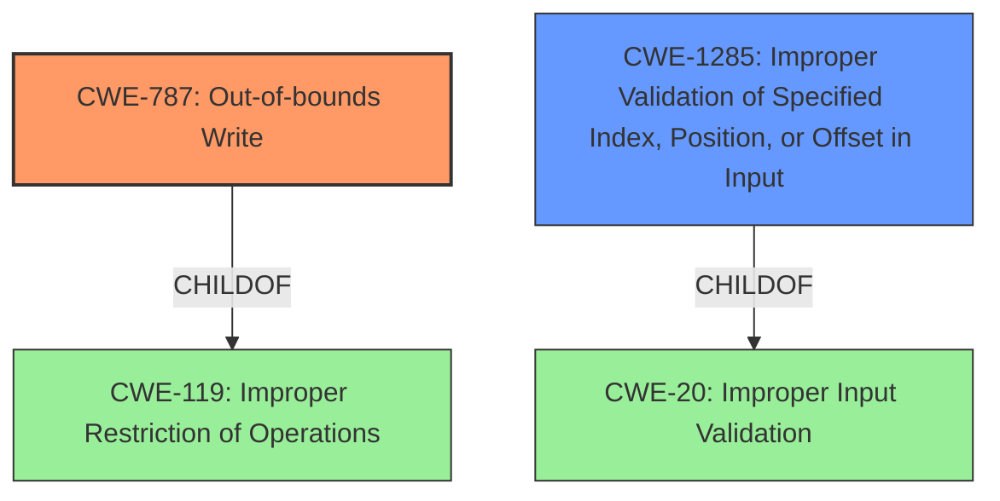

# Analysis for CVE-2020-11288

# Summary
| CWE ID  | CWE Name                                           | Confidence | CWE Abstraction Level | CWE Vulnerability Mapping Label | CWE-Vulnerability Mapping Notes |
| :------- | :------------------------------------------------- | :--------- | :---------------------- | :------------------------------ | :------------------------------ |
| CWE-787  | Out-of-bounds Write                              | 0.95       | Base                    | Primary                         | Allowed                       |
| CWE-1285 | Improper Validation of Specified Index, Position, or Offset in Input | 0.80       | Base                    | Secondary                      | Allowed                       |

## Evidence and Confidence

*   **Confidence Score:** 0.85
*   **Evidence Strength:** HIGH

## Relationship Analysis
The primary CWE is CWE-787 **Out-of-bounds Write** which is a base level CWE. There is a parent child relationship between CWE-787 and CWE-119 **Improper Restriction of Operations within the Bounds of a Memory Buffer**. The secondary CWE is CWE-1285 **Improper Validation of Specified Index, Position, or Offset in Input** which is also a base level CWE. The child of CWE-20 **Improper Input Validation**.

## Vulnerability Chain
The vulnerability chain starts with **lack of input validation** which leads to an **out of bounds write**.
- **Root Cause:** Lack of Input Validation
- **Weakness:** Out-of-bounds Write
- **Impact:** Memory corruption, code execution, denial of service

## Summary of Analysis
The vulnerability description clearly states that an **out of bound write** can occur due to **lack of input validation**.

The vulnerability description key phrases include:
-   **rootcause:** **lack of input validation**
-   **weakness:** **Out of bound write**

Based on the provided information, the primary CWE is CWE-787 **Out-of-bounds Write** and the secondary CWE is CWE-1285 **Improper Validation of Specified Index, Position, or Offset in Input**.

CWE-787 **Out-of-bounds Write** is a base level CWE that describes when a product writes data past the end, or before the beginning, of the intended buffer. The vulnerability description states that an **out of bounds write** can occur in playready while processing command.

CWE-1285 **Improper Validation of Specified Index, Position, or Offset in Input** is a base level CWE that describes when a product receives input that is expected to specify an index, position, or offset into an indexable resource such as a buffer or file, but it does not validate or incorrectly validates that the specified index/position/offset has the required properties. The vulnerability description states that the **out of bound write** occurs due to **lack of input validation**.

The other CWEs listed in the **Retriever Results** were considered, but they were not selected because they did not accurately represent the vulnerability. For example, CWE-126 **Buffer Over-read** was not selected because the vulnerability description states that an **out of bounds write** occurs, not an out of bounds read. Similarly, CWE-822 **Untrusted Pointer Dereference** and CWE-823 **Use of Out-of-range Pointer Offset** were not selected because the vulnerability description does not mention anything about pointers.

The selected CWEs are at the optimal level of specificity because they accurately represent the vulnerability and are at the base level of abstraction.

Relevant CWE Information:

# Enhanced Context (25 CWEs)
The following CWEs were identified as potentially relevant to this vulnerability:

## CWE-131: Incorrect Calculation of Buffer Size
**Abstraction Level**: Base
**Similarity Score**: 0.78
**Source**: dense

**Description**:
The product does not correctly calculate the size to be used when allocating a buffer, which could lead to a buffer overflow.

**Mapping Guidance**:
- Usage: Allowed
- Rationale: This CWE entry is at the Base level of abstraction, which is a preferred level of abstraction for mapping to the root causes of vulnerabilities.

## CWE-703: Improper Check or Handling of Exceptional Conditions
**Abstraction Level**: Pillar
**Similarity Score**: 0.77
**Source**: dense

**Description**:
The product does not properly anticipate or handle exceptional conditions that rarely occur during normal operation of the product.

**Mapping Guidance**:
- Usage: Discouraged
- Rationale: This CWE entry is extremely high-level, a Pillar.

## CWE-129: Improper Validation of Array Index
**Abstraction Level**: Variant
**Similarity Score**: 0.76
**Source**: dense

**Description**:
The product uses untrusted input when calculating or using an array index, but the product does not validate or incorrectly validates the index to ensure the index references a valid position within the array.

**Mapping Guidance**:
- Usage: Allowed
- Rationale: This CWE entry is at the Variant level of abstraction, which is a preferred level of abstraction for mapping to the root causes of vulnerabilities.

## CWE-754: Improper Check for Unusual or Exceptional Conditions
**Abstraction Level**: Class
**Similarity Score**: 0.76
**Source**: dense

**Description**:
The product does not check or incorrectly checks for unusual or exceptional conditions that are not expected to occur frequently during day to day operation of the product.

**Mapping Guidance**:
- Usage: Allowed-with-Review
- Rationale: This CWE entry is a Class and might have Base-level children that would be more appropriate

## CWE-191: Integer Underflow (Wrap or Wraparound)
**Abstraction Level**: Base
**Similarity Score**: 0.76
**Source**: dense

**Description**:
The product subtracts one value from another, such that the result is less than the minimum allowable integer value, which produces a value that is not equal to the correct result.

**Mapping Guidance**:
- Usage: Allowed
- Rationale: This CWE entry is at the Base level of abstraction, which is a preferred level of abstraction for mapping to the root causes of vulnerabilities.

## CWE-667: Improper Locking
**Abstraction Level**: Class
**Similarity Score**: 0.76
**Source**: dense

**Description**:
The product does not properly acquire or release a lock on a resource, leading to unexpected resource state changes and behaviors.

**Mapping Guidance**:
- Usage: Allowed-with-Review
- Rationale: This CWE entry is a Class and might have Base-level children that would be more appropriate

## CWE-252: Unchecked Return Value
**Abstraction Level**: Base
**Similarity Score**: 0.75
**Source**: dense

**Description**:
The product does not check the return value from a method or function, which can prevent it from detecting unexpected states and conditions.

**Mapping Guidance**:
- Usage: Allowed
- Rationale: This CWE entry is at the Base level of abstraction, which is a preferred level of abstraction for mapping to the root causes of vulnerabilities.

## CWE-824: Access of Uninitialized Pointer
**Abstraction Level**: Base
**Similarity Score**: 0.75
**Source**: dense

**Description**:
The product accesses or uses a pointer that has not been initialized.

**Mapping Guidance**:
- Usage: Allowed
- Rationale: This CWE entry is at the Base level of abstraction, which is a preferred level of abstraction for mapping to the root causes of vulnerabilities.

## CWE-755: Improper Handling of Exceptional Conditions
**Abstraction Level**: Class
**Similarity Score**: 0.75
**Source**: dense

**Description**:
The product does not handle or incorrectly handles an exceptional condition.

**Mapping Guidance**:
- Usage: Discouraged
- Rationale: This CWE entry is a level-1 Class (i.e., a child of a Pillar). It might have lower-level children that would be more appropriate

## CWE-125: Out-of-bounds Read
**Abstraction Level**: Base
**Similarity Score**: 0.75
**Source**: dense

**Description**:
The product reads data past the end, or before the beginning, of the intended buffer.

**Mapping Guidance**:
- Usage: Allowed
- Rationale: This CWE entry is at the Base level of abstraction, which is a preferred level of abstraction for mapping to the root causes of vulnerabilities.

## CWE-823: Use of Out-of-range Pointer Offset