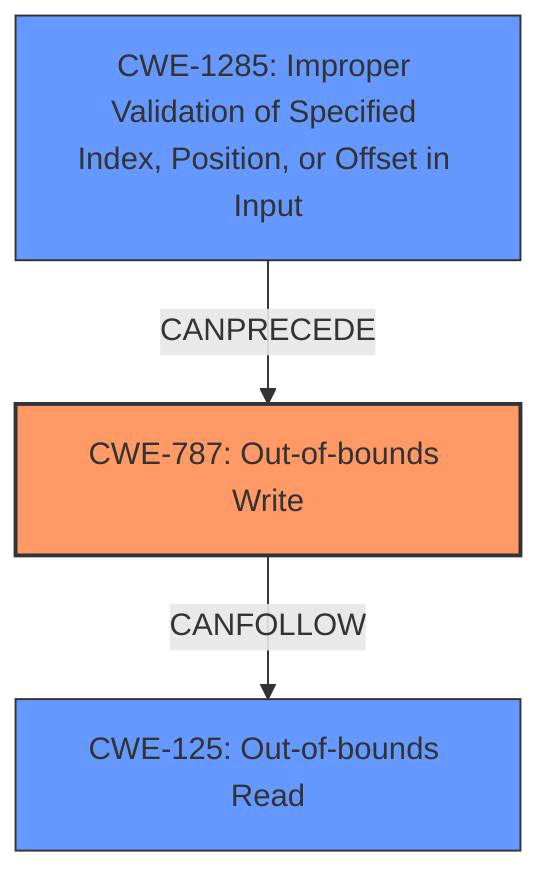

# Analysis for CVE-2020-11289

# Summary
| CWE ID | CWE Name | Confidence | CWE Abstraction Level | CWE Vulnerability Mapping Label | CWE-Vulnerability Mapping Notes |
|---|---|---|---|---|---|
| CWE-787 | Out-of-bounds Write | 1.0 | Base | Allowed | Primary CWE |
| CWE-125 | Out-of-bounds Read | 0.6 | Base | Allowed | Secondary CWE |
| CWE-1285 | Improper Validation of Specified Index, Position, or Offset in Input | 0.7 | Base | Allowed | Secondary CWE |

## Evidence and Confidence

*   **Confidence Score:** 0.8
*   **Evidence Strength:** HIGH

## Relationship Analysis
The primary CWE is CWE-787 (**Out-of-bounds Write**), due to the vulnerability description explicitly mentioning it as a **weakness**. 

The CWE-787 (**Out-of-bounds Write**) can be caused by CWE-1285 (**Improper Validation of Specified Index, Position, or Offset in Input**). The vulnerability description explicitly mentions **lack of validation of command ID** as the root cause, which can lead to writing outside the intended memory region.

CWE-125 (**Out-of-bounds Read**) is included as a possible read vulnerability, since writing out of bounds can often allow for reading out of bounds.

## Vulnerability Chain
The vulnerability chain starts with **lack of validation of command ID** in the TZ command handler, represented by CWE-1285 (**Improper Validation of Specified Index, Position, or Offset in Input**). This **rootcause** leads to CWE-787 (**Out-of-bounds Write**), which in turn can lead to CWE-125 (**Out-of-bounds Read**).

## Summary of Analysis
The initial analysis identified CWE-787 (**Out-of-bounds Write**) as the primary weakness based on the explicit mention in the vulnerability description: " **Out of bound write** can occur...". The root cause, " **lack of validation of command ID**," strongly suggests CWE-1285 (**Improper Validation of Specified Index, Position, or Offset in Input**).

Here's the relevant evidence from the vulnerability description:
*   **Vulnerability Description Key Phrases**
    *   **rootcause:** **lack of validation of command ID**
    *   **weakness:** **Out of bound write**

Based on this evidence, the chosen CWEs are at the optimal level of specificity. CWE-787 is a base CWE that describes the core weakness, and CWE-1285 explains the **rootcause** by which the out-of-bounds write is possible.

Relevant CWE Information:

# Enhanced Context (25 CWEs)

## CWE-131: Incorrect Calculation of Buffer Size
**Abstraction Level**: Base
**Similarity Score**: 0.80
**Source**: dense

**Description**:
The product does not correctly calculate the size to be used when allocating a buffer, which could lead to a buffer overflow.
**Rationale:** While an incorrect buffer size calculation could lead to an out-of-bounds write, the provided vulnerability description focuses on the **lack of validation of the command ID** rather than an incorrect size calculation.

## CWE-191: Integer Underflow (Wrap or Wraparound)
**Abstraction Level**: Base
**Similarity Score**: 0.78
**Source**: dense

**Description**:
The product subtracts one value from another, such that the result is less than the minimum allowable integer value, which produces a value that is not equal to the correct result.
**Rationale:** Integer underflow is not directly mentioned or implied in the provided vulnerability description.

## CWE-1289: Improper Validation of Unsafe Equivalence in Input
**Abstraction Level**: Base
**Similarity Score**: 0.77
**Source**: dense

**Description**:
The product receives an input value that is used as a resource identifier or other type of reference, but it does not validate or incorrectly validates that the input is equivalent to a potentially-unsafe value.
**Rationale:** While there is **lack of validation of command ID**, it does not appear that the command ID is being validated for equivalence to an unsafe value.

## CWE-252: Unchecked Return Value
**Abstraction Level**: Base
**Similarity Score**: 0.77
**Source**: dense

**Description**:
The product does not check the return value from a method or function, which can prevent it from detecting unexpected states and conditions.
**Rationale:** The vulnerability description doesn't mention anything about unchecked return values.

## CWE-681: Incorrect Conversion between Numeric Types
**Abstraction Level**: Base
**Similarity Score**: 0.77
**Source**: dense

**Description**:
When converting from one data type to another, such as long to integer, data can be omitted or translated in a way that produces unexpected values. If the resulting values are used in a sensitive context, then dangerous behaviors may occur.
**Rationale:** The vulnerability description doesn't mention anything about incorrect conversions between numeric types.

## CWE-125: Out-of-bounds Read
**Abstraction Level**: Base
**Similarity Score**: 0.77
**Source**: dense

**Description**:
The product reads data past the end, or before the beginning, of the intended buffer.
**Rationale:** An out-of-bounds write vulnerability can often lead to the possibility of an out-of-bounds read as well. This is included as a secondary CWE because of the potential for information disclosure.

## CWE-129: Improper Validation of Array Index
**Abstraction Level**: Variant
**Similarity Score**: 0.77
**Source**: dense

**Description**:
The product uses untrusted input when calculating or using an array index, but the product does not validate or incorrectly validates the index to ensure the index references a valid position within the array.
**Rationale:** This is very close to CWE-1285, but CWE-1285 is more general.

## CWE-667: Improper Locking
**Abstraction Level**: Class
**Similarity Score**: 0.77
**Source**: dense

**Description**:
The product does not properly acquire or release a lock on a resource, leading to unexpected resource state changes and behaviors.
**Rationale:** The vulnerability description doesn't mention anything about locking issues.

## CWE-130: Improper Handling of Length Parameter Inconsistency
**Abstraction Level**: Base
**Similarity Score**: 0.77
**Source**: dense

**Description**:
The product parses a formatted message or structure, but it does not handle or incorrectly handles a length field that is inconsistent with the actual length of the associated data.
**Rationale:** The vulnerability description doesn't mention anything about length parameter inconsistencies.

## CWE-404: Improper Resource Shutdown or Release
**Abstraction Level**: Class
**Similarity Score**: 0.77
**Source**: dense

**Description**:
The product does not release or incorrectly releases a resource before it is made available for re-use.
**Rationale:** The vulnerability description doesn't mention anything about resource shutdown or release issues.

## CWE-823: Use of Out-of-range Pointer Offset
**Abstraction Level**: Base
**Similarity Score**: 6223.80
**Source**: sparse

**Description**:
The product performs pointer arithmetic on a valid pointer, but it uses an offset that can point outside of the intended range of valid memory locations for the resulting pointer.
**Rationale:** This is not as good as CWE-787 since the **Out-of-bounds Write** is more specific.

## CWE-367: Time-of-check Time-of-use (TOCTOU) Race Condition
**Abstraction Level**: Base
**Similarity Score**: 5955.45
**Source**: sparse

**Description**:
The product checks the state of a resource before using that resource, but the resource's state can change between the check and the use in a way that invalidates the results of the check. This can cause the product to perform invalid actions when the resource is in an unexpected state.
**Rationale:** There is no indication of a race condition.

## CWE-822: Untrusted Pointer Dereference
**Abstraction Level**: Base
**Similarity Score**: 5919.50
**Source**: sparse

**Description**:
The product obtains a value from an untrusted source, converts this value to a pointer, and dereferences the resulting pointer.