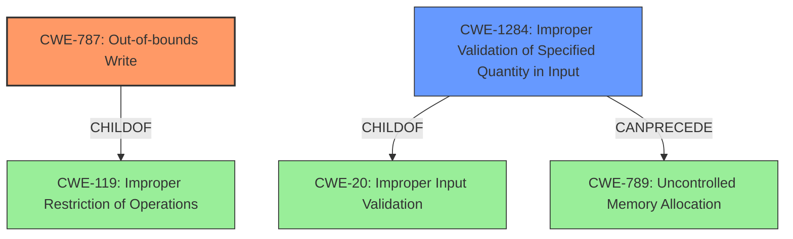

# Analysis for CVE-2020-11294

# Summary
| CWE ID | CWE Name | Confidence | CWE Abstraction Level | CWE Vulnerability Mapping Label | CWE-Vulnerability Mapping Notes |
|---|---|---|---|---|---|
| CWE-787 | Out-of-bounds Write | 1.0 | Base | Allowed | Primary CWE |
| CWE-1284 | Improper Validation of Specified Quantity in Input | 0.7 | Base | Allowed | Secondary Candidate |

## Evidence and Confidence

*   **Confidence Score:** 0.85
*   **Evidence Strength:** HIGH

## Relationship Analysis
The primary CWE is CWE-787 which is a base level CWE, which is good. It is related to CWE-119.
CWE-1284 is related to CWE-20. It can precede CWE-789.

## Vulnerability Chain
The vulnerability chain starts with the **missing validation** of the prefix size (CWE-1284), which then leads to an **out-of-bounds write** (CWE-787).

## Summary of Analysis
The vulnerability is an **out-of-bounds write** due to **lack of validation** of the prefix size used in the logger component of Snapdragon products.

The primary weakness is CWE-787. The vulnerability description clearly states "**out of bound write** in logger due to **prefix size is not validated**". This perfectly aligns with the definition of CWE-787, which involves writing data past the end of the intended buffer. The root cause is the missing validation, which can be classified as CWE-1284 "Improper Validation of Specified Quantity in Input".

The retriever results also suggest CWE-787, but other CWEs were considered:

*   CWE-126 (Buffer Over-read): While similar to out-of-bounds write, the description explicitly mentions a write operation, making CWE-787 a more accurate fit.
*   CWE-823 (Use of Out-of-range Pointer Offset) and CWE-822 (Untrusted Pointer Dereference): These CWEs are related to pointer arithmetic and dereferencing, which are not explicitly mentioned in the vulnerability description. While they could be involved at a lower level, CWE-787 provides a more direct and accurate representation of the vulnerability.
*   CWE-1284 (Improper Validation of Specified Quantity in Input): This CWE is a strong candidate as a secondary CWE, as the root cause is the **lack of validation** of the prefix size.

Therefore, the primary CWE is CWE-787, with CWE-1284 as a secondary CWE to highlight the root cause.

Relevant CWE Information:

# Enhanced Context (25 CWEs)
The following CWEs were identified as potentially relevant to this vulnerability:

## CWE-697: Incorrect Comparison
**Abstraction Level**: Pillar
**Similarity Score**: 0.78
**Source**: dense

**Description**:
The product compares two entities in a security-relevant context, but the comparison is incorrect, which may lead to resultant weaknesses.

**Mapping Guidance**:
- Usage: Discouraged
- Rationale: This CWE entry is extremely high-level, a Pillar. However, sometimes this weakness is forced to be used due to the lack of in-depth weakness research. See Research Gaps.

## CWE-1289: Improper Validation of Unsafe Equivalence in Input
**Abstraction Level**: Base
**Similarity Score**: 0.78
**Source**: dense

**Description**:
The product receives an input value that is used as a resource identifier or other type of reference, but it does not validate or incorrectly validates that the input is equivalent to a potentially-unsafe value.

**Mapping Guidance**:
- Usage: Allowed
- Rationale: This CWE entry is at the Base level of abstraction, which is a preferred level of abstraction for mapping to the root causes of vulnerabilities.

## CWE-682: Incorrect Calculation
**Abstraction Level**: Pillar
**Similarity Score**: 0.77
**Source**: dense

**Description**:
The product performs a calculation that generates incorrect or unintended results that are later used in security-critical decisions or resource management.

**Mapping Guidance**:
- Usage: Discouraged
- Rationale: This CWE entry is extremely high-level, a Pillar. In many cases, lower-level children or descendants are more appropriate. However, sometimes this weakness is forced to be used due to the lack of in-depth weakness research. See Research Gaps.

## CWE-703: Improper Check or Handling of Exceptional Conditions
**Abstraction Level**: Pillar
**Similarity Score**: 0.77
**Source**: dense

**Description**:
The product does not properly anticipate or handle exceptional conditions that rarely occur during normal operation of the product.

**Mapping Guidance**:
- Usage: Discouraged
- Rationale: This CWE entry is extremely high-level, a Pillar.

## CWE-1254: Incorrect Comparison Logic Granularity
**Abstraction Level**: Base
**Similarity Score**: 0.75
**Source**: dense

**Description**:
The product's comparison logic is performed over a series of steps rather than across the entire string in one operation. If there is a comparison logic failure on one of these steps, the operation may be vulnerable to a timing attack that can result in the interception of the process for nefarious purposes.

**Mapping Guidance**:
- Usage: Allowed
- Rationale: This CWE entry is at the Base level of abstraction, which is a preferred level of abstraction for mapping to the root causes of vulnerabilities.

## CWE-754: Improper Check for Unusual or Exceptional Conditions
**Abstraction Level**: Class
**Similarity Score**: 0.75
**Source**: dense

**Description**:
The product does not check or incorrectly checks for unusual or exceptional conditions that are not expected to occur frequently during day to day operation of the product.

**Mapping Guidance**:
- Usage: Allowed-with-Review
- Rationale: This CWE entry is a Class and might have Base-level children that would be more appropriate

## CWE-131: Incorrect Calculation of Buffer Size
**Abstraction Level**: Base
**Similarity Score**: 0.74
**Source**: dense

**Description**:
The product does not correctly calculate the size to be used when allocating a buffer, which could lead to a buffer overflow.

**Mapping Guidance**:
- Usage: Allowed
- Rationale: This CWE entry is at the Base level of abstraction, which is a preferred level of abstraction for mapping to the root causes of vulnerabilities.

## CWE-667: Improper Locking
**Abstraction Level**: Class
**Similarity Score**: 0.74
**Source**: dense

**Description**:
The product does not properly acquire or release a lock on a resource, leading to unexpected resource state changes and behaviors.

**Mapping Guidance**:
- Usage: Allowed-with-Review
- Rationale: This CWE entry is a Class and might have Base-level children that would be more appropriate

## CWE-691: Insufficient Control Flow Management
**Abstraction Level**: Pillar
**Similarity Score**: 0.74
**Source**: dense

**Description**:
The code does not sufficiently manage its control flow during execution, creating conditions in which the control flow can be modified in unexpected ways.

**Mapping Guidance**:
- Usage: Discouraged
- Rationale: This CWE entry is extremely high-level, a Pillar. However, classification research is limited for weaknesses of this type, so there can be gaps or organizational difficulties within CWE that force use of this weakness, even at such a high level of abstraction.

## CWE-208: Observable Timing Discrepancy
**Abstraction Level**: Base
**Similarity Score**: 0.74
**Source**: dense

**Description**:
Two separate operations in a product require different amounts of time to complete, in a way that is observable to an actor and reveals security-relevant information about the state of the product, such as whether a particular operation was successful or not.

**Mapping Guidance**:
- Usage: Allowed
- Rationale: This CWE entry is at the Base level of abstraction, which is a preferred level of abstraction for mapping to the root causes of vulnerabilities.

## CWE-823: Use of Out-